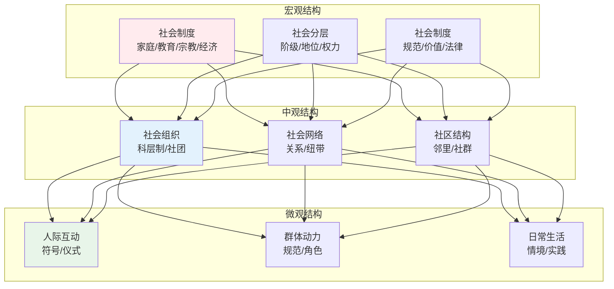
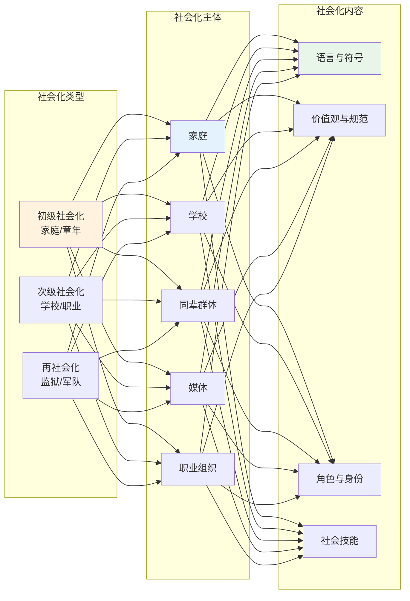
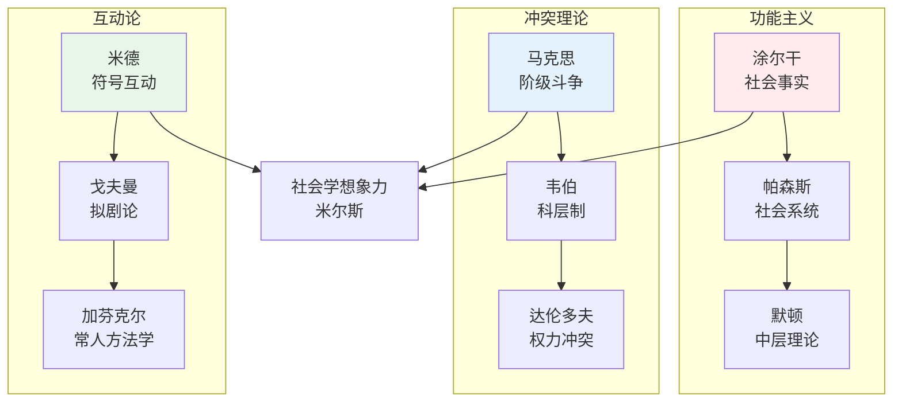
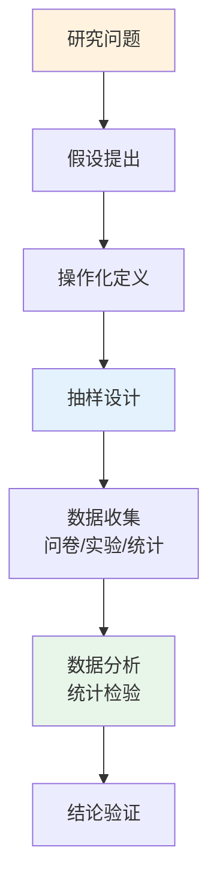
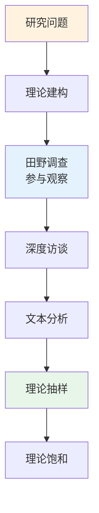
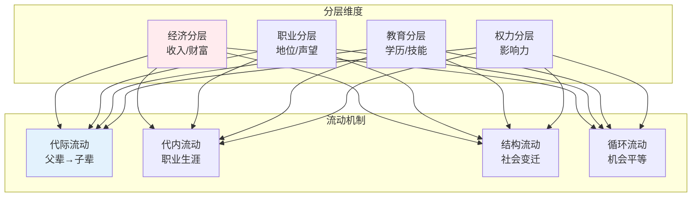
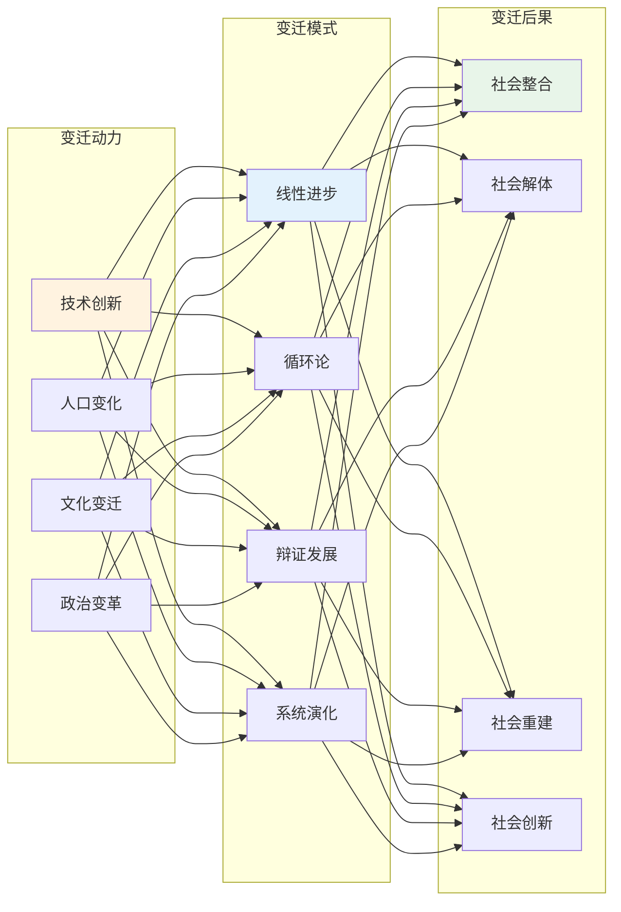
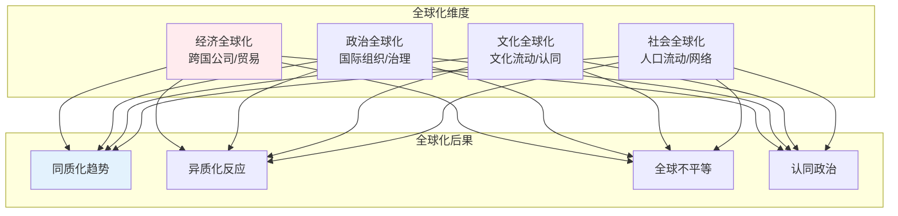
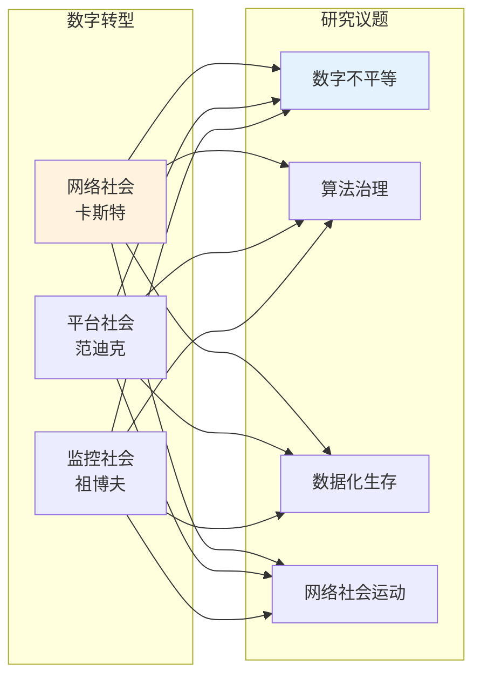

# 社会学知识体系

## 🗂️ 内容导航

| 名称 | 说明 | 链接 |
|------|------|------|
| 应用社会学 | 社会学知识在实践领域的应用 | [进入](applied/index.md) |
| 社会变迁 | 理解社会变化的动力与机制 | [进入](change/index.md) |
| 社会研究方法 | 掌握社会科学研究的核心方法论与技术 | [进入](methods/index.md) |
| 社会群体与组织 | 理解群体动力与组织运作机制 | [进入](organizations/index.md) |
| 社会分层与流动 | 理解社会不平等的结构与机制 | [进入](stratification/index.md) |
| 社会学理论 | 理解社会学理论的发展脉络与核心观点 | [进入](theory/index.md) |

---


> **第一性原理**：社会学是研究人类社会结构、过程及其规律的学科，核心问题是"社会如何可能"以及"个体与社会的关系"。

---

## 📚 社会学的公理体系

### 第一性原理：社会建构性

```
社会学的基本信念：
1. 社会现实是建构的产物
2. 个体行为受社会结构制约
3. 社会行动具有意义性
4. 社会变迁遵循一定规律
5. 社会研究需要科学方法
```

---

## 🔬 核心概念框架

### 社会结构 Social Structure



### 社会化 Socialization



---

## 📖 经典理论流派

### 三大理论范式



### 核心理论对比

| 理论范式 | 核心观点 | 代表人物 | 分析层次 |
|----------|----------|----------|----------|
| 功能主义 | 社会是有机整体，各部分协调运作 | 涂尔干、帕森斯 | 宏观 |
| 冲突理论 | 社会充满矛盾与冲突，权力分配不均 | 马克思、韦伯 | 宏观 |
| 互动论 | 社会通过日常互动建构 | 米德、戈夫曼 | 微观 |
| 交换理论 | 社会行为是理性交换 | 霍曼斯、布劳 | 中观 |
| 女性主义 | 性别是社会建构的核心维度 | 于尔当、麦克因特 | 宏观/微观 |

---

## 🔬 研究方法论

### 定量研究方法



### 定性研究方法



### 混合研究方法

| 方法类型 | 适用场景 | 优势 | 挑战 |
|----------|----------|------|------|
| 定量为主 | 验证假设、大规模调查 | 客观性强、可推广 | 缺乏深度 |
| 定性为主 | 探索性研究、理解意义 | 深入细致、情境化 | 推广性有限 |
| 混合方法 | 复杂问题、三角验证 | 全面深入 | 操作复杂 |

---

## 🏛️ 主要研究领域

### 社会分层与流动



### 社会群体与组织

| 群体类型 | 特征 | 功能 | 例子 |
|----------|------|------|------|
| 初级群体 | 面对面、情感性 | 社会化、情感支持 | 家庭、邻里 |
| 次级群体 | 间接、工具性 | 特定目标、效率 | 公司、政党 |
| 参照群体 | 认同标准 | 自我评价、行为规范 | 同辈、偶像 |
| 虚拟群体 | 网络连接 | 信息共享、情感联结 | 网络社区 |

### 社会变迁理论



---

## 💡 社会学想象力

### 米尔斯的核心洞见

```
社会学想象力的价值：
1. 连接个人困扰与公共议题
2. 理解历史与个人史的交织
3. 认识个人选择与社会结构的张力
4. 超越环境决定论与文化决定论
```

### 应用示例

| 个人困扰 | 公共议题 | 社会学分析 |
|----------|----------|------------|
| 失业焦虑 | 结构性失业 | 经济转型、技术替代 |
| 婚姻困难 | 婚姻制度变迁 | 性别平等、个体化 |
| 教育压力 | 教育内卷化 | 竞争机制、资源分配 |
| 健康问题 | 健康不平等 | 社会决定因素、医疗体系 |

---

## 🔬 当代社会学前沿

### 全球化研究



### 风险社会理论

| 概念 | 内涵 | 当代表现 |
|------|------|----------|
| 风险社会 | 现代性自我危害 | 环境危机、金融危机 |
| 反思性现代化 | 制度自我批判 | 科学反思、民主参与 |
| 个体化 | 传统纽带断裂 | 个人主义、生活方式多元 |
| 风险沟通 | 风险认知与决策 | 风险传播、公众参与 |

### 数字社会学



---

## 📖 学习路径

### 基础阶段

```
第1步：理解社会学的基本概念
第2步：学习经典理论三大范式
第3步：掌握社会学研究方法
第4步：分析日常社会现象
```

### 进阶阶段

```
第5步：选择专业研究方向
第6步：深入学习中层理论
第7步：参与社会调查实践
第8步：形成社会学视角
```

### 核心能力培养

- 社会学想象力
- 批判性思维
- 研究设计能力
- 数据分析能力
- 理论建构能力

---

## 🎯 核心结论

### 社会学的基本发现

1. **社会建构性**：看似自然的社会现象实为历史建构
2. **结构性制约**：个体选择受社会结构深刻影响
3. **意义性行动**：社会行动充满主观意义
4. **动态变迁**：社会处于持续变化之中
5. **多元现代性**：现代性有多种实现形式

### 社会学的实践价值

```
社会学如何改变世界：
1. 揭示社会不平等的机制
2. 理解社会问题的根源
3. 评估社会政策的效果
4. 推动社会改革与进步
5. 培养公民社会意识
```

---

## 📚 参考文献

1. 涂尔干《社会学方法的准则》
2. 马克思《资本论》
3. 韦伯《新教伦理与资本主义精神》
4. 米尔斯《社会学想象力》
5. 布迪厄《区分》
6. 吉登斯《现代性的后果》
7. 费孝通《乡土中国》
8. 李银河《女性主义》