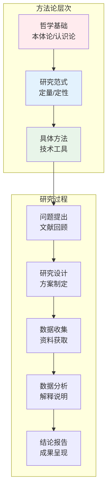
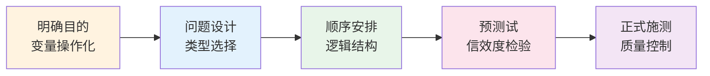
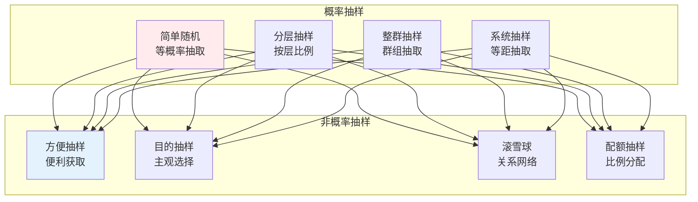
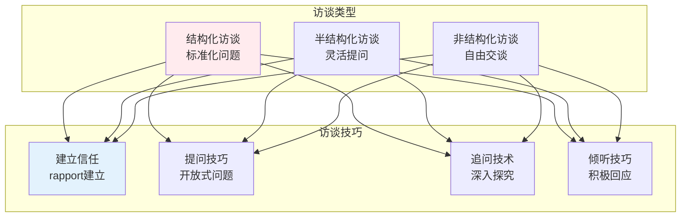
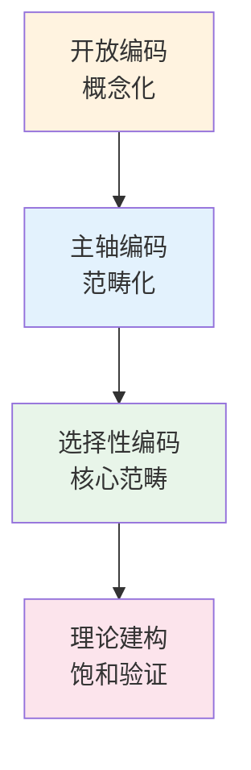
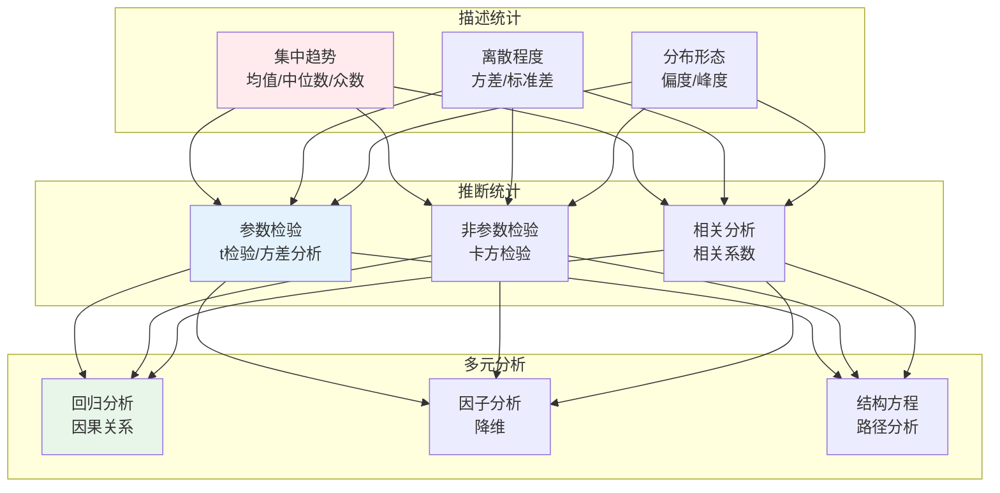

# 社会研究方法

> **核心观点**：科学的研究方法是获得可靠知识的基础，社会研究需要系统化的方法论指导。

---

## 📊 方法论框架



---

## 🔬 研究范式对比

| 维度 | 定量研究 | 定性研究 |
|------|----------|----------|
| 本体论 | 客观现实 | 建构现实 |
| 认识论 | 客观知识 | 主观理解 |
| 方法论 | 实证主义 | 解释主义 |
| 目标 | 验证假设 | 探索意义 |
| 数据 | 数字、变量 | 文字、图像 |
| 样本 | 大样本 | 小样本 |
| 工具 | 问卷、实验 | 访谈、观察 |
| 分析 | 统计分析 | 主题分析 |
| 结果 | 因果关系 | 深度理解 |

---

## 📋 定量研究方法

### 问卷设计



### 问卷类型

| 问题类型 | 特点 | 优点 | 缺点 |
|----------|------|------|------|
| 封闭式 | 预设选项 | 易于统计 | 信息有限 |
| 开放式 | 自由回答 | 信息丰富 | 难以统计 |
| 半封闭 | 混合形式 | 平衡兼顾 | 设计复杂 |

### 抽样方法



### 实验设计

| 设计类型 | 特点 | 优点 | 缺点 |
|----------|------|------|------|
| 前后测设计 | 测量前后变化 | 控制历史效应 | 成熟效应 |
| 控制组设计 | 随机分组 | 内部效度高 | 实施困难 |
| 所罗门设计 | 多次测量 | 控制多种效应 | 成本高 |
| 准实验 | 自然分组 | 现实可行 | 内部效度低 |

---

## 📝 定性研究方法

### 访谈技术



### 参与观察

| 阶段 | 任务 | 关键活动 |
|------|------|----------|
| 进入 | 建立关系 | 接触、解释、信任 |
| 观察 | 收集资料 | 记录、访谈、体验 |
| 分析 | 理解意义 | 编码、主题、理论 |
| 退出 | 结束关系 | 总结、反馈、告别 |

### 扎根理论



---

## 📊 数据分析技术

### 定量分析



### 定性分析

| 分析方法 | 描述 | 适用情境 |
|----------|------|----------|
| 主题分析 | 识别反复出现的主题 | 广泛适用 |
| 内容分析 | 系统分析文本内容 | 媒体研究 |
| 话语分析 | 分析语言使用 | 语言研究 |
| 叙事分析 | 分析故事结构 | 生命故事 |
| 扎根理论 | 从数据建构理论 | 理论建构 |

---

## 🎯 研究质量评估

### 定量研究质量

| 指标 | 定义 | 提高方法 |
|------|------|----------|
| 信度 | 测量的一致性 | 标准化程序 |
| 效度 | 测量的准确性 | 多种方法验证 |
| 内部效度 | 因果关系可靠性 | 控制变量 |
| 外部效度 | 结论推广性 | 随机抽样 |

### 定性研究质量

| 指标 | 定义 | 实现方法 |
|------|------|----------|
| 可信性 | 研究可靠 | 三角验证 |
| 可转移性 | 结论适用 | 厚描述 |
| 可靠性 | 过程透明 | 审计追踪 |
| 可确认性 | 客观中立 | 反思日志 |

---

## 🎯 核心结论

### 方法选择原则

| 研究问题 | 推荐方法 | 理由 |
|----------|----------|------|
| 验证假设 | 定量研究 | 因果关系检验 |
| 探索意义 | 定性研究 | 深度理解 |
| 复杂问题 | 混合方法 | 全面视角 |
| 实践导向 | 行动研究 | 解决问题 |

### 研究伦理

```
研究伦理四原则：
1. 知情同意：告知研究目的
2. 自愿参与：无强制参与
3. 隐私保护：匿名化处理
4. 无伤害原则：避免身心伤害
```

---

## 📚 参考文献

1. 风笑天《社会学研究方法》
2. 艾尔·巴比《社会研究方法》
3. 陈向明《质的研究方法与社会科学研究》
4. 克雷斯威尔《研究设计》
5. 施特劳斯《扎根理论》
6. 阿拉伯《问卷设计手册》