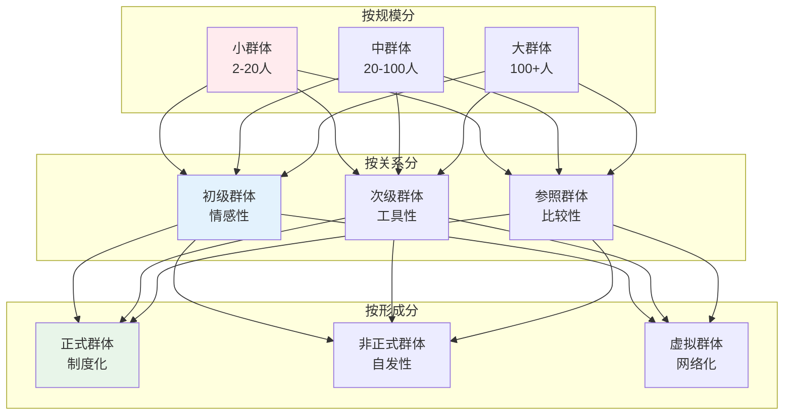
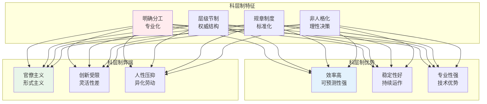
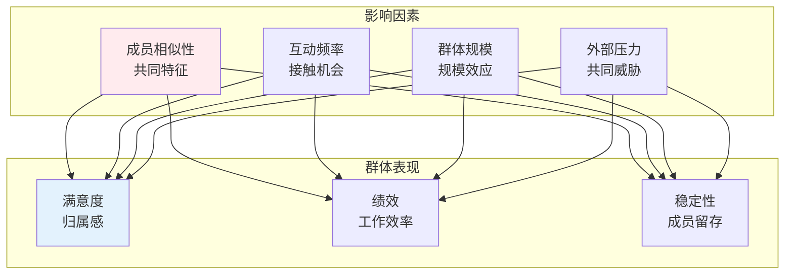
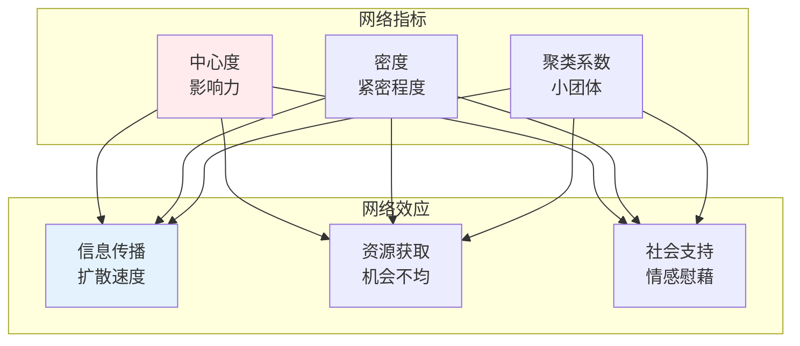
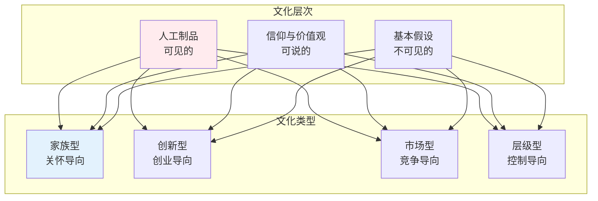

# 社会群体与组织

> **核心观点**：群体是人类社会生活的基本单位，组织是现代社会的主要结构形式。

---

## 📊 群体类型体系



---

## 🔬 初级群体

### 特征与功能

| 特征 | 内涵 | 例子 |
|------|------|------|
| 面对面互动 | 直接接触 | 家庭、邻里 |
| 情感性强 | 情感纽带 | 朋友、同伴 |
| 持久性 | 长期稳定 | 亲属关系 |
| 整合性 | 全面影响 | 社会化场所 |

### 初级群体功能

```
初级群体的社会功能：
1. 社会化：价值观、规范内化
2. 情感支持：心理慰藉
3. 社会控制：非正式约束
4. 身份认同：自我概念形成
5. 社会整合：社会凝聚力
```

### 初级群体的变迁

| 变化趋势 | 表现 | 影响 |
|----------|------|------|
| 规模缩小 | 家庭小型化 | 支持网络弱化 |
| 功能外移 | 教育、养老转移 | 功能专业化 |
| 关系松散 | 互动频率降低 | 情感纽带减弱 |
| 选择性增强 | 自由选择 | 质量提升 |

---

## 🏢 次级群体

### 组织类型

| 组织类型 | 目标 | 特征 | 例子 |
|----------|------|------|------|
| 营利组织 | 经济利益 | 市场导向 | 企业 |
| 非营利组织 | 社会服务 | 公益导向 | 慈善机构 |
| 政府组织 | 公共管理 | 权威导向 | 行政机关 |
| 政党组织 | 政治目标 | 意识形态 | 政党 |

### 科层制理论（韦伯）



---

## 👥 群体动力学

### 群体凝聚力



### 群体决策

| 问题类型 | 描述 | 解决方案 |
|----------|------|----------|
| 群体思维 | 追求一致忽略风险 | 魔鬼代言人 |
| 群体极化 | 决策趋向极端 | 多元意见 |
| 社会惰化 | 个人努力减少 | 责任明确 |
| 从众压力 | 服从群体规范 | 匿名投票 |

### 群体冲突

```
冲突的两面性：
1. 功能性冲突：促进创新、增强团结
2. 失能性冲突：降低效率、破坏关系

冲突管理策略：
1. 竞争：坚持己见
2. 合作：双赢解决
3. 妥协：各让一步
4. 回避：暂时搁置
5. 迁就：委曲求全
```

---

## 🌐 社会网络

### 网络类型

| 网络类型 | 结构特征 | 功能优势 |
|----------|----------|----------|
| 强关系网络 | 紧密、互惠 | 情感支持 |
| 弱关系网络 | 松散、桥接 | 信息传播 |
| 社会资本 | 资源嵌入 | 机会获取 |
| 结构洞 | 桥梁位置 | 信息优势 |

### 网络分析



---

## 🏭 组织社会学

### 组织结构

| 结构类型 | 特征 | 优点 | 缺点 |
|----------|------|------|------|
| 官僚制 | 层级分明、规则明确 | 效率高、稳定 | 僵化、创新差 |
| 矩阵制 | 双重汇报 | 资源共享 | 指挥混乱 |
| 扁平化 | 层级少、授权多 | 灵活、创新 | 控制弱 |
| 网络化 | 虚拟、灵活 | 响应快 | 协调难 |

### 组织文化



### 组织变革

```
组织变革八步骤：
1. 建立紧迫感
2. 组建领导团队
3. 制定愿景战略
4. 沟通变革愿景
5. 授权广泛行动
6. 创造短期成效
7. 巩固成果推进
8. 植入文化基因
```

---

## 🎯 核心结论

### 群体与组织的基本规律

1. **规模影响互动**：群体规模影响互动质量
2. **关系决定功能**：不同关系类型有不同功能
3. **结构决定行为**：组织结构影响成员行为
4. **文化塑造认同**：组织文化影响身份认同
5. **网络影响资源**：网络位置影响机会获取

### 实践启示

```
管理启示：
1. 重视初级群体的情感功能
2. 平衡科层制的效率与创新
3. 培育积极的组织文化
4. 构建有利的社会网络
5. 管理群体冲突
```

---

## 📚 参考文献

1. 韦伯《经济与社会》
2. 梅奥《工业文明的人类问题》
3. 帕特南《独自打保龄》
4. 格兰诺维特《找工作》
5. 沙因《组织文化与领导力》
6. 科特《领导变革》
7. 卡斯特《组织与管理》
8. 罗宾斯《组织行为学》