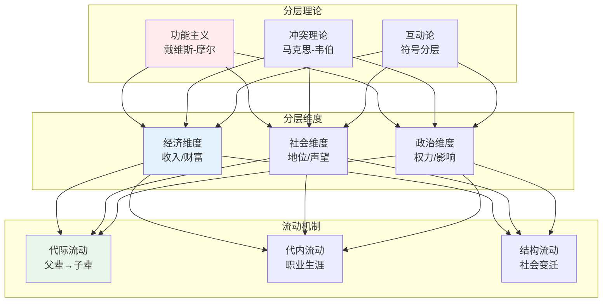
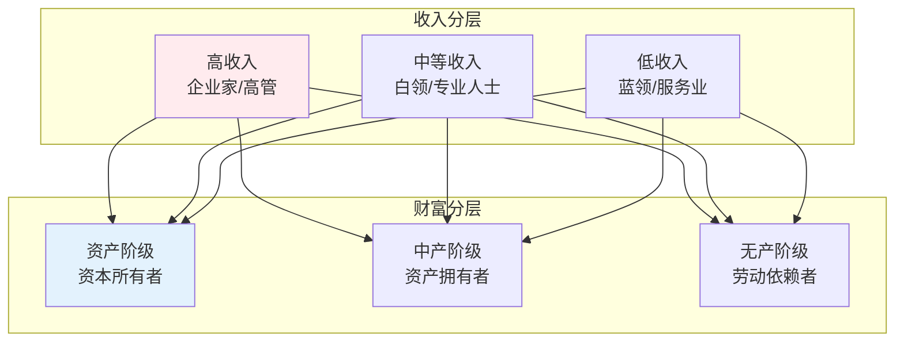
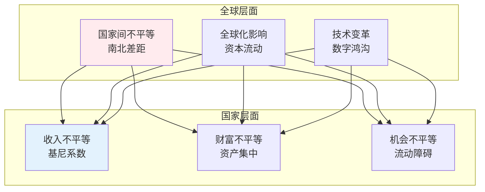

# 社会分层与流动

> **核心观点**：社会分层是社会不平等的结构性表现，理解分层机制是认识社会的关键。

---

## 📊 分层理论框架



---

## 🔬 分层理论对比

### 功能主义视角

**核心观点**：分层是社会运行的必要条件，重要职位需要更高报酬。

| 概念 | 内涵 | 评价 |
|------|------|------|
| 戴维斯-摩尔命题 | 分层促进社会功能 | 忽视不平等 |
| 社会必要差异 | 不同职位需要不同技能 | 合理性解释 |
| 报酬差异 | 重要职位需要更高激励 | 效率论证 |

### 冲突理论视角

**核心观点**：分层是权力斗争的结果，反映阶级利益冲突。

| 概念 | 内涵 | 评价 |
|------|------|------|
| 阶级剥削 | 资本家剥削工人 | 揭示不平等根源 |
| 虚假意识 | 被压迫者接受压迫 | 意识形态批判 |
| 阶级固化 | 不平等代际传递 | 结构性分析 |

### 互动论视角

**核心观点**：分层是社会建构的产物，通过日常生活再生产。

| 概念 | 内涵 | 评价 |
|------|------|------|
| 符号分层 | 身份标志的象征 | 微观机制 |
| 生活方式 | 消费模式的差异 | 文化分析 |
| 身份认同 | 社会位置的内化 | 主观体验 |

---

## 📊 分层维度详解

### 经济分层



### 社会地位

| 地位类型 | 获得方式 | 特征 | 例子 |
|----------|----------|------|------|
| 先赋地位 | 出生决定 | 不可改变 | 种族、性别 |
| 自致地位 | 个人努力 | 可以改变 | 学历、职业 |
| 主要地位 | 核心身份 | 主导认同 | 职业地位 |
| 次要地位 | 辅助身份 | 补充认同 | 宗教、兴趣 |

### 权力分层

```
权力来源：
1. 经济权力：资源控制
2. 政治权力：制度影响
3. 文化权力：符号资本
4. 社会权力：关系网络
5. 信息权力：知识控制
```

---

## 📈 社会流动机制

### 代际流动


### 流动类型

| 流动类型 | 描述 | 影响因素 |
|----------|------|----------|
| 向上流动 | 社会地位提升 | 教育、机遇 |
| 向下流动 | 社会地位下降 | 失败、疾病 |
| 水平流动 | 地位不变 | 稳定状态 |
| 结构流动 | 社会结构变化 | 经济发展 |
| 循环流动 | 地位机会平等 | 理想状态 |

### 流动障碍

| 障碍类型 | 描述 | 表现 |
|----------|------|------|
| 教育不平等 | 教育机会差异 | 阶层固化 |
| 社会资本 | 关系网络差异 | 机会不均 |
| 文化资本 | 文化资源差异 | 代际传递 |
| 经济资本 | 财富积累差异 | 起点不公 |
| 制度歧视 | 结构性排斥 | 系统性不平等 |

---

## 🏛️ 中产阶级研究

### 中产阶级特征

| 维度 | 特征 | 表现 |
|------|------|------|
| 经济 | 收入稳定 | 有产有业 |
| 职业 | 专业技能 | 白领工作 |
| 教育 | 高等教育 | 学历优势 |
| 价值观 | 稳定保守 | 中庸态度 |

### 中产阶级焦虑

```
中产阶级焦虑来源：
1. 职业焦虑：技术替代、竞争压力
2. 教育焦虑：子女教育、升学压力
3. 住房焦虑：房贷压力、房价波动
4. 养老焦虑：养老保障、医疗费用
5. 身份焦虑：地位维持、阶层下滑
```

---

## 🌍 当代分层趋势

### 全球不平等



### 不平等测量

| 测量指标 | 计算方法 | 优缺点 |
|----------|----------|--------|
| 基尼系数 | 洛伦兹曲线 | 综合反映 |
| 帕尔马比率 | 顶层10%/底层40% | 聚焦两端 |
| 收入份额 | 各层收入占比 | 直观易懂 |
| 财富集中度 | 资产分布 | 反映积累 |

---

## 🎯 核心结论

### 分层的基本规律

1. **分层普遍存在**：任何社会都存在不平等
2. **分层相对稳定**：结构一旦形成难以改变
3. **流动受限**：结构性障碍限制流动
4. **再生产机制**：不平等通过多种渠道传递
5. **政策可干预**：制度设计可影响分层

### 政策启示

```
促进社会流动的政策：
1. 教育公平：均衡教育资源
2. 就业公平：消除歧视壁垒
3. 收入调节：税收再分配
4. 社会保障：托底弱势群体
5. 反垄断：防止资本过度集中
```

---

## 📚 参考文献

1. 马克思《资本论》
2. 韦伯《阶级、地位与政党》
3. 布迪厄《区分》
4. 戴维斯《地位系统》
5. 帕金《社会不平等》
6. 费孝通《乡土中国》
7. 李强《社会分层十讲》
8. 陆学艺《当代中国社会阶层研究报告》