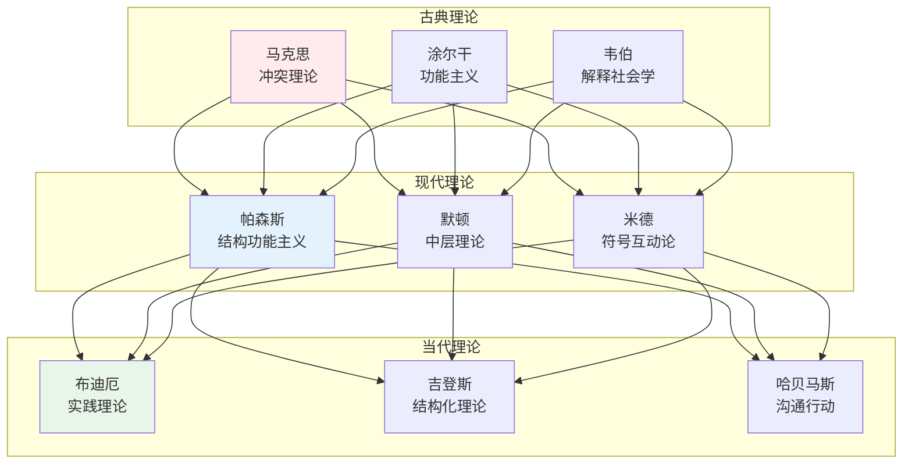

# 社会学理论

> **核心观点**：社会学理论是对社会现象的系统解释，帮助我们理解社会如何运作、为何如此。

---

## 📊 理论概览



---

## 🔬 古典理论三大奠基人

### 马克思：冲突理论

**核心命题**：社会是由经济基础决定的，阶级斗争是社会变迁的动力。

| 概念 | 内涵 | 现实意义 |
|------|------|----------|
| 经济基础 | 生产力与生产关系 | 决定社会形态 |
| 上层建筑 | 政治、法律、意识形态 | 反映经济基础 |
| 阶级斗争 | 资产阶级与无产阶级对立 | 社会变迁动力 |
| 异化 | 劳动者与劳动产品分离 | 现代工作问题 |
| 剩余价值 | 工人创造的超出工资的价值 | 利润来源 |

```
马克思的历史唯物主义：
1. 生产力决定生产关系
2. 经济基础决定上层建筑
3. 社会存在决定社会意识
4. 阶级斗争推动社会变革
```

### 涂尔干：功能主义

**核心命题**：社会是一个有机整体，各部分协调运作维持社会秩序。

| 概念 | 内涵 | 研究方法 |
|------|------|----------|
| 社会事实 | 外在于个人的社会现象 | 客观研究 |
| 机械团结 | 同质社会的凝聚力 | 传统社会 |
| 有机团结 | 异质社会的相互依赖 | 现代社会 |
| 社会失范 | 规范缺失导致的混乱 | 失范研究 |
| 集体意识 | 共同的信仰与情感 | 宗教研究 |

```
涂尔干的社会学方法论：
1. 把社会事实当作物来研究
2. 社会事实必须用社会事实解释
3. 区分正常与病态现象
4. 比较方法验证假设
```

### 韦伯：解释社会学

**核心命题**：社会学应理解社会行动的主观意义。

| 概念 | 内涵 | 应用领域 |
|------|------|----------|
| 理解社会学 | 理解行动的主观意义 | 微观分析 |
| 理想类型 | 概念化的分析工具 | 比较研究 |
| 官僚制 | 理性化组织形式 | 组织研究 |
| 新教伦理 | 资本主义精神来源 | 宗教社会学 |
| 社会分层 | 阶级、地位、权力 | 分层研究 |

```
韦伯的三维分层：
1. 经济维度：阶级（财富）
2. 声望维度：地位（荣誉）
3. 权力维度：政党（政治影响力）
```

---

## 📚 现代理论发展

### 帕森斯：结构功能主义

**核心命题**：社会系统通过满足功能需求维持均衡。

| 功能需求 | 内容 | 满足机制 |
|----------|------|----------|
| 适应 | 获取资源 | 经济系统 |
| 目标达成 | 实现目标 | 政治系统 |
| 整合 | 协调关系 | 法律系统 |
| 潜模式维持 | 传承价值 | 家庭/教育 |

### 默顿：中层理论

**核心命题**：反对宏大理论，主张可验证的中层理论。

| 理论类型 | 特点 | 例子 |
|----------|------|------|
| 宏观理论 | 解释一切社会现象 | 马克思主义 |
| 中层理论 | 解释特定社会现象 | 失范理论 |
| 微观理论 | 解释个体行为 | 标签理论 |

### 米德：符号互动论

**核心命题**：社会通过符号互动建构。

| 概念 | 内涵 | 发展过程 |
|------|------|----------|
| 符号 | 意义的载体 | 语言、手势 |
| 自我 | 自我意识 | 主我与客我 |
| 角色取替 | 理解他人视角 | 社会化 |
| 定义情境 | 情境的社会建构 | 互动基础 |

---

## 🎯 当代理论前沿

### 布迪厄：实践理论

**核心命题**：社会实践是惯习、场域、资本相互作用的结果。

| 概念 | 内涵 | 分析应用 |
|------|------|----------|
| 惯习 | 内化的行动倾向 | 行为模式 |
| 场域 | 社会空间 | 权力场域 |
| 资本 | 社会资源 | 经济/文化/社会/象征 |
| 符号暴力 | 文化再生产 | 教育不平等 |

### 吉登斯：结构化理论

**核心命题**：结构与能动是二重性的，相互建构。

| 概念 | 内涵 | 理论意义 |
|------|------|----------|
| 结构 | 规则与资源 | 结构二重性 |
| 能动 | 行动者的能力 | 行动反思性 |
| 结构化 | 结构的生产与再生产 | 跨越二元对立 |

### 哈贝马斯：沟通行动理论

**核心命题**：通过理性沟通达成共识是社会整合的基础。

| 概念 | 内涵 | 现实意义 |
|------|------|----------|
| 沟通行动 | 以理解为导向的行动 | 交往理性 |
| 生活世界 | 文化、社会、人格 | 共识基础 |
| 系统 | 经济与行政 | 理性化 |
| 公共领域 | 公众讨论空间 | 民主基础 |

---

## 🎯 核心结论

### 理论选择指南

| 研究问题 | 推荐理论 | 分析焦点 |
|----------|----------|----------|
| 社会不平等 | 冲突理论 | 阶级、权力 |
| 社会秩序 | 功能主义 | 制度、规范 |
| 日常生活 | 符号互动论 | 互动、意义 |
| 文化再生产 | 实践理论 | 惯习、资本 |
| 现代性 | 结构化理论 | 结构与能动 |

### 理论学习路径

```
第1步：理解三大古典理论
第2步：学习现代理论发展
第3步：掌握当代理论前沿
第4步：比较不同理论视角
第5步：应用于实际研究
```

---

## 📚 参考文献

1. 马克思《资本论》
2. 涂尔干《社会学方法的准则》
3. 韦伯《新教伦理与资本主义精神》
4. 帕森斯《社会系统》
5. 布迪厄《区分》
6. 吉登斯《社会的构成》
7. 哈贝马斯《沟通行动理论》
8. 《社会学理论》- 乔纳森·特纳