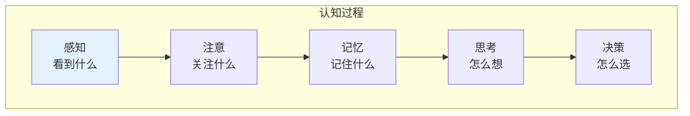
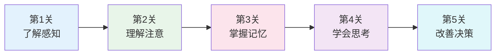

# 认知心理

> **重要提示**：心理学的主目录在 [社会科学/心理学](/social-sciences/psychology/index.md)，这里只介绍思维科学视角的认知心理。

---

## 🎯 一句话理解认知心理

**认知心理就是研究"脑子是怎么想问题"的学问！**

---

## 🔗 快速跳转

| 主题 | 主目录位置 | 思维科学视角 |
|------|------------|--------------|
| 心理学基础 | [社会科学/心理学](/social-sciences/psychology/index.md) | 基础理论 |
| 学习心理 | [思维科学/学习认知](/thinking/learning-cognition/index.md) | 学习方法 |
| 思维科学 | [思维科学](/thinking/index.md) | 思维方法 |

---

## 📚 认知心理的核心内容

### 🧠 认知过程

### 🎯 认知心理关注的问题

| 问题 | 内容 | 应用 |
|------|------|------|
| 人怎么感知世界？ | 视觉、听觉、触觉 | 设计产品 |
| 人怎么记忆？ | 短期记忆、长期记忆 | 提高学习效率 |
| 人怎么思考？ | 推理、判断、决策 | 改善思维 |
| 人怎么学习？ | 学习策略、迁移 | 优化教育 |

---

## 🎮 认知心理闯关游戏

---

## 💡 给小学生的话

> 认知心理就是研究"你怎么想"的学问！
> 
> 先去 [社会科学/心理学](/social-sciences/psychology/index.md) 学好基础，再来这里看脑子怎么工作！
> 
> 记住：了解自己的脑子，才能更好地学习！

---

**每个认知心理学家都曾经是初学者！**