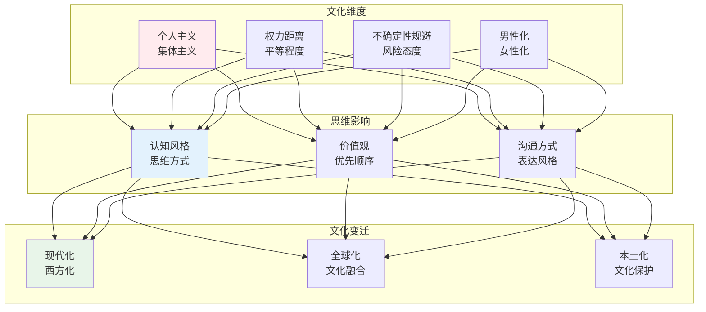
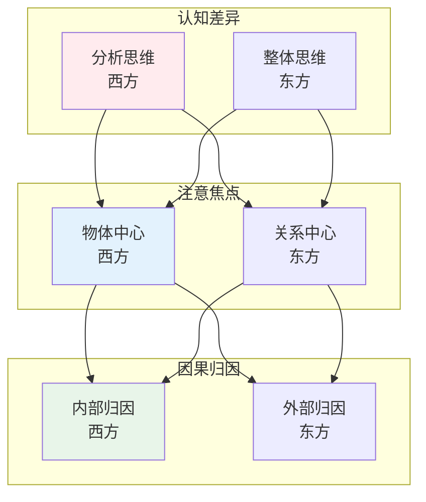
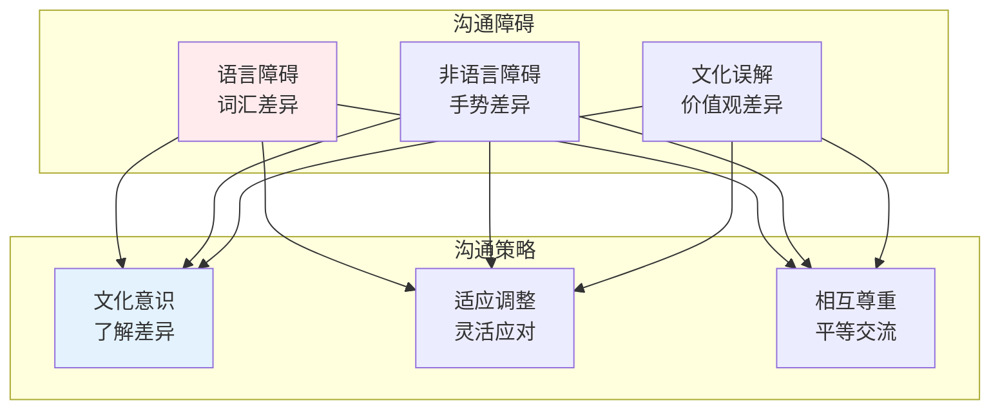

# 文化研究

> **核心观点**：文化是人类思维的载体，理解文化对思维的影响是跨文化理解的基础。

---

## 📊 文化思维框架



---

## 🌍 文化理论

### 霍夫斯泰德文化维度

| 维度 | 两极 | 例子 |
|------|------|------|
| 个人主义/集体主义 | 个人vs群体 | 美国vs中国 |
| 权力距离 | 平等vs等级 | 北欧vs亚洲 |
| 不确定性规避 | 接受vs规避 | 新加坡vs希腊 |
| 男性化/女性化 | 竞争vs合作 | 日本vs北欧 |
| 长期/短期导向 | 未来vs现在 | 中国vs美国 |
| 放纵/约束 | 自由vs克制 | 墨西哥vs巴基斯坦 |

### 文化与认知



---

## 🎭 文化符号

### 符号系统

| 符号类型 | 内涵 | 例子 |
|----------|------|------|
| 语言符号 | 概念表达 | 词汇含义 |
| 非语言符号 | 行为表达 | 手势表情 |
| 物质符号 | 实物表达 | 建筑服饰 |
| 仪式符号 | 行为表达 | 节日仪式 |

### 文化传承

```
文化传承方式：
1. 家庭传承：代际传递
2. 教育传承：学校教育
3. 媒体传承：大众传播
4. 社区传承：社会互动
5. 数字传承：网络媒体
```

---

## 🌐 跨文化理解

### 文化适应

| 策略 | 特点 | 例子 |
|------|------|------|
| 同化 | 融入主流文化 | 移民融入 |
| 分离 | 保持原有文化 | 族裔社区 |
| 整合 | 双重文化认同 | 双语者 |
| 边缘化 | 两种文化疏离 | 文化迷失 |

### 跨文化沟通



---

## 🎯 核心结论

### 文化思维发现

1. **文化多样性**：不同文化有不同思维
2. **文化相对性**：没有绝对优劣
3. **文化适应性**：文化适应环境
4. **文化变迁性**：文化持续变化
5. **文化影响力**：文化深刻影响思维

### 实践启示

```
跨文化实践启示：
1. 尊重差异：接受多元
2. 保持开放：学习借鉴
3. 批判思考：反思自身
4. 主动适应：灵活应对
5. 促进对话：增进理解
```

---

## 📚 参考文献

1. 吉尔特·霍夫斯泰德《文化的后果》
2. 理查德·尼斯贝特《思维的版图》
3. 爱德华·霍尔《超越文化》
4. 克利福德·格尔茨《文化的解释》
5. 张岱年《中国文化概论》
6. 《跨文化沟通》- 拉里·萨默瓦尔
7. 《文化心理学》- 理查德·施韦德
8. 《文化人类学》- 庄孔韶