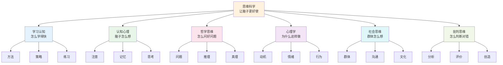
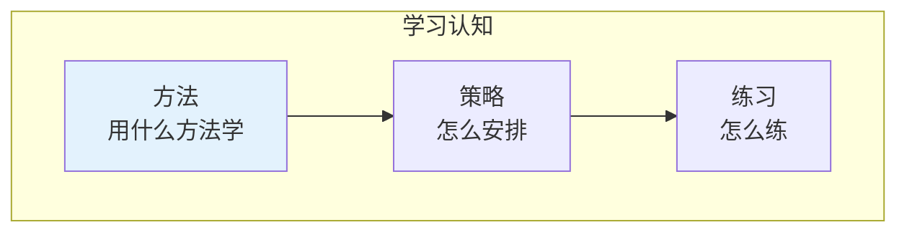
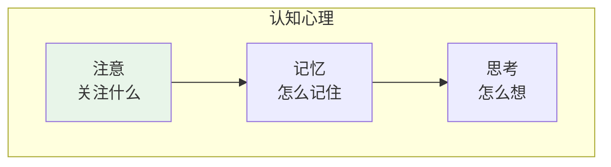
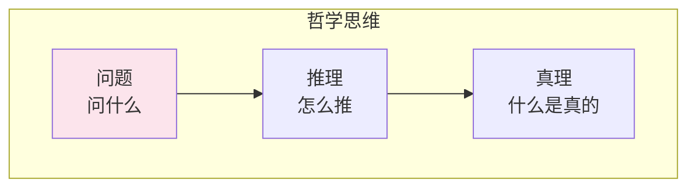
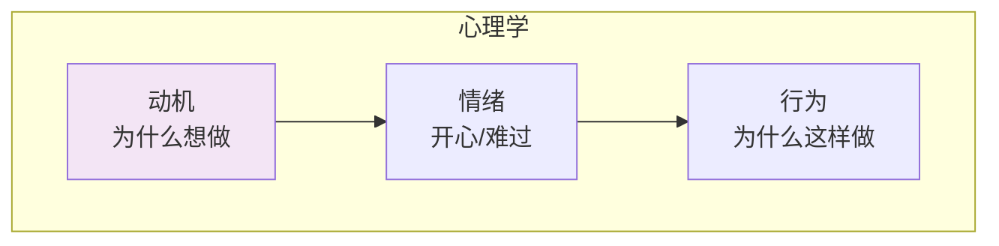
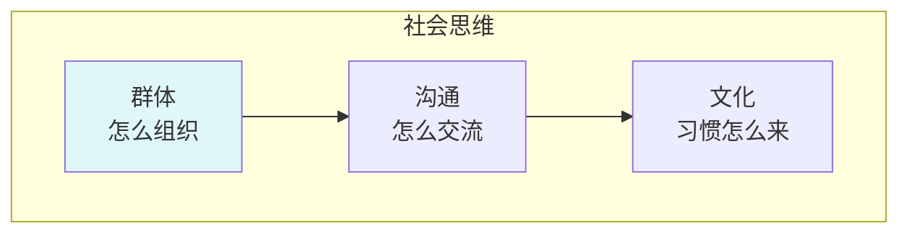
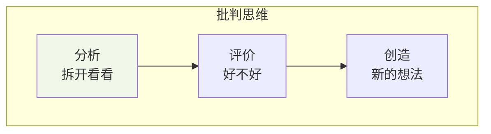
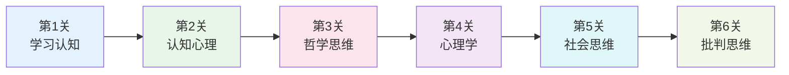

# 思维科学

> **费曼学习法**：思维就是"怎么想问题"的学问！

---

## 🎯 一句话理解思维科学

**思维科学就是研究"怎么想问题、怎么学得快"的学问！**

为什么有些人学得快？为什么有些人想得深？思维科学就是回答这些问题的！

---

## 🏗️ 思维科学的"积木塔"

---

## 📚 每个积木块详解

### 📚 学习认知（怎么学得快）

**用小学生的话说**：学习认知就是研究"怎么学得快、记得牢"的学问！

| 积木块 | 小学生版解释 | 生活中的例子 |
|--------|--------------|--------------|
| 方法 | 用什么方法学 | 做笔记、多复习 |
| 策略 | 怎么安排 | 先做难的还是简单的 |
| 练习 | 怎么练 | 多做题、多实践 |

---

### 🧠 认知心理（脑子怎么想）

**用小学生的话说**：认知心理就是研究"脑子是怎么想问题"的学问！

| 积木块 | 小学生版解释 | 生活中的例子 |
|--------|--------------|--------------|
| 注意 | 关注什么 | 上课认真听讲 |
| 记忆 | 怎么记住 | 背课文 |
| 思考 | 怎么想 | 解数学题 |

---

### 🤔 哲学思维（怎么问好问题）

**用小学生的话说**：哲学思维就是研究"怎么问好问题"的学问！

| 积木块 | 小学生版解释 | 生活中的例子 |
|--------|--------------|--------------|
| 问题 | 问什么 | 为什么天是蓝的？ |
| 推理 | 怎么推 | 因为...所以... |
| 真理 | 什么是真的 | 什么是事实？ |

---

### 😊 心理学（为什么这样做）

**用小学生的话说**：心理学就是研究"为什么我会这样做"的学问！

| 积木块 | 小学生版解释 | 生活中的例子 |
|--------|--------------|--------------|
| 动机 | 为什么想做 | 想吃糖所以去拿 |
| 情绪 | 开心/难过 | 考试考好了很开心 |
| 行为 | 为什么这样做 | 因为开心所以笑 |

---

### 👥 社会思维（群体怎么想）

**用小学生的话说**：社会思维就是研究"一群人是怎么想的"的学问！

| 积木块 | 小学生版解释 | 生活中的例子 |
|--------|--------------|--------------|
| 群体 | 怎么组织 | 班级、小组 |
| 沟通 | 怎么交流 | 说话、写信 |
| 文化 | 习惯怎么来 | 过年吃饺子 |

---

### 🔍 批判思维（怎么判断对错）

**用小学生的话说**：批判思维就是研究"怎么判断对错"的学问！

| 积木块 | 小学生版解释 | 生活中的例子 |
|--------|--------------|--------------|
| 分析 | 拆开看看 | 这个消息是真的吗？ |
| 评价 | 好不好 | 这个方法好不好？ |
| 创造 | 新的想法 | 有没有更好的方法？ |

---

## 🎮 思维科学闯关游戏

**闯关秘籍**：
1. **第1关**：学学习认知（学会学习）
2. **第2关**：学认知心理（理解思维）
3. **第3关**：学哲学思维（学会提问）
4. **第4关**：学心理学（理解行为）
5. **第5关**：学社会思维（理解群体）
6. **第6关**：学批判思维（学会判断）

---

## 💡 给小学生的话

> 思维就像肌肉，越练越强！
> 
> 多问"为什么"、多想"为什么"！
> 
> 你也可以成为思考高手！

---

**每个思想家都曾经是初学者！**