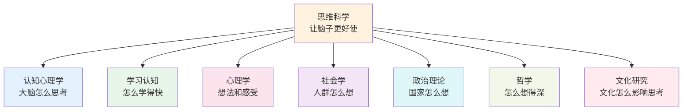

# 思维科学

> **费曼学习法**：思维科学就是研究「怎么想更清楚、学得更快、判断更准」的学问！

---

## 🎯 一句话理解思维科学

**思维科学就是让你的脑子更好使、想问题更清楚的学问！**

为什么有人学得快？为什么有人判断准？为什么有人说话有条理？思维科学就是回答这些问题的。

---

## 🏗️ 思维科学的「积木塔」

---

## 📚 内容导航

| 领域 | 说明 | 链接 |
|------|------|------|
| 🧠 认知心理学 | 记忆、注意、决策背后的心理机制 | [进入](cognitive-psychology/index.md) |
| 📖 学习认知 | 高效学习、思维模型与学习方法 | [进入](learning-cognition/index.md) |
| 🧭 心理学 | 从更广视角理解人的思维与行为 | [进入](psychology/index.md) |
| 👥 社会学 | 群体思维与社会行为规律 | [进入](sociology/index.md) |
| 🏛️ 政治理论 | 权力、秩序与集体决策的逻辑 | [进入](political-theory/index.md) |
| 🤔 哲学 | 追问「为什么」，锻炼深度思考 | [进入](philosophy/index.md) |
| 🌏 文化研究 | 文化如何塑造我们的思维方式 | [进入](cultural-studies/index.md) |

---

## 🔗 相关链接

| 主题 | 链接 |
|------|------|
| 心理学 | [社会科学/心理学](../social-sciences/psychology/index.md) |
| 哲学 | [人文科学/哲学](../humanities/philosophy/index.md) |
| 社会学 | [社会科学/社会学](../social-sciences/sociology/index.md) |
| 教育学 | [社会科学/教育学](../social-sciences/education/index.md) |

---

## 🛠️ 思维方法实践

> **AI工具下的认知体系化与思维结构化**

在AI工具的加持下，建立体系化的认知和结构化的思维变得尤为重要：

1. **确定学习目标**：明确想解决的问题或掌握的技能
2. **利用AI工具收集信息**：搜索引擎、知识图谱、在线课程快速获取信息
3. **建立知识框架**：用思维导图或概念图构建逻辑清晰的框架
4. **深入学习与思考**：对每个节点理解其原理和联系
5. **实践与应用**：把知识用于真实问题
6. **反思与迭代**：根据反馈调整学习策略与框架
7. **保持好奇心**：持续学习，不断丰富认知体系

**解决问题四步法**：识别问题核心 → 分析问题原因 → 制定解决方案 → 执行与监控。问题解决后别忘了反思总结，为未来积累经验。

---

## 💡 给小学生的话

> 脑子越用越灵！
>
> 学会「怎么想」，比记住「想什么」更重要！
>
> 从现在开始，像侦探一样思考吧！

---

**每个思考者都曾经是初学者！**