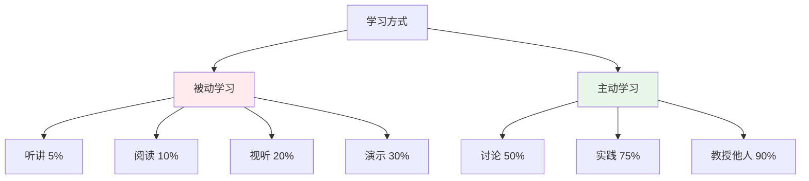
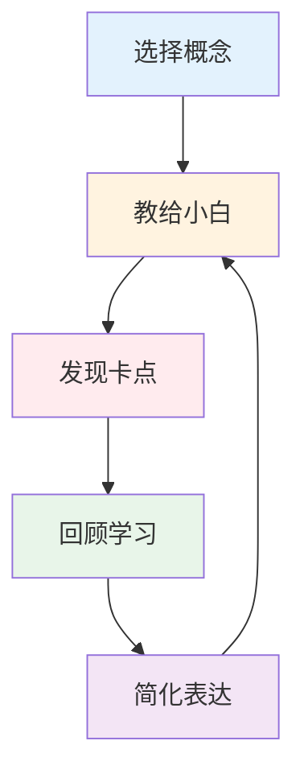
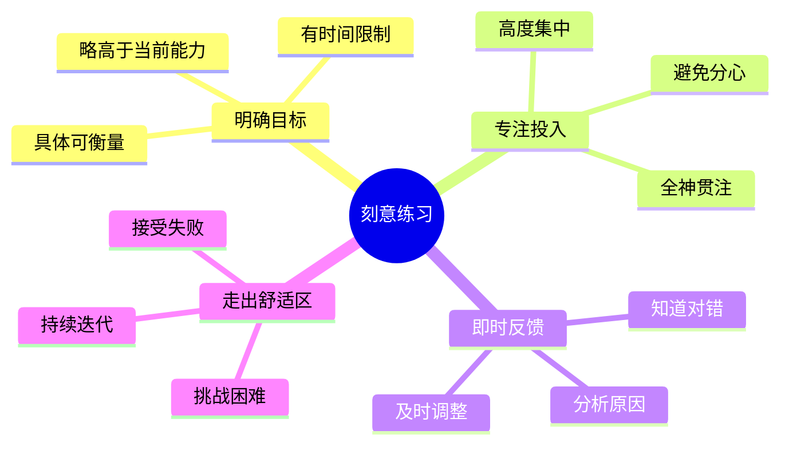
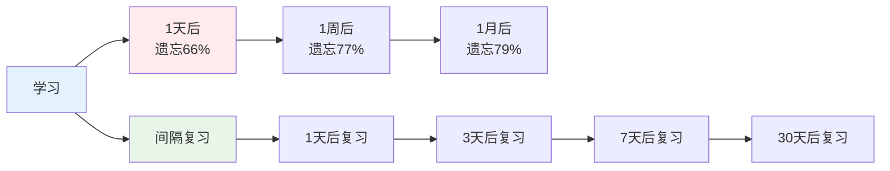
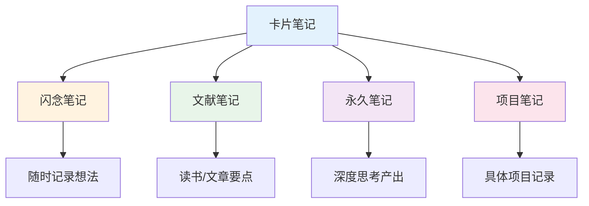

# 高效学习实战 — 让学习事半功倍

> 90%的人在用低效的方式学习，只有20%的人掌握了核心方法

---

## 一、学习效果公式

```
学习效果 = 输入质量 × 加工深度 × 输出频率 × 复习密度
```

### 学习金字塔



---

## 二、费曼学习法

### 2.1 费曼学习法流程



### 2.2 费曼学习法要点

| 步骤 | 说明 | 关键点 |
|------|------|--------|
| 选择概念 | 选择要学习的概念 | 明确学习目标 |
| 教给小白 | 用简单语言解释 | 假设对方完全不懂 |
| 发现卡点 | 找出解释不清楚的地方 | 卡点就是没理解 |
| 回顾学习 | 重新学习卡点内容 | 针对性学习 |
| 简化表达 | 用更简单的话解释 | 直到完全理解 |

---

## 三、刻意练习

### 3.1 刻意练习四要素



### 3.2 刻意练习案例

**案例：学习编程**

| 阶段 | 做法 | 结果 |
|------|------|------|
| 初级 | 只看教程 | 学了就忘 |
| 中级 | 做小项目 | 能写简单代码 |
| 高级 | 刻意练习+反馈 | 能独立开发 |

---

## 四、间隔重复

### 4.1 艾宾浩斯遗忘曲线



### 4.2 复习时间表

| 复习次数 | 间隔时间 | 目的 |
|----------|----------|------|
| 第1次 | 学习后立即 | 巩固记忆 |
| 第2次 | 1天后 | 对抗遗忘 |
| 第3次 | 3天后 | 深化记忆 |
| 第4次 | 7天后 | 长期记忆 |
| 第5次 | 30天后 | 永久记忆 |

---

## 五、知识管理

### 5.1 卡片笔记法



### 5.2 知识体系构建

| 步骤 | 说明 | 工具 |
|------|------|------|
| 收集 | 收集优质内容 | RSS、收藏夹 |
| 整理 | 分类整理 | 标签、文件夹 |
| 加工 | 深度思考 | 笔记软件 |
| 连接 | 建立知识网络 | 双向链接 |
| 输出 | 写作、分享 | 博客、公众号 |

---

## 六、学习避坑指南

### 6.1 常见误区

| 误区 | 正确做法 |
|------|----------|
| 收藏=学过 | 整理+输出 |
| 追求速成 | 接受慢就是快 |
| 碎片化 | 系统化学习 |
| 不复习 | 间隔重复 |
| 不输出 | 主动输出 |

### 6.2 高效学习习惯

- [ ] 每天固定时间学习
- [ ] 学习时关闭干扰
- [ ] 做笔记并定期复习
- [ ] 输出倒逼输入
- [ ] 找到学习伙伴

---

## 七、行动清单

### 建立学习系统

- [ ] 明确学习目标
- [ ] 选择学习资源
- [ ] 制定学习计划
- [ ] 建立笔记系统
- [ ] 定期复习输出

### 提升学习效率

- [ ] 使用费曼学习法
- [ ] 刻意练习
- [ ] 间隔重复
- [ ] 输出倒逼输入
- [ ] 找到学习伙伴

---

> **记住：学习的目的不是记住知识，而是改变行为。**
