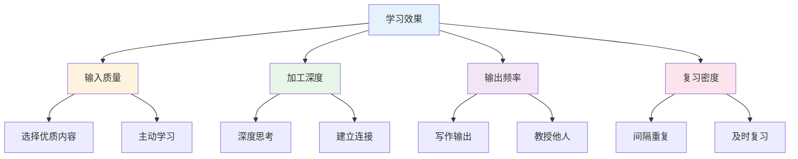
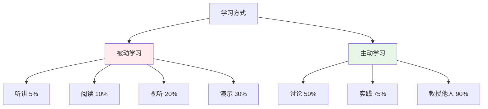
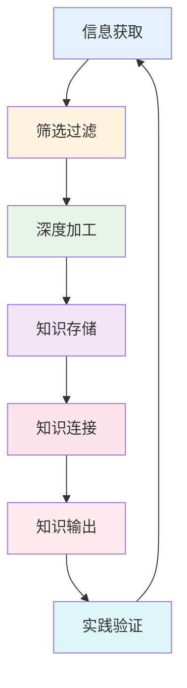
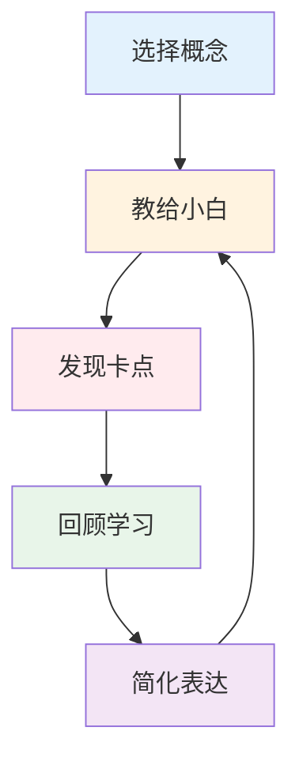
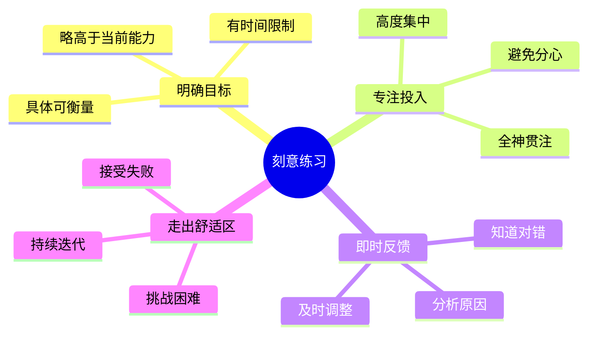
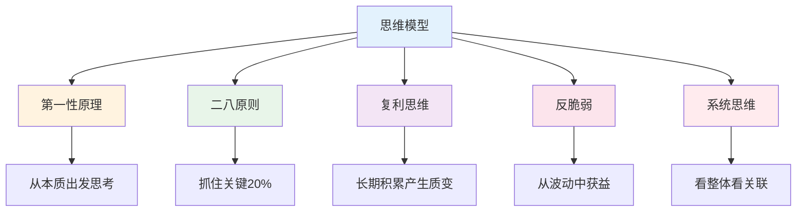
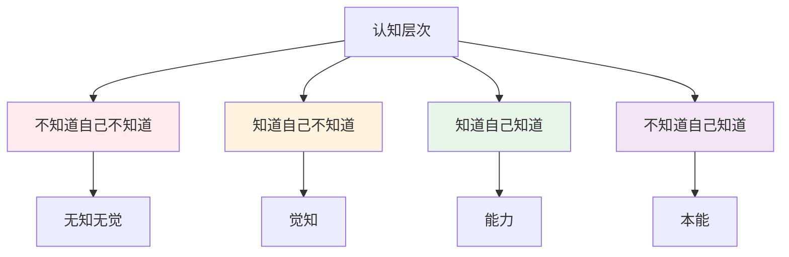
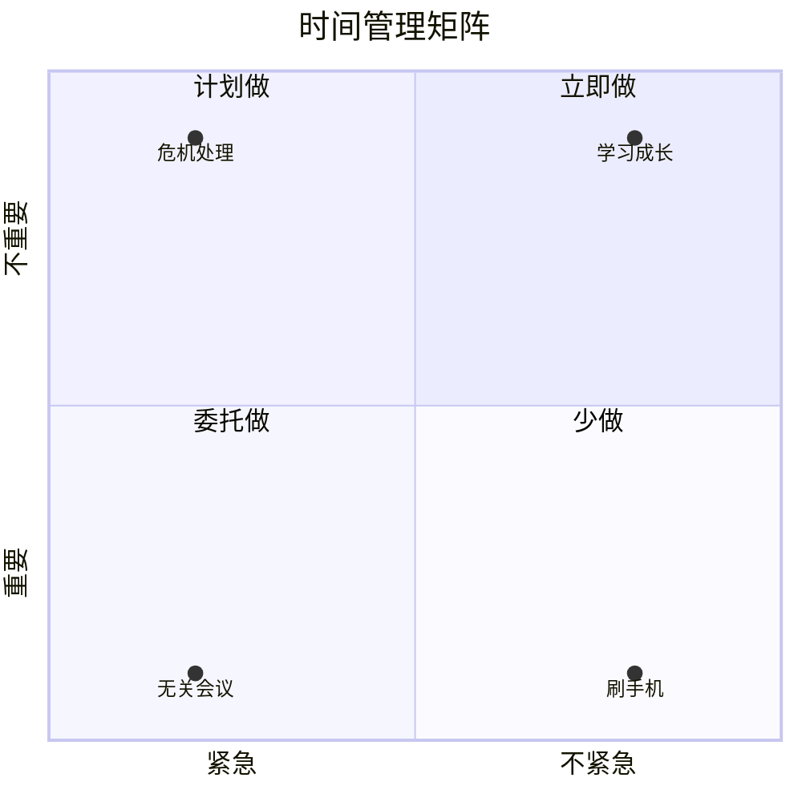
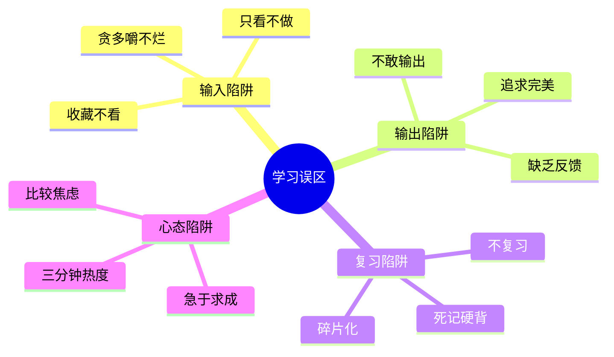

# 学习认知 — 高效学习的底层逻辑

> 90%的人在用低效的方式学习，只有20%的人掌握了学习的核心规律
> 目标：建立高效学习系统，持续提升认知能力

---

## 一、学习核心规律

### 1.1 学习效果公式

**学习效果 = 输入质量 × 加工深度 × 输出频率 × 复习密度**

### 1.2 学习金字塔

**外行做法：** 只输入不输出
**内行做法：** 输入+加工+输出+复习闭环

---

## 二、知识管理系统

### 2.1 知识管理流程

### 2.2 卡片笔记法

| 类型 | 内容 | 用途 |
|------|------|------|
| 闪念笔记 | 随时记录想法 | 捕捉灵感 |
| 文献笔记 | 读书/文章要点 | 积累素材 |
| 永久笔记 | 深度思考产出 | 知识积累 |
| 项目笔记 | 具体项目记录 | 实践总结 |

---

## 三、高效学习方法

### 3.1 费曼学习法

**费曼学习法核心：** 用简单的语言解释复杂的概念

### 3.2 刻意练习四要素

---

## 四、思维模型

### 4.1 常用思维模型

### 4.2 决策框架

| 框架 | 核心问题 | 适用场景 |
|------|----------|----------|
| 第一性原理 | 本质是什么？ | 创新、复杂问题 |
| 二八原则 | 关键少数是什么？ | 优先级排序 |
| 逆向思维 | 怎样会失败？ | 风险评估 |
| 系统思维 | 各部分如何关联？ | 复杂系统 |
| 概率思维 | 可能性有多大？ | 风险决策 |

---

## 五、认知升级

### 5.1 认知层次模型

### 5.2 认知升级路径

| 阶段 | 特征 | 突破方法 |
|------|------|----------|
| 无知无觉 | 不知道自己不知道 | 广泛学习 |
| 觉知 | 知道自己不知道 | 专题研究 |
| 能力 | 知道自己知道 | 刻意练习 |
| 本能 | 不知道自己知道 | 实践内化 |

---

## 六、时间管理

### 6.1 时间管理四象限

### 6.2 高效学习时间安排

| 时间段 | 适合活动 | 原因 |
|--------|----------|------|
| 早晨 | 深度学习 | 精力充沛 |
| 上午 | 创造性工作 | 大脑活跃 |
| 下午 | 协作沟通 | 社交需求 |
| 晚上 | 轻松阅读 | 放松身心 |

---

## 七、学习避坑指南

### 7.1 常见学习误区

### 7.2 有效学习策略

| 误区 | 外行做法 | 内行做法 |
|------|----------|----------|
| 收藏 | 收藏=学过 | 整理+输出 |
| 速成 | 追求捷径 | 接受慢就是快 |
| 碎片化 | 随机学习 | 系统化学习 |
| 不复习 | 学过就忘 | 间隔重复 |
| 不输出 | 被动输入 | 主动输出 |

---

## 八、落地清单

### 建立学习系统

- [ ] 目标：明确学习目标和优先级
- [ ] 输入：选择优质学习资源
- [ ] 加工：深度思考、建立连接
- [ ] 输出：写作、教授他人
- [ ] 复习：间隔重复、及时回顾

### 提升认知能力

- [ ] 广度：跨领域学习
- [ ] 深度：专题深入研究
- [ ] 连接：建立知识网络
- [ ] 实践：学以致用
- [ ] 反思：定期复盘总结

---

## 九、推荐阅读

- 《学习之道》— 学习方法论
- 《如何阅读一本书》— 阅读方法
- 《思考，快与慢》— 认知心理学
- 《刻意练习》— 技能提升
- 《卡片笔记写作法》— 知识管理
