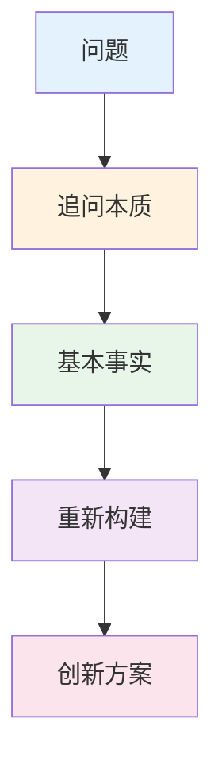
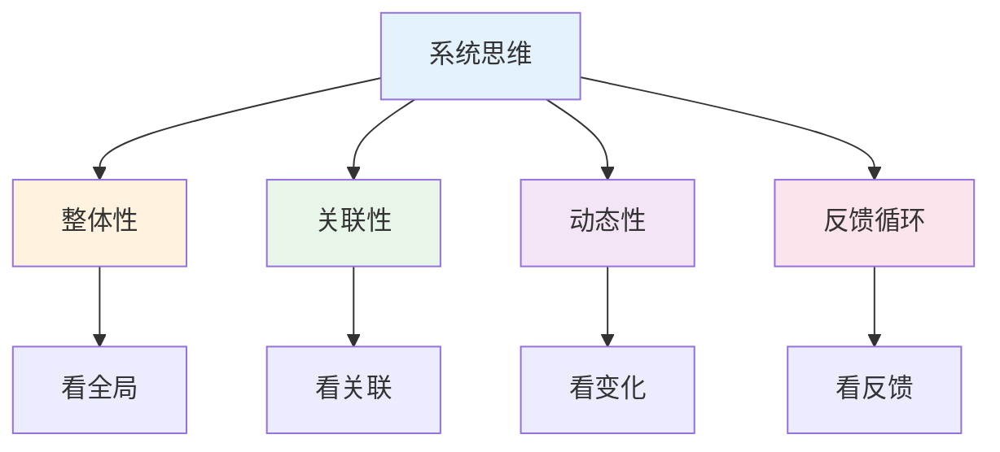
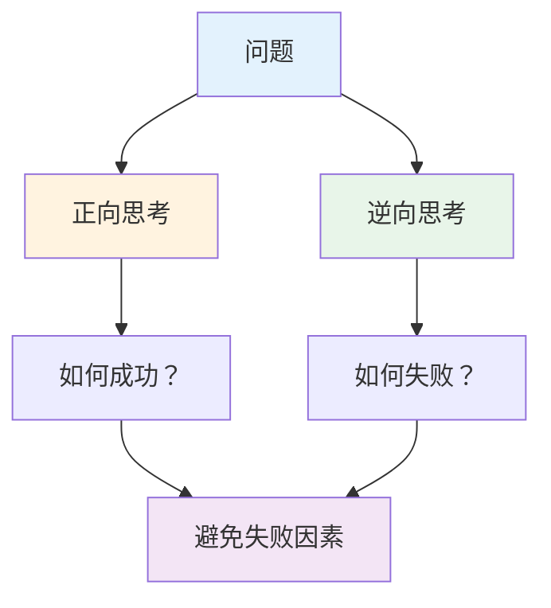
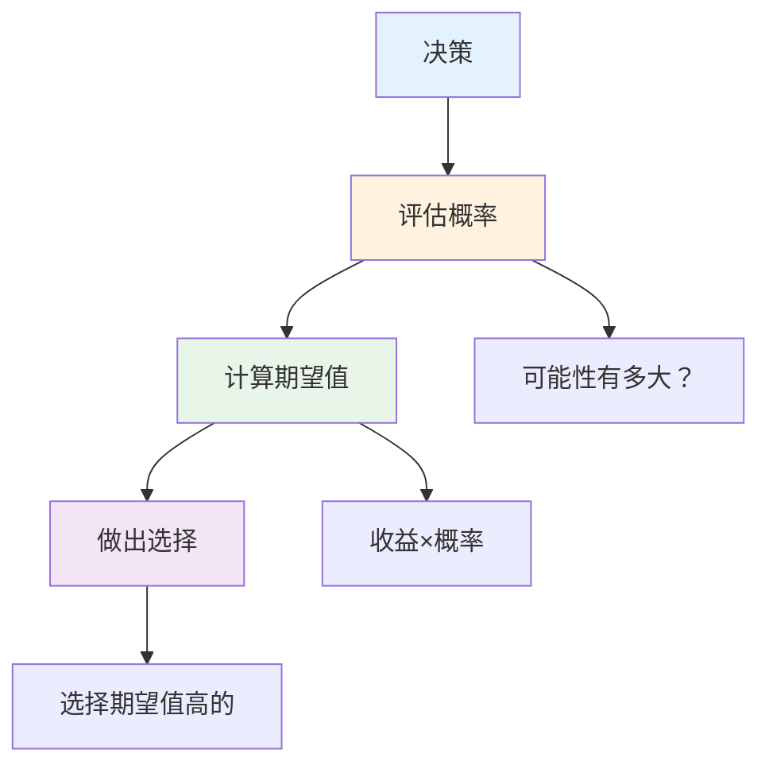

# 思维模型实战 — 提升思维质量的方法

> 80%的问题可以用20%的思维模型解决

---

## 一、第一性原理

### 1.1 核心概念



### 1.2 案例：特斯拉电池成本

**传统思维：** 电池很贵，所以电动车很贵

**第一性原理：**
- 电池由什么组成？钴、镍、锂等
- 这些原材料贵吗？不贵
- 所以电池成本可以降低

**结果：** 特斯拉大幅降低电池成本

---

## 二、二八原则

### 2.1 核心概念

```
80%的结果来自20%的原因
找到关键的20%，事半功倍
```

### 2.2 应用场景

| 场景 | 应用 |
|------|------|
| 时间管理 | 找出最重要的20%任务 |
| 客户管理 | 服务好20%的高价值客户 |
| 问题解决 | 找出关键的20%原因 |
| 学习 | 掌握20%的核心知识 |

---

## 三、系统思维

### 3.1 核心概念



### 3.2 案例：交通拥堵

**线性思维：** 路窄→堵车→修路

**系统思维：**
- 路窄→堵车→修路→更多车→还是堵
- 解决方案：公共交通+错峰出行

---

## 四、逆向思维

### 4.1 核心概念



### 4.2 案例：投资决策

**正向思考：** 如何投资赚钱？

**逆向思考：** 如何投资亏钱？

- 追涨杀跌
- 过度集中
- 借钱投资
- 情绪化

**结论：** 避免这些行为就能赚钱

---

## 五、概率思维

### 5.1 核心概念



### 5.2 案例：创业决策

| 方案 | 成功概率 | 成功收益 | 期望值 |
|------|----------|----------|--------|
| 创业A | 20% | 1000万 | 200万 |
| 创业B | 40% | 500万 | 200万 |
| 上班 | 90% | 100万/年 | 90万 |

**分析：** 创业期望值高，但风险也高

---

## 六、行动清单

### 学习思维模型

- [ ] 了解常用思维模型
- [ ] 理解每个模型的适用场景
- [ ] 在实际问题中应用
- [ ] 定期复盘总结

### 应用思维模型

- [ ] 遇到问题先选择思维模型
- [ ] 用模型分析问题
- [ ] 用模型指导行动
- [ ] 用模型评估结果

---

> **记住：思维模型是工具，用对了事半功倍。**
