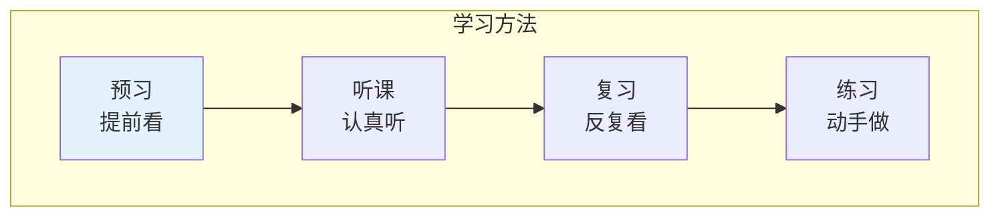

# 学习认知

> **费曼学习法**：学习认知就是研究"怎么学得快、记得牢"的学问！

---

## 🎯 一句话理解学习认知

**学习认知就是研究"怎么学得快、记得牢"的学问！**

---

## 🔗 快速跳转

| 主题 | 主目录位置 | 思维科学视角 |
|------|------------|--------------|
| 心理学基础 | [社会科学/心理学](/social-sciences/psychology/index.md) | 基础理论 |
| 认知心理 | [思维科学/认知心理](/thinking/cognitive-psychology/index.md) | 思维过程 |
| 教育方法 | [社会科学/教育学](/social-sciences/education/index.md) | 教学理论 |

---

## 📚 学习认知的核心内容

### 📚 学习方法

### 🎯 学习认知关注的问题

| 问题 | 内容 | 应用 |
|------|------|------|
| 怎么记得牢？ | 记忆技巧、间隔重复 | 背课文 |
| 怎么学得快？ | 学习策略、主动学习 | 做作业 |
| 怎么理解深？ | 深度学习、联系实际 | 学数学 |
| 怎么保持动力？ | 兴趣培养、目标设定 | 坚持学习 |

---

## 🎮 学习闯关游戏

---

## 💡 给小学生的话

> 学习是有方法的！
> 
> 先去 [社会科学/心理学](/social-sciences/psychology/index.md) 了解人怎么学习，再来这里学具体方法！
> 
> 记住：方法对了，学习就快了！

---

**每个学习高手都曾经是初学者！**