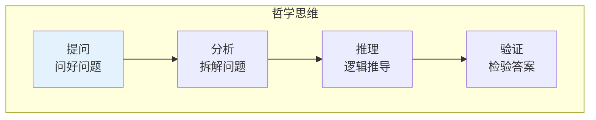

# 哲学思维

> **重要提示**：哲学的主目录在 [人文科学/哲学](/humanities/philosophy/index.md)，这里只介绍思维科学视角的哲学思维。

---

## 🎯 一句话理解思维科学中的哲学

**思维科学中的哲学就是研究"怎么问好问题、怎么深度思考"的学问！**

---

## 🔗 快速跳转

| 主题 | 主目录位置 | 思维科学视角 |
|------|------------|--------------|
| 哲学基础 | [人文科学/哲学](/humanities/philosophy/index.md) | 基础理论 |
| 逻辑思维 | [思维科学/批判思维](/thinking/critical-thinking/index.md) | 推理方法 |
| 批判思维 | [思维科学/学习认知](/thinking/learning-cognition/index.md) | 学习方法 |

---

## 📚 思维科学视角的哲学思维

### 🤔 哲学思维的核心

### 🎯 思维科学关注的哲学问题

| 问题 | 内容 | 应用 |
|------|------|------|
| 怎么问好问题？ | 提问技巧、问题分解 | 学会思考 |
| 怎么判断真假？ | 逻辑推理、证据评估 | 避免被骗 |
| 怎么做决策？ | 价值判断、伦理思考 | 做出正确选择 |
| 怎么深度思考？ | 批判思维、创新思维 | 提高思维质量 |

---

## 🎮 哲学思维闯关游戏

---

## 💡 给小学生的话

> 哲学就是"想"的学问！
> 
> 先去 [人文科学/哲学](/humanities/philosophy/index.md) 学好基础，再来这里学怎么深度思考！
> 
> 记住：会想问题，才能解决问题！

---

**每个哲学家都曾经是初学者！**