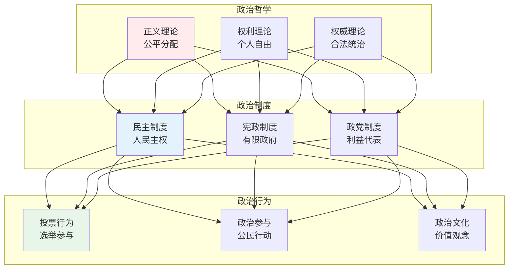
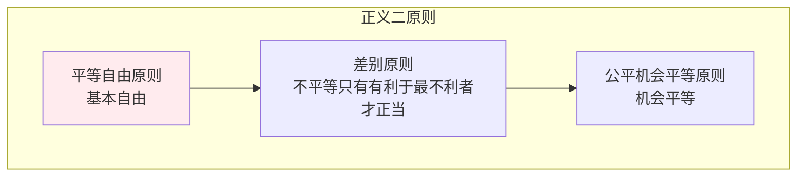
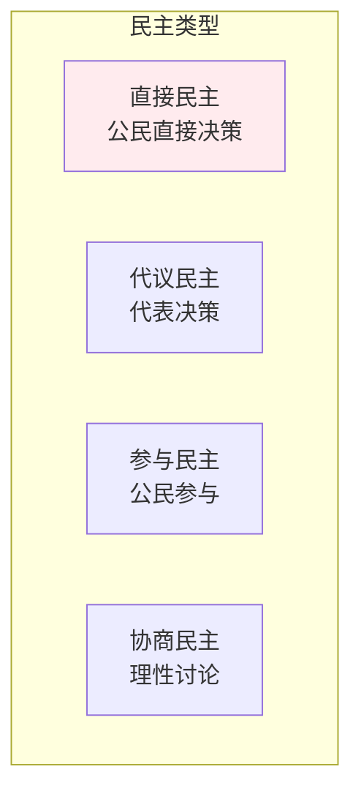
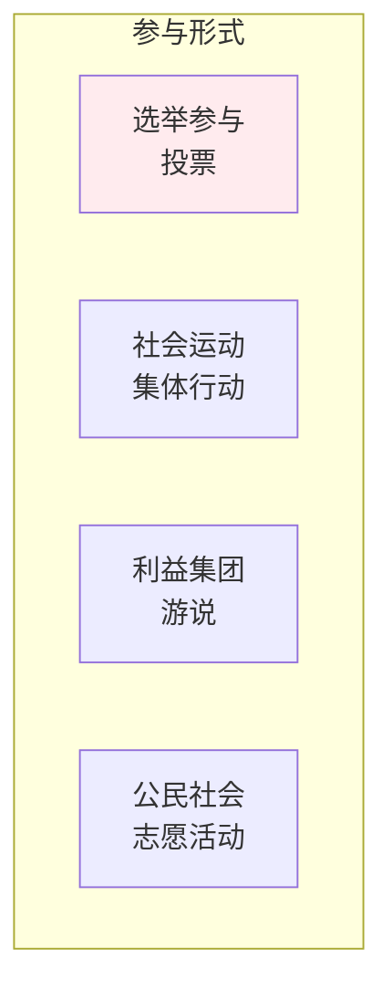

# 政治理论

> **核心观点**：政治理论研究权力、正义、权威等政治概念，是理解政治现象的基础。

---

## 📊 政治理论框架



---

## ⚖️ 政治哲学

### 正义理论

| 理论 | 核心观点 | 代表人物 |
|------|----------|----------|
| 功利主义 | 最大多数人的最大幸福 | 边沁 |
| 自由主义 | 个人权利优先 | 诺齐克 |
| 平等主义 | 平等分配 | 罗尔斯 |
| 社群主义 | 社群价值 | 桑德尔 |

### 罗尔斯正义原则



### 权利理论

| 权利类型 | 内涵 | 例子 |
|----------|------|------|
| 消极权利 | 不受干涉 | 言论自由 |
| 积极权利 | 获得帮助 | 受教育权 |
| 第一代权利 | 公民政治权利 | 选举权 |
| 第二代权利 | 社会经济权利 | 工作权 |

---

## 🏛️ 政治制度

### 民主制度



### 宪政原则

| 原则 | 内涵 | 实现 |
|------|------|------|
| 有限政府 | 政府权力受限 | 宪法约束 |
| 权力分立 | 相互制衡 | 三权分立 |
| 法治 | 法律至上 | 依法治国 |
| 司法独立 | 公正审判 | 法院独立 |

### 政党制度

```
政党制度类型：
1. 两党制：两党轮流执政
2. 多党制：多党竞争
3. 一党制：一党执政
4. 一党优势制：一党主导
```

---

## 🗳️ 政治行为

### 投票行为

| 因素 | 影响 | 例子 |
|------|------|------|
| 政党认同 | 长期倾向 | 党派忠诚 |
| 议题立场 | 政策偏好 | 经济政策 |
| 候选人 | 个人特质 | 领导能力 |
| 社会因素 | 群体影响 | 阶层投票 |

### 政治参与



### 政治文化

| 类型 | 特征 | 公民参与 |
|------|------|----------|
| 臣民文化 | 服从权威 | 被动 |
| 参与文化 | 积极参与 | 主动 |
| 地方文化 | 关注地方 | 有限 |

---

## 🎯 核心结论

### 政治理论发现

1. **权力是核心**：政治是权力游戏
2. **正义是目标**：公平是追求
3. **制度是保障**：规范权力运行
4. **参与是基础**：公民参与重要
5. **文化是土壤**：政治文化影响

### 政治思维价值

```
政治思维价值：
1. 理解权力运作
2. 培养公民意识
3. 提升参与能力
4. 促进社会公正
5. 维护公共利益
```

---

## 📚 参考文献

1. 约翰·罗尔斯《正义论》
2. 罗伯特·诺齐克《无政府、国家与乌托邦》
3. 亚里士多德《政治学》
4. 托马斯·霍布斯《利维坦》
5. 约翰·洛克《政府论》
6. 卢梭《社会契约论》
7. 汉娜·阿伦特《人的境况》
8. 《政治学》- 安德鲁·海伍德