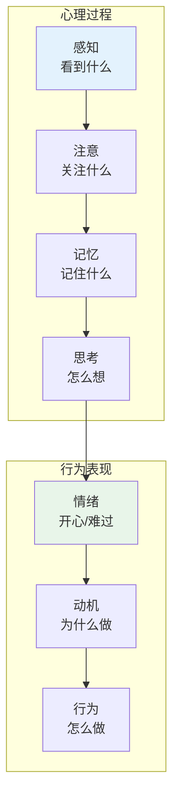
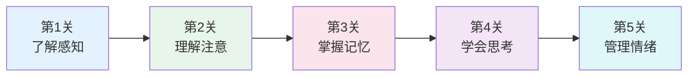

# 心理学

> **重要提示**：心理学的主目录在 [社会科学/心理学](/social-sciences/psychology/index.md)，这里只介绍思维科学视角的心理学。

---

## 🎯 一句话理解思维科学中的心理学

**思维科学中的心理学就是研究"为什么我会这样做"的学问！**

---

## 🔗 快速跳转

| 主题 | 主目录位置 | 思维科学视角 |
|------|------------|--------------|
| 心理学基础 | [社会科学/心理学](/social-sciences/psychology/index.md) | 基础理论 |
| 认知心理 | [思维科学/认知心理](/thinking/cognitive-psychology/index.md) | 思维过程 |
| 学习心理 | [思维科学/学习认知](/thinking/learning-cognition/index.md) | 学习方法 |

---

## 📚 思维科学视角的心理学

### 🧠 思维与心理

### 🎯 思维科学关注的心理问题

| 问题 | 内容 | 应用 |
|------|------|------|
| 怎么学得快？ | 学习方法、记忆技巧 | 提高学习效率 |
| 怎么想得深？ | 思维模式、推理方式 | 提高思维质量 |
| 怎么做决策？ | 选择心理、判断偏差 | 做出更好选择 |
| 怎么管理情绪？ | 情绪调节、压力管理 | 保持心理健康 |

---

## 🎮 思维心理闯关游戏

---

## 💡 给小学生的话

> 心理学就是研究"你"的学问！
> 
> 先去 [社会科学/心理学](/social-sciences/psychology/index.md) 学好基础，再来这里看思维怎么工作！
> 
> 记住：了解自己，才能更好地学习！

---

**每个心理学家都曾经是初学者！**