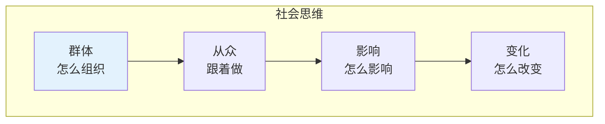

# 社会思维

> **重要提示**：社会学的主目录在 [社会科学/社会学](/social-sciences/sociology/index.md)，这里只介绍思维科学视角的社会思维。

---

## 🎯 一句话理解思维科学中的社会思维

**思维科学中的社会思维就是研究"一群人是怎么想的"的学问！**

---

## 🔗 快速跳转

| 主题 | 主目录位置 | 思维科学视角 |
|------|------------|--------------|
| 社会学基础 | [社会科学/社会学](/social-sciences/sociology/index.md) | 基础理论 |
| 社会心理 | [社会科学/心理学](/social-sciences/psychology/index.md) | 心理机制 |
| 文化研究 | [人文科学/民族学](/humanities/ethnology/index.md) | 文化差异 |

---

## 📚 思维科学视角的社会思维

### 👥 社会思维的核心

### 🎯 思维科学关注的社会问题

| 问题 | 内容 | 应用 |
|------|------|------|
| 群体怎么想？ | 从众心理、群体决策 | 理解社会现象 |
| 怎么影响别人？ | 说服技巧、影响力 | 提高沟通效果 |
| 怎么避免偏见？ | 刻板印象、认知偏差 | 做出客观判断 |
| 怎么协作？ | 团队合作、沟通技巧 | 提高团队效率 |

---

## 🎮 社会思维闯关游戏

---

## 💡 给小学生的话

> 社会思维就是研究"大家"的学问！
> 
> 先去 [社会科学/社会学](/social-sciences/sociology/index.md) 学好基础，再来这里看群体怎么想！
> 
> 记住：理解别人，才能更好地相处！

---

**每个社会学家都曾经是初学者！**