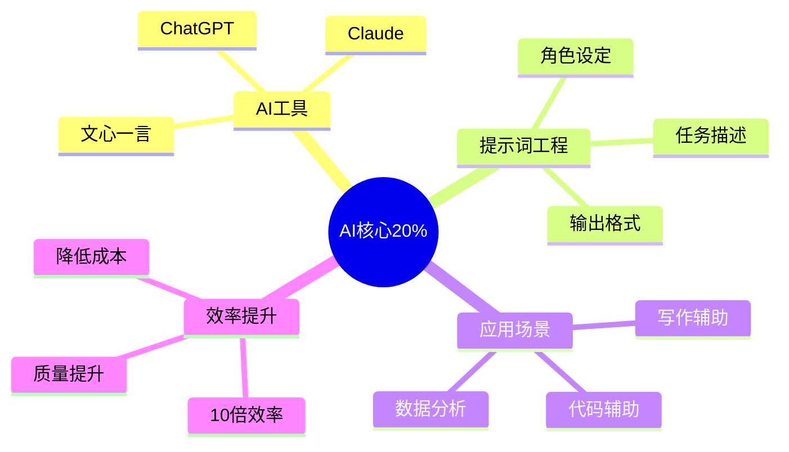

# AI赋能 — 深入实战指南

> 掌握AI核心的20%知识，提升80%的工作效率

---

## 核心知识地图

---

## 子目录导航

| 主题 | 文件 | 核心问题 |
|------|------|----------|
| 提示词工程 | [01-提示词工程实战.md](01-提示词工程实战.md) | 如何用好AI？ |
| AI应用场景 | [02-AI应用场景实战.md](02-AI应用场景实战.md) | AI能做什么？ |

---

## 一句话总结

> **AI是工具，用对了事半功倍，用错了浪费时间。**
