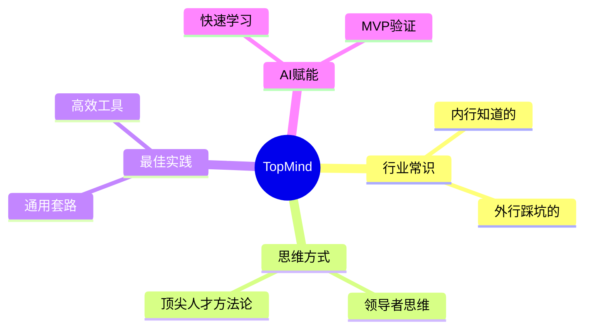

# TopMind — 行业干货与认知升级

> 基于80/20原则，提炼各行各业与日常生活紧密相关的高价值知识点
> 目标：掌握20%的核心知识，解决80%的常见问题

---

## 核心理念

---

## 知识体系导航

| 分类 | 文件 | 适用人群 |
|------|------|----------|
| 商业与创业 | [商业创业](商业创业.md) | 创业者、产品经理、运营 |
| 投资与理财 | [投资理财](投资理财.md) | 所有希望财富增长的人 |
| 职场与管理 | [职场管理](职场管理.md) | 职场人、管理者、HR |
| 健康与医疗 | [健康医疗](健康医疗.md) | 所有人 |
| 法律常识 | [法律常识](法律常识.md) | 所有人 |
| 房产与租赁 | [房产租赁](房产租赁.md) | 租房者、购房者 |
| 人际关系与沟通 | [人际沟通](人际沟通.md) | 所有人 |
| 学习与认知 | [学习认知](学习认知.md) | 所有希望持续成长的人 |
| AI赋能新行业 | [AI赋能](AI赋能.md) | 技术人员、创业者 |

---

## 使用方法

1. **按需学习**：根据当前遇到的问题，选择对应主题
2. **快速检索**：使用页面内搜索功能，找到具体知识点
3. **实践应用**：每个知识点都附带"落地清单"，可直接执行
4. **持续迭代**：定期回顾，更新认知

---

## 贡献指南

欢迎补充各行各业的干货知识，格式要求：
- 使用Mermaid图形化表达核心概念
- 包含"外行踩坑"和"内行做法"对比
- 提供可落地的行动清单
