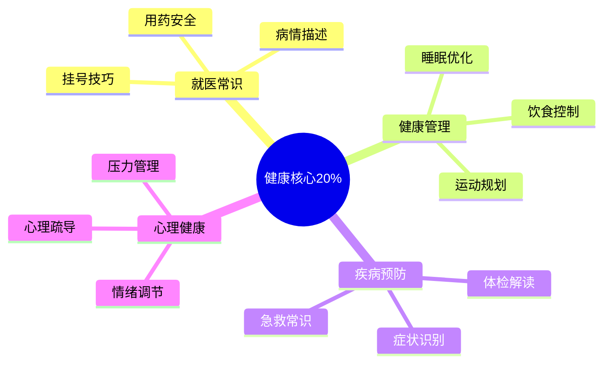

# 健康医疗 — 深入实战指南

> 掌握健康核心的20%知识，预防80%的常见疾病

---

## 核心知识地图

---

## 子目录导航

| 主题 | 文件 | 核心问题 |
|------|------|----------|
| 就医实战 | [01-就医实战指南.md](01-就医实战指南.md) | 如何高效就医？ |
| 健康管理 | [02-健康管理实战.md](02-健康管理实战.md) | 如何保持健康？ |

---

## 一句话总结

> **健康是1，其他是0。没有健康，一切都是空谈。**
