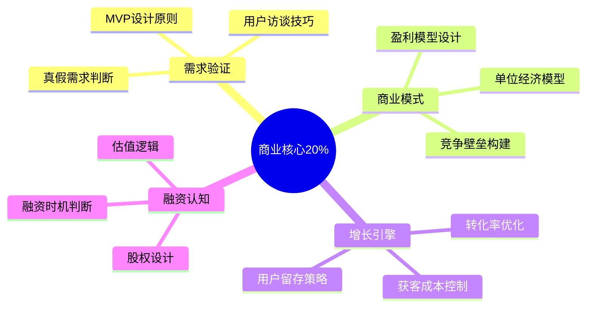

# 商业创业 — 深入实战指南

> 掌握商业本质的20%核心知识，解决80%的创业问题

---

## 核心知识地图

---

## 子目录导航

| 主题 | 文件 | 核心问题 |
|------|------|----------|
| 需求验证 | [01-需求验证实战.md](01-需求验证实战.md) | 如何判断需求真假？ |
| 商业模式 | [02-商业模式设计.md](02-商业模式设计.md) | 如何设计盈利模型？ |
| 增长策略 | [03-增长引擎搭建.md](03-增长引擎搭建.md) | 如何低成本获客？ |
| 案例复盘 | [04-创业案例复盘.md](04-创业案例复盘.md) | 成功失败的规律是什么？ |

---

## 一句话总结

> **创业的本质是：用最小成本验证需求，用最快速度迭代产品，用最低成本获取用户。**
