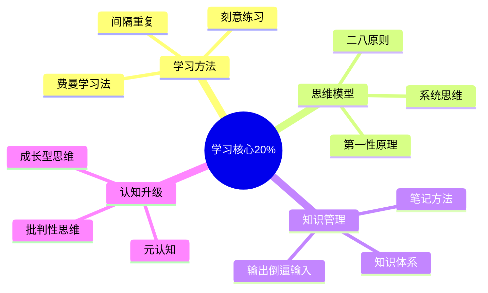

# 学习认知 — 深入实战指南

> 掌握学习核心的20%知识，提升80%的学习效率

---

## 核心知识地图

---

## 子目录导航

| 主题 | 文件 | 核心问题 |
|------|------|----------|
| 高效学习 | [01-高效学习实战.md](01-高效学习实战.md) | 如何高效学习？ |
| 思维模型 | [02-思维模型实战.md](02-思维模型实战.md) | 如何提升思维？ |

---

## 一句话总结

> **学习不是目的，改变才是。学以致用，才是真学习。**
