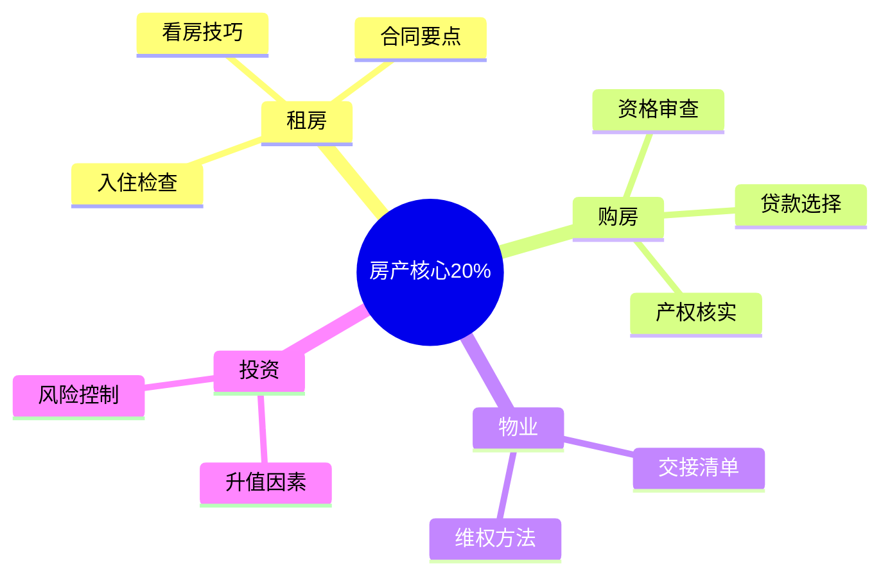

# 房产租赁 — 深入实战指南

> 掌握房产核心的20%知识，避免80%的常见坑

---

## 核心知识地图

---

## 子目录导航

| 主题 | 文件 | 核心问题 |
|------|------|----------|
| 租房实战 | [01-租房实战指南.md](01-租房实战指南.md) | 如何避免租房坑？ |
| 购房实战 | [02-购房实战指南.md](02-购房实战指南.md) | 如何买房不踩坑？ |

---

## 一句话总结

> **房子是大事，多看多比多谨慎，才能不踩坑。**
