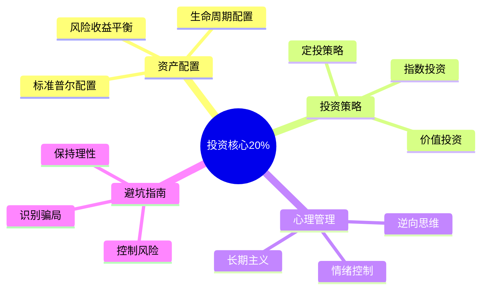

# 投资理财 — 深入实战指南

> 掌握投资核心的20%知识，实现80%的财富增长

---

## 核心知识地图

---

## 子目录导航

| 主题 | 文件 | 核心问题 |
|------|------|----------|
| 资产配置 | [01-资产配置实战.md](01-资产配置实战.md) | 如何分配资金？ |
| 投资策略 | [02-投资策略详解.md](02-投资策略详解.md) | 用什么方法投资？ |
| 案例复盘 | [03-投资案例复盘.md](03-投资案例复盘.md) | 成功失败的规律？ |

---

## 一句话总结

> **投资的本质是：用时间换空间，用纪律换收益，用认知换财富。**
