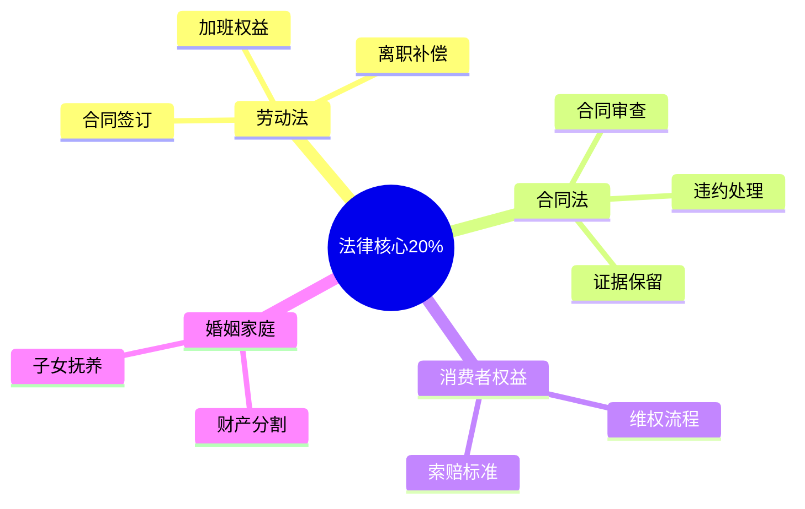

# 法律常识 — 深入实战指南

> 掌握法律核心的20%知识，保护80%的合法权益

---

## 核心知识地图

---

## 子目录导航

| 主题 | 文件 | 核心问题 |
|------|------|----------|
| 劳动维权 | [01-劳动维权实战.md](01-劳动维权实战.md) | 如何保护劳动权益？ |
| 合同审查 | [02-合同审查要点.md](02-合同审查要点.md) | 如何避免合同陷阱？ |

---

## 一句话总结

> **法律是保护自己的武器，不懂法就会吃亏。**
