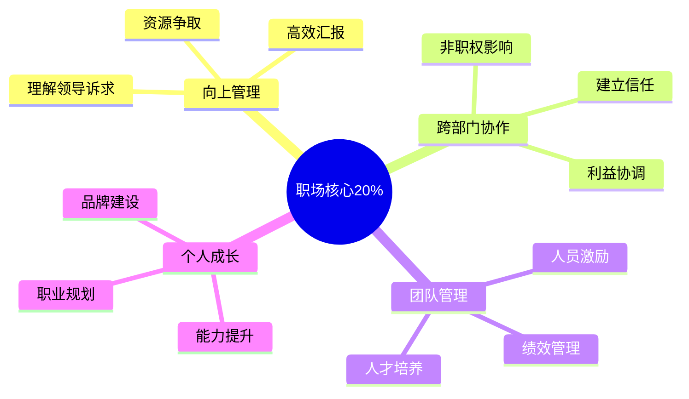

# 职场管理 — 深入实战指南

> 掌握职场核心的20%知识，解决80%的职场问题

---

## 核心知识地图

---

## 子目录导航

| 主题 | 文件 | 核心问题 |
|------|------|----------|
| 向上管理 | [01-向上管理实战.md](01-向上管理实战.md) | 如何管理领导？ |
| 跨部门协作 | [02-跨部门协作.md](02-跨部门协作.md) | 如何影响他人？ |
| 案例复盘 | [03-职场案例复盘.md](03-职场案例复盘.md) | 成功失败的规律？ |

---

## 一句话总结

> **职场的本质是：用结果说话，用关系护航，用能力成长。**
