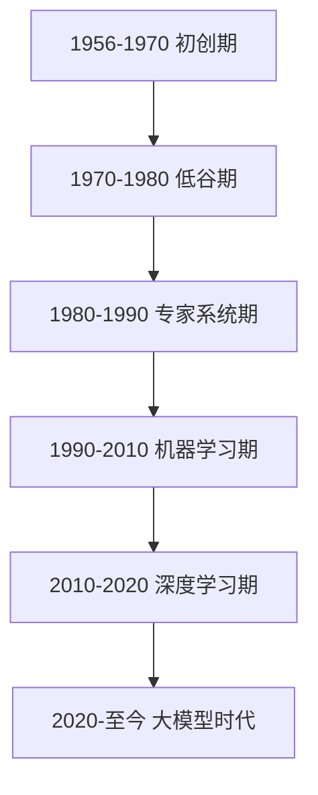
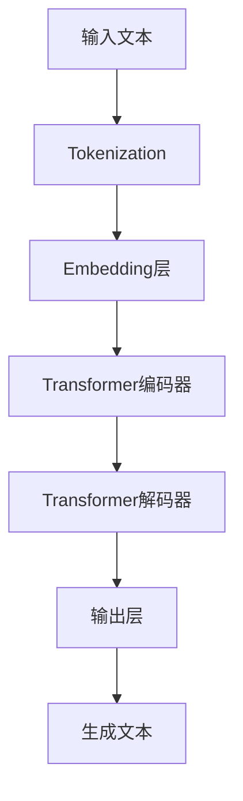
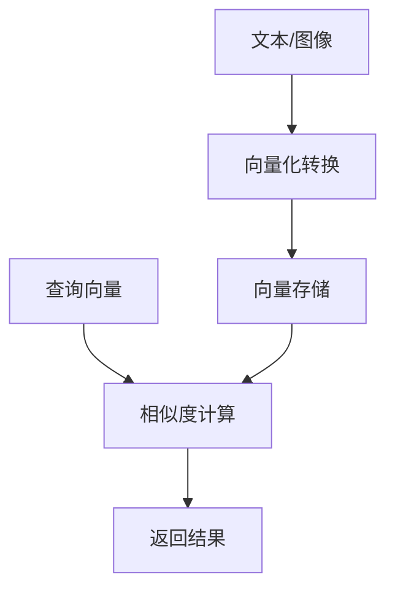
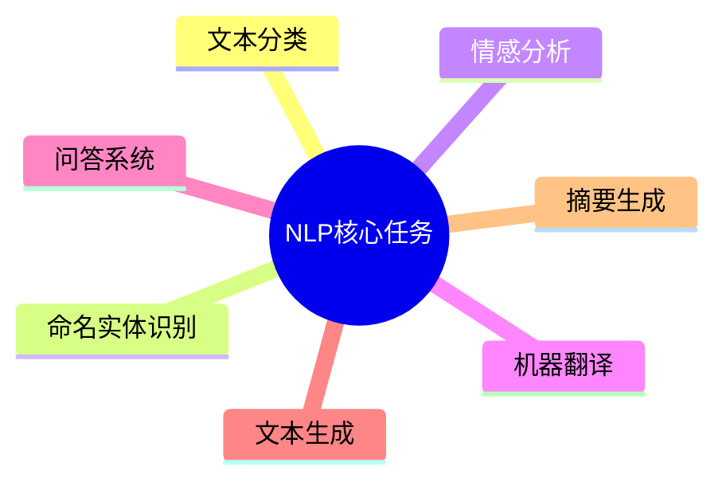

# 第1章：AI基础知识

## 1.1 人工智能发展历程

### 1.1.1 概念解析
人工智能（Artificial Intelligence，简称AI）是指由人制造出来的系统所表现出来的智能。

### 1.1.2 发展阶段



### 1.1.3 关键技术里程碑

| 年份 | 技术突破 | 影响 |
|------|----------|------|
| 1956 | 达特茅斯会议 | 正式提出AI概念 |
| 1997 | 深蓝击败国际象棋冠军 | 证明AI在特定领域超越人类 |
| 2012 | AlexNet | 深度学习爆发 |
| 2017 | Transformer架构 | 奠定大模型基础 |
| 2022 | ChatGPT发布 | 大模型商业化元年 |

## 1.2 大语言模型基础

### 1.2.1 核心概念
大语言模型（Large Language Model，简称LLM）是指参数量巨大、训练数据海量的深度学习模型，能够理解和生成人类语言。

### 1.2.2 模型架构



### 1.2.3 常见大模型

| 模型名称 | 开发机构 | 发布时间 |
|----------|----------|----------|
| GPT-4 | OpenAI | 2023 |
| Claude | Anthropic | 2023 |
| Gemini | Google | 2023 |
| 文心一言 | 百度 | 2023 |
| 通义千问 | 阿里 | 2023 |

## 1.3 向量数据库原理

### 1.3.1 概念解析
向量数据库是一种专门用于存储和检索向量数据的数据库，能够高效处理高维向量的相似度搜索。

### 1.3.2 核心原理



### 1.3.3 常见向量数据库

| 数据库名称 | 类型 | 特点 |
|------------|------|------|
| Pinecone | 云服务 | 易于使用，托管式 |
| Chroma | 开源 | 轻量级，适合开发测试 |
| FAISS | 开源 | 高性能，适合大规模数据 |
| Milvus | 开源 | 分布式，支持多种索引 |

## 1.4 自然语言处理基础

### 1.4.1 核心任务



### 1.4.2 基本流程

1. **数据收集**：获取原始文本数据
2. **数据清洗**：去除噪声和无用信息
3. **文本预处理**：分词、停用词移除等
4. **特征提取**：将文本转换为可计算的特征
5. **模型训练**：使用机器学习/深度学习模型训练
6. **模型评估**：评估模型性能
7. **部署应用**：将模型部署到生产环境

### 1.4.3 常见NLP库

| 库名称 | 语言 | 特点 |
|--------|------|------|
| NLTK | Python | 经典NLP库，适合学习 |
| spaCy | Python | 高性能，适合生产环境 |
| Hugging Face Transformers | Python | 大模型生态，支持多种模型 |
| Stanford CoreNLP | Java | 学术研究常用 |

## 1.5 常见问题解决方案

### 1.5.1 如何选择合适的大模型？
- 考虑任务类型：生成任务选择生成式模型，分类任务选择判别式模型
- 考虑部署环境：云服务还是本地部署
- 考虑成本：API调用费用 vs 本地部署成本
- 考虑数据隐私：敏感数据适合本地部署

### 1.5.2 向量数据库选择依据？
- 数据规模：小数据量选择轻量级数据库，大数据量选择分布式数据库
- 性能要求：高并发场景选择高性能数据库
- 预算：云服务需要考虑长期成本
- 技术栈：选择与现有技术栈兼容的数据库

### 1.5.3 如何开始NLP学习？
- 学习Python基础
- 掌握NLP基本概念
- 使用NLTK或spaCy进行实践
- 学习Transformer架构
- 尝试微调预训练模型

## 1.6 实践案例

### 1.6.1 使用Hugging Face Transformers加载预训练模型

```python
from transformers import pipeline

# 加载情感分析模型
classifier = pipeline("sentiment-analysis")

# 测试模型
result = classifier("I love AI technology!")
print(result)
# 输出: [{'label': 'POSITIVE', 'score': 0.9998709559440613}]
```

### 1.6.2 简单向量相似度计算

```python
import numpy as np
from sklearn.metrics.pairwise import cosine_similarity

# 定义向量
vector1 = np.array([1, 2, 3])
vector2 = np.array([4, 5, 6])
vector3 = np.array([7, 8, 9])

# 计算相似度
similarity12 = cosine_similarity([vector1], [vector2])
similarity13 = cosine_similarity([vector1], [vector3])

print(f"向量1和向量2的相似度: {similarity12[0][0]:.2f}")
print(f"向量1和向量3的相似度: {similarity13[0][0]:.2f}")
```
