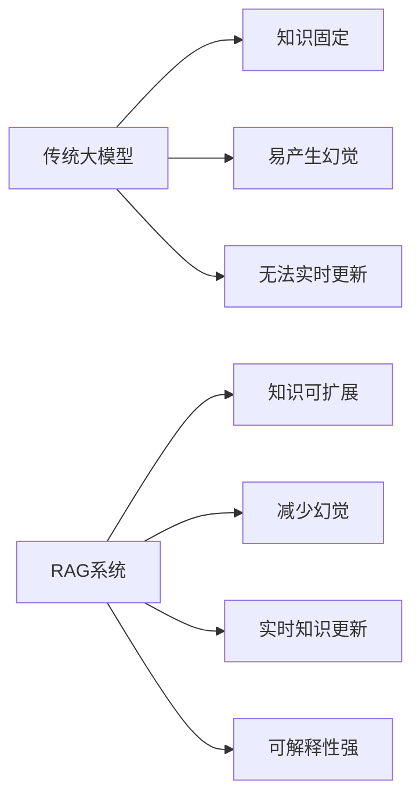
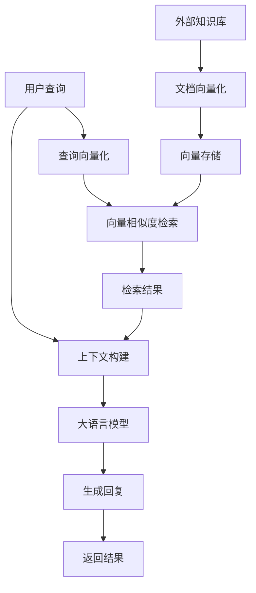
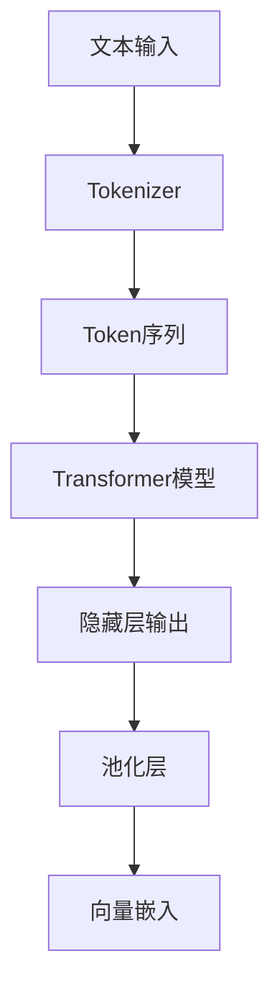
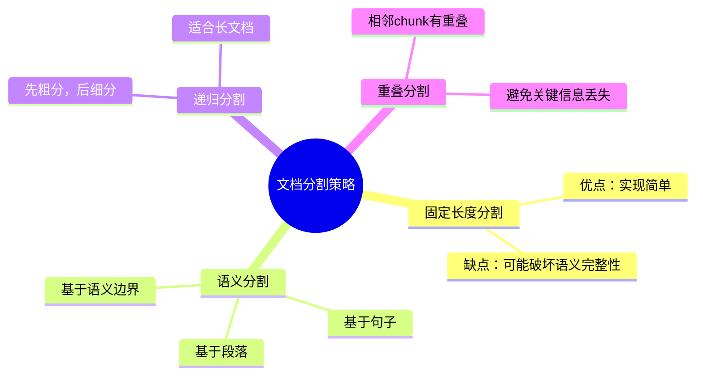

# 第2章：RAG技术原理

## 2.1 RAG核心概念

### 2.1.1 什么是RAG？
检索增强生成（Retrieval-Augmented Generation，简称RAG）是一种结合了检索和生成的AI技术，通过从外部知识库检索相关信息，增强大语言模型的生成能力。

### 2.1.2 RAG的优势



### 2.1.3 RAG的应用场景
- 企业知识库问答
- 学术文献检索与总结
- 实时新闻分析
- 专业领域问答（医疗、法律等）
- 个性化推荐系统

## 2.2 检索增强生成机制

### 2.2.1 RAG系统架构



### 2.2.2 核心流程详解

1. **文档处理阶段**
   - 文档收集：从各种来源获取文档
   - 文档分割：将长文档分割成合适大小的chunk
   - 文档向量化：使用嵌入模型将文本转换为向量
   - 向量存储：将向量存储到向量数据库

2. **查询处理阶段**
   - 查询接收：接收用户的自然语言查询
   - 查询向量化：将查询转换为向量
   - 相似度检索：在向量数据库中检索最相关的文档chunk

3. **生成阶段**
   - 上下文构建：将检索到的文档chunk与原始查询组合
   - 模型调用：将构建好的上下文传递给大语言模型
   - 结果生成：大语言模型生成基于检索内容的回复

### 2.2.3 RAG与Fine-tuning对比

| 特性 | RAG | Fine-tuning |
|------|-----|-------------|
| 知识更新 | 实时更新，只需添加新文档 | 需要重新训练模型 |
| 计算成本 | 低，主要是向量存储和检索 | 高，需要大量计算资源 |
| 幻觉风险 | 低，基于检索内容生成 | 高，依赖模型记忆 |
| 专业领域适配 | 容易，只需添加专业文档 | 困难，需要高质量训练数据 |
| 可解释性 | 强，可追溯引用来源 | 弱，黑盒生成 |

## 2.3 向量嵌入技术

### 2.3.1 嵌入模型原理



### 2.3.2 常见嵌入模型

| 模型名称 | 维度 | 特点 |
|----------|------|------|
| text-embedding-ada-002 | 1536 | OpenAI的嵌入模型，通用性强 |
| all-MiniLM-L6-v2 | 384 | 轻量级，适合本地部署 |
| BGE-large-en-v1.5 | 1024 | 中文表现优秀，开源 |
| E5 | 768 | 专为检索任务优化 |

### 2.3.3 嵌入模型选择原则

1. **任务类型**：检索任务选择检索优化的模型
2. **文本语言**：多语言或特定语言模型
3. **嵌入维度**：高维度通常效果更好，但存储成本更高
4. **部署环境**：云服务或本地部署
5. **预算**：API调用费用 vs 本地部署成本

## 2.4 检索策略优化

### 2.4.1 文档分割策略



### 2.4.2 相似度计算方法

| 方法 | 计算公式 | 特点 |
|------|----------|------|
| 余弦相似度 | cos(θ) = (A·B) / (|A||B|) | 最常用，适合高维向量 |
| 欧氏距离 | √Σ(Ai-Bi)² | 计算简单，适合低维向量 |
| 点积 | A·B | 计算效率高 |
| 曼哈顿距离 | Σ|Ai-Bi| | 对异常值不敏感 |

### 2.4.3 检索优化技术

1. **多向量检索**：为每个文档生成多个向量，从不同角度描述文档
2. **混合检索**：结合关键词检索和向量检索
3. **重排序**：使用重排序模型对初始检索结果重新排序
4. **上下文扩展**：根据用户历史对话扩展查询
5. **动态检索**：根据生成结果动态调整检索策略

## 2.5 RAG系统评估

### 2.5.1 评估指标

| 指标类型 | 具体指标 | 用途 |
|----------|----------|------|
| 检索质量 | 准确率、召回率、F1值 | 评估检索结果的相关性 |
| 生成质量 | BLEU、ROUGE、METEOR | 评估生成文本的质量 |
| 用户体验 | 回答准确率、响应时间、满意度 | 评估系统整体表现 |
| 幻觉检测 | 事实一致性评分 | 评估生成内容的准确性 |

### 2.5.2 评估方法

1. **人工评估**：由领域专家评估系统输出
2. **自动评估**：使用预训练模型进行自动评估
3. **A/B测试**：对比不同版本系统的表现
4. **离线评估**：使用标注数据集进行评估

## 2.6 实践案例

### 2.6.1 构建简单的RAG系统

```python
from langchain.document_loaders import TextLoader
from langchain.text_splitter import CharacterTextSplitter
from langchain.embeddings import OpenAIEmbeddings
from langchain.vectorstores import Chroma
from langchain.llms import OpenAI
from langchain.chains import RetrievalQA

# 1. 加载文档
document = TextLoader("data/document.txt").load()

# 2. 文档分割
text_splitter = CharacterTextSplitter(chunk_size=1000, chunk_overlap=200)
documents = text_splitter.split_documents(document)

# 3. 嵌入模型
embeddings = OpenAIEmbeddings()

# 4. 创建向量存储
vector_store = Chroma.from_documents(documents, embeddings)

# 5. 创建检索器
retriever = vector_store.as_retriever()

# 6. 创建RAG链
qa_chain = RetrievalQA.from_chain_type(
    llm=OpenAI(),
    chain_type="stuff",
    retriever=retriever
)

# 7. 测试查询
result = qa_chain.run("什么是RAG技术？")
print(result)
```

### 2.6.2 优化检索策略

```python
from langchain.retrievers import MultiQueryRetriever
from langchain.prompts import PromptTemplate

# 创建多查询检索器
template = """
您是一个专业的查询改写专家。请将以下查询改写为3个不同的版本，以提高检索效果：

原始查询：{question}

改写结果：
1. 
2. 
3. 
"""
prompt = PromptTemplate.from_template(template)

multi_query_retriever = MultiQueryRetriever.from_llm(
    retriever=retriever,
    llm=OpenAI(),
    prompt=prompt
)

# 使用多查询检索器创建RAG链
optimized_qa_chain = RetrievalQA.from_chain_type(
    llm=OpenAI(),
    chain_type="stuff",
    retriever=multi_query_retriever
)

# 测试优化后的查询
result = optimized_qa_chain.run("什么是RAG技术？")
print(result)
```

## 2.7 常见问题解决方案

### 2.7.1 检索结果不相关怎么办？
- 优化文档分割策略：调整chunk大小和重叠比例
- 更换嵌入模型：选择更适合任务的嵌入模型
- 调整相似度阈值：提高或降低检索的相似度阈值
- 使用多向量检索：从不同角度描述文档
- 优化查询表达式：改进用户查询的表达方式

### 2.7.2 如何处理长文档？
- 使用递归分割策略：先粗分，后细分
- 实现层次化检索：先检索章节，再检索具体内容
- 使用滑动窗口技术：处理超长文档
- 提取文档摘要：先生成摘要，再基于摘要检索

### 2.7.3 如何降低幻觉？
- 增加检索文档数量：提供更多相关信息
- 优化提示词：明确要求模型基于检索内容生成
- 使用链式思考：让模型逐步推理
- 增加事实核查步骤：对生成结果进行事实检查
- 使用特定领域模型：选择专业领域的预训练模型

### 2.7.4 如何提高RAG系统的响应速度？
- 优化向量数据库：使用更高效的索引算法
- 减少检索文档数量：只返回最相关的文档
- 使用轻量级嵌入模型：减少向量化时间
- 实现缓存机制：缓存常见查询的结果
- 并行处理：同时处理多个检索请求
