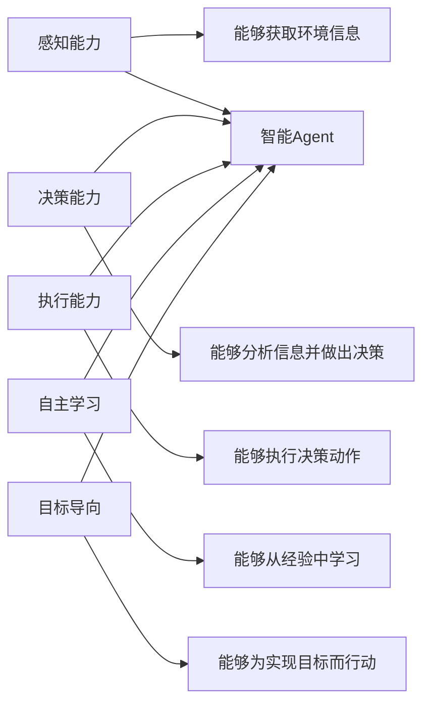
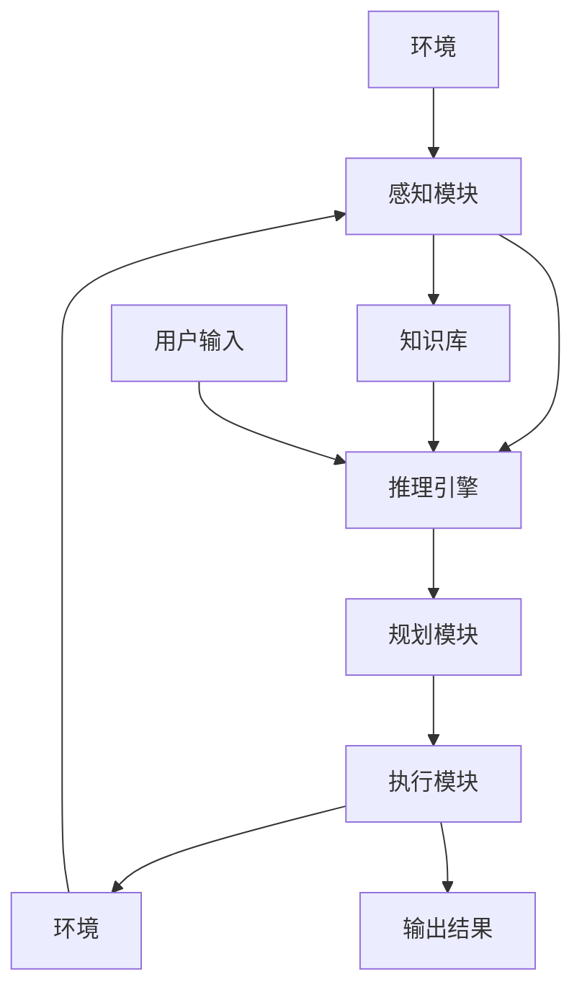
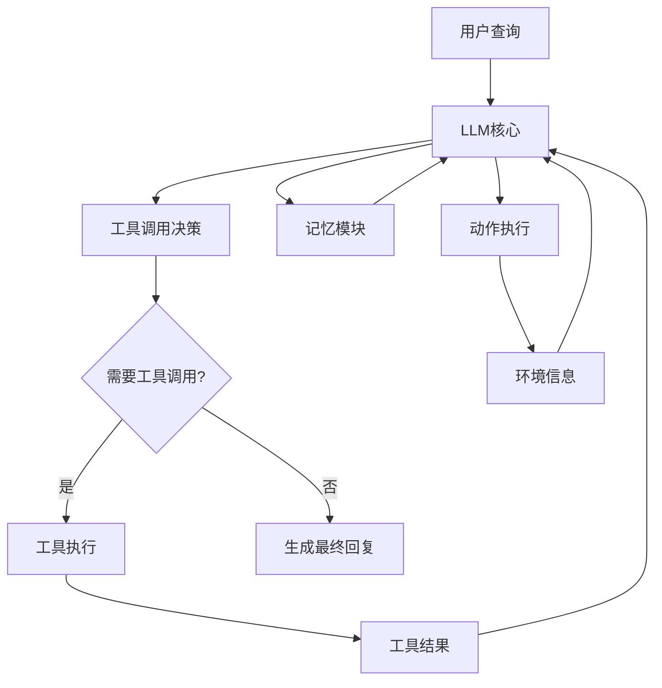
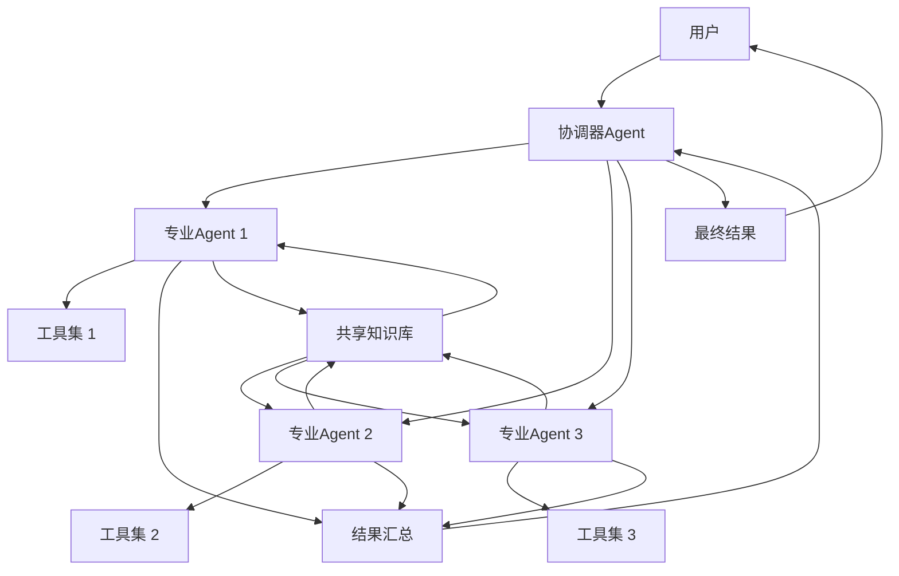
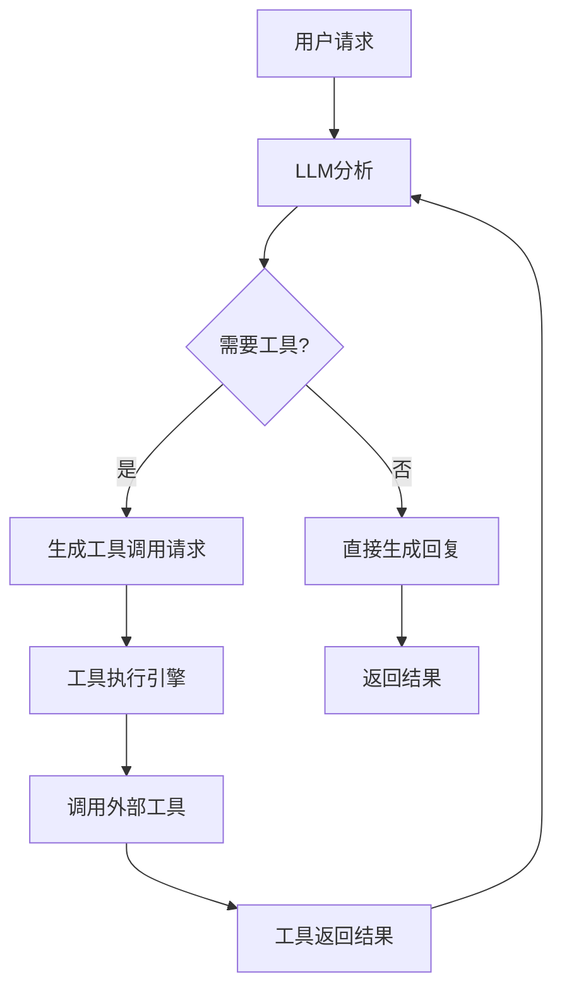
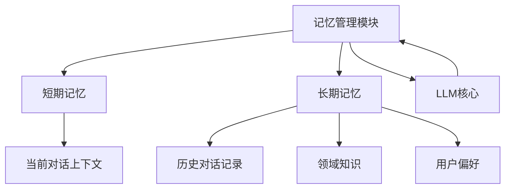

# 第3章：Agent架构设计

## 3.1 Agent核心定义

### 3.1.1 什么是Agent？
智能代理（Agent）是指能够自主感知环境、做出决策并执行动作以实现特定目标的系统。在AI领域，Agent通常指具有自主决策能力的AI系统。

### 3.1.2 Agent的核心特征



### 3.1.3 Agent的分类

| 分类维度 | 具体类型 | 特点 |
|----------|----------|------|
| 功能类型 | 工具型Agent | 专注于特定任务执行 |
|          | 对话型Agent | 专注于自然语言交互 |
|          | 协作型Agent | 能够与其他Agent协作 |
| 智能程度 | 反应型Agent | 基于简单规则反应 |
|          | 认知型Agent | 具有推理和规划能力 |
|          | 学习型Agent | 能够自主学习和进化 |
| 应用领域 | 通用型Agent | 适用于多种任务 |
|          | 专业型Agent | 专注于特定领域 |

## 3.2 智能代理架构

### 3.2.1 经典Agent架构



### 3.2.2 现代Agent架构（LLM驱动）



### 3.2.3 Agent核心组件详解

1. **LLM核心**：Agent的大脑，负责理解用户意图、生成决策和回复
2. **记忆模块**：存储Agent的历史对话和经验
3. **工具模块**：提供Agent可以调用的外部工具
4. **规划模块**：负责复杂任务的分解和规划
5. **执行模块**：执行规划的动作序列
6. **反馈模块**：获取环境反馈并调整策略

## 3.3 多Agent协作

### 3.3.1 多Agent系统架构



### 3.3.2 多Agent协作模式

1. **层级式协作**：上级Agent协调下级Agent，下级Agent执行具体任务
2. **平等式协作**：多个Agent地位平等，通过协商完成任务
3. **混合式协作**：结合层级式和平等式的协作模式
4. **市场机制**：Agent通过竞争和交易完成任务

### 3.3.3 多Agent通信机制

| 通信方式 | 特点 | 适用场景 |
|----------|------|----------|
| 消息传递 | 简单直接，异步通信 | 分布式系统 |
| 共享内存 | 实时共享，同步通信 | 集中式系统 |
| API调用 | 标准化接口，跨系统通信 | 异构系统集成 |
| 事件驱动 | 基于事件触发，松耦合 | 复杂系统协作 |

## 3.4 工具调用机制

### 3.4.1 工具调用原理



### 3.4.2 工具定义与注册

```python
from langchain.tools import BaseTool, StructuredTool
from typing import Optional, Type
from pydantic import BaseModel, Field

# 工具输入参数定义
class CalculatorInput(BaseModel):
    expression: str = Field(description="需要计算的数学表达式")

# 计算器工具实现
class CalculatorTool(BaseTool):
    name = "calculator"
    description = "用于计算数学表达式的结果"
    args_schema: Type[BaseModel] = CalculatorInput
    
    def _run(self, expression: str) -> str:
        try:
            result = eval(expression)
            return f"计算结果: {result}"
        except Exception as e:
            return f"计算错误: {str(e)}"
    
    async def _arun(self, expression: str) -> str:
        # 异步实现（可选）
        return self._run(expression)

# 注册工具
calculator_tool = CalculatorTool()
```

### 3.4.3 工具调用流程

1. **工具发现**：Agent知道可用的工具列表和功能
2. **工具选择**：根据当前任务选择合适的工具
3. **参数生成**：生成工具调用所需的参数
4. **工具执行**：调用工具并获取结果
5. **结果处理**：将工具结果整合到回复中

## 3.5 Agent记忆系统

### 3.5.1 记忆系统架构



### 3.5.2 记忆类型

| 记忆类型 | 存储内容 | 访问频率 | 存储时长 |
|----------|----------|----------|----------|
| 短期记忆 | 当前对话上下文 | 高 | 会话期间 |
| 中期记忆 | 近期对话记录 | 中 | 数小时至数天 |
| 长期记忆 | 长期对话历史、用户偏好、领域知识 | 低 | 长期存储 |

### 3.5.3 记忆管理策略

1. **记忆压缩**：对长期记忆进行压缩和摘要
2. **记忆检索**：根据当前上下文检索相关记忆
3. **记忆更新**：定期更新和清理记忆
4. **记忆优先级**：根据重要性设置记忆优先级

## 3.6 实践案例：构建简单Agent

### 3.6.1 基于LangChain构建工具型Agent

```python
from langchain.agents import initialize_agent, AgentType
from langchain.llms import OpenAI
from langchain.tools import CalculatorTool, SerpAPIWrapper

# 初始化LLM
llm = OpenAI(temperature=0)

# 初始化工具
search = SerpAPIWrapper()
calculator = CalculatorTool()
tools = [search, calculator]

# 初始化Agent
agent = initialize_agent(
    tools,
    llm,
    agent=AgentType.ZERO_SHOT_REACT_DESCRIPTION,
    verbose=True
)

# 测试Agent
result = agent.run("今天北京的天气怎么样？如果温度高于20度，计算100+200的结果")
print(result)
```

### 3.6.2 构建多Agent协作系统

```python
from langchain.agents import AgentExecutor, create_react_agent
from langchain import hub
from langchain.tools import BaseTool
from typing import List

# 定义专业Agent
class WeatherAgent:
    def __init__(self, llm, tools):
        self.llm = llm
        self.tools = tools
        self.prompt = hub.pull("react-agent-template")
        self.agent = create_react_agent(llm, tools, self.prompt)
        self.executor = AgentExecutor(agent=self.agent, tools=tools, verbose=True)
    
    def run(self, query):
        return self.executor.invoke({"input": query})

class MathAgent:
    def __init__(self, llm, tools):
        self.llm = llm
        self.tools = tools
        self.prompt = hub.pull("react-agent-template")
        self.agent = create_react_agent(llm, tools, self.prompt)
        self.executor = AgentExecutor(agent=self.agent, tools=tools, verbose=True)
    
    def run(self, query):
        return self.executor.invoke({"input": query})

# 定义协调器Agent
class CoordinatorAgent:
    def __init__(self, llm, weather_agent, math_agent):
        self.llm = llm
        self.weather_agent = weather_agent
        self.math_agent = math_agent
    
    def run(self, query):
        # 分析查询类型
        if "天气" in query or "温度" in query:
            return self.weather_agent.run(query)
        elif any(op in query for op in ["+", "-", "*", "/", "计算"]):
            return self.math_agent.run(query)
        else:
            # 处理复杂查询
            # 这里可以扩展为更复杂的协调逻辑
            return self.llm.invoke(query)

# 初始化各Agent并测试
llm = OpenAI(temperature=0)
weather_agent = WeatherAgent(llm, [search_tool])
math_agent = MathAgent(llm, [calculator_tool])
coordinator = CoordinatorAgent(llm, weather_agent, math_agent)

result = coordinator.run("北京今天的温度是多少？如果超过25度，计算300*500的结果")
print(result)
```

## 3.7 常见问题解决方案

### 3.7.1 Agent做出错误决策怎么办？
- 优化Agent的提示词：明确Agent的角色和职责
- 增加工具调用的验证机制：对工具调用进行检查
- 实现人类干预机制：允许人类在关键节点干预
- 增加反馈循环：让Agent从错误中学习

### 3.7.2 如何提高Agent的执行效率？
- 优化工具调用次数：减少不必要的工具调用
- 实现并行执行：同时执行多个子任务
- 优化记忆检索：提高记忆检索的效率
- 使用更高效的LLM：选择响应速度更快的模型

### 3.7.3 多Agent协作冲突如何解决？
- 设计明确的通信协议：规范Agent之间的通信
- 实现冲突检测和解决机制：及时发现和解决冲突
- 设计合理的协作模式：根据任务特点选择合适的协作模式
- 引入协调机制：通过协调器Agent管理协作

### 3.7.4 如何确保Agent的安全性？
- 实现工具调用权限控制：限制Agent可以调用的工具
- 增加输入验证：验证用户输入的安全性
- 实现输出审核：对Agent的输出进行审核
- 设计安全的提示词：避免Agent被诱导做出危险行为
- 实现 sandbox 环境：在隔离环境中执行Agent动作

### 3.7.5 如何评估Agent的性能？
- 任务完成率：Agent完成任务的比例
- 执行效率：完成任务所需的时间
- 决策质量：决策的正确性和合理性
- 用户满意度：用户对Agent表现的评价
- 资源消耗：Agent运行所需的资源

## 3.8 未来发展趋势

1. **更强大的自主决策能力**：Agent能够在复杂环境中做出更智能的决策
2. **更好的多模态理解**：Agent能够理解和处理文本、图像、音频等多种模态
3. **更高效的多Agent协作**：Agent之间能够更高效地协作完成复杂任务
4. **更强的学习和进化能力**：Agent能够自主学习和进化
5. **更广泛的应用场景**：Agent将应用于更多领域，如医疗、教育、金融等
6. **更好的安全性和可靠性**：Agent将更加安全可靠，适合在关键领域使用

通过本章的学习，读者应该能够理解Agent的核心概念、架构设计和实现方法，掌握构建简单Agent和多Agent协作系统的技能，并了解Agent技术的未来发展趋势。
