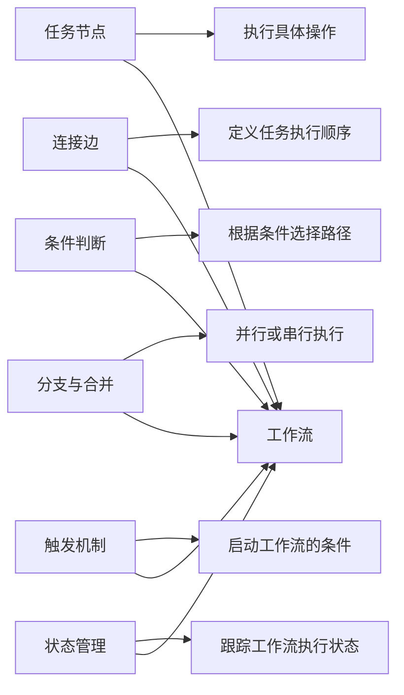
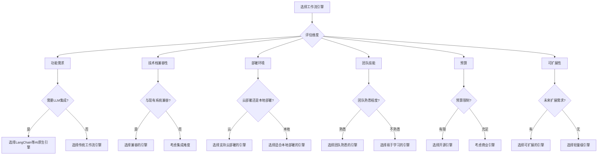
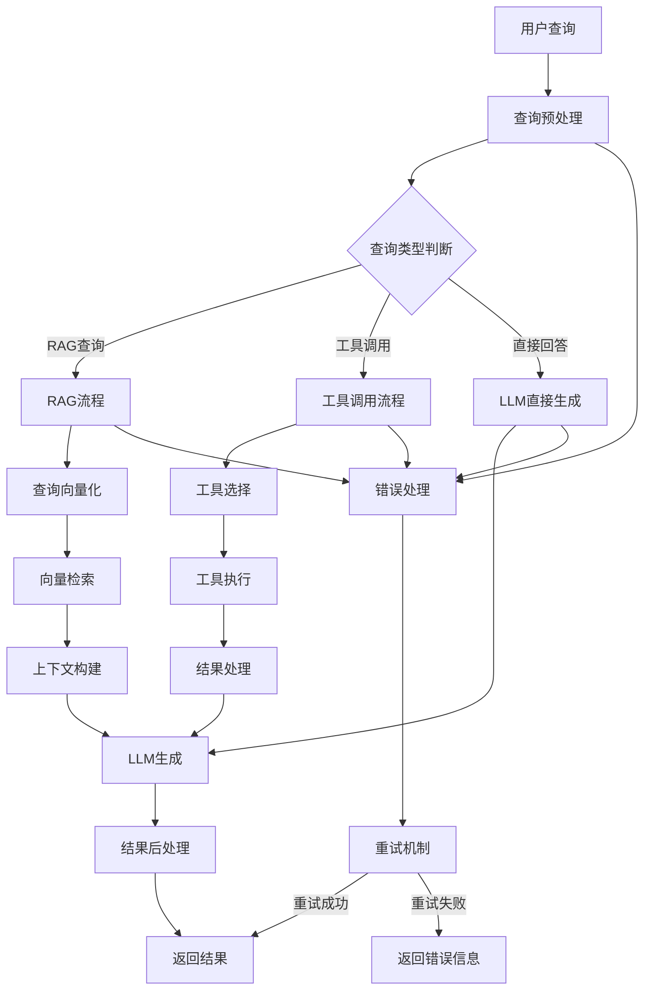
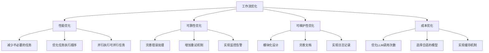

# 第4章：工作流搭建

## 4.1 工作流基础概念

### 4.1.1 什么是工作流？
工作流（Workflow）是指将一系列任务按照预定义的规则和顺序组织起来，实现自动化执行的过程。在AI系统中，工作流用于协调不同组件之间的交互，实现复杂任务的自动化处理。

### 4.1.2 工作流的核心要素



### 4.1.3 工作流的优势

| 优势 | 描述 |
|------|------|
| 自动化执行 | 减少人工干预，提高效率 |
| 可视化设计 | 便于理解和维护 |
| 灵活配置 | 可根据需求调整流程 |
| 可监控性 | 实时跟踪执行状态 |
| 可扩展性 | 便于添加新的任务和节点 |
| 一致性 | 确保流程执行的一致性 |

### 4.1.4 AI工作流的典型应用场景

- 数据处理流水线
- 模型训练与部署流程
- RAG系统的文档处理流程
- 多Agent协作流程
- 客户服务自动化流程
- 内容生成与审核流程

## 4.2 工作流引擎选择

### 4.2.1 常见工作流引擎比较

| 引擎名称 | 类型 | 特点 | 适用场景 |
|----------|------|------|----------|
| LangChain | LLM原生 | 专为AI应用设计，支持LLM集成 | AI应用、Agent系统 |
| Apache Airflow | 开源 | 强大的调度和监控能力 | 数据流水线、ETL |
| Prefect | 开源 | 现代化设计，易于使用 | 数据科学工作流 |
| Zapier | 商业 | 可视化设计，无需编码 | 简单自动化流程 |
| n8n | 开源 | 可视化设计，支持多种集成 | 自动化办公、Web应用 |
| Camunda | 开源 | 企业级工作流，支持BPMN | 复杂业务流程 |

### 4.2.2 工作流引擎选择依据



### 4.2.3 不同场景的引擎推荐

1. **AI应用开发**：LangChain
2. **数据处理流水线**：Apache Airflow、Prefect
3. **企业级业务流程**：Camunda
4. **简单自动化流程**：Zapier、n8n
5. **多Agent协作**：LangChain、自定义工作流

## 4.3 可视化工作流设计

### 4.3.1 工作流设计原则

1. **模块化设计**：将复杂流程拆分为独立的模块
2. **清晰的执行顺序**：明确任务的执行顺序和依赖关系
3. **适当的抽象层次**：根据需求选择合适的抽象层次
4. **错误处理机制**：设计完善的错误处理和重试机制
5. **可监控性**：确保流程执行状态可监控
6. **可测试性**：便于测试和调试

### 4.3.2 可视化工作流设计工具

| 工具名称 | 特点 | 适用场景 |
|----------|------|----------|
| LangChain Expression Language | 代码优先，支持链式调用 | 开发者，AI应用 |
| Apache Airflow UI | Web界面，支持DAG可视化 | 数据工程师，ETL流程 |
| Prefect UI | 现代化Web界面，实时监控 | 数据科学家，机器学习流程 |
| n8n Editor | 拖拽式设计，无需编码 | 业务用户，简单自动化 |
| Camunda Modeler | 支持BPMN规范，专业设计 | 业务分析师，企业流程 |

### 4.3.3 工作流设计示例



## 4.4 工作流编排实践

### 4.4.1 基于LangChain的工作流编排

```python
from langchain.prompts import PromptTemplate
from langchain.llms import OpenAI
from langchain.chains import LLMChain, SequentialChain
from langchain.embeddings import OpenAIEmbeddings
from langchain.vectorstores import Chroma
from langchain.chains import RetrievalQA

# 初始化LLM和Embeddings
llm = OpenAI(temperature=0)
embeddings = OpenAIEmbeddings()

# 1. 文档处理工作流
vector_store = Chroma.from_documents(
    documents=documents,
    embedding=embeddings
)
retriever = vector_store.as_retriever()

# 2. 检索链
retrieval_chain = RetrievalQA.from_chain_type(
    llm=llm,
    chain_type="stuff",
    retriever=retriever
)

# 3. 摘要生成链
summary_template = """
请将以下内容总结为简洁的要点：

{content}

总结：
"""
summary_prompt = PromptTemplate(
    input_variables=["content"],
    template=summary_template
)
summary_chain = LLMChain(
    llm=llm,
    prompt=summary_prompt,
    output_key="summary"
)

# 4. 最终回复链
final_template = """
根据以下检索结果和摘要，回答用户的问题：

用户问题：{question}

检索结果：{retrieval_result}

摘要：{summary}

回答：
"""
final_prompt = PromptTemplate(
    input_variables=["question", "retrieval_result", "summary"],
    template=final_template
)
final_chain = LLMChain(
    llm=llm,
    prompt=final_prompt,
    output_key="final_answer"
)

# 5. 顺序工作流
sequential_chain = SequentialChain(
    chains=[retrieval_chain, summary_chain, final_chain],
    input_variables=["question"],
    output_variables=["retrieval_result", "summary", "final_answer"],
    verbose=True
)

# 测试工作流
result = sequential_chain({
    "question": "什么是RAG技术？"
})
print(result["final_answer"])
```

### 4.4.2 基于Airflow的RAG文档处理工作流

```python
from airflow import DAG
from airflow.operators.python_operator import PythonOperator
from datetime import datetime, timedelta
import os
from langchain.document_loaders import TextLoader
from langchain.text_splitter import CharacterTextSplitter
from langchain.embeddings import OpenAIEmbeddings
from langchain.vectorstores import Chroma

# 默认参数
default_args = {
    'owner': 'airflow',
    'depends_on_past': False,
    'start_date': datetime(2024, 1, 1),
    'email_on_failure': False,
    'email_on_retry': False,
    'retries': 1,
    'retry_delay': timedelta(minutes=5),
}

# 创建DAG
dag = DAG(
    'rag_document_processing',
    default_args=default_args,
    description='RAG文档处理工作流',
    schedule_interval=timedelta(days=1),
)

# 1. 文档收集任务
def collect_documents(**kwargs):
    # 从指定目录收集文档
    documents_dir = "/path/to/documents"
    documents = []
    for filename in os.listdir(documents_dir):
        if filename.endswith(".txt"):
            loader = TextLoader(os.path.join(documents_dir, filename))
            documents.extend(loader.load())
    kwargs['ti'].xcom_push(key='documents', value=documents)

# 2. 文档分割任务
def split_documents(**kwargs):
    documents = kwargs['ti'].xcom_pull(key='documents', task_ids='collect_documents')
    text_splitter = CharacterTextSplitter(chunk_size=1000, chunk_overlap=200)
    split_docs = text_splitter.split_documents(documents)
    kwargs['ti'].xcom_push(key='split_docs', value=split_docs)

# 3. 文档向量化任务
def vectorize_documents(**kwargs):
    split_docs = kwargs['ti'].xcom_pull(key='split_docs', task_ids='split_documents')
    embeddings = OpenAIEmbeddings()
    vector_store = Chroma.from_documents(split_docs, embeddings, persist_directory="/path/to/vector_store")
    vector_store.persist()

# 定义任务
collect_task = PythonOperator(
    task_id='collect_documents',
    python_callable=collect_documents,
    provide_context=True,
    dag=dag,
)

split_task = PythonOperator(
    task_id='split_documents',
    python_callable=split_documents,
    provide_context=True,
    dag=dag,
)

vectorize_task = PythonOperator(
    task_id='vectorize_documents',
    python_callable=vectorize_documents,
    provide_context=True,
    dag=dag,
)

# 设置任务依赖
collect_task >> split_task >> vectorize_task
```

### 4.4.3 工作流的错误处理与重试机制

```python
from langchain.callbacks import CallbackManager, get_openai_callback
from langchain.llms import OpenAI
from tenacity import retry, stop_after_attempt, wait_exponential

# 配置重试装饰器
@retry(
    stop=stop_after_attempt(3),
    wait=wait_exponential(multiplier=1, min=4, max=10)
)
def llm_with_retry(prompt, llm):
    """带重试机制的LLM调用"""
    try:
        with get_openai_callback() as cb:
            result = llm.invoke(prompt)
            print(f"成本: {cb.total_cost:.4f}美元")
        return result
    except Exception as e:
        print(f"LLM调用失败: {str(e)}")
        raise

# 工作流中的错误处理
class WorkflowError(Exception):
    """工作流错误类"""
    pass

def run_workflow(workflow, input_data):
    """运行工作流并处理错误"""
    try:
        result = workflow(input_data)
        return {
            "status": "success",
            "result": result
        }
    except WorkflowError as e:
        return {
            "status": "failed",
            "error": f"工作流错误: {str(e)}"
        }
    except Exception as e:
        return {
            "status": "failed",
            "error": f"系统错误: {str(e)}"
        }

# 示例用法
llm = OpenAI(temperature=0)
prompt = "什么是人工智能？"
result = llm_with_retry(prompt, llm)
print(result)
```

## 4.5 工作流监控与优化

### 4.5.1 工作流监控指标

| 指标类型 | 具体指标 | 用途 |
|----------|----------|------|
| 执行状态 | 成功次数、失败次数 | 评估工作流的可靠性 |
| 执行效率 | 平均执行时间、最长执行时间 | 评估工作流的性能 |
| 资源消耗 | CPU使用率、内存使用率 | 评估资源使用情况 |
| 错误分析 | 错误类型分布、错误率 | 识别常见错误 |
| 业务指标 | 任务完成率、用户满意度 | 评估业务价值 |

### 4.5.2 工作流优化策略



### 4.5.3 工作流监控工具

| 工具名称 | 特点 | 适用场景 |
|----------|------|----------|
| LangChain Callbacks | 与LangChain集成，支持成本监控 | LangChain工作流 |
| Airflow UI | 内置监控界面，支持DAG监控 | Airflow工作流 |
| Prometheus + Grafana | 强大的监控和可视化 | 各种工作流引擎 |
| Datadog | 全栈监控，支持多种集成 | 云原生应用 |
| New Relic | 应用性能监控 | 分布式系统 |

## 4.6 常见问题解决方案

### 4.6.1 工作流执行缓慢怎么办？
- 优化任务执行顺序：减少依赖关系
- 并行执行可并行任务：提高执行效率
- 优化单个任务的性能：如优化LLM调用、减少不必要的计算
- 实现缓存机制：缓存重复计算的结果
- 选择更高效的工作流引擎

### 4.6.2 工作流频繁失败怎么办？
- 完善错误处理机制：捕获和处理异常
- 增加重试机制：对临时错误进行重试
- 实现监控告警：及时发现和处理问题
- 优化输入数据验证：确保输入数据的正确性
- 增加日志记录：便于调试和分析

### 4.6.3 如何设计可扩展的工作流？
- 模块化设计：将工作流拆分为独立的模块
- 使用插件架构：支持动态添加新的任务类型
- 标准化接口：确保模块之间的兼容性
- 设计灵活的配置机制：便于调整工作流参数
- 选择可扩展的工作流引擎

### 4.6.4 如何降低工作流的成本？
- 优化LLM调用次数：减少不必要的调用
- 选择合适的模型：根据任务需求选择合适的模型
- 实现缓存机制：缓存重复计算的结果
- 优化资源使用：如关闭不必要的服务
- 选择成本更低的工作流引擎

### 4.6.5 如何确保工作流的安全性？
- 实现访问控制：限制工作流的访问权限
- 加密敏感数据：保护敏感信息
- 实现审计日志：记录工作流的执行情况
- 定期安全检查：发现和修复安全漏洞
- 选择安全可靠的工作流引擎

## 4.7 未来发展趋势

1. **AI原生工作流**：工作流引擎将更深入地集成LLM和AI技术
2. **可视化设计的普及**：无需编码的可视化设计将越来越普及
3. **实时工作流**：支持实时数据处理和响应
4. **智能编排**：工作流能够根据环境和数据自动调整
5. **多模态工作流**：支持处理文本、图像、音频等多种模态
6. **边缘计算集成**：工作流能够在边缘设备上执行
7. **区块链集成**：实现工作流的去中心化和不可篡改

通过本章的学习，读者应该能够理解工作流的基本概念、选择合适的工作流引擎、设计和实现AI工作流，并掌握工作流监控和优化的方法。工作流技术是AI工程化落地的重要组成部分，掌握工作流设计和实现能力对于构建复杂AI系统至关重要。
