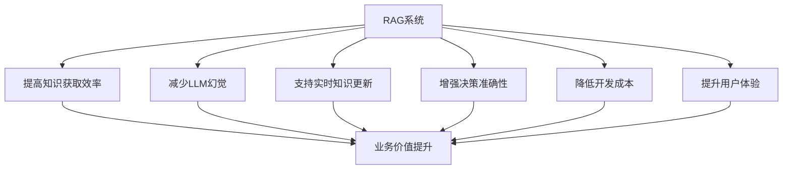
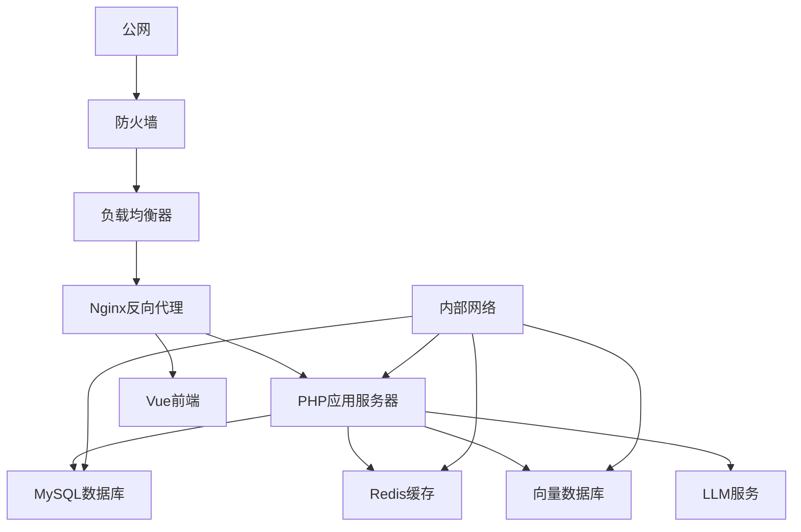
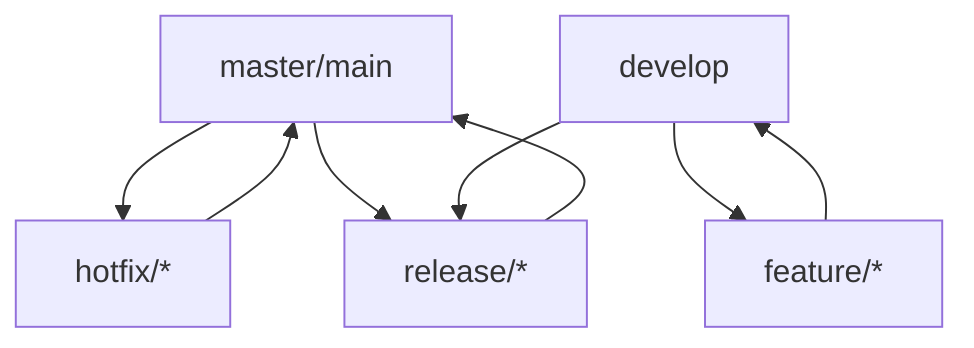
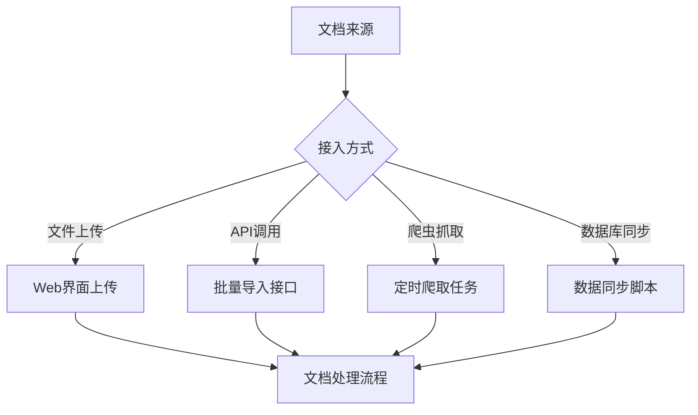
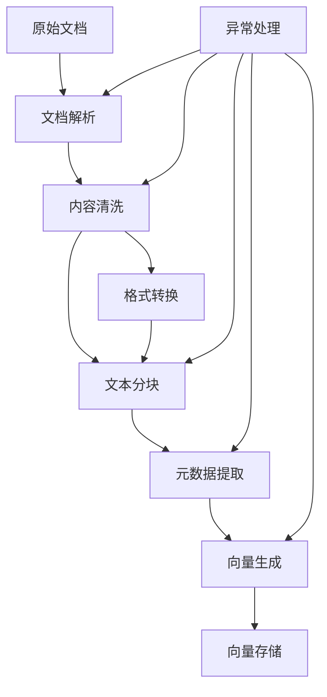
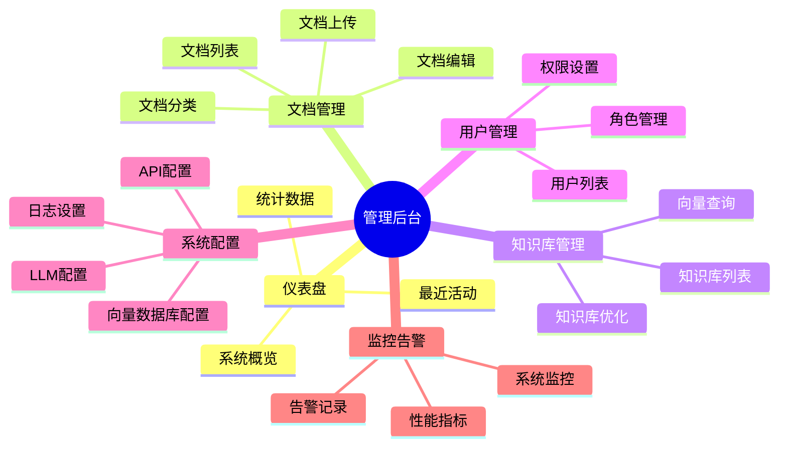
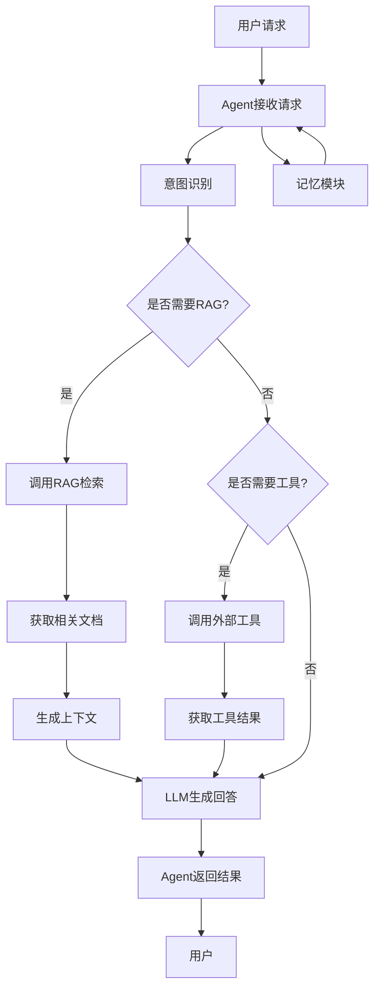
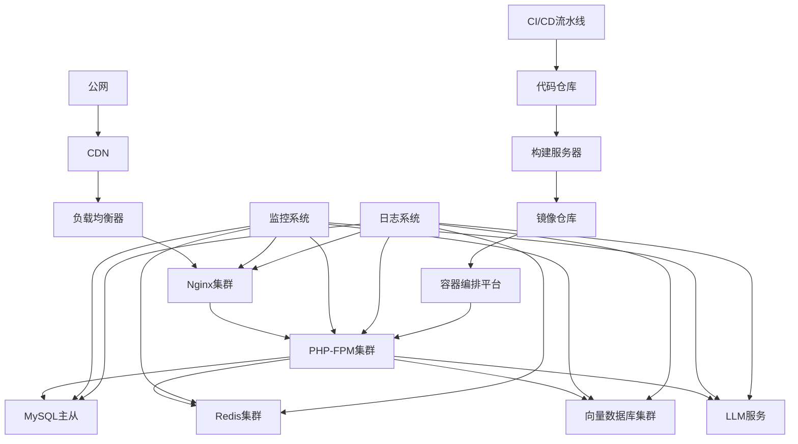
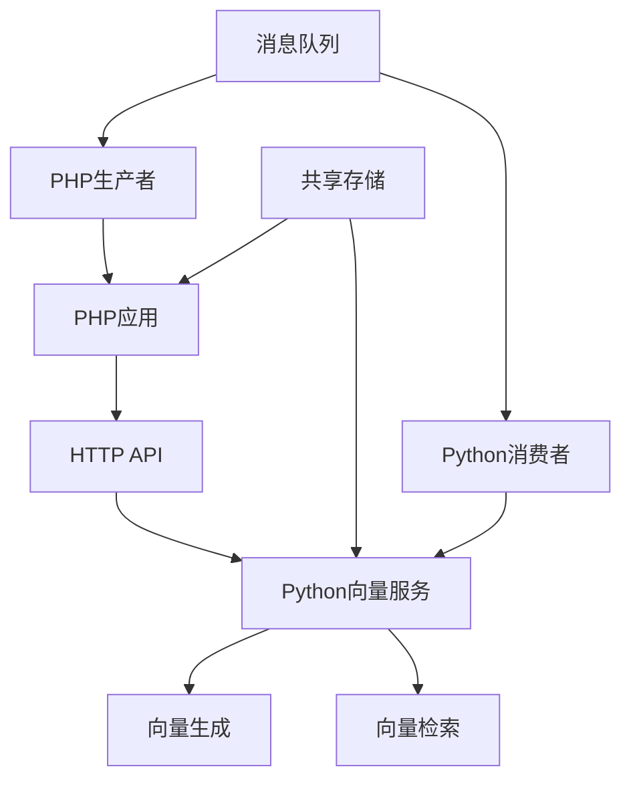

# RAG系统从0到1搭建指南
## 面向PHP+Vue+UniApp技术栈团队

## 1. 引言

### 1.1 文档目的
本文档旨在为以PHP、Vue及UniApp技术栈为主的开发团队，提供一份全面的RAG（检索增强生成）系统从0到1搭建指南。通过本指南，团队成员可以了解RAG系统的核心概念、技术架构、实现步骤以及最佳实践，从而顺利完成RAG系统的搭建与部署。

### 1.2 目标读者
- PHP开发人员
- Vue前端开发人员
- UniApp移动端开发人员
- OA实施人员
- IT维护人员
- 技术团队leader

### 1.3 RAG系统价值



## 2. 软硬件环境准备

### 2.1 服务器配置建议

| 服务类型 | CPU | 内存 | 存储 | 网络 | 推荐配置 |
|----------|-----|------|------|------|----------|
| 应用服务器 | 8核 | 16GB | 500GB SSD | 千兆网卡 | 生产环境 |
| 向量数据库 | 16核 | 32GB | 1TB SSD | 千兆网卡 | 生产环境 |
| 数据库服务器 | 8核 | 16GB | 1TB SSD | 千兆网卡 | 生产环境 |
| 开发环境 | 4核 | 8GB | 256GB SSD | 千兆网卡 | 开发测试 |

### 2.2 操作系统选择与优化

#### 2.2.1 操作系统选型
- **生产环境**：Ubuntu Server 22.04 LTS
- **开发环境**：Windows 10/11 + WSL2 或 Ubuntu Desktop 22.04 LTS

#### 2.2.2 Linux系统优化

```bash
# 禁用不必要的服务
systemctl disable postfix
 调整文件描述符限制
cat << EOF >> /etc/security/limits.conf
* soft nofile 65536
* hard nofile 65536
EOF

# 调整内核参数
cat << EOF >> /etc/sysctl.conf
net.core.somaxconn = 4096
net.ipv4.tcp_max_syn_backlog = 4096
net.ipv4.tcp_fin_timeout = 10
EOF
sysctl -p
```

### 2.3 必要软件依赖与版本兼容性

| 软件名称 | 版本 | 用途 | 安装方式 |
|----------|------|------|----------|
| PHP | 8.2+ | 后端开发 | apt/yum |
| Nginx | 1.24+ | Web服务器 | apt/yum |
| MySQL | 8.0+ | 关系型数据库 | apt/yum/docker |
| Redis | 7.0+ | 缓存/会话存储 | apt/yum/docker |
| Python | 3.10+ | 向量处理/LLM调用 | apt/yum |
| Node.js | 18+ | 前端开发 | nvm |
| Docker | 24.0+ | 容器化部署 | 官方脚本 |
| Docker Compose | 2.21+ | 多容器管理 | pip |

### 2.4 网络环境与安全配置

#### 2.4.1 网络架构



#### 2.4.2 安全配置

1. **防火墙规则**：
   - 仅开放必要端口（80, 443, 22）
   - 配置IP白名单
   - 启用入侵检测系统

2. **HTTPS配置**：
   ```nginx
   server {
       listen 443 ssl;
       server_name rag.example.com;
       
       ssl_certificate /etc/nginx/ssl/cert.pem;
       ssl_certificate_key /etc/nginx/ssl/key.pem;
       ssl_protocols TLSv1.2 TLSv1.3;
       ssl_ciphers ECDHE-RSA-AES256-GCM-SHA512:DHE-RSA-AES256-GCM-SHA512;
       
       # 其他配置...
   }
   ```

## 3. 项目结构与目录设计

### 3.1 推荐的目录组织结构

```
rag-system/
├── backend/              # PHP后端
│   ├── app/              # 应用代码
│   │   ├── Controllers/  # 控制器
│   │   ├── Models/       # 数据模型
│   │   ├── Services/     # 业务逻辑
│   │   ├── Libraries/    # 自定义库
│   │   └── Routes/       # 路由定义
│   ├── config/           # 配置文件
│   ├── public/           # 公共资源
│   ├── storage/          # 存储目录
│   ├── tests/            # 测试代码
│   └── vendor/           # 依赖包
├── frontend/             # Vue前端
│   ├── public/           # 静态资源
│   ├── src/              # 源代码
│   │   ├── assets/       # 资源文件
│   │   ├── components/   # 组件
│   │   ├── views/        # 页面
│   │   ├── router/       # 路由
│   │   ├── store/        # 状态管理
│   │   └── utils/        # 工具函数
│   ├── tests/            # 测试代码
│   └── package.json      # 依赖配置
├── uniapp/               # UniApp移动端
│   ├── pages/            # 页面
│   ├── components/       # 组件
│   ├── static/           # 静态资源
│   ├── utils/            # 工具函数
│   └── manifest.json     # 配置文件
├── vector-service/       # 向量服务（Python）
│   ├── app/              # 应用代码
│   ├── requirements.txt  # 依赖配置
│   └── Dockerfile        # Docker配置
├── docker-compose.yml    # Docker Compose配置
└── README.md             # 项目说明
```

### 3.2 核心模块划分

| 模块名称 | 主要功能 | 技术栈 | 负责人 |
|----------|----------|--------|--------|
| 数据处理模块 | 文档上传、清洗、分块、向量化 | PHP/Python | 后端开发 |
| 检索引擎模块 | 向量检索、关键词检索、混合检索 | Python | 后端开发 |
| LLM集成模块 | LLM调用、提示词工程、结果生成 | PHP/Python | 后端开发 |
| API服务模块 | 对外提供API接口 | PHP | 后端开发 |
| 管理后台 | 系统配置、文档管理、用户管理 | Vue | 前端开发 |
| 用户端 | RAG查询、结果展示 | Vue/UniApp | 前端/移动端开发 |
| 向量服务 | 向量计算、向量存储 | Python | 后端开发 |

### 3.3 配置文件管理策略

#### 3.3.1 配置文件结构

```
config/
├── app.php           # 应用基本配置
├── database.php      # 数据库配置
├── redis.php         # Redis配置
├── vector_db.php     # 向量数据库配置
├── llm.php           # LLM服务配置
├── api.php           # API配置
├── auth.php          # 认证配置
└── environments/     # 环境配置
    ├── development/  # 开发环境
    ├── staging/      # 测试环境
    └── production/   # 生产环境
```

#### 3.3.2 环境变量管理

```php
// .env.example
APP_NAME=RAG_System
APP_ENV=development
APP_KEY=
APP_DEBUG=true
APP_URL=http://localhost

DB_CONNECTION=mysql
DB_HOST=127.0.0.1
DB_PORT=3306
DB_DATABASE=rag_system
DB_USERNAME=root
DB_PASSWORD=

REDIS_HOST=127.0.0.1
REDIS_PASSWORD=null
REDIS_PORT=6379

VECTOR_DB_HOST=127.0.0.1
VECTOR_DB_PORT=8000
VECTOR_DB_COLLECTION=rag_documents

LLM_API_KEY=sk-xxxxxxxxxxxxxxxxxxxxxxxxxxxxxxxx
LLM_MODEL=gpt-4
```

### 3.4 代码版本控制与协作规范

#### 3.4.1 Git分支策略



#### 3.4.2 代码提交规范

| 类型 | 描述 | 示例 |
|------|------|------|
| feat | 新功能 | feat: 添加文档上传功能 |
| fix | 修复bug | fix: 解决检索结果排序问题 |
| docs | 文档更新 | docs: 更新API文档 |
| style | 代码风格 | style: 格式化代码 |
| refactor | 代码重构 | refactor: 优化向量处理逻辑 |
| test | 测试代码 | test: 添加单元测试 |
| chore | 杂项 | chore: 更新依赖版本 |

## 4. 内容组织与管理

### 4.1 文档数据源接入方案

#### 4.1.1 支持的文档格式

| 格式 | 描述 | 处理方式 |
|------|------|----------|
| TXT | 纯文本 | 直接读取 |
| MD | Markdown | 解析为HTML或纯文本 |
| DOC/DOCX | Word文档 | 使用PHPWord解析 |
| PDF | PDF文档 | 使用pdfparse/php-pdf-parser解析 |
| PPT/PPTX | PowerPoint | 使用PHPPresentation解析 |
| HTML | 网页 | 提取正文内容 |
| 数据库 | 结构化数据 | SQL查询导出 |

#### 4.1.2 接入方式



### 4.2 文档预处理流程

#### 4.2.1 预处理流程图



#### 4.2.2 文本分块策略

```php
// PHP文本分块示例
function chunkText($text, $chunkSize = 1000, $overlap = 200) {
    $chunks = [];
    $length = strlen($text);
    
    for ($i = 0; $i < $length; $i += ($chunkSize - $overlap)) {
        $chunk = substr($text, $i, $chunkSize);
        $chunks[] = $chunk;
        
        if ($i + $chunkSize >= $length) {
            break;
        }
    }
    
    return $chunks;
}
```

#### 4.2.3 元数据提取

| 元数据项 | 描述 | 提取方式 |
|----------|------|----------|
| 标题 | 文档标题 | 解析文件元数据或提取正文标题 |
| 作者 | 文档作者 | 解析文件元数据 |
| 创建时间 | 文档创建时间 | 解析文件元数据 |
| 更新时间 | 文档更新时间 | 解析文件元数据或系统时间 |
| 类别 | 文档类别 | 用户指定或自动分类 |
| 标签 | 文档标签 | 用户指定或自动提取关键词 |
| 来源 | 文档来源 | 系统记录 |

### 4.3 向量数据库选型与优化配置

#### 4.3.1 向量数据库比较

| 数据库名称 | 类型 | 特点 | 适用场景 |
|------------|------|------|----------|
| Chroma | 开源 | 轻量级，易于部署 | 开发测试 |
| Milvus | 开源 | 分布式，高性能 | 大规模生产环境 |
| Pinecone | 商业 | 托管式，易用 | 快速上线 |
| FAISS | 开源 | 高性能，适合本地部署 | 单机生产环境 |

#### 4.3.2 向量数据库配置

```python
# Chroma向量数据库配置示例
from chromadb.config import Settings
from chromadb import Client

settings = Settings(
    chroma_db_impl="duckdb+parquet",
    persist_directory="./chroma_db",
    anonymized_telemetry=False
)

client = Client(settings)
collection = client.get_or_create_collection(
    name="rag_documents",
    metadata={"description": "RAG系统文档集合"}
)
```

#### 4.3.3 向量生成与存储

```python
# 向量生成示例（使用sentence-transformers）
from sentence_transformers import SentenceTransformer

model = SentenceTransformer('all-MiniLM-L6-v2')

# 生成文本向量
def generate_embedding(text):
    return model.encode(text).tolist()

# 存储向量到数据库
def store_embedding(document_id, text, metadata):
    embedding = generate_embedding(text)
    collection.add(
        documents=[text],
        metadatas=[metadata],
        ids=[document_id]
    )
```

### 4.4 知识库更新与维护机制

#### 4.4.1 更新策略

| 更新方式 | 描述 | 适用场景 |
|----------|------|----------|
| 手动更新 | 用户手动上传或编辑 | 少量文档更新 |
| 定时更新 | 定时执行更新任务 | 定期批量更新 |
| 实时更新 | 监听数据源变化 | 重要文档实时更新 |
| 增量更新 | 只更新变化的文档 | 大规模文档更新 |

#### 4.4.2 维护机制

1. **文档版本管理**：
   ```php
   // 文档版本模型示例
   class DocumentVersion extends Model {
       protected $fillable = [
           'document_id',
           'version',
           'content',
           'metadata',
           'created_by',
       ];
       
       public function document() {
           return $this->belongsTo(Document::class);
       }
   }
   ```

2. **过期文档清理**：
   - 设置文档有效期
   - 定期清理过期文档
   - 支持文档归档

3. **质量评估**：
   - 用户反馈评分
   - 自动质量检测
   - 定期人工审核

## 5. 可视化界面设计

### 5.1 管理后台功能模块规划

#### 5.1.1 功能模块图



#### 5.1.2 文档管理界面设计

```vue
<!-- Vue文档上传组件示例 -->
<template>
  <div class="document-upload">
    <el-upload
      class="upload-demo"
      drag
      action="/api/documents/upload"
      :headers="{ Authorization: `Bearer ${token}` }"
      :on-success="handleSuccess"
      :on-error="handleError"
      :multiple="true"
      :file-list="fileList"
    >
      <el-icon class="el-icon--upload"><upload-filled /></el-icon>
      <div class="el-upload__text">
        将文件拖到此处，或 <em>点击上传</em>
      </div>
      <template #tip>
        <div class="el-upload__tip">
          支持上传 TXT、MD、DOCX、PDF 等格式文件，单个文件不超过 100MB
        </div>
      </template>
    </el-upload>
    
    <el-table :data="uploadedDocuments" style="width: 100%">
      <el-table-column prop="name" label="文件名" />
      <el-table-column prop="size" label="大小" />
      <el-table-column prop="status" label="状态">
        <template #default="scope">
          <el-tag :type="scope.row.status === 'processed' ? 'success' : 'warning'">
            {{ scope.row.status }}
          </el-tag>
        </template>
      </el-table-column>
      <el-table-column prop="upload_time" label="上传时间" />
      <el-table-column label="操作">
        <template #default="scope">
          <el-button type="primary" size="small" @click="viewDocument(scope.row.id)">
            查看
          </el-button>
          <el-button type="danger" size="small" @click="deleteDocument(scope.row.id)">
            删除
          </el-button>
        </template>
      </el-table-column>
    </el-table>
  </div>
</template>

<script setup>
import { ref } from 'vue';
import { UploadFilled } from '@element-plus/icons-vue';
import { ElMessage } from 'element-plus';

const token = ref(localStorage.getItem('token'));
const fileList = ref([]);
const uploadedDocuments = ref([]);

const handleSuccess = (response) => {
  ElMessage.success('文件上传成功');
  uploadedDocuments.value.push(response.data);
};

const handleError = (error) => {
  ElMessage.error('文件上传失败');
  console.error(error);
};

const viewDocument = (id) => {
  // 查看文档逻辑
};

const deleteDocument = (id) => {
  // 删除文档逻辑
};
</script>
```

### 5.2 用户交互界面设计建议

#### 5.2.1 查询界面设计

```vue
<!-- Vue查询界面示例 -->
<template>
  <div class="rag-query">
    <div class="query-header">
      <h1>RAG智能查询</h1>
      <p>基于知识库的智能问答系统</p>
    </div>
    
    <div class="query-input-area">
      <el-input
        v-model="query"
        placeholder="请输入您的问题..."
        type="textarea"
        :rows="4"
        @keyup.enter="handleQuery"
      />
      <div class="query-actions">
        <el-button type="primary" @click="handleQuery" :loading="loading">
          {{ loading ? '查询中...' : '发送' }}
        </el-button>
        <el-button @click="clearQuery">清空</el-button>
      </div>
    </div>
    
    <div class="query-history">
      <h3>历史记录</h3>
      <el-timeline>
        <el-timeline-item v-for="item in history" :key="item.id" :timestamp="item.time">
          <div class="history-item">
            <strong>{{ item.query }}</strong>
            <p>{{ item.answer }}</p>
          </div>
        </el-timeline-item>
      </el-timeline>
    </div>
    
    <div class="query-result" v-if="result">
      <h3>查询结果</h3>
      <div class="answer-content" v-html="result.answer"></div>
      
      <div class="sources">
        <h4>参考来源</h4>
        <el-collapse>
          <el-collapse-item 
            v-for="(source, index) in result.sources" 
            :key="index" 
            :title="source.title || `来源 ${index + 1}`"
          >
            <div class="source-content" v-html="source.content"></div>
            <div class="source-meta">
              <span>{{ source.type }}</span>
              <span>{{ source.score.toFixed(2) }}</span>
            </div>
          </el-collapse-item>
        </el-collapse>
      </div>
    </div>
  </div>
</template>

<script setup>
import { ref } from 'vue';
import { ElMessage } from 'element-plus';

const query = ref('');
const loading = ref(false);
const result = ref(null);
const history = ref([]);

const handleQuery = async () => {
  if (!query.value.trim()) {
    ElMessage.warning('请输入查询内容');
    return;
  }
  
  loading.value = true;
  try {
    const response = await fetch('/api/rag/query', {
      method: 'POST',
      headers: {
        'Content-Type': 'application/json',
        'Authorization': `Bearer ${localStorage.getItem('token')}`
      },
      body: JSON.stringify({ query: query.value })
    });
    
    const data = await response.json();
    if (data.success) {
      result.value = data.data;
      // 保存到历史记录
      history.value.unshift({
        id: Date.now(),
        query: query.value,
        answer: data.data.answer,
        time: new Date().toLocaleString()
      });
    } else {
      ElMessage.error(data.message);
    }
  } catch (error) {
    ElMessage.error('查询失败，请稍后重试');
    console.error(error);
  } finally {
    loading.value = false;
  }
};

const clearQuery = () => {
  query.value = '';
  result.value = null;
};
</script>
```

### 5.3 检索结果展示优化

#### 5.3.1 结果排序策略

| 排序依据 | 描述 | 权重 |
|----------|------|------|
| 相似度得分 | 向量相似度 | 0.5 |
| 文档时效性 | 文档更新时间 | 0.2 |
| 文档质量 | 用户评分或质量评分 | 0.15 |
| 文档热度 | 访问频率 | 0.1 |
| 关键词匹配 | 关键词出现频率 | 0.05 |

#### 5.3.2 结果高亮

```php
// PHP结果高亮示例
function highlightKeywords($text, $keywords) {
    foreach ($keywords as $keyword) {
        $text = preg_replace(
            "/($keyword)/i",
            '<span class="highlight">$1</span>',
            $text
        );
    }
    return $text;
}
```

### 5.4 数据分析与监控仪表盘

#### 5.4.1 关键指标

| 指标类型 | 具体指标 | 描述 |
|----------|----------|------|
| 系统指标 | 活跃用户数 | 实时在线用户数 |
| | 日均查询量 | 每天的查询次数 |
| | 平均响应时间 | 查询的平均响应时间 |
| | 成功率 | 查询成功的比例 |
| 内容指标 | 文档总数 | 知识库中文档数量 |
| | 文档类型分布 | 不同类型文档的占比 |
| | 知识库更新频率 | 文档更新的频率 |
| 性能指标 | CPU使用率 | 服务器CPU使用率 |
| | 内存使用率 | 服务器内存使用率 |
| | 磁盘使用率 | 服务器磁盘使用率 |
| | 网络流量 | 服务器网络流量 |

#### 5.4.2 仪表盘设计

```vue
<!-- Vue仪表盘示例 -->
<template>
  <div class="dashboard">
    <el-row :gutter="20">
      <el-col :span="6">
        <el-card shadow="hover">
          <template #header>
            <div class="card-header">
              <span>活跃用户数</span>
              <el-button type="text" size="small">今日</el-button>
            </div>
          </template>
          <div class="card-content">
            <div class="number">{{ activeUsers }}</div>
            <div class="trend">
              <el-icon><arrow-up /></el-icon>
              <span class="increase">12.5%</span>
            </div>
          </div>
        </el-card>
      </el-col>
      
      <el-col :span="6">
        <el-card shadow="hover">
          <template #header>
            <div class="card-header">
              <span>日均查询量</span>
              <el-button type="text" size="small">本周</el-button>
            </div>
          </template>
          <div class="card-content">
            <div class="number">{{ dailyQueries }}</div>
            <div class="trend">
              <el-icon><arrow-up /></el-icon>
              <span class="increase">8.3%</span>
            </div>
          </div>
        </el-card>
      </el-col>
      
      <el-col :span="6">
        <el-card shadow="hover">
          <template #header>
            <div class="card-header">
              <span>平均响应时间</span>
              <el-button type="text" size="small">本月</el-button>
            </div>
          </template>
          <div class="card-content">
            <div class="number">{{ avgResponseTime }}ms</div>
            <div class="trend">
              <el-icon><arrow-down /></el-icon>
              <span class="decrease">-5.2%</span>
            </div>
          </div>
        </el-card>
      </el-col>
      
      <el-col :span="6">
        <el-card shadow="hover">
          <template #header>
            <div class="card-header">
              <span>文档总数</span>
              <el-button type="text" size="small">总计</el-button>
            </div>
          </template>
          <div class="card-content">
            <div class="number">{{ totalDocuments }}</div>
            <div class="trend">
              <el-icon><arrow-up /></el-icon>
              <span class="increase">25.7%</span>
            </div>
          </div>
        </el-card>
      </el-col>
    </el-row>
    
    <el-row :gutter="20" style="margin-top: 20px">
      <el-col :span="12">
        <el-card shadow="hover">
          <template #header>
            <div class="card-header">
              <span>查询趋势</span>
            </div>
          </template>
          <div class="chart-container">
            <!-- ECharts图表 -->
            <div ref="trendChart" style="width: 100%; height: 300px;"></div>
          </div>
        </el-card>
      </el-col>
      
      <el-col :span="12">
        <el-card shadow="hover">
          <template #header>
            <div class="card-header">
              <span>文档类型分布</span>
            </div>
          </template>
          <div class="chart-container">
            <!-- ECharts饼图 -->
            <div ref="documentTypeChart" style="width: 100%; height: 300px;"></div>
          </div>
        </el-card>
      </el-col>
    </el-row>
    
    <el-row :gutter="20" style="margin-top: 20px">
      <el-col :span="24">
        <el-card shadow="hover">
          <template #header>
            <div class="card-header">
              <span>系统性能监控</span>
            </div>
          </template>
          <div class="chart-container">
            <!-- ECharts多线图 -->
            <div ref="performanceChart" style="width: 100%; height: 300px;"></div>
          </div>
        </el-card>
      </el-col>
    </el-row>
  </div>
</template>

<script setup>
import { ref, onMounted } from 'vue';
import * as echarts from 'echarts';

// 模拟数据
const activeUsers = ref(128);
const dailyQueries = ref(5432);
const avgResponseTime = ref(1250);
const totalDocuments = ref(15678);

// 图表引用
const trendChart = ref(null);
const documentTypeChart = ref(null);
const performanceChart = ref(null);

onMounted(() => {
  // 初始化图表
  initTrendChart();
  initDocumentTypeChart();
  initPerformanceChart();
});

const initTrendChart = () => {
  const chart = echarts.init(trendChart.value);
  const option = {
    title: { text: '查询量趋势' },
    tooltip: { trigger: 'axis' },
    xAxis: {
      type: 'category',
      data: ['周一', '周二', '周三', '周四', '周五', '周六', '周日']
    },
    yAxis: { type: 'value' },
    series: [{
      data: [3200, 4500, 3800, 5200, 4800, 6500, 5800],
      type: 'line',
      smooth: true
    }]
  };
  chart.setOption(option);
};

const initDocumentTypeChart = () => {
  const chart = echarts.init(documentTypeChart.value);
  const option = {
    title: { text: '文档类型分布' },
    tooltip: { trigger: 'item' },
    legend: { orient: 'vertical', left: 'left' },
    series: [{
      name: '文档类型',
      type: 'pie',
      radius: '50%',
      data: [
        { value: 4500, name: 'PDF' },
        { value: 3200, name: 'DOCX' },
        { value: 2800, name: 'TXT' },
        { value: 2100, name: 'MD' },
        { value: 1500, name: 'PPTX' },
        { value: 1578, name: '其他' }
      ],
      emphasis: {
        itemStyle: {
          shadowBlur: 10,
          shadowOffsetX: 0,
          shadowColor: 'rgba(0, 0, 0, 0.5)'
        }
      }
    }]
  };
  chart.setOption(option);
};

const initPerformanceChart = () => {
  const chart = echarts.init(performanceChart.value);
  const option = {
    title: { text: '系统性能' },
    tooltip: { trigger: 'axis' },
    legend: { data: ['CPU使用率', '内存使用率', '磁盘使用率'] },
    xAxis: {
      type: 'category',
      data: ['00:00', '04:00', '08:00', '12:00', '16:00', '20:00']
    },
    yAxis: { type: 'value', max: 100 },
    series: [
      {
        name: 'CPU使用率',
        type: 'line',
        data: [35, 28, 42, 58, 65, 48]
      },
      {
        name: '内存使用率',
        type: 'line',
        data: [62, 58, 65, 72, 78, 68]
      },
      {
        name: '磁盘使用率',
        type: 'line',
        data: [45, 46, 48, 50, 52, 53]
      }
    ]
  };
  chart.setOption(option);
};
</script>
```

## 6. Agent系统对接

### 6.1 Agent框架选型建议

| 框架名称 | 类型 | 特点 | 适用场景 |
|----------|------|------|----------|
| LangChain | 开源 | 丰富的集成生态，支持多种LLM | 复杂Agent系统 |
| AutoGPT | 开源 | 自主决策能力强 | 实验性Agent |
| BabyAGI | 开源 | 基于任务链的Agent | 简单任务自动化 |
| LangGraph | 开源 | 基于图的工作流，适合复杂流程 | 复杂业务流程 |
| 自定义Agent | 自研 | 完全定制化，适合特定需求 | 特定业务场景 |

### 6.2 RAG与Agent交互流程设计



### 6.3 工具调用机制实现

#### 6.3.1 工具定义

```python
# Python工具定义示例
from langchain.tools import BaseTool, StructuredTool
from typing import Optional, Type
from pydantic import BaseModel, Field

# 天气查询工具
class WeatherInput(BaseModel):
    city: str = Field(description="城市名称")
    date: Optional[str] = Field(description="日期，可选")

class WeatherTool(BaseTool):
    name = "weather_query"
    description = "查询指定城市的天气信息"
    args_schema: Type[BaseModel] = WeatherInput
    
    def _run(self, city: str, date: Optional[str] = None) -> str:
        # 调用天气API获取数据
        weather_data = fetch_weather(city, date)
        return format_weather_response(weather_data)
    
    async def _arun(self, city: str, date: Optional[str] = None) -> str:
        return self._run(city, date)

# RAG检索工具
class RAGInput(BaseModel):
    query: str = Field(description="检索查询")
    top_k: int = Field(default=3, description="返回结果数量")

class RAGTool(BaseTool):
    name = "rag_retrieval"
    description = "从知识库中检索相关信息"
    args_schema: Type[BaseModel] = RAGInput
    
    def _run(self, query: str, top_k: int = 3) -> str:
        # 调用RAG检索API
        results = rag_retrieve(query, top_k)
        return format_rag_response(results)
    
    async def _arun(self, query: str, top_k: int = 3) -> str:
        return self._run(query, top_k)
```

#### 6.3.2 工具调用流程

```php
// PHP工具调用示例
class AgentService {
    private $llmClient;
    private $tools;
    
    public function __construct() {
        $this->llmClient = new LLMClient();
        $this->tools = [
            new WeatherTool(),
            new RAGTool(),
            new CalculatorTool()
        ];
    }
    
    public function run($userInput, $context = []) {
        // 构建提示词
        $prompt = $this->buildPrompt($userInput, $context);
        
        // 调用LLM获取响应
        $response = $this->llmClient->generate($prompt);
        
        // 检查是否需要调用工具
        $toolCall = $this->parseToolCall($response);
        
        if ($toolCall) {
            // 执行工具调用
            $toolResult = $this->executeToolCall($toolCall);
            
            // 将工具结果添加到上下文
            $context[] = [
                'role' => 'tool',
                'content' => $toolResult
            ];
            
            // 递归调用，继续生成响应
            return $this->run($userInput, $context);
        }
        
        // 返回最终响应
        return $response;
    }
    
    private function buildPrompt($userInput, $context) {
        // 构建包含工具描述的提示词
        $toolDescriptions = [];
        foreach ($this->tools as $tool) {
            $toolDescriptions[] = sprintf(
                "%s: %s\n参数: %s",
                $tool->getName(),
                $tool->getDescription(),
                json_encode($tool->getArgsSchema())
            );
        }
        
        $prompt = "你是一个智能Agent，需要根据用户请求提供帮助。\n\n";
        $prompt .= "可用工具:\n" . implode("\n\n", $toolDescriptions) . "\n\n";
        $prompt .= "上下文:\n" . json_encode($context) . "\n\n";
        $prompt .= "用户请求: " . $userInput . "\n\n";
        $prompt .= "如果需要调用工具，请返回JSON格式: {\"tool\": \"工具名称\", \"args\": {}}\n";
        $prompt .= "否则直接返回回答。";
        
        return $prompt;
    }
    
    private function parseToolCall($response) {
        // 解析LLM响应，检查是否包含工具调用
        // 简化示例，实际应使用更健壮的解析
        if (strpos($response, '{') !== false) {
            $jsonStr = substr($response, strpos($response, '{'));
            $jsonStr = substr($jsonStr, 0, strrpos($jsonStr, '}') + 1);
            try {
                $toolCall = json_decode($jsonStr, true);
                if (isset($toolCall['tool']) && isset($toolCall['args'])) {
                    return $toolCall;
                }
            } catch (Exception $e) {
                // 解析失败，返回null
            }
        }
        return null;
    }
    
    private function executeToolCall($toolCall) {
        // 执行工具调用
        foreach ($this->tools as $tool) {
            if ($tool->getName() === $toolCall['tool']) {
                return $tool->run($toolCall['args']);
            }
        }
        return "工具调用失败: 找不到指定工具";
    }
}
```

### 6.4 多轮对话上下文管理

#### 6.4.1 上下文存储

```php
// PHP上下文存储示例
class ContextManager {
    private $redis;
    private $ttl = 3600; // 上下文有效期，默认1小时
    
    public function __construct() {
        $this->redis = new Redis();
        $this->redis->connect('127.0.0.1', 6379);
    }
    
    // 保存上下文
    public function saveContext($userId, $context) {
        $key = "context:{$userId}";
        $this->redis->setex($key, $this->ttl, json_encode($context));
    }
    
    // 获取上下文
    public function getContext($userId) {
        $key = "context:{$userId}";
        $context = $this->redis->get($key);
        return $context ? json_decode($context, true) : [];
    }
    
    // 更新上下文
    public function updateContext($userId, $message) {
        $context = $this->getContext($userId);
        $context[] = $message;
        
        // 限制上下文长度，避免过长
        if (count($context) > 20) {
            $context = array_slice($context, -20);
        }
        
        $this->saveContext($userId, $context);
    }
    
    // 清空上下文
    public function clearContext($userId) {
        $key = "context:{$userId}";
        $this->redis->del($key);
    }
}
```

#### 6.4.2 上下文使用示例

```php
// 处理多轮对话示例
$contextManager = new ContextManager();
$agentService = new AgentService();

// 获取用户ID
$userId = $_SESSION['user_id'];

// 获取历史上下文
$context = $contextManager->getContext($userId);

// 添加当前用户输入到上下文
$contextManager->updateContext($userId, [
    'role' => 'user',
    'content' => $userInput,
    'time' => date('Y-m-d H:i:s')
]);

// 调用Agent处理请求
$response = $agentService->run($userInput, $context);

// 添加Agent响应到上下文
$contextManager->updateContext($userId, [
    'role' => 'assistant',
    'content' => $response,
    'time' => date('Y-m-d H:i:s')
]);

// 返回响应
return $response;
```

## 7. 对外服务提供

### 7.1 API接口设计规范

#### 7.1.1 RESTful API设计

| 接口名称 | 方法 | URL | 描述 | 认证 |
|----------|------|-----|------|------|
| 查询接口 | POST | /api/rag/query | 执行RAG查询 | Bearer Token |
| 文档上传 | POST | /api/documents/upload | 上传文档 | Bearer Token |
| 文档列表 | GET | /api/documents | 获取文档列表 | Bearer Token |
| 文档详情 | GET | /api/documents/{id} | 获取文档详情 | Bearer Token |
| 文档删除 | DELETE | /api/documents/{id} | 删除文档 | Bearer Token |
| 知识库统计 | GET | /api/knowledgebase/stats | 获取知识库统计信息 | Bearer Token |
| 向量检索 | POST | /api/vector/search | 执行向量检索 | Bearer Token |
| 工具调用 | POST | /api/tools/call | 调用外部工具 | Bearer Token |

#### 7.1.2 API请求响应格式

```json
// 请求格式示例
{
  "query": "RAG系统的工作原理是什么？",
  "top_k": 3,
  "temperature": 0.1
}

// 成功响应格式
{
  "success": true,
  "code": 200,
  "message": "查询成功",
  "data": {
    "answer": "RAG系统的工作原理是...",
    "sources": [
      {
        "id": "doc1",
        "title": "RAG技术详解",
        "content": "...",
        "score": 0.92,
        "type": "MD"
      }
    ],
    "processing_time": 1250
  }
}

// 错误响应格式
{
  "success": false,
  "code": 400,
  "message": "查询参数错误",
  "errors": {
    "query": "查询内容不能为空"
  }
}
```

### 7.2 认证与权限控制实现

#### 7.2.1 JWT认证

```php
// PHP JWT认证示例
use Firebase\JWT\JWT;
use Firebase\JWT\Key;

class AuthService {
    private $secretKey = 'your-secret-key-here';
    private $algorithm = 'HS256';
    
    // 生成JWT令牌
    public function generateToken($userId, $userRole) {
        $payload = [
            'sub' => $userId,
            'role' => $userRole,
            'iat' => time(),
            'exp' => time() + 3600 // 1小时过期
        ];
        
        return JWT::encode($payload, $this->secretKey, $this->algorithm);
    }
    
    // 验证JWT令牌
    public function verifyToken($token) {
        try {
            $decoded = JWT::decode($token, new Key($this->secretKey, $this->algorithm));
            return (array) $decoded;
        } catch (Exception $e) {
            throw new UnauthorizedException('无效的令牌');
        }
    }
    
    // 权限检查
    public function checkPermission($userRole, $requiredPermission) {
        $permissions = [
            'admin' => ['read', 'write', 'delete', 'admin'],
            'editor' => ['read', 'write'],
            'user' => ['read']
        ];
        
        return in_array($requiredPermission, $permissions[$userRole] ?? []);
    }
}
```

#### 7.2.2 中间件实现

```php
// PHP中间件示例（基于Laravel）
class AuthMiddleware {
    public function handle($request, Closure $next, $permission = null) {
        // 获取Authorization头
        $token = $request->header('Authorization');
        
        if (!$token) {
            return response()->json([
                'success' => false,
                'code' => 401,
                'message' => '未提供认证令牌'
            ], 401);
        }
        
        // 移除Bearer前缀
        $token = str_replace('Bearer ', '', $token);
        
        try {
            $authService = new AuthService();
            $claims = $authService->verifyToken($token);
            
            // 检查权限
            if ($permission && !$authService->checkPermission($claims['role'], $permission)) {
                return response()->json([
                    'success' => false,
                    'code' => 403,
                    'message' => '权限不足'
                ], 403);
            }
            
            // 将用户信息添加到请求
            $request->merge([
                'user_id' => $claims['sub'],
                'user_role' => $claims['role']
            ]);
            
            return $next($request);
        } catch (Exception $e) {
            return response()->json([
                'success' => false,
                'code' => 401,
                'message' => $e->getMessage()
            ], 401);
        }
    }
}
```

### 7.3 服务部署与扩展策略

#### 7.3.1 部署架构



#### 7.3.2 Docker部署配置

```yaml
# docker-compose.yml示例
version: '3.8'

services:
  # PHP应用服务
  php-app:
    build: ./backend
    restart: always
    volumes:
      - ./backend:/var/www/html
    depends_on:
      - mysql
      - redis
    environment:
      - APP_ENV=production
      - DB_HOST=mysql
      - REDIS_HOST=redis
    networks:
      - rag-network
  
  # Nginx服务
  nginx:
    image: nginx:latest
    restart: always
    ports:
      - "80:80"
      - "443:443"
    volumes:
      - ./nginx/conf.d:/etc/nginx/conf.d
      - ./backend/public:/var/www/html/public
    depends_on:
      - php-app
    networks:
      - rag-network
  
  # MySQL数据库
  mysql:
    image: mysql:8.0
    restart: always
    ports:
      - "3306:3306"
    volumes:
      - mysql_data:/var/lib/mysql
      - ./mysql/init.sql:/docker-entrypoint-initdb.d/init.sql
    environment:
      - MYSQL_ROOT_PASSWORD=secret
      - MYSQL_DATABASE=rag_system
    networks:
      - rag-network
  
  # Redis缓存
  redis:
    image: redis:7.0
    restart: always
    ports:
      - "6379:6379"
    volumes:
      - redis_data:/data
    networks:
      - rag-network
  
  # 向量服务
  vector-service:
    build: ./vector-service
    restart: always
    ports:
      - "8000:8000"
    volumes:
      - vector_data:/app/data
    networks:
      - rag-network
  
  # 前端服务
  frontend:
    build: ./frontend
    restart: always
    ports:
      - "8080:80"
    networks:
      - rag-network

volumes:
  mysql_data:
  redis_data:
  vector_data:

networks:
  rag-network:
    driver: bridge
```

### 7.4 性能监控与优化方案

#### 7.4.1 监控指标

| 监控层级 | 具体指标 | 监控工具 |
|----------|----------|----------|
| 应用层 | API响应时间 | Prometheus + Grafana |
| | 请求成功率 | Prometheus + Grafana |
| | 错误率 | Prometheus + Grafana |
| | QPS | Prometheus + Grafana |
| 数据库层 | 查询响应时间 | MySQL Exporter + Prometheus |
| | 连接数 | MySQL Exporter + Prometheus |
| | 慢查询 | MySQL Slow Query Log |
| 缓存层 | 命中率 | Redis Exporter + Prometheus |
| | 内存使用率 | Redis Exporter + Prometheus |
| 系统层 | CPU使用率 | Node Exporter + Prometheus |
| | 内存使用率 | Node Exporter + Prometheus |
| | 磁盘I/O | Node Exporter + Prometheus |
| | 网络流量 | Node Exporter + Prometheus |

#### 7.4.2 性能优化技巧

1. **缓存优化**：
   - 缓存热点查询结果
   - 使用Redis缓存频繁访问的数据
   - 实现多级缓存策略

2. **数据库优化**：
   - 合理设计索引
   - 优化SQL查询
   - 使用读写分离
   - 数据库分库分表

3. **应用优化**：
   - 代码优化，减少不必要的计算
   - 使用异步处理，提高并发能力
   - 实现请求合并，减少API调用次数
   - 使用CDN加速静态资源

4. **LLM调用优化**：
   - 优化提示词，减少token使用量
   - 实现LLM调用缓存
   - 使用更高效的模型
   - 实现批量处理

5. **向量检索优化**：
   - 选择合适的向量数据库
   - 优化向量索引
   - 调整检索参数
   - 实现向量压缩

## 8. 最佳实践与理论依据

### 8.1 各环节技术选型的理论依据

#### 8.1.1 后端技术选型

| 技术 | 选型依据 | 理论支持 |
|------|----------|----------|
| PHP 8.2+ | 高性能、稳定、生态成熟 | PHP 8.x引入JIT编译，性能提升显著 |
| MySQL 8.0+ | 关系型数据存储，事务支持 | ACID特性保证数据一致性 |
| Redis 7.0+ | 高性能缓存，支持多种数据结构 | 内存数据库，读写速度快 |
| Nginx | 高性能Web服务器，反向代理 | 事件驱动架构，并发能力强 |

#### 8.1.2 前端技术选型

| 技术 | 选型依据 | 理论支持 |
|------|----------|----------|
| Vue 3 | 响应式设计，组件化开发 | 虚拟DOM，性能优秀 |
| Element Plus | 丰富的UI组件库 | 开箱即用，开发效率高 |
| UniApp | 跨平台开发，一套代码多端运行 | 基于Vue语法，学习成本低 |
| ECharts | 强大的数据可视化库 | 支持多种图表类型，配置灵活 |

#### 8.1.3 AI相关技术选型

| 技术 | 选型依据 | 理论支持 |
|------|----------|----------|
| LangChain | 丰富的LLM集成生态 | 模块化设计，易于扩展 |
| Sentence-Transformers | 高效的向量生成模型 | 基于Transformer架构，语义理解能力强 |
| Chroma | 轻量级向量数据库 | 适合中小规模应用，易于部署 |
| Milvus | 分布式向量数据库 | 适合大规模数据，高性能 |

### 8.2 针对PHP+Vue+UniApp技术栈的适配方案

#### 8.2.1 PHP与Python协作方案



#### 8.2.2 PHP调用LLM服务示例

```php
// PHP调用OpenAI API示例
class LLMClient {
    private $apiKey;
    private $baseUrl;
    
    public function __construct() {
        $this->apiKey = getenv('LLM_API_KEY');
        $this->baseUrl = 'https://api.openai.com/v1';
    }
    
    public function generate($prompt, $model = 'gpt-4', $temperature = 0.1) {
        $headers = [
            'Authorization: Bearer ' . $this->apiKey,
            'Content-Type: application/json'
        ];
        
        $data = [
            'model' => $model,
            'prompt' => $prompt,
            'temperature' => $temperature,
            'max_tokens' => 1000
        ];
        
        $ch = curl_init();
        curl_setopt($ch, CURLOPT_URL, $this->baseUrl . '/completions');
        curl_setopt($ch, CURLOPT_RETURNTRANSFER, true);
        curl_setopt($ch, CURLOPT_POST, true);
        curl_setopt($ch, CURLOPT_POSTFIELDS, json_encode($data));
        curl_setopt($ch, CURLOPT_HTTPHEADER, $headers);
        
        $response = curl_exec($ch);
        curl_close($ch);
        
        $result = json_decode($response, true);
        return $result['choices'][0]['text'] ?? '';
    }
}
```

### 8.3 常见问题解决方案与性能优化技巧

#### 8.3.1 常见问题与解决方案

| 问题 | 解决方案 |
|------|----------|
| LLM生成内容不准确 | 优化提示词、增加上下文、调整温度参数 |
| 检索结果不相关 | 优化文本分块策略、调整向量模型、改进检索算法 |
| 系统响应慢 | 实现缓存、优化数据库查询、使用异步处理 |
| 内存占用高 | 优化向量存储、实现向量压缩、增加服务器内存 |
| 文档处理效率低 | 实现并行处理、优化分块算法、使用更高效的解析库 |
| 多轮对话上下文丢失 | 使用Redis存储上下文、实现上下文管理机制 |

#### 8.3.2 性能优化技巧

1. **前端优化**：
   - 代码分割，按需加载
   - 图片懒加载
   - 减少HTTP请求
   - 使用CDN加速

2. **后端优化**：
   - 使用OPcache加速PHP代码
   - 优化数据库连接池
   - 使用Redis缓存热点数据
   - 实现异步任务处理

3. **向量服务优化**：
   - 使用GPU加速向量生成
   - 优化向量索引
   - 实现向量压缩
   - 使用批量处理

4. **LLM调用优化**：
   - 优化提示词，减少token使用
   - 实现LLM调用缓存
   - 使用更高效的模型
   - 实现批量请求

### 8.4 安全与合规性考量

#### 8.4.1 安全防护措施

| 安全层面 | 防护措施 |
|----------|----------|
| 网络安全 | 防火墙、DDoS防护、VPN |
| 应用安全 | 输入验证、输出编码、SQL注入防护、XSS防护 |
| 数据安全 | 数据加密、脱敏处理、访问控制 |
| 认证授权 | JWT认证、RBAC权限控制、API密钥管理 |
| 日志审计 | 完整的日志记录、定期安全审计 |
| 依赖安全 | 定期更新依赖、漏洞扫描、安全检测 |

#### 8.4.2 合规性要求

1. **数据隐私合规**：
   - 遵守GDPR、CCPA等数据隐私法规
   - 实现数据最小化原则
   - 提供数据删除机制
   - 获得用户明确授权

2. **内容合规**：
   - 实现内容审核机制
   - 过滤违法违规内容
   - 提供举报机制
   - 记录内容生成日志

3. **知识产权合规**：
   - 确保使用合法授权的模型和数据
   - 尊重原创内容版权
   - 实现内容溯源机制
   - 提供引用来源

## 9. 总结与展望

### 9.1 总结

本文档为PHP+Vue+UniApp技术栈的开发团队提供了一份全面的RAG系统从0到1搭建指南，涵盖了从软硬件环境准备、项目结构设计到内容组织管理、可视化界面设计、Agent系统对接、对外服务提供以及最佳实践等各个方面。

通过本指南，团队可以：
- 了解RAG系统的核心概念和技术架构
- 掌握RAG系统的搭建和部署流程
- 学习如何设计和实现高效的RAG系统
- 了解常见问题的解决方案和性能优化技巧
- 确保系统的安全性和合规性

### 9.2 后续建议

1. **持续学习**：AI技术发展迅速，团队应持续关注最新技术动态
2. **迭代优化**：根据实际使用情况，不断优化系统性能和用户体验
3. **扩展功能**：根据业务需求，扩展系统功能，如多模态支持、多语言支持等
4. **社区贡献**：积极参与开源社区，分享经验和成果
5. **团队培训**：定期组织团队培训，提高团队技术水平

### 9.3 未来发展趋势

1. **多模态RAG**：支持文本、图像、音频、视频等多种模态
2. **实时RAG**：支持实时数据更新和检索
3. **自适应RAG**：根据用户反馈自动调整检索和生成策略
4. **分布式RAG**：支持大规模分布式部署
5. **边缘RAG**：支持在边缘设备上运行RAG系统
6. **可解释RAG**：提供生成内容的可解释性

---

# 附录

## 附录A：工具与资源推荐

### A.1 开发工具

| 工具名称 | 用途 | 推荐理由 |
|----------|------|----------|
| VS Code | 代码编辑器 | 轻量、插件丰富 |
| PhpStorm | PHP IDE | 强大的代码补全和调试功能 |
| PyCharm | Python IDE | 适合Python开发 |
| Docker Desktop | 容器化开发 | 简化开发环境搭建 |
| Postman | API测试 | 方便的API调试工具 |
| GitKraken | Git客户端 | 可视化Git操作 |

### A.2 学习资源

| 资源类型 | 名称 | 描述 |
|----------|------|------|
| 书籍 | 《RAG实战指南》 | 详细介绍RAG技术和实践 |
| 文档 | LangChain官方文档 | 完整的LangChain使用指南 |
| 文档 | Chroma官方文档 | Chroma向量数据库使用指南 |
| 课程 | Coursera "Generative AI with Large Language Models" | 介绍生成式AI和LLM |
| 网站 | Hugging Face | 预训练模型和数据集资源 |
| 社区 | Reddit r/LangChain | LangChain社区讨论 |

## 附录B：配置文件模板

### B.1 PHP环境配置

```ini
; php.ini配置建议
memory_limit = 256M
max_execution_time = 300
upload_max_filesize = 100M
post_max_size = 100M
default_charset = "UTF-8"

; OPcache配置
zend_extension=opcache
opcache.enable=1
opcache.memory_consumption=128
opcache.max_accelerated_files=10000
opcache.revalidate_freq=2
opcache.validate_timestamps=1
```

### B.2 Nginx配置

```nginx
server {
    listen 80;
    server_name rag.example.com;
    root /var/www/html/public;
    index index.php index.html index.htm;
    
    location / {
        try_files $uri $uri/ /index.php?$query_string;
    }
    
    location ~ \.php$ {
        fastcgi_pass php-app:9000;
        fastcgi_index index.php;
        fastcgi_param SCRIPT_FILENAME $document_root$fastcgi_script_name;
        include fastcgi_params;
    }
    
    location ~ /\.ht {
        deny all;
    }
    
    error_log /var/log/nginx/rag_error.log;
}
```