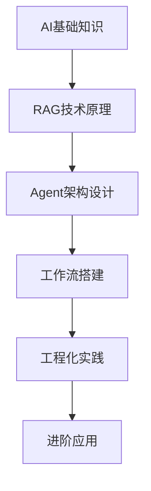

# AI知识笔记体系：从入门到工程化落地

## 1. 学习路径规划

## 2. 目录结构

### 第1章：AI基础知识
- 1.1 人工智能发展历程
- 1.2 大语言模型基础
- 1.3 向量数据库原理
- 1.4 自然语言处理基础

### 第2章：RAG技术原理
- 2.1 RAG核心概念
- 2.2 检索增强生成机制
- 2.3 向量嵌入技术
- 2.4 检索策略优化

### 第3章：Agent架构设计
- 3.1 Agent核心定义
- 3.2 智能代理架构
- 3.3 多Agent协作
- 3.4 工具调用机制

### 第4章：工作流搭建
- 4.1 工作流基础概念
- 4.2 工作流引擎选择
- 4.3 可视化工作流设计
- 4.4 工作流编排实践

### 第5章：工程化实践
- 5.1 系统架构设计
- 5.2 开发环境搭建
- 5.3 代码实现与测试
- 5.4 部署与监控

## 3. 学习目标

| 阶段 | 学习目标 |
|------|----------|
| 入门 | 掌握AI核心概念，理解RAG、Agent基本原理 |
| 进阶 | 能够设计简单的RAG系统和Agent应用 |
| 工程化 | 具备搭建完整AI应用的能力，包括系统设计、开发、测试和部署 |

## 4. 适用人群

- AI零基础学习者
- 软件开发工程师
- 数据科学家
- AI产品经理
- 技术爱好者

## 5. 更新日志

| 日期 | 版本 | 更新内容 |
|------|------|----------|
| 2026-01-18 | v1.0 | 初始化知识体系 |
