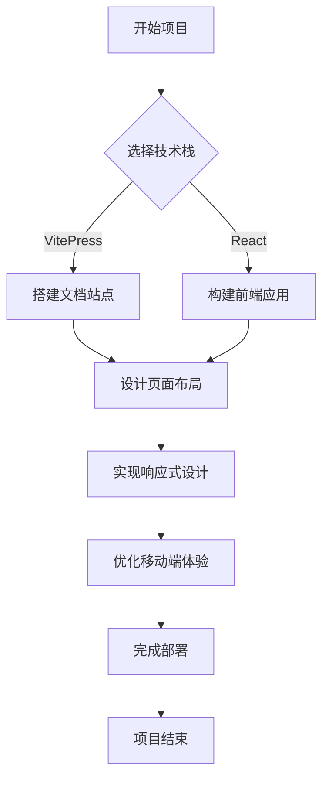
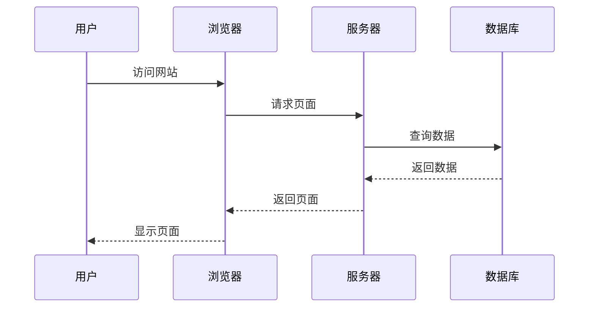
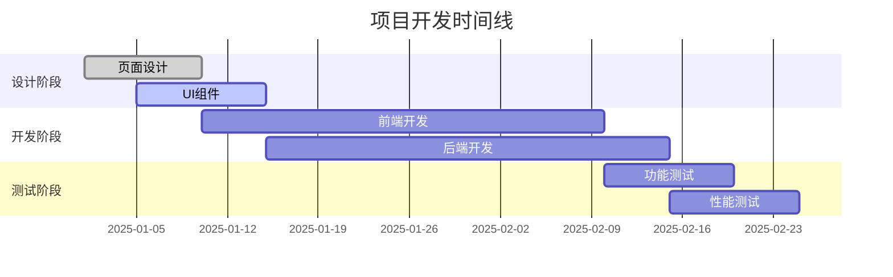
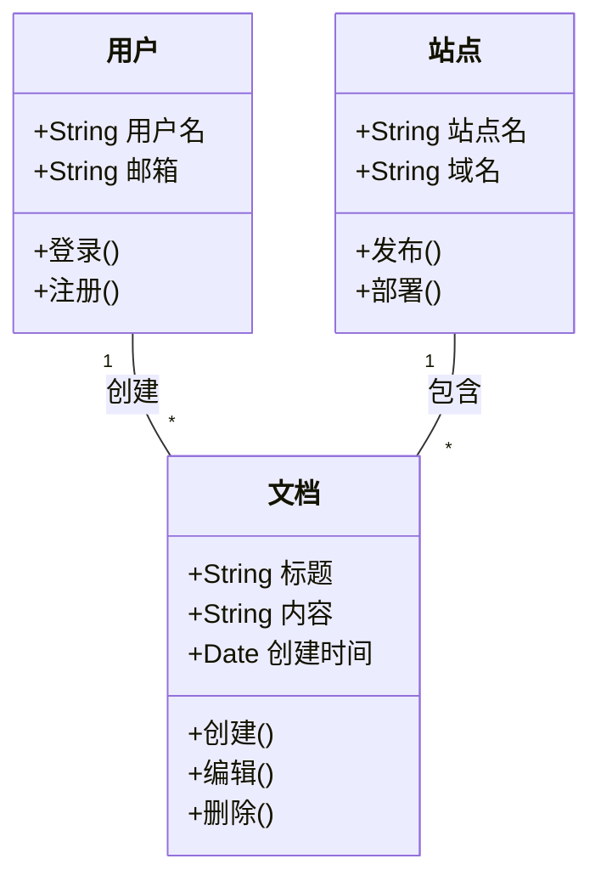
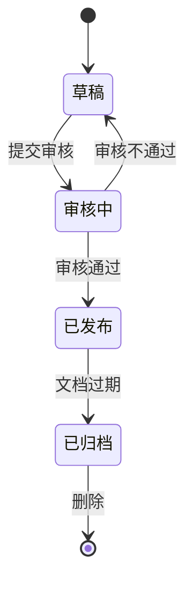
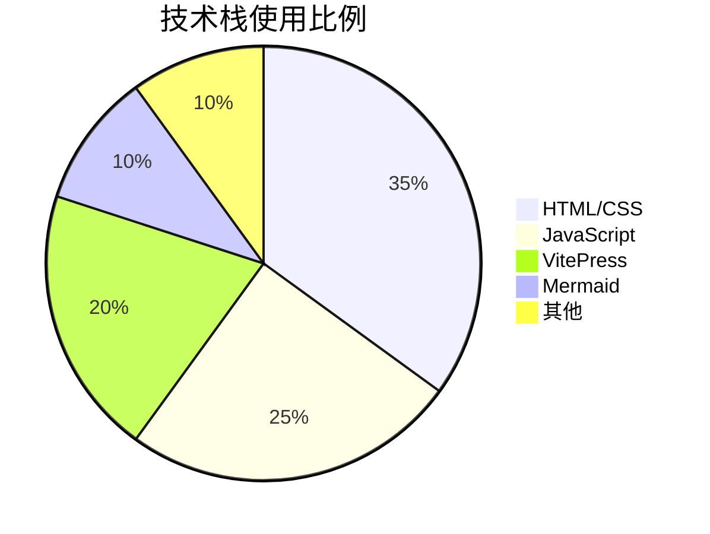
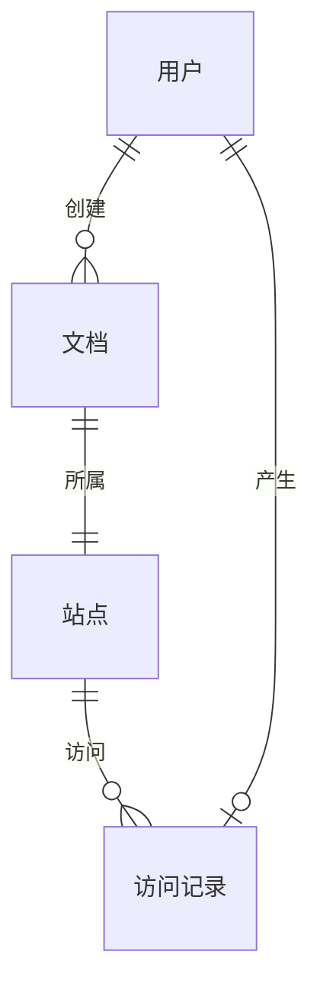
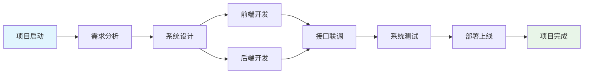

# Markdown 表格与图形化用法示例

## 表格用法

### 基础表格

| 序号 | 项目名称 | 完成状态 | 优先级 | 备注 |
|------|----------|----------|--------|------|
| 1 | 设计页面布局 | ✅ | 高 | 已完成 |
| 2 | 实现响应式设计 | 🔄 | 高 | 进行中 |
| 3 | 优化移动端体验 | ❌ | 中 | 待开始 |
| 4 | 添加图形化组件 | ❌ | 低 | 计划中 |

### 对齐方式表格

| 左对齐 | 居中对齐 | 右对齐 |
|:-------|:--------:|-------:|
| 内容A  |  内容B   |  内容C  |
| 数据1  |  数据2   |  数据3  |
| 项目X  |  项目Y   |  项目Z  |

## 图形化用法

### 流程图 (Flowchart)

### 时序图 (Sequence Diagram)

### 甘特图 (Gantt Chart)

### 类图 (Class Diagram)

### 状态图 (State Diagram)

### 饼图 (Pie Chart)

### 关系图 (Entity Relationship Diagram)

## 综合示例：项目管理流程

以下是一个结合表格和图形的综合示例：

### 项目进度表

| 阶段 | 任务 | 负责人 | 预计完成时间 | 状态 |
|------|------|--------|--------------|------|
| 设计 | 页面设计 | 张三 | 2025-01-10 | ✅ |
| 开发 | 前端开发 | 李四 | 2025-02-10 | 🔄 |
| 开发 | 后端开发 | 王五 | 2025-02-15 | 🔄 |
| 测试 | 功能测试 | 赵六 | 2025-02-20 | ❌ |

### 项目流程图

这些示例展示了 Markdown 中表格和图形化元素的用法，可以用于创建清晰、直观的文档内容。