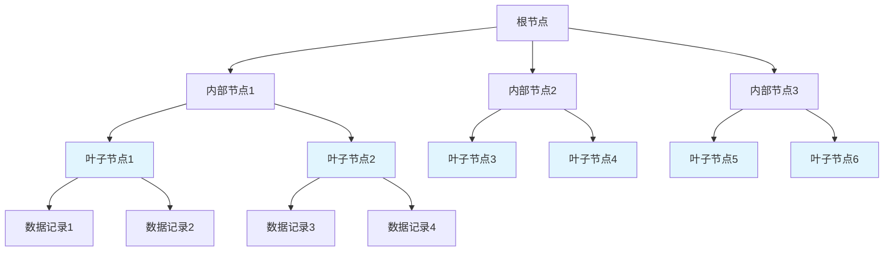

# MySQL MVCC、 B+树

## 概要回答

MySQL的MVCC（Multi-Version Concurrency Control，多版本并发控制）是一种并发控制机制，通过保存数据的多个版本来实现非阻塞读操作，提高数据库并发性能。B+树是MySQL InnoDB存储引擎中用于组织索引数据的主要数据结构，具有有序、稳定、层级浅等特点，支持高效的范围查询和顺序访问。两者共同构成了MySQL高性能并发处理的基础。

## 深度解析

### 1. MVCC（多版本并发控制）

#### 1.1 MVCC基本概念
MVCC通过保存数据的多个版本来实现读写操作的并发执行，读操作不会阻塞写操作，写操作也不会阻塞读操作。

```sql
-- MVCC示例场景
-- 事务A开始
START TRANSACTION;
SELECT * FROM users WHERE id = 1; -- 读取版本1的数据

-- 事务B开始并修改数据
START TRANSACTION;
UPDATE users SET name = 'John Doe' WHERE id = 1;
COMMIT; -- 创建版本2的数据

-- 事务A再次读取相同数据
SELECT * FROM users WHERE id = 1; -- 仍然读取版本1的数据（可重复读）
COMMIT;
```

#### 1.2 undo日志与版本链
InnoDB通过undo日志维护数据的多个版本，形成版本链：

```sql
-- 版本链示例
/*
Row ID: 1
Version 1: name='John', age=25, trx_id=100, roll_ptr=0x1234
                     ↑
Version 2: name='Jane', age=26, trx_id=200, roll_ptr=0x5678
                     ↑
Version 3: name='John Doe', age=27, trx_id=300, roll_ptr=0x9ABC
*/
```

#### 1.3 ReadView机制
ReadView是事务在某一时刻看到的数据视图，决定了哪些版本的数据对当前事务可见：

```sql
-- ReadView结构示例
/*
ReadView {
    m_ids: [200, 300, 400],  // 活跃事务ID列表
    min_trx_id: 200,         // 最小活跃事务ID
    max_trx_id: 400,         // 最大活跃事务ID
    creator_trx_id: 150      // 创建该ReadView的事务ID
}
*/
```

```cpp
// ReadView可见性判断伪代码
bool ReadView::changes_visible(trx_id_t id) {
    // 如果是创建ReadView的事务自己做的修改，则可见
    if (id == creator_trx_id) {
        return true;
    }
    
    // 如果事务ID小于最小活跃事务ID，则表示该事务已提交，可见
    if (id < min_trx_id) {
        return true;
    }
    
    // 如果事务ID大于等于最大活跃事务ID，则表示该事务在ReadView创建之后才开始，不可见
    if (id >= max_trx_id) {
        return false;
    }
    
    // 如果事务ID在活跃事务列表中，则表示该事务还未提交，不可见
    if (m_ids.contains(id)) {
        return false;
    }
    
    // 其他情况可见
    return true;
}
```

#### 1.4 隔离级别与MVCC

##### READ COMMITTED隔离级别
每次SELECT都会生成新的ReadView：

```sql
-- READ COMMITTED示例
SET SESSION TRANSACTION ISOLATION LEVEL READ COMMITTED;

START TRANSACTION;
SELECT * FROM users WHERE id = 1; -- 生成ReadView1
-- 此时其他事务提交了修改
SELECT * FROM users WHERE id = 1; -- 生成ReadView2，能看到其他事务的提交
COMMIT;
```

##### REPEATABLE READ隔离级别
事务中第一次SELECT生成ReadView，后续SELECT复用该ReadView：

```sql
-- REPEATABLE READ示例
SET SESSION TRANSACTION ISOLATION LEVEL REPEATABLE READ;

START TRANSACTION;
SELECT * FROM users WHERE id = 1; -- 生成ReadView并复用
-- 此时其他事务提交了修改
SELECT * FROM users WHERE id = 1; -- 复用之前的ReadView，看不到其他事务的提交
COMMIT;
```

### 2. B+树索引结构

#### 2.1 B+树基本特性
B+树是B树的一种变体，专门用于数据库和操作系统的文件系统中：



#### 2.2 B+树与B树的区别

| 特性 | B树 | B+树 |
|------|-----|------|
| 数据存储 | 内部节点和叶子节点都存储数据 | 只有叶子节点存储数据 |
| 叶子节点链接 | 无链接 | 叶子节点通过指针链接 |
| 查询性能 | 查询性能不稳定 | 查询性能稳定 |
| 范围查询 | 不方便 | 方便 |

#### 2.3 B+树节点结构

```cpp
// B+树节点结构示例
struct BPlusTreeNode {
    bool is_leaf;           // 是否为叶子节点
    int key_count;          // 关键字数量
    int* keys;              // 关键字数组
    void** pointers;        // 指针数组
    BPlusTreeNode* next;    // 叶子节点的下一个节点指针
};

// 内部节点
struct InternalNode : BPlusTreeNode {
    BPlusTreeNode** children; // 子节点指针数组
};

// 叶子节点
struct LeafNode : BPlusTreeNode {
    Record** records;        // 数据记录指针数组
    LeafNode* next;         // 下一个叶子节点
};
```

#### 2.4 B+树操作

##### 查找操作
```cpp
// B+树查找伪代码
BPlusTreeNode* BPlusTree::search(int key) {
    BPlusTreeNode* current = root;
    
    // 从根节点向下查找
    while (!current->is_leaf) {
        int i = 0;
        // 找到第一个大于key的键值位置
        while (i < current->key_count && key >= current->keys[i]) {
            i++;
        }
        // 移动到对应的子节点
        current = (BPlusTreeNode*)current->pointers[i];
    }
    
    // 在叶子节点中查找
    LeafNode* leaf = (LeafNode*)current;
    for (int i = 0; i < leaf->key_count; i++) {
        if (leaf->keys[i] == key) {
            return leaf->records[i]; // 找到记录
        }
    }
    
    return nullptr; // 未找到
}
```

##### 插入操作
```cpp
// B+树插入伪代码
void BPlusTree::insert(int key, Record* record) {
    // 查找插入位置
    LeafNode* leaf = findLeafNode(key);
    
    // 在叶子节点中插入
    if (leaf->key_count < MAX_KEYS) {
        insertIntoLeaf(leaf, key, record);
    } else {
        // 叶子节点已满，需要分裂
        splitLeafNode(leaf, key, record);
    }
}

void BPlusTree::splitLeafNode(LeafNode* leaf, int key, Record* record) {
    // 创建新节点
    LeafNode* newLeaf = new LeafNode();
    
    // 将一半数据移到新节点
    int mid = MAX_KEYS / 2;
    for (int i = mid; i < MAX_KEYS; i++) {
        newLeaf->keys[i - mid] = leaf->keys[i];
        newLeaf->records[i - mid] = leaf->records[i];
    }
    
    // 更新计数
    leaf->key_count = mid;
    newLeaf->key_count = MAX_KEYS - mid;
    
    // 链接叶子节点
    newLeaf->next = leaf->next;
    leaf->next = newLeaf;
    
    // 更新父节点
    insertIntoParent(leaf, newLeaf->keys[0], newLeaf);
}
```

##### 删除操作
```cpp
// B+树删除伪代码
void BPlusTree::remove(int key) {
    // 查找要删除的记录
    LeafNode* leaf = findLeafNode(key);
    
    // 从叶子节点中删除
    removeFromLeaf(leaf, key);
    
    // 检查是否需要合并节点
    if (leaf->key_count < MIN_KEYS) {
        coalesceOrRedistribute(leaf);
    }
}

void BPlusTree::coalesceOrRedistribute(LeafNode* leaf) {
    // 尝试从兄弟节点借关键字
    if (canBorrowFromSibling(leaf)) {
        borrowFromSibling(leaf);
    } else {
        // 合并节点
        mergeNodes(leaf);
    }
}
```

### 3. MVCC与B+树的结合

#### 3.1 聚簇索引中的MVCC实现
InnoDB的聚簇索引将数据行和索引存储在一起：

```sql
-- 聚簇索引示例
CREATE TABLE users (
    id INT PRIMARY KEY,
    name VARCHAR(50),
    age INT,
    INDEX idx_name (name)
) ENGINE=InnoDB;

-- 聚簇索引结构
/*
B+树根节点
├── 内部节点
│   ├── 叶子节点 (id=1, name='Alice', age=25)
│   ├── 叶子节点 (id=2, name='Bob', age=30)
│   └── 叶子节点 (id=3, name='Charlie', age=35)
└── 叶子节点链接形成链表
*/
```

#### 3.2 二级索引与MVCC
二级索引存储的是主键值，需要回表查询：

```sql
-- 二级索引示例
SELECT * FROM users WHERE name = 'Bob';

-- 执行过程：
-- 1. 在idx_name索引中查找'Bob'
-- 2. 找到主键值2
-- 3. 在聚簇索引中通过主键2查找完整记录
-- 4. 应用MVCC可见性判断
```

#### 3.3 一致性读的实现
通过ReadView和undo日志实现一致性读：

```cpp
// 一致性读实现伪代码
Record* ConsistentRead::read(Record* clustered_record) {
    // 获取当前事务的ReadView
    ReadView* view = trx_get_read_view();
    
    // 从记录的版本链中找到可见的版本
    Record* visible_record = clustered_record;
    while (visible_record != nullptr) {
        trx_id_t trx_id = visible_record->trx_id;
        
        // 检查该版本是否对当前事务可见
        if (view->changes_visible(trx_id)) {
            return visible_record;
        }
        
        // 获取下一个版本
        visible_record = get_previous_version(visible_record);
    }
    
    return nullptr; // 没有可见版本
}
```

## 总结

MySQL的MVCC和B+树是数据库高性能并发处理的核心技术：

1. **MVCC机制**通过维护数据的多个版本和ReadView机制，实现了非阻塞的并发读写操作，提高了数据库的并发性能。

2. **B+树索引**通过其有序、稳定、层级浅的特点，支持高效的等值查询、范围查询和顺序访问，是数据库索引的理想数据结构。

3. **两者结合**使得MySQL能够在保证数据一致性的前提下，提供高性能的并发访问能力。理解这两项技术的原理对于数据库性能优化和问题排查具有重要意义。