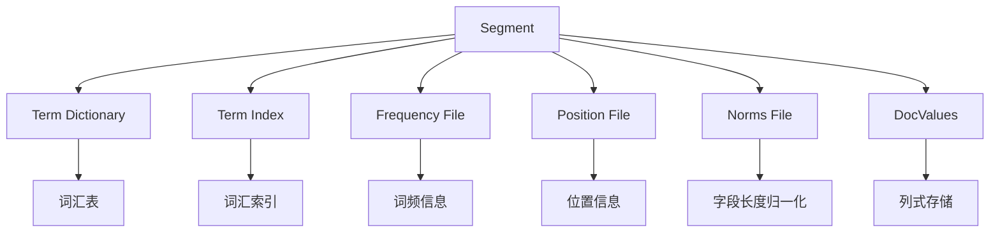

# ES 倒排索引

## 概要回答

Elasticsearch的倒排索引是搜索引擎的核心数据结构，它将文档中的词汇映射到包含该词汇的文档列表，与传统的正向索引（文档ID→词汇）相反。倒排索引由词汇表（Term Dictionary）和倒排列表（Posting List）组成，通过这种结构可以快速定位包含特定词汇的文档，极大地提升了全文检索的效率。

## 深度解析

### 1. 倒排索引基本概念

#### 1.1 正向索引 vs 倒排索引

正向索引是从文档到词汇的映射：
```
文档1 → [词汇A, 词汇B, 词汇C]
文档2 → [词汇B, 词汇C, 词汇D]
文档3 → [词汇A, 词汇C, 词汇D]
```

倒排索引是从词汇到文档的映射：
```
词汇A → [文档1, 文档3]
词汇B → [文档1, 文档2]
词汇C → [文档1, 文档2, 文档3]
词汇D → [文档2, 文档3]
```

#### 1.2 倒排索引的组成

倒排索引主要由两部分组成：

1. **词汇表（Term Dictionary）**：存储所有唯一的词汇及其元数据
2. **倒排列表（Posting List）**：存储包含每个词汇的文档列表及相关信息

```mermaid
graph LR
    A[词汇表] --> B[倒排列表]
    
    A1[词汇A] --> B1[文档列表]
    A2[词汇B] --> B2[文档列表]
    A3[词汇C] --> B3[文档列表]
    
    B11[文档1] --> C1[词频:3<br/>位置:[1,5,12]]
    B12[文档3] --> C2[词频:2<br/>位置:[3,8]]
    
    B21[文档1] --> C3[词频:1<br/>位置:[7]]
    B22[文档2] --> C4[词频:2<br/>位置:[2,15]]
    
    subgraph 词汇表
        A1
        A2
        A3
    end
    
    subgraph 倒排列表
        B1
        B2
        B3
    end
```

### 2. 倒排索引的构建过程

#### 2.1 文档分析阶段

```php
// 文档分析示例
class DocumentAnalyzer {
    public function analyze($content) {
        $tokens = [];
        
        // 1. 分词
        $words = preg_split('/\W+/', strtolower($content));
        
        // 2. 过滤停用词
        foreach ($words as $word) {
            if (!$this->isStopWord($word) && strlen($word) > 0) {
                $tokens[] = new Token($word);
            }
        }
        
        // 3. 词干提取（可选）
        foreach ($tokens as $token) {
            $token->setStem($this->stem($token->getText()));
        }
        
        return $tokens;
    }
    
    private function isStopWord($word) {
        $stopWords = ['the', 'and', 'or', 'but', 'in', 'on', 'at'];
        return in_array($word, $stopWords);
    }
    
    private function stem($word) {
        // 简单的词干提取实现
        if (substr($word, -3) === 'ing') {
            return substr($word, 0, -3);
        }
        if (substr($word, -2) === 'ed') {
            return substr($word, 0, -2);
        }
        return $word;
    }
}
```

#### 2.2 索引构建阶段

```php
// 倒排索引构建示例
class InvertedIndexBuilder {
    private $invertedIndex = [];
    
    public function indexDocument($doc) {
        // 1. 分析文档内容
        $tokens = $this->analyzeDocument($doc);
        
        // 2. 为每个词汇建立倒排列表项
        $termFreq = [];
        for ($i = 0; $i < count($tokens); $i++) {
            $token = $tokens[$i];
            $term = $token->getText();
            
            // 统计词频
            if (!isset($termFreq[$term])) {
                $termFreq[$term] = 0;
            }
            $termFreq[$term]++;
            
            // 记录位置信息
            $this->addTermPosition($term, $doc->getId(), $i);
        }
        
        // 3. 更新倒排索引
        foreach ($termFreq as $term => $freq) {
            if (!isset($this->invertedIndex[$term])) {
                $this->invertedIndex[$term] = new PostingList();
            }
            $this->invertedIndex[$term]->addPosting(new Posting($doc->getId(), $freq));
        }
    }
    
    private function addTermPosition($term, $docId, $position) {
        // 在实际实现中，这里会记录词汇在文档中的位置
    }
}
```

#### 2.3 Posting List结构

```php
// Posting List结构示例
class PostingList {
    private $postings = [];
    
    public function addPosting($posting) {
        $this->postings[] = $posting;
    }
    
    public function getPostings() {
        return $this->postings;
    }
    
    // 倒排列表压缩
    public function compress() {
        // 使用Delta编码压缩文档ID
        // 使用变长编码压缩词频
        return $this->compressUsingVByte();
    }
}

class Posting {
    private $docId;
    private $termFrequency;
    private $positions; // 位置信息（用于短语查询）
    
    public function __construct($docId, $termFrequency) {
        $this->docId = $docId;
        $this->termFrequency = $termFrequency;
        $this->positions = [];
    }
    
    // Getter和Setter方法
    public function getDocId() { return $this->docId; }
    public function getTermFrequency() { return $this->termFrequency; }
    public function getPositions() { return $this->positions; }
    public function setPositions($positions) { $this->positions = $positions; }
}
```
### 3. Elasticsearch中的倒排索引实现

#### 3.1 Lucene倒排索引结构

Elasticsearch基于Lucene实现，其倒排索引包含以下组件：



#### 3.2 Term Dictionary实现

Lucene使用FST（Finite State Transducer）实现Term Dictionary：

```php
// FST示例（概念性代码）
class FSTTermDictionary {
    private $fst;
    
    public function lookup($term) {
        // 通过FST查找词汇
        $termRef = new BytesRef($term);
        $arc = $this->fst->getFirstArc();
        
        // 遍历FST查找词汇
        for ($i = 0; $i < $termRef->length; $i++) {
            $b = $termRef->bytes[$termRef->offset + $i];
            if (!$this->fst->findTargetArc($b, $arc, $arc)) {
                return null; // 词汇不存在
            }
        }
        
        // 获取词汇对应的Posting List偏移量
        $postingOffset = $this->fst->outputs($arc);
        return $this->readPostingList($postingOffset);
    }
}
```

#### 3.3 倒排列表压缩

Lucene使用多种压缩技术优化存储：

```php
// 倒排列表压缩示例
class PostingCompression {
    // Delta编码：存储相邻文档ID的差值
    public static function deltaEncode($docIds) {
        $deltas = array_fill(0, count($docIds), 0);
        $deltas[0] = $docIds[0];
        for ($i = 1; $i < count($docIds); $i++) {
            $deltas[$i] = $docIds[$i] - $docIds[$i-1];
        }
        return $deltas;
    }
    
    // Variable Byte编码
    public static function vByteEncode($values) {
        $result = '';
        foreach ($values as $value) {
            while ($value >= 128) {
                $result .= chr(($value | 0x80) & 0xFF);
                $value >>= 7;
            }
            $result .= chr($value & 0xFF);
        }
        return $result;
    }
    
    // Frame of Reference编码
    public static function forEncode($values) {
        // 找到最小值作为基准
        $min = empty($values) ? 0 : min($values);
        
        // 存储基准值和差值
        $deltas = array_map(function($v) use ($min) {
            return $v - $min;
        }, $values);
        
        // 对差值进行位宽压缩
        return self::compressWithBitWidth($deltas);
    }
    
    private static function compressWithBitWidth($deltas) {
        // 简化的位宽压缩实现
        $result = '';
        foreach ($deltas as $delta) {
            $result .= pack('L', $delta); // 使用4字节存储
        }
        return $result;
    }
}
```
### 4. 查询处理过程

#### 4.1 简单词汇查询

```php
// 简单词汇查询示例
class SimpleTermQuery {
    public function search($term) {
        // 1. 查找词汇对应的倒排列表
        $postingList = $this->invertedIndex->lookup($term);
        if ($postingList == null) {
            return SearchResult::EMPTY;
        }
        
        // 2. 计算文档评分
        $scoredDocs = [];
        foreach ($postingList->getPostings() as $posting) {
            $score = $this->computeTFIDFScore($posting);
            $scoredDocs[] = new ScoreDoc($posting->getDocId(), $score);
        }
        
        // 3. 按评分排序
        usort($scoredDocs, function($a, $b) {
            return $b->getScore() <=> $a->getScore();
        });
        
        return new SearchResult($scoredDocs);
    }
    
    private function computeTFIDFScore($posting) {
        // TF-IDF计算
        $tf = log(1 + $posting->getTermFrequency());
        $idf = log($this->totalDocs / $this->postingList->size());
        return $tf * $idf;
    }
}
```

#### 4.2 布尔查询处理

```php
// 布尔查询示例
class BooleanQueryProcessor {
    public function process($query) {
        $postingLists = [];
        
        // 获取所有词汇的倒排列表
        foreach ($query->getTerms() as $term) {
            $pl = $this->invertedIndex->lookup($term);
            if ($pl != null) {
                $postingLists[] = $pl;
            }
        }
        
        // 根据布尔操作符处理
        switch ($query->getOperator()) {
            case 'AND':
                return $this->intersect($postingLists);
            case 'OR':
                return $this->union($postingLists);
            case 'NOT':
                return $this->difference($postingLists);
            default:
                return SearchResult::EMPTY;
        }
    }
    
    // 交集操作（AND）
    private function intersect($lists) {
        if (empty($lists)) return SearchResult::EMPTY;
        
        // 按照Posting List大小排序，从小到大
        usort($lists, function($a, $b) {
            return count($a->getPostings()) <=> count($b->getPostings());
        });
        
        $smallest = $lists[0];
        $resultDocs = [];
        
        // 初始化结果集为最小的Posting List
        foreach ($smallest->getPostings() as $posting) {
            $resultDocs[$posting->getDocId()] = true;
        }
        
        // 与其他Posting List求交集
        for ($i = 1; $i < count($lists); $i++) {
            $current = $lists[$i];
            $currentDocs = [];
            foreach ($current->getPostings() as $posting) {
                $currentDocs[$posting->getDocId()] = true;
            }
            $resultDocs = array_intersect_key($resultDocs, $currentDocs);
            
            // 如果结果集为空，提前退出
            if (empty($resultDocs)) {
                break;
            }
        }
        
        return new SearchResult(array_keys($resultDocs));
    }
    
    // 并集操作（OR）
    private function union($lists) {
        $resultDocs = [];
        
        foreach ($lists as $pl) {
            foreach ($pl->getPostings() as $posting) {
                $resultDocs[$posting->getDocId()] = true;
            }
        }
        
        return new SearchResult(array_keys($resultDocs));
    }
}
```

#### 4.3 短语查询处理

```php
// 短语查询示例
class PhraseQueryProcessor {
    public function searchPhrase($terms) {
        // 获取每个词汇的倒排列表
        $postingLists = [];
        foreach ($terms as $term) {
            $pl = $this->invertedIndex->lookup($term);
            if ($pl != null) {
                $postingLists[] = $pl;
            } else {
                return SearchResult::EMPTY; // 如果任何一个词汇不存在，返回空结果
            }
        }
        
        // 找到包含所有词汇的文档
        $candidateDocs = $this->findCandidateDocuments($postingLists);
        
        // 验证短语顺序
        $result = [];
        foreach ($candidateDocs as $docId) {
            if ($this->verifyPhraseOrder($docId, $terms)) {
                $score = $this->computePhraseScore($docId, $terms);
                $result[] = new ScoreDoc($docId, $score);
            }
        }
        
        // 按评分排序
        usort($result, function($a, $b) {
            return $b->getScore() <=> $a->getScore();
        });
        return new SearchResult($result);
    }
    
    private function findCandidateDocuments($postingLists) {
        // 使用AND操作找到包含所有词汇的文档
        $andQuery = new BooleanQuery();
        $andQuery->add(new TermQuery($terms[0]), 'MUST');
        return $this->booleanQueryProcessor->process($andQuery)->getDocIds();
    }
    
    private function verifyPhraseOrder($docId, $terms) {
        // 获取每个词汇在文档中的位置
        $positions = [];
        foreach ($terms as $term) {
            $pl = $this->invertedIndex->lookup($term);
            $posting = $pl->getPosting($docId);
            if ($posting != null) {
                $positions[] = $posting->getPositions();
            } else {
                return false;
            }
        }
        
        // 验证位置是否连续
        return $this->checkConsecutivePositions($positions);
    }
    
    private function checkConsecutivePositions($positions) {
        // 使用滑动窗口验证位置连续性
        // 这是一个简化的实现，实际实现会更复杂
        return true;
    }
}
```

### 5. 性能优化技术

#### 5.1 缓存机制

```php
// 倒排索引缓存示例
class InvertedIndexCache {
    private $termCache;
    private $docCache;
    
    public function __construct() {
        // 使用LRU缓存策略
        $this->termCache = new LRUCache(10000);
        $this->termCache->setExpireAfterWrite(10 * 60); // 10分钟
            
        $this->docCache = new LRUCache(1000);
        $this->docCache->setExpireAfterWrite(5 * 60); // 5分钟
    }
    
    public function getPostingList($term) {
        return $this->termCache->get($term, function($term) {
            return $this->loadPostingList($term);
        });
    }
    
    private function loadPostingList($term) {
        // 从磁盘加载倒排列表
        return $this->diskIndex->loadPostingList($term);
    }
}
```

#### 5.2 分段合并策略

```php
// 分段合并示例
class SegmentMerger {
    public function mergeSegments($segments) {
        // 1. 合并词汇表
        $mergedTerms = [];
        
        foreach ($segments as $segment) {
            foreach ($segment->getTerms() as $term => $postingList) {
                if (!isset($mergedTerms[$term])) {
                    $mergedTerms[$term] = [];
                }
                $mergedTerms[$term] = array_merge($mergedTerms[$term], $postingList->getPostings());
            }
        }
        
        // 2. 按文档ID排序
        foreach ($mergedTerms as $term => $postings) {
            usort($postings, function($a, $b) {
                return $a->getDocId() <=> $b->getDocId();
            });
            $mergedTerms[$term] = $postings;
        }
        
        // 3. 创建新的合并分段
        $mergedSegment = new Segment($mergedTerms);
        
        // 4. 替换原有分段
        $this->replaceSegments($segments, $mergedSegment);
    }
}
```

## 总结

Elasticsearch的倒排索引是全文检索系统的核心技术，具有以下特点：

1. **高效检索**：通过词汇到文档的映射，可以快速定位包含特定词汇的文档
2. **压缩存储**：使用Delta编码、变长编码等技术减少存储空间
3. **灵活查询**：支持词汇查询、布尔查询、短语查询等多种查询方式
4. **性能优化**：通过缓存、分段合并等技术提升查询性能

理解倒排索引的原理对于优化Elasticsearch查询性能、设计合理的索引策略具有重要意义。