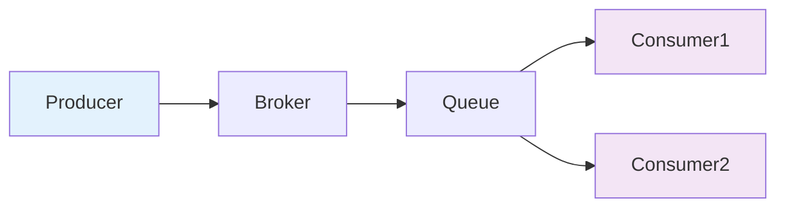

# MQ

## 概要回答

消息队列（MQ）是一种异步通信机制，用于在分布式系统中解耦应用组件、实现异步处理和削峰填谷。主流MQ包括RabbitMQ、Apache Kafka、RocketMQ、Amazon SQS等，它们在可靠性、性能、扩展性等方面各有特点。MQ通过生产者-消费者模式、消息持久化、确认机制等技术确保消息的可靠传递。

## 深度解析

### 1. 消息队列基本概念

#### 1.1 核心组件

消息队列系统主要包含以下几个核心组件：

1. **Producer（生产者）**：负责创建并发送消息到消息队列
2. **Consumer（消费者）**：负责从消息队列接收并处理消息
3. **Broker（代理）**：消息队列服务器，负责存储、转发消息
4. **Queue（队列）**：存储消息的缓冲区
5. **Exchange（交换机）**：在某些MQ中用于路由消息到不同的队列



#### 1.2 消息传递模式

##### 点对点模式（Point-to-Point）
一条消息只能被一个消费者消费：

```php
// 点对点模式示例
class PointToPointExample {
    // 生产者
    public function sendMessage($queueName, $message) {
        $factory = new ActiveMQConnectionFactory("tcp://localhost:61616");
        try {
            $connection = $factory->createConnection();
            $connection->start();
            $session = $connection->createSession(false, Session::AUTO_ACKNOWLEDGE);
            $queue = $session->createQueue($queueName);
            $producer = $session->createProducer($queue);
            
            $textMessage = $session->createTextMessage($message);
            $producer->send($textMessage);
            $connection->close();
        } catch (JMSException $e) {
            $e->printStackTrace();
        }
    }
    
    // 消费者
    public function receiveMessage($queueName) {
        $factory = new ActiveMQConnectionFactory("tcp://localhost:61616");
        try {
            $connection = $factory->createConnection();
            $connection->start();
            $session = $connection->createSession(false, Session::AUTO_ACKNOWLEDGE);
            $queue = $session->createQueue($queueName);
            $consumer = $session->createConsumer($queue);
            
            $message = $consumer->receive(1000);
            if ($message instanceof TextMessage) {
                $textMessage = $message;
                echo "Received: " . $textMessage->getText() . "\n";
            }
            $connection->close();
        } catch (JMSException $e) {
            $e->printStackTrace();
        }
    }
}
```

##### 发布订阅模式（Publish-Subscribe）
一条消息可以被多个消费者消费：

```php
// 发布订阅模式示例
class PubSubExample {
    // 发布者
    public function publishMessage($topicName, $message) {
        $factory = new ActiveMQConnectionFactory("tcp://localhost:61616");
        try {
            $connection = $factory->createConnection();
            $connection->start();
            $session = $connection->createSession(false, Session::AUTO_ACKNOWLEDGE);
            $topic = $session->createTopic($topicName);
            $producer = $session->createProducer($topic);
            
            $textMessage = $session->createTextMessage($message);
            $producer->send($textMessage);
            $connection->close();
        } catch (JMSException $e) {
            $e->printStackTrace();
        }
    }
    
    // 订阅者
    public function subscribeMessage($topicName) {
        $factory = new ActiveMQConnectionFactory("tcp://localhost:61616");
        try {
            $connection = $factory->createConnection();
            $connection->start();
            $session = $connection->createSession(false, Session::AUTO_ACKNOWLEDGE);
            $topic = $session->createTopic($topicName);
            $consumer = $session->createConsumer($topic);
            
            $listener = function($message) {
                try {
                    if ($message instanceof TextMessage) {
                        $textMessage = $message;
                        echo "Received: " . $textMessage->getText() . "\n";
                    }
                } catch (JMSException $e) {
                    $e->printStackTrace();
                }
            };
            
            $consumer->setMessageListener($listener);
            
            // 保持监听
            fopen('php://stdin', 'r');
        } catch (JMSException $e) {
            $e->printStackTrace();
        }
    }
}
```

### 2. 主流消息队列对比

#### 2.1 RabbitMQ

**特点**：
- 基于AMQP协议
- 支持多种消息协议
- 丰富的路由策略
- 管理界面友好
- 集群支持

```php
// RabbitMQ PHP示例
require_once 'vendor/autoload.php';

use PhpAmqpLib\Connection\AMQPStreamConnection;
use PhpAmqpLib\Message\AMQPMessage;

class RabbitMQExample {
    private $connection;
    private $channel;
    
    public function __construct() {
        $this->connection = new AMQPStreamConnection('localhost', 5672, 'guest', 'guest');
        $this->channel = $this->connection->channel();
    }
    
    public function declareQueue($queue_name) {
        // 声明队列
        $this->channel->queue_declare($queue_name, false, true, false, false);
    }
    
    public function sendMessage($queue_name, $message) {
        // 发送消息
        $msg = new AMQPMessage($message, [
            'delivery_mode' => AMQPMessage::DELIVERY_MODE_PERSISTENT
        ]);
        $this->channel->basic_publish($msg, '', $queue_name);
        echo "Sent: $message\n";
    }
    
    public function consumeMessages($queue_name) {
        // 消费消息
        $callback = function($msg) {
            echo "Received: " . $msg->body . "\n";
            $msg->ack();
        };
        
        $this->channel->basic_qos(null, 1, null); // 公平分发
        $this->channel->basic_consume($queue_name, '', false, false, false, false, $callback);
        
        echo "Waiting for messages...\n";
        while ($this->channel->is_consuming()) {
            $this->channel->wait();
        }
    }
    
    public function close() {
        $this->channel->close();
        $this->connection->close();
    }
}

// 使用示例
// $mq = new RabbitMQExample();
// $mq->declareQueue('task_queue');
// 
// // 发送消息
// for ($i = 0; $i < 5; $i++) {
//     $mq->sendMessage('task_queue', 'Task ' . $i);
// }
// 
// // 消费消息（在另一个进程中运行）
// // $mq->consumeMessages('task_queue');
// // $mq->close();
```

#### 2.2 Apache Kafka

**特点**：
- 高吞吐量
- 分布式架构
- 持久化存储
- 水平扩展
- 实时流处理

```php
// Kafka PHP示例
require_once 'vendor/autoload.php';

use RdKafka\Conf;
use RdKafka\Producer;
use RdKafka\Consumer;
use RdKafka\TopicConf;

class KafkaExample {
    private const BOOTSTRAP_SERVERS = "localhost:9092";
    private const TOPIC_NAME = "test-topic";
    
    // 生产者示例
    public static function sendMessage($message) {
        $conf = new Conf();
        $conf->set('metadata.broker.list', self::BOOTSTRAP_SERVERS);
        
        $producer = new Producer($conf);
        $producer->addBrokers(self::BOOTSTRAP_SERVERS);
        
        $topic = $producer->newTopic(self::TOPIC_NAME);
        
        // 确保消息持久化
        $topic->produce(RD_KAFKA_PARTITION_UA, 0, $message);
        
        // 设置重试次数
        for ($i = 0; $i < 3; $i++) {
            try {
                $producer->poll(0);
                echo "Sent message: $message\n";
                break;
            } catch (Exception $e) {
                echo "Error sending message: " . $e->getMessage() . "\n";
                sleep(1);
            }
        }
        
        $producer->flush(1000);
    }
    
    // 消费者示例
    public static function consumeMessages() {
        $conf = new Conf();
        $conf->set('metadata.broker.list', self::BOOTSTRAP_SERVERS);
        $conf->set('group.id', 'test-group');
        $conf->set('auto.offset.reset', 'earliest');
        
        $consumer = new Consumer($conf);
        $consumer->addBrokers(self::BOOTSTRAP_SERVERS);
        
        $topicConf = new TopicConf();
        $topicConf->set('auto.commit.enable', 'false'); // 手动提交offset
        
        $topic = $consumer->newTopic(self::TOPIC_NAME, $topicConf);
        $topic->consumeStart(0, RD_KAFKA_OFFSET_STORED);
        
        try {
            while (true) {
                $message = $topic->consume(0, 1000);
                
                if ($message->err === RD_KAFKA_RESP_ERR_NO_ERROR) {
                    echo sprintf("Consumed message: key=%s, value=%s, partition=%d, offset=%d\n",
                               $message->key, $message->payload, $message->partition, $message->offset);
                    
                    // 处理完消息后手动提交offset
                    $topic->offsetStore($message->partition, $message->offset + 1);
                } elseif ($message->err !== RD_KAFKA_RESP_ERR__PARTITION_EOF) {
                    echo "Error: " . rd_kafka_err2str($message->err) . "\n";
                }
            }
        } catch (Exception $e) {
            echo "Error consuming messages: " . $e->getMessage() . "\n";
        } finally {
            $consumer->close();
        }
    }
}
```

#### 2.3 RocketMQ

**特点**：
- 阿里巴巴开源
- 高可用性
- 顺序消息支持
- 消息过滤
- 事务消息

```php
// RocketMQ PHP示例
require_once 'vendor/autoload.php';

use RocketMQ\Producer;
use RocketMQ\Consumer;
use RocketMQ\Message;
use RocketMQ\SendResult;

class RocketMQExample {
    private const NAMESRV_ADDR = "localhost:9876";
    private const PRODUCER_GROUP = "test-producer-group";
    private const CONSUMER_GROUP = "test-consumer-group";
    private const TOPIC = "TestTopic";
    
    // 生产者示例
    public static function sendMessage($message) {
        try {
            $producer = new Producer(self::PRODUCER_GROUP);
            $producer->setNamesrvAddr(self::NAMESRV_ADDR);
            $producer->start();
            
            $msg = new Message(self::TOPIC, $message);
            
            // 同步发送
            $sendResult = $producer->send($msg);
            echo "Send result: " . $sendResult->getMsgId() . "\n";
            
            $producer->shutdown();
        } catch (Exception $e) {
            echo "Send failed: " . $e->getMessage() . "\n";
        }
    }
    
    // 异步发送
    public static function sendAsyncMessage($message) {
        try {
            $producer = new Producer(self::PRODUCER_GROUP);
            $producer->setNamesrvAddr(self::NAMESRV_ADDR);
            $producer->start();
            
            $msg = new Message(self::TOPIC, $message);
            
            $producer->sendAsync($msg, function($sendResult) {
                echo "Async send success: " . $sendResult->getMsgId() . "\n";
            }, function($exception) {
                echo "Async send failed: " . $exception->getMessage() . "\n";
            });
        } catch (Exception $e) {
            echo "Async send setup failed: " . $e->getMessage() . "\n";
        }
    }
    
    // 消费者示例
    public static function consumeMessages() {
        try {
            $consumer = new Consumer(self::CONSUMER_GROUP);
            $consumer->setNamesrvAddr(self::NAMESRV_ADDR);
            $consumer->subscribe(self::TOPIC, "*");
            
            $consumer->registerMessageListener(function($msgs) {
                foreach ($msgs as $msg) {
                    try {
                        $message = $msg->getBody();
                        echo "Received message: " . $message . "\n";
                        
                        // 模拟处理时间
                        sleep(1);
                        
                        return Consumer::CONSUME_SUCCESS;
                    } catch (Exception $e) {
                        echo "Error processing message: " . $e->getMessage() . "\n";
                        return Consumer::RECONSUME_LATER;
                    }
                }
                return Consumer::CONSUME_SUCCESS;
            });
            
            $consumer->start();
            echo "Consumer started...\n";
            
            // 保持运行
            while (true) {
                sleep(1);
            }
        } catch (Exception $e) {
            echo "Consumer error: " . $e->getMessage() . "\n";
        }
    }
}
```

### 3. 消息队列核心机制

#### 3.1 消息持久化

```php
// 消息持久化示例
class MessagePersistence {
    // RabbitMQ持久化配置
    public function configureRabbitMQPersistence($channel) {
        // 1. 队列持久化
        $durable = true;
        $channel->queue_declare("persistent_queue", $durable, false, false, null);
        
        // 2. 交换机持久化
        $channel->exchange_declare("persistent_exchange", "direct", $durable);
        
        // 3. 消息持久化
        $properties = [
            'delivery_mode' => 2  // 2表示持久化
        ];
        $msg = new AMQPMessage("Hello World!", $properties);
        $channel->basic_publish($msg, "", "persistent_queue");
    }
    
    // Kafka持久化配置
    public function configureKafkaPersistence() {
        $conf = new RdKafka\Conf();
        // 等待所有副本确认
        $conf->set("acks", "all");
        // 失败时重试
        $conf->set("retries", 3);
        // 批量发送大小
        $conf->set("batch.size", 16384);
        // 异步刷盘间隔
        $conf->set("linger.ms", 1);
        // 发送缓冲区大小
        $conf->set("buffer.memory", 33554432);
        
        return $conf;
    }
}
```
#### 3.2 消息确认机制

```php
// 消息确认机制示例
class MessageAcknowledgment {
    // RabbitMQ手动确认
    public function manualAckExample() {
        try {
            $channel = $this->createChannel();
            $channel->basic_qos(null, 1, null); // 每次只处理一条消息
            
            $callback = function($msg) use ($channel) {
                $message = $msg->body;
                echo "Received: " . $message . "\n";
                
                try {
                    // 模拟处理消息
                    $this->processMessage($message);
                    // 手动确认消息
                    $channel->basic_ack($msg->delivery_info['delivery_tag']);
                    echo "Message acknowledged\n";
                } catch (Exception $e) {
                    // 拒绝消息并重新入队
                    $channel->basic_nack($msg->delivery_info['delivery_tag'], false, true);
                    echo "Message rejected and requeued\n";
                }
            };
            
            $channel->basic_consume('task_queue', '', false, false, false, false, $callback);
            
            // 等待消息
            while ($channel->is_consuming()) {
                $channel->wait();
            }
        } catch (Exception $e) {
            echo "Error: " . $e->getMessage() . "\n";
        }
    }
    
    // Kafka手动提交offset
    public function manualOffsetCommit() {
        $conf = new RdKafka\Conf();
        $conf->set('enable.auto.commit', 'false'); // 关闭自动提交
        
        $consumer = new RdKafka\KafkaConsumer($conf);
        
        try {
            while (true) {
                $message = $consumer->consume(1000);
                if ($message->err === RD_KAFKA_RESP_ERR_NO_ERROR) {
                    try {
                        // 处理消息
                        $this->processMessage($message->payload);
                        
                        // 手动提交offset
                        $consumer->commitAsync($message);
                    } catch (Exception $e) {
                        // 处理失败，可以选择不提交offset，下次重新消费
                        echo "Message processing failed: " . $e->getMessage() . "\n";
                    }
                }
            }
        } catch (Exception $e) {
            echo "Consumer error: " . $e->getMessage() . "\n";
        } finally {
            $consumer->close();
        }
    }
    
    private function processMessage($message) {
        // 模拟消息处理
        echo "Processing message: " . $message . "\n";
        sleep(2); // 模拟处理时间
    }
}
```

#### 3.3 死信队列

```php
// 死信队列示例（RabbitMQ）
class DeadLetterQueue {
    public function setupDeadLetterQueue($channel) {
        // 1. 声明死信交换机和队列
        $channel->exchange_declare("dlx_exchange", "direct", true);
        $channel->queue_declare("dlx_queue", true, false, false, null);
        $channel->queue_bind("dlx_queue", "dlx_exchange", "dlx_routing_key");
        
        // 2. 声明普通队列，设置死信交换机
        $args = [
            "x-dead-letter-exchange" => "dlx_exchange",
            "x-dead-letter-routing-key" => "dlx_routing_key",
            "x-message-ttl" => 60000 // 消息过期时间1分钟
        ];
        
        $channel->queue_declare("normal_queue", true, false, false, false, false, $args);
        
        // 3. 发送消息
        $message = "Test message";
        $properties = [
            'expiration' => '60000' // 设置消息过期时间
        ];
        $msg = new AMQPMessage($message, $properties);
        $channel->basic_publish($msg, "", "normal_queue");
    }
    
    // 处理死信消息
    public function consumeDeadLetterMessages($channel) {
        $callback = function($msg) use ($channel) {
            $message = $msg->body;
            echo "Dead letter message received: " . $message . "\n";
            
            // 处理死信消息（记录日志、报警、人工处理等）
            $this->handleDeadLetterMessage($message);
            
            // 确认消息
            $channel->basic_ack($msg->delivery_info['delivery_tag']);
        };
        
        $channel->basic_consume("dlx_queue", "", false, false, false, false, $callback);
        
        // 等待消息
        while ($channel->is_consuming()) {
            $channel->wait();
        }
    }
    
    private function handleDeadLetterMessage($message) {
        // 记录死信消息到数据库或日志
        error_log("Handling dead letter message: " . $message);
        // 可以发送告警邮件、记录到监控系统等
    }
}
```### 4. 消息队列应用场景

#### 4.1 异步处理

```php
// 订单处理异步化示例
class OrderController {
    private $rabbitMQ;
    
    public function __construct($rabbitMQ) {
        $this->rabbitMQ = $rabbitMQ;
    }
    
    public function createOrder($request) {
        // 1. 快速响应用户
        $orderId = $this->generateOrderId();
        
        // 2. 异步处理订单
        $orderEvent = new OrderEvent($orderId, $request);
        $this->rabbitMQ->publish("order.exchange", "order.created", json_encode($orderEvent));
        
        return ["status" => "success", "message" => "Order created: " . $orderId];
    }
    
    private function generateOrderId() {
        return uniqid("order_", true);
    }
}

class OrderEventHandler {
    private $inventoryService;
    private $paymentService;
    private $emailService;
    private $logService;
    
    public function __construct($inventoryService, $paymentService, $emailService, $logService) {
        $this->inventoryService = $inventoryService;
        $this->paymentService = $paymentService;
        $this->emailService = $emailService;
        $this->logService = $logService;
    }
    
    // 处理订单创建事件
    public function handleOrderCreated($message) {
        $event = json_decode($message->body, true);
        
        try {
            // 1. 扣减库存
            $this->inventoryService->deductStock($event['productId'], $event['quantity']);
            
            // 2. 处理支付
            $this->paymentService->processPayment($event['orderId'], $event['amount']);
            
            // 3. 发送确认邮件
            $this->emailService->sendOrderConfirmation($event['orderDetails']);
            
            // 4. 记录日志
            $this->logService->recordOrderProcessed($event['orderId']);
            
            // 确认消息
            $message->ack();
        } catch (Exception $e) {
            // 处理失败，发送到死信队列或重试队列
            $this->handleError($event, $e);
            $message->nack(false, true); // 拒绝消息并重新入队
        }
    }
}
```#### 4.2 应用解耦

```php
// 用户注册解耦示例
class UserService {
    private $rabbitMQ;
    
    public function __construct($rabbitMQ) {
        $this->rabbitMQ = $rabbitMQ;
    }
    
    public function registerUser($request) {
        // 1. 创建用户账户
        $user = $this->createUserAccount($request);
        
        // 2. 发布用户注册事件
        $event = new UserRegisteredEvent($user->getId(), $user->getEmail());
        $this->rabbitMQ->publish("user.exchange", "user.registered", json_encode($event));
        
        // 3. 立即返回成功响应
        return ["status" => "success", "user_id" => $user->getId()];
    }
    
    private function createUserAccount($request) {
        // 创建用户账户的逻辑
        // 返回User对象
    }
}

// 不同的服务监听用户注册事件
class EmailService {
    public function handleUserRegistered($message) {
        $event = json_decode($message->body, true);
        // 发送欢迎邮件
        $this->sendWelcomeEmail($event['email']);
        
        // 确认消息
        $message->ack();
    }
    
    private function sendWelcomeEmail($email) {
        // 发送邮件的逻辑
    }
}

class AnalyticsService {
    public function handleUserRegistered($message) {
        $event = json_decode($message->body, true);
        // 记录用户注册统计数据
        $this->recordUserRegistration($event['userId']);
        
        // 确认消息
        $message->ack();
    }
    
    private function recordUserRegistration($userId) {
        // 记录用户注册统计数据的逻辑
    }
}

class CrmService {
    public function handleUserRegistered($message) {
        $event = json_decode($message->body, true);
        // 同步到CRM系统
        $this->syncToCRM($event['userId']);
        
        // 确认消息
        $message->ack();
    }
    
    private function syncToCRM($userId) {
        // 同步到CRM系统的逻辑
    }
}
```

#### 4.3 削峰填谷

```php
// 秒杀系统削峰填谷示例
class SeckillController {
    private $redis;
    private $rabbitMQ;
    
    public function __construct($redis, $rabbitMQ) {
        $this->redis = $redis;
        $this->rabbitMQ = $rabbitMQ;
    }
    
    public function seckill($productId, $userId) {
        // 1. 检查库存（使用Redis原子操作）
        $stockKey = "stock:" . $productId;
        $stock = $this->redis->decr($stockKey);
        
        if ($stock < 0) {
            // 库存不足
            $this->redis->incr($stockKey); // 恢复库存
            return ["status" => "error", "message" => "Out of stock"];
        }
        
        // 2. 创建秒杀订单事件
        $event = new SeckillOrderEvent($productId, $userId, time());
        
        // 3. 发送到消息队列进行异步处理
        $this->rabbitMQ->publish("seckill.exchange", "seckill.order", json_encode($event));
        
        // 4. 立即返回响应
        return ["status" => "success", "message" => "Seckill order submitted"];
    }
}

class SeckillOrderProcessor {
    private $orderService;
    private $paymentService;
    private $notificationService;
    private $logger;
    
    public function __construct($orderService, $paymentService, $notificationService, $logger) {
        $this->orderService = $orderService;
        $this->paymentService = $paymentService;
        $this->notificationService = $notificationService;
        $this->logger = $logger;
    }
    
    public function processSeckillOrder($message) {
        $event = json_decode($message->body, true);
        
        try {
            // 1. 创建订单记录
            $order = $this->orderService->createOrder($event['productId'], $event['userId']);
            
            // 2. 处理支付
            $this->paymentService->processPayment($order);
            
            // 3. 发送确认通知
            $this->notificationService->sendSeckillSuccessNotification($event['userId'], $order);
            
            // 确认消息
            $message->ack();
        } catch (Exception $e) {
            // 处理失败，记录日志并可能需要人工干预
            $this->logger->error("Failed to process seckill order: " . json_encode($event), ['exception' => $e]);
            $message->nack(false, true); // 拒绝消息并重新入队
        }
    }
}
```

## 总结

消息队列是构建高可用、高并发分布式系统的重要组件，具有以下核心价值：

1. **解耦应用组件**：通过异步通信降低系统组件间的耦合度
2. **异步处理**：提高系统响应速度和用户体验
3. **削峰填谷**：平滑处理突发流量，保护后端服务
4. **可靠性保证**：通过持久化、确认机制确保消息不丢失
5. **扩展性支持**：支持水平扩展和负载均衡

选择合适的消息队列需要考虑以下因素：
- **性能要求**：吞吐量、延迟要求
- **可靠性要求**：消息不丢失、顺序保证
- **扩展性需求**：集群支持、水平扩展能力
- **生态系统**：客户端支持、监控工具
- **运维复杂度**：部署、维护成本

在实际应用中，应根据具体业务场景选择合适的消息队列产品，并合理设计消息模型和处理流程。