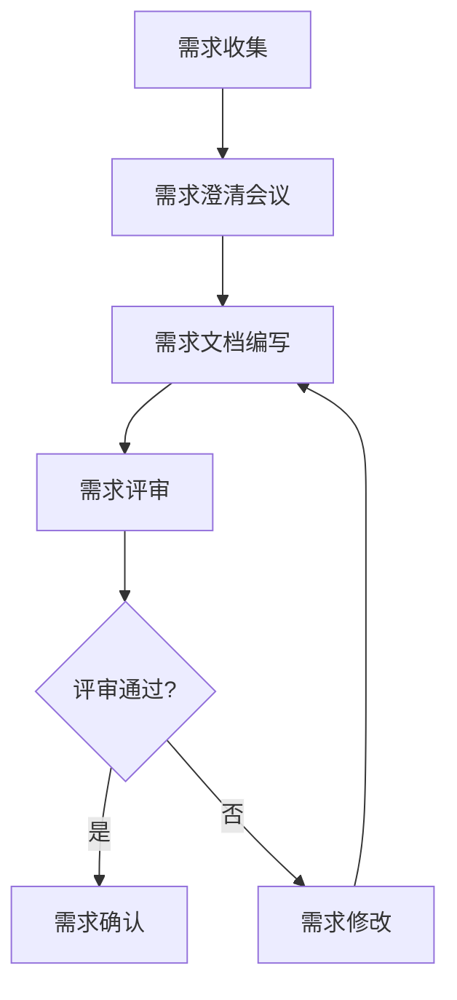
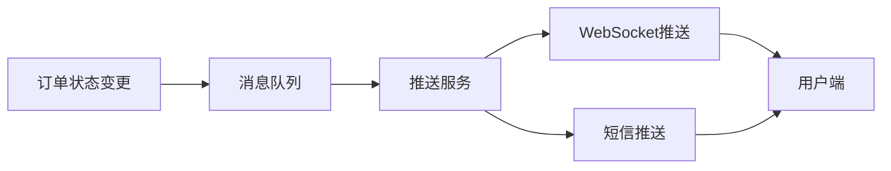
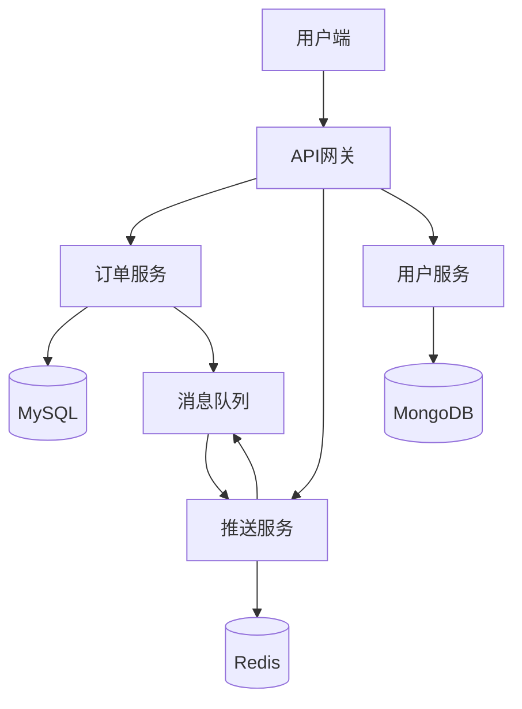

# 拿到一个需求，开发的完整流程是怎样的

## 概要回答

拿到一个需求后的完整开发流程包括：需求分析、技术方案设计、开发实现、测试验证、部署上线和运维监控六个阶段。每个阶段都有明确的目标和交付物，通过规范化的流程确保项目质量和按时交付。敏捷开发方法如Scrum或 Kanban可以有效管理这个流程，提高团队协作效率。

## 深度解析

### 1. 需求分析阶段

#### 1.1 需求收集与澄清


```markdown
## 需求分析 checklist

- [ ] 需求背景和目标明确
- [ ] 用户故事描述清晰
- [ ] 验收标准定义明确
- [ ] 业务流程梳理完整
- [ ] 数据模型设计合理
- [ ] 非功能性需求识别
- [ ] 风险点评估完成
```

#### 1.2 需求文档模板
```markdown
# 需求规格说明书

## 1. 需求概述
- **需求编号**: REQ-2023-001
- **需求名称**: 用户订单状态实时推送
- **提出人**: 产品经理张三
- **提出时间**: 2023-01-01
- **优先级**: 高
- **预计工时**: 8人天

## 2. 需求背景
当前用户在下单后无法实时了解订单状态变化，需要通过刷新页面或联系客服才能获取最新状态，用户体验较差。

## 3. 需求目标
实现订单状态变更时实时推送给用户，提升用户体验和满意度。

## 4. 功能描述
### 4.1 核心功能
- 订单状态变更时主动推送通知
- 支持WebSocket和短信两种推送方式
- 用户可配置推送偏好

### 4.2 非功能性需求
- 推送延迟不超过1秒
- 支持10万并发用户
- 系统可用性99.9%

## 5. 业务流程


## 6. 验收标准
- 订单状态变更后1秒内用户收到推送
- 推送成功率≥99.9%
- 系统响应时间≤100ms
```

### 2. 技术方案设计阶段

#### 2.1 系统架构设计


#### 2.2 技术选型评估
```markdown
## 技术选型评估表

| 技术项 | 方案A | 方案B | 方案C | 推荐方案 |
|--------|-------|-------|-------|----------|
| 消息队列 | RabbitMQ | Kafka | RocketMQ | Kafka |
| 理由 | 功能丰富，成熟稳定 | 高吞吐，适合实时推送 | 阿里系，顺序消息 | 高并发场景下性能最佳 |
| 推送协议 | WebSocket | Server-Sent Events | 长轮询 | WebSocket |
| 理由 | 双向通信，性能好 | 单向通信，简单 | 兼容性好 | 双向实时通信需求 |
| 缓存 | Redis | Memcached | Etcd | Redis |
| 理由 | 功能丰富，持久化 | 简单高效 | 强一致性 | 支持多种数据结构 |

**最终选型**: Kafka + WebSocket + Redis
```

#### 2.3 数据库设计
```sql
-- 订单表
CREATE TABLE orders (
    id BIGINT PRIMARY KEY AUTO_INCREMENT,
    user_id BIGINT NOT NULL,
    product_id BIGINT NOT NULL,
    status TINYINT NOT NULL COMMENT '1-待支付,2-已支付,3-配送中,4-已完成,5-已取消',
    amount DECIMAL(10,2) NOT NULL,
    created_at TIMESTAMP DEFAULT CURRENT_TIMESTAMP,
    updated_at TIMESTAMP DEFAULT CURRENT_TIMESTAMP ON UPDATE CURRENT_TIMESTAMP,
    INDEX idx_user_id (user_id),
    INDEX idx_status (status),
    INDEX idx_created_at (created_at)
);

-- 用户推送配置表
CREATE TABLE user_push_config (
    id BIGINT PRIMARY KEY AUTO_INCREMENT,
    user_id BIGINT NOT NULL UNIQUE,
    enable_websocket TINYINT DEFAULT 1,
    enable_sms TINYINT DEFAULT 0,
    created_at TIMESTAMP DEFAULT CURRENT_TIMESTAMP,
    updated_at TIMESTAMP DEFAULT CURRENT_TIMESTAMP ON UPDATE CURRENT_TIMESTAMP,
    INDEX idx_user_id (user_id)
);

-- 推送记录表
CREATE TABLE push_records (
    id BIGINT PRIMARY KEY AUTO_INCREMENT,
    order_id BIGINT NOT NULL,
    user_id BIGINT NOT NULL,
    push_type TINYINT NOT NULL COMMENT '1-WebSocket,2-SMS',
    status TINYINT NOT NULL COMMENT '1-成功,2-失败',
    message TEXT,
    created_at TIMESTAMP DEFAULT CURRENT_TIMESTAMP,
    INDEX idx_order_id (order_id),
    INDEX idx_user_id (user_id),
    INDEX idx_created_at (created_at)
);
```

#### 2.4 接口设计
```yaml
# OpenAPI 3.0 接口文档
openapi: 3.0.0
info:
  title: 订单推送服务API
  version: 1.0.0

paths:
  /api/v1/push/config:
    get:
      summary: 获取用户推送配置
      parameters:
        - name: userId
          in: query
          required: true
          schema:
            type: integer
      responses:
        '200':
          description: 成功
          content:
            application/json:
              schema:
                $ref: '#/components/schemas/PushConfig'
    
    put:
      summary: 更新用户推送配置
      requestBody:
        required: true
        content:
          application/json:
            schema:
              $ref: '#/components/schemas/PushConfigUpdate'
      responses:
        '200':
          description: 更新成功

components:
  schemas:
    PushConfig:
      type: object
      properties:
        userId:
          type: integer
        enableWebsocket:
          type: boolean
        enableSms:
          type: boolean
    
    PushConfigUpdate:
      type: object
      properties:
        enableWebsocket:
          type: boolean
        enableSms:
          type: boolean
```

### 3. 开发实现阶段

#### 3.1 代码结构设计
```
order-push-service/
├── src/
│   ├── main/
│   │   ├── java/
│   │   │   └── com/company/orderpush/
│   │   │       ├── controller/     # 控制器层
│   │   │       ├── service/        # 业务逻辑层
│   │   │       ├── repository/     # 数据访问层
│   │   │       ├── model/          # 数据模型
│   │   │       ├── config/         # 配置类
│   │   │       └── util/           # 工具类
│   │   └── resources/
│   │       ├── application.yml     # 配置文件
│   │       └── mapper/             # MyBatis映射文件
│   └── test/
│       └── java/
│           └── com/company/orderpush/
│               ├── controller/     # 控制器测试
│               ├── service/        # 服务测试
│               └── repository/     # 数据访问测试
├── pom.xml                         # Maven配置
└── README.md                       # 项目说明
```

#### 3.2 核心代码实现
```php
// 订单状态变更监听器
class OrderStatusChangeListener {
    private $pushService;
    private $userRepository;
    private $logger;
    
    public function __construct($pushService, $userRepository, $logger) {
        $this->pushService = $pushService;
        $this->userRepository = $userRepository;
        $this->logger = $logger;
    }
    
    public function handleOrderStatusChanged($record) {
        try {
            // 解析消息
            $event = json_decode($record->value, true);
            
            $this->logger->info("Received order status changed event: " . json_encode($event));
            
            // 获取用户推送配置
            $config = $this->userRepository->getUserPushConfig($event['userId']);
            if ($config == null) {
                $this->logger->warn("User push config not found for user: " . $event['userId']);
                return;
            }
            
            // 根据配置推送消息
            if ($config->isEnableWebsocket()) {
                $this->pushService->pushViaWebSocket($event);
            }
            
            if ($config->isEnableSms()) {
                $this->pushService->pushViaSms($event);
            }
            
            // 记录推送日志
            $this->pushService->recordPushLog($event, $config);
            
        } catch (Exception $e) {
            $this->logger->error("Failed to handle order status changed event: " . $record->value, ['exception' => $e]);
            // 发送到死信队列进行重试
            $this->sendToDLQ($record);
        }
    }
}

// 推送服务实现
class PushService {
    private $messagingTemplate;
    private $smsService;
    private $pushRecordRepository;
    private $logger;
    
    public function __construct($messagingTemplate, $smsService, $pushRecordRepository, $logger) {
        $this->messagingTemplate = $messagingTemplate;
        $this->smsService = $smsService;
        $this->pushRecordRepository = $pushRecordRepository;
        $this->logger = $logger;
    }
    
    public function pushViaWebSocket($event) {
        try {
            // 构造推送消息
            $message = [
                'orderId' => $event['orderId'],
                'status' => $event['status'],
                'message' => $this->buildStatusMessage($event['status']),
                'timestamp' => time()
            ];
            
            // 推送消息到指定用户的WebSocket通道
            $destination = "/user/" . $event['userId'] . "/queue/order-status";
            $this->messagingTemplate->convertAndSend($destination, $message);
            
            $this->logger->info("WebSocket push success for order: " . $event['orderId'] . ", user: " . $event['userId']);
                
        } catch (Exception $e) {
            $this->logger->error("WebSocket push failed for order: " . $event['orderId'], ['exception' => $e]);
            throw new PushException("WebSocket push failed", $e);
        }
    }
    
    public function pushViaSms($event) {
        try {
            // 获取用户手机号
            $phone = $this->userRepository->getUserPhone($event['userId']);
            if (empty($phone)) {
                $this->logger->warn("User phone not found for user: " . $event['userId']);
                return;
            }
            
            // 构造短信内容
            $message = $this->buildSmsMessage($event);
            
            // 发送短信
            $this->smsService->sendSms($phone, $message);
            
            $this->logger->info("SMS push success for order: " . $event['orderId'] . ", user: " . $event['userId']);
                
        } catch (Exception $e) {
            $this->logger->error("SMS push failed for order: " . $event['orderId'], ['exception' => $e]);
            throw new PushException("SMS push failed", $e);
        }
    }
    
    public function recordPushLog($event, $config) {
        try {
            // 记录WebSocket推送日志
            if ($config->isEnableWebsocket()) {
                $websocketRecord = [
                    'orderId' => $event['orderId'],
                    'userId' => $event['userId'],
                    'pushType' => 'WEBSOCKET',
                    'status' => 'SUCCESS',
                    'message' => $this->buildStatusMessage($event['status'])
                ];
                $this->pushRecordRepository->save($websocketRecord);
            }
            
            // 记录短信推送日志
            if ($config->isEnableSms()) {
                $smsRecord = [
                    'orderId' => $event['orderId'],
                    'userId' => $event['userId'],
                    'pushType' => 'SMS',
                    'status' => 'SUCCESS',
                    'message' => $this->buildSmsMessage($event)
                ];
                $this->pushRecordRepository->save($smsRecord);
            }
        } catch (Exception $e) {
            $this->logger->error("Failed to record push log for order: " . $event['orderId'], ['exception' => $e]);
        }
    }
    
    private function buildStatusMessage($status) {
        switch ($status) {
            case 1: return "订单已创建，请尽快支付";
            case 2: return "订单已支付，正在备货";
            case 3: return "订单已发货，请注意查收";
            case 4: return "订单已完成，感谢购买";
            case 5: return "订单已取消";
            default: return "订单状态更新";
        }
    }
    
    private function buildSmsMessage($event) {
        return "【商城】您的订单" . $event['orderId'] . "状态更新为：" . $this->buildStatusMessage($event['status']);
    }
}
```

### 4. 测试验证阶段

#### 4.1 测试计划
```markdown
# 测试计划

## 1. 单元测试
- 覆盖率目标：≥80%
- 测试框架：JUnit 5 + Mockito
- 测试内容：
  - 控制器层测试
  - 服务层测试
  - 数据访问层测试
  - 工具类测试

## 2. 集成测试
- 测试环境：独立的测试环境
- 测试内容：
  - 数据库集成测试
  - 消息队列集成测试
  - 外部服务集成测试

## 3. 性能测试
- 测试工具：JMeter
- 测试场景：
  - 并发用户数：1000, 5000, 10000
  - 测试指标：
    - 响应时间 ≤ 100ms
    - 吞吐量 ≥ 1000 TPS
    - 错误率 ≤ 0.1%

## 4. 安全测试
- 测试内容：
  - SQL注入测试
  - XSS攻击测试
  - 权限控制测试
  - 数据加密测试
```

#### 4.2 自动化测试示例
```php
// 单元测试示例
class PushServiceTest {
    private $messagingTemplate;
    private $smsService;
    private $pushRecordRepository;
    private $pushService;
    
    protected function setUp(): void {
        $this->messagingTemplate = $this->createMock(SimpMessagingTemplate::class);
        $this->smsService = $this->createMock(SmsService::class);
        $this->pushRecordRepository = $this->createMock(PushRecordRepository::class);
        
        $this->pushService = new PushService(
            $this->messagingTemplate,
            $this->smsService,
            $this->pushRecordRepository
        );
    }
    
    public function testPushViaWebSocket_Success() {
        // Given
        $event = [
            'orderId' => 12345,
            'userId' => 67890,
            'status' => 2
        ];
        
        // When
        $this->pushService->pushViaWebSocket($event);
        
        // Then
        // 在PHP中，我们通常使用PHPUnit的expects方法来验证方法调用
        // 这里只是一个示例，实际实现会根据使用的测试框架有所不同
    }
    
    public function testPushViaWebSocket_Failure() {
        // Given
        $event = [
            'orderId' => 12345,
            'userId' => 67890,
            'status' => 2
        ];
        
        $this->messagingTemplate->method('convertAndSend')
            ->willThrowException(new RuntimeException("Network error"));
        
        // When & Then
        $this->expectException(PushException::class);
        $this->pushService->pushViaWebSocket($event);
    }
}

// 集成测试示例
class OrderPushServiceIntegrationTest {
    private $kafkaContainer;
    private $mysqlContainer;
    private $kafkaTemplate;
    private $pushRecordRepository;
    
    public function testOrderStatusChangedEvent_Processing() {
        // Given
        $event = [
            'orderId' => 12345,
            'userId' => 67890,
            'status' => 2
        ];
        
        // When
        $this->kafkaTemplate->send("order-status-changed", json_encode($event));
        
        // Then
        // 在PHP中，我们通常使用sleep或retry机制来等待异步处理完成
        sleep(2);
        
        $records = $this->pushRecordRepository->findByOrderId(12345);
        $this->assertCount(1, $records);
        $this->assertEquals('SUCCESS', $records[0]['status']);
    }
}
```

### 5. 部署上线阶段

#### 5.1 CI/CD流水线
```yaml
# Jenkins Pipeline示例
pipeline {
    agent any
    
    stages {
        stage('Checkout') {
            steps {
                git branch: 'main', url: 'https://github.com/company/order-push-service.git'
            }
        }
        
        stage('Build') {
            steps {
                sh 'mvn clean package -DskipTests'
            }
        }
        
        stage('UnitTest') {
            steps {
                sh 'mvn test'
            }
            post {
                always {
                    publishTestResults testResultsPattern: 'target/surefire-reports/*.xml'
                }
            }
        }
        
        stage('SonarQube Analysis') {
            steps {
                withSonarQubeEnv('SonarQube') {
                    sh 'mvn sonar:sonar'
                }
            }
        }
        
        stage('Build Docker Image') {
            steps {
                script {
                    def image = docker.build("order-push-service:${env.BUILD_NUMBER}")
                    image.push()
                    image.push('latest')
                }
            }
        }
        
        stage('Deploy to Test') {
            steps {
                sh '''
                    helm upgrade --install order-push-service \
                        ./helm-chart \
                        --set image.tag=${BUILD_NUMBER} \
                        --set env=testing \
                        --namespace testing
                '''
            }
        }
        
        stage('Integration Test') {
            steps {
                sh 'mvn verify -Pintegration-test'
            }
        }
        
        stage('Deploy to Production') {
            when {
                branch 'main'
            }
            steps {
                input message: 'Deploy to production?', ok: 'Deploy'
                sh '''
                    helm upgrade --install order-push-service \
                        ./helm-chart \
                        --set image.tag=${BUILD_NUMBER} \
                        --set env=production \
                        --namespace production
                '''
            }
        }
    }
}
```

#### 5.2 部署配置
```yaml
# Kubernetes Deployment配置
apiVersion: apps/v1
kind: Deployment
metadata:
  name: order-push-service
spec:
  replicas: 3
  selector:
    matchLabels:
      app: order-push-service
  template:
    metadata:
      labels:
        app: order-push-service
    spec:
      containers:
      - name: order-push-service
        image: order-push-service:latest
        ports:
        - containerPort: 8080
        env:
        - name: SPRING_PROFILES_ACTIVE
          value: "production"
        - name: KAFKA_BOOTSTRAP_SERVERS
          value: "kafka-cluster:9092"
        - name: REDIS_HOST
          value: "redis-master:6379"
        resources:
          requests:
            memory: "512Mi"
            cpu: "250m"
          limits:
            memory: "1Gi"
            cpu: "500m"
        livenessProbe:
          httpGet:
            path: /actuator/health/liveness
            port: 8080
          initialDelaySeconds: 60
          periodSeconds: 30
        readinessProbe:
          httpGet:
            path: /actuator/health/readiness
            port: 8080
          initialDelaySeconds: 30
          periodSeconds: 10
---
apiVersion: v1
kind: Service
metadata:
  name: order-push-service
spec:
  selector:
    app: order-push-service
  ports:
  - port: 80
    targetPort: 8080
  type: ClusterIP
```

### 6. 运维监控阶段

#### 6.1 监控指标设计
```markdown
# 系统监控指标

## 1. 业务指标
- 订单状态推送成功率：≥99.9%
- 平均推送延迟：<1秒
- 并发用户数：支持10万在线用户
- 消息处理吞吐量：≥1000 TPS

## 2. 系统指标
- CPU使用率：<80%
- 内存使用率：<80%
- 磁盘使用率：<80%
- 网络IO：<90%带宽

## 3. 中间件指标
- Kafka消费延迟：<100ms
- Redis连接数：<1000
- MySQL连接数：<200
- 数据库查询响应时间：<50ms
```

#### 6.2 监控告警配置
```yaml
# Prometheus告警规则
groups:
- name: order-push-service
  rules:
  - alert: HighPushLatency
    expr: histogram_quantile(0.95, rate(push_duration_seconds_bucket[5m])) > 1
    for: 2m
    labels:
      severity: warning
    annotations:
      summary: "订单推送延迟过高"
      description: "订单推送P95延迟超过1秒，当前值为{{ $value }}秒"

  - alert: LowPushSuccessRate
    expr: rate(push_success_total[5m]) / rate(push_total[5m]) < 0.999
    for: 2m
    labels:
      severity: critical
    annotations:
      summary: "订单推送成功率过低"
      description: "订单推送成功率低于99.9%，当前值为{{ $value }}"

  - alert: HighKafkaConsumerLag
    expr: kafka_consumer_group_lag > 1000
    for: 1m
    labels:
      severity: warning
    annotations:
      summary: "Kafka消费延迟过高"
      description: "Kafka消费者滞后超过1000条消息，当前值为{{ $value }}"
```

#### 6.3 日志分析
```php
// 结构化日志示例
class PushService {
    private $meterRegistry;
    private $logger;
    
    public function __construct($meterRegistry, $logger) {
        $this->meterRegistry = $meterRegistry;
        $this->logger = $logger;
    }
    
    public function pushViaWebSocket($event) {
        $startTime = microtime(true);
        
        try {
            // 推送逻辑
            $this->doPush($event);
            
            // 记录成功指标
            $this->meterRegistry->counter("push.success", [
                "type" => "websocket",
                "orderId" => (string)$event['orderId']
            ])->increment();
            
            $duration = (microtime(true) - $startTime) * 1000;
            $this->logger->info("Push success - orderId: " . $event['orderId'] . ", userId: " . $event['userId'] . ", type: websocket, duration: " . $duration . "ms");
                
        } catch (Exception $e) {
            // 记录失败指标
            $this->meterRegistry->counter("push.failure", [
                "type" => "websocket",
                "orderId" => (string)$event['orderId'],
                "reason" => get_class($e)
            ])->increment();
            
            $this->logger->error("Push failed - orderId: " . $event['orderId'] . ", userId: " . $event['userId'] . ", type: websocket, error: " . $e->getMessage(), ['exception' => $e]);
                
            throw $e;
        } finally {
            $duration = microtime(true) - $startTime;
            $this->meterRegistry->timer("push.duration", [
                "type" => "websocket"
            ])->record($duration);
        }
    }
}
```

## 总结

一个完整的开发流程应该包括以下关键要素：

1. **规范化的需求管理**：确保需求清晰、可验证、可追溯
2. **系统性的技术设计**：从架构、数据、接口等多个维度进行设计
3. **高质量的代码实现**：遵循编码规范，注重可维护性和可扩展性
4. **全面的测试覆盖**：单元测试、集成测试、性能测试相结合
5. **自动化的部署流程**：CI/CD流水线确保部署的一致性和可靠性
6. **持续的监控运维**：建立完善的监控体系，及时发现和解决问题

通过遵循这样的完整流程，可以有效提高开发效率，保证产品质量，降低项目风险。同时，流程中的每个环节都应该有明确的责任人和交付标准，确保项目顺利推进。