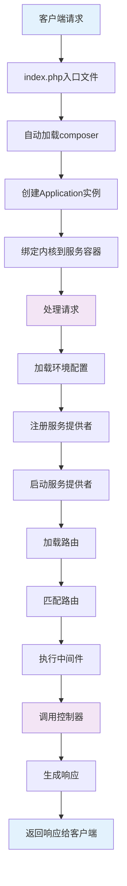

# Laravel框架每次请求的生命周期，框架本身用到哪些设计模式

## 概要回答

Laravel框架的请求生命周期从入口文件index.php开始，经过引导、路由、中间件、控制器处理、响应返回等阶段。框架广泛使用了服务容器、门面、中间件、策略、事件、队列等多种设计模式，实现了高度解耦、可扩展的架构设计。理解Laravel的生命周期和设计模式有助于更好地使用框架和进行框架源码分析。

## 深度解析

### 1. Laravel请求生命周期

#### 1.1 整体流程图



#### 1.2 详细生命周期阶段

##### 阶段1：入口文件处理
```php
// public/index.php - Laravel入口文件
<?php

use Illuminate\Contracts\Http\Kernel;
use Illuminate\Http\Request;

// 1. 自动加载Composer依赖
require __DIR__.'/../vendor/autoload.php';

// 2. 创建应用实例
$app = require_once __DIR__.'/../bootstrap/app.php';

// 3. 创建HTTP内核实例
$kernel = $app->make(Kernel::class);

// 4. 处理请求并发送响应
$response = $kernel->handle(
    $request = Request::capture()
);
$response->send();

// 5. 终止应用
$kernel->terminate($request, $response);
```

##### 阶段2：应用实例创建
```php
// bootstrap/app.php - 应用实例创建
<?php

// 1. 创建应用容器实例
$app = new Illuminate\Foundation\Application(
    $_ENV['APP_BASE_PATH'] ?? dirname(__DIR__)
);

// 2. 绑定重要的接口实现
$app->singleton(
    Illuminate\Contracts\Http\Kernel::class,
    App\Http\Kernel::class
);

$app->singleton(
    Illuminate\Contracts\Console\Kernel::class,
    App\Console\Kernel::class
);

$app->singleton(
    Illuminate\Contracts\Debug\ExceptionHandler::class,
    App\Exceptions\Handler::class
);

return $app;
```

##### 阶段3：内核处理请求
```php
// Illuminate\Foundation\Http\Kernel - HTTP内核
class Kernel implements HttpKernelInterface
{
    public function handle($request)
    {
        try {
            // 1. 发送请求处理开始事件
            $this->app['events']->dispatch(
                new RequestHandled($request, $response)
            );
            
            // 2. 发送请求到应用程序
            $response = $this->sendRequestThroughRouter($request);
        } catch (Exception $e) {
            $this->reportException($e);
            $response = $this->renderException($request, $e);
        }
        
        // 3. 触发请求处理完成事件
        $this->app['events']->dispatch(
            new RequestHandled($request, $response)
        );
        
        return $response;
    }
    
    protected function sendRequestThroughRouter($request)
    {
        // 将请求实例绑定到容器
        $this->app->instance('request', $request);
        
        // 通过中间件发送请求
        return (new Pipeline($this->app))
                    ->send($request)
                    ->through($this->app->shouldSkipMiddleware() ? [] : $this->middleware)
                    ->then($this->dispatchToRouter());
    }
}
```

##### 阶段4：路由分发
```php
// 路由分发闭包
protected function dispatchToRouter()
{
    return function ($request) {
        $this->app->instance('request', $request);
        
        return $this->router->dispatch($request);
    };
}

// Illuminate\Routing\Router - 路由器
class Router
{
    public function dispatch(Request $request)
    {
        $this->currentRequest = $request;
        
        // 1. 收集路由
        return $this->dispatchToRoute($request);
    }
    
    public function dispatchToRoute(Request $request)
    {
        // 2. 查找匹配的路由
        $route = $this->findRoute($request);
        
        // 3. 设置请求的路由
        $request->setRouteResolver(function () use ($route) {
            return $route;
        });
        
        $this->events->dispatch(new RouteMatched($route, $request));
        
        // 4. 通过路由中间件运行路由
        return $this->runRoute($request, $route);
    }
    
    protected function runRoute(Request $request, Route $route)
    {
        // 5. 执行路由参数绑定
        $request->setRouteResolver(function () use ($route) {
            return $route;
        });
        
        $this->events->dispatch(new RouteStarting($route, $request));
        
        // 6. 通过路由中间件运行
        return $this->runRouteWithinStack($route, $request);
    }
}
```

##### 阶段5：控制器执行
```php
// 控制器方法调用
protected function runController()
{
    return $this->controllerDispatcher()->dispatch(
        $this, $this->getController(), $this->getControllerMethod()
    );
}

// Illuminate\Routing\ControllerDispatcher - 控制器分发器
class ControllerDispatcher
{
    public function dispatch(Route $route, $controller, $method)
    {
        // 1. 解析控制器依赖
        $parameters = $this->resolveClassMethodDependencies(
            $route->parametersWithoutNulls(), $controller, $method
        );
        
        // 2. 调用控制器方法
        return $controller->{$method}(...array_values($parameters));
    }
}
```

### 2. Laravel核心设计模式

#### 2.1 服务容器（Service Container）- 依赖注入模式

```php
// 服务容器实现
class Container
{
    protected $bindings = [];
    protected $instances = [];
    
    // 绑定接口到实现
    public function bind($abstract, $concrete = null, $shared = false)
    {
        if (is_null($concrete)) {
            $concrete = $abstract;
        }
        
        $this->bindings[$abstract] = compact('concrete', 'shared');
    }
    
    // 解析实例
    public function make($abstract)
    {
        // 检查是否已有实例
        if (isset($this->instances[$abstract])) {
            return $this->instances[$abstract];
        }
        
        $concrete = $this->getConcrete($abstract);
        
        // 如果是可构建的类，直接构建
        if ($this->isBuildable($concrete, $abstract)) {
            $object = $this->build($concrete);
        } else {
            // 否则递归解析
            $object = $this->make($concrete);
        }
        
        // 如果是共享实例，保存起来
        if ($this->isShared($abstract)) {
            $this->instances[$abstract] = $object;
        }
        
        return $object;
    }
    
    // 构建实例
    public function build($concrete)
    {
        // 如果是匿名函数，直接执行
        if ($concrete instanceof Closure) {
            return $concrete($this);
        }
        
        // 反射解析构造函数参数
        $reflector = new ReflectionClass($concrete);
        $constructor = $reflector->getConstructor();
        
        if (is_null($constructor)) {
            return new $concrete;
        }
        
        $dependencies = $constructor->getParameters();
        $instances = $this->resolveDependencies($dependencies);
        
        return $reflector->newInstanceArgs($instances);
    }
}

// 使用示例
class UserController extends Controller
{
    protected $userService;
    
    // 构造函数注入
    public function __construct(UserService $userService)
    {
        $this->userService = $userService;
    }
    
    // 方法注入
    public function show(Request $request, User $user)
    {
        return response()->json($user);
    }
}
```

#### 2.2 门面模式（Facade Pattern）

```php
// 门面基类
abstract class Facade
{
    protected static $app;
    protected static $resolvedInstance;
    
    // 静态方法调用
    public static function __callStatic($method, $args)
    {
        $instance = static::getFacadeRoot();
        
        if (! $instance) {
            throw new RuntimeException('A facade root has not been set.');
        }
        
        return $instance->$method(...$args);
    }
    
    // 获取门面根实例
    protected static function getFacadeRoot()
    {
        return static::resolveFacadeInstance(static::getFacadeAccessor());
    }
    
    // 解析门面实例
    protected static function resolveFacadeInstance($name)
    {
        if (is_object($name)) {
            return $name;
        }
        
        if (isset(static::$resolvedInstance[$name])) {
            return static::$resolvedInstance[$name];
        }
        
        if (static::$app) {
            return static::$resolvedInstance[$name] = static::$app[$name];
        }
    }
    
    // 子类必须实现此方法，返回服务容器绑定的键名
    protected static function getFacadeAccessor()
    {
        throw new RuntimeException('Facade does not implement getFacadeAccessor method.');
    }
}

// Cache门面实现
class Cache extends Facade
{
    protected static function getFacadeAccessor()
    {
        return 'cache';
    }
}

// 使用示例
class UserController extends Controller
{
    public function index()
    {
        // 通过门面访问缓存服务
        $users = Cache::remember('users', 60, function () {
            return User::all();
        });
        
        return response()->json($users);
    }
}
```

#### 2.3 中间件模式（Middleware Pattern）

```php
// 中间件接口
interface Middleware
{
    public function handle($request, Closure $next);
}

// HTTP中间件示例
class Authenticate implements Middleware
{
    protected $auth;
    
    public function __construct(Auth $auth)
    {
        $this->auth = $auth;
    }
    
    public function handle($request, Closure $next)
    {
        // 前置操作
        if (!$this->auth->check()) {
            return redirect('login');
        }
        
        // 调用下一个中间件或控制器
        $response = $next($request);
        
        // 后置操作
        // 可以在这里修改响应
        
        return $response;
    }
}

// 管道模式实现中间件处理
class Pipeline
{
    protected $pipes = [];
    protected $container;
    protected $passable;
    
    public function send($passable)
    {
        $this->passable = $passable;
        return $this;
    }
    
    public function through($pipes)
    {
        $this->pipes = is_array($pipes) ? $pipes : func_get_args();
        return $this;
    }
    
    public function then(Closure $destination)
    {
        $pipeline = array_reduce(
            array_reverse($this->pipes), 
            $this->carry(), 
            $this->prepareDestination($destination)
        );
        
        return $pipeline($this->passable);
    }
    
    protected function carry()
    {
        return function ($stack, $pipe) {
            return function ($passable) use ($stack, $pipe) {
                // 解析中间件
                $pipe = $this->parsePipeString($pipe);
                
                // 调用中间件
                $response = $pipe->handle($passable, $stack);
                
                return $response;
            };
        };
    }
    
    protected function prepareDestination(Closure $destination)
    {
        return function ($passable) use ($destination) {
            return $destination($passable);
        };
    }
}
```

#### 2.4 策略模式（Strategy Pattern）

```php
// 策略接口
interface PaymentStrategy
{
    public function pay($amount);
}

// 具体策略实现
class AlipayStrategy implements PaymentStrategy
{
    public function pay($amount)
    {
        // 支付宝支付逻辑
        return "Paid {$amount} via Alipay";
    }
}

class WechatPayStrategy implements PaymentStrategy
{
    public function pay($amount)
    {
        // 微信支付逻辑
        return "Paid {$amount} via Wechat Pay";
    }
}

class CreditCardStrategy implements PaymentStrategy
{
    public function pay($amount)
    {
        // 信用卡支付逻辑
        return "Paid {$amount} via Credit Card";
    }
}

// 上下文类
class PaymentContext
{
    protected $strategy;
    
    public function __construct(PaymentStrategy $strategy)
    {
        $this->strategy = $strategy;
    }
    
    public function setStrategy(PaymentStrategy $strategy)
    {
        $this->strategy = $strategy;
    }
    
    public function executePayment($amount)
    {
        return $this->strategy->pay($amount);
    }
}

// 在Laravel中的应用
class PaymentController extends Controller
{
    public function pay(Request $request)
    {
        $amount = $request->input('amount');
        $method = $request->input('method');
        
        // 根据支付方式选择策略
        switch ($method) {
            case 'alipay':
                $strategy = new AlipayStrategy();
                break;
            case 'wechat':
                $strategy = new WechatPayStrategy();
                break;
            case 'credit_card':
                $strategy = new CreditCardStrategy();
                break;
            default:
                throw new InvalidArgumentException('Unsupported payment method');
        }
        
        $context = new PaymentContext($strategy);
        $result = $context->executePayment($amount);
        
        return response()->json(['message' => $result]);
    }
}
```

#### 2.5 观察者模式（Observer Pattern）

```php
// 事件类
class UserRegistered
{
    public $user;
    
    public function __construct($user)
    {
        $this->user = $user;
    }
}

// 事件监听器
class SendWelcomeEmail
{
    public function handle(UserRegistered $event)
    {
        // 发送欢迎邮件
        Mail::to($event->user->email)->send(new WelcomeEmail($event->user));
    }
}

class CreateUserProfile
{
    public function handle(UserRegistered $event)
    {
        // 创建用户资料
        Profile::create([
            'user_id' => $event->user->id,
            'created_at' => now()
        ]);
    }
}

class NotifyAdmin
{
    public function handle(UserRegistered $event)
    {
        // 通知管理员
        Notification::send(Admin::all(), new NewUserRegistered($event->user));
    }
}

// 事件分发器
class EventServiceProvider extends ServiceProvider
{
    protected $listen = [
        UserRegistered::class => [
            SendWelcomeEmail::class,
            CreateUserProfile::class,
            NotifyAdmin::class,
        ],
    ];
    
    public function boot()
    {
        parent::boot();
    }
}

// 使用示例
class UserController extends Controller
{
    public function register(Request $request)
    {
        $user = User::create($request->all());
        
        // 触发用户注册事件
        event(new UserRegistered($user));
        
        return response()->json($user);
    }
}
```

#### 2.6 工厂模式（Factory Pattern）

```php
// 数据库工厂
class DatabaseFactory
{
    public static function create($type)
    {
        switch ($type) {
            case 'mysql':
                return new MySqlConnection();
            case 'pgsql':
                return new PostgresConnection();
            case 'sqlite':
                return new SqliteConnection();
            default:
                throw new InvalidArgumentException("Unsupported database type: {$type}");
        }
    }
}

// 在Laravel中的应用 - 模型工厂
class UserFactory extends Factory
{
    protected $model = User::class;
    
    public function definition()
    {
        return [
            'name' => $this->faker->name,
            'email' => $this->faker->unique()->safeEmail,
            'email_verified_at' => now(),
            'password' => bcrypt('password'),
            'remember_token' => Str::random(10),
        ];
    }
    
    public function unverified()
    {
        return $this->state(function (array $attributes) {
            return [
                'email_verified_at' => null,
            ];
        });
    }
}

// 使用示例
class UserController extends Controller
{
    public function seed()
    {
        // 创建单个用户
        $user = User::factory()->create();
        
        // 创建多个用户
        $users = User::factory()->count(10)->create();
        
        // 创建特定状态的用户
        $unverifiedUser = User::factory()->unverified()->create();
        
        return response()->json(['message' => 'Users seeded successfully']);
    }
}
```

### 3. Laravel核心组件架构

#### 3.1 服务提供者（Service Provider）

```php
// 服务提供者基类
abstract class ServiceProvider
{
    protected $app;
    protected $defer = false;
    
    public function __construct($app)
    {
        $this->app = $app;
    }
    
    // 注册服务
    public function register()
    {
        //
    }
    
    // 启动服务
    public function boot()
    {
        //
    }
}

// 自定义服务提供者示例
class PaymentServiceProvider extends ServiceProvider
{
    public function register()
    {
        // 绑定支付服务接口到实现
        $this->app->singleton(
            PaymentServiceInterface::class,
            function ($app) {
                $config = $app['config']['payment'];
                return new PaymentService($config);
            }
        );
    }
    
    public function boot()
    {
        // 发布配置文件
        $this->publishes([
            __DIR__.'/../config/payment.php' => config_path('payment.php'),
        ]);
        
        // 合并配置
        $this->mergeConfigFrom(
            __DIR__.'/../config/payment.php', 'payment'
        );
    }
}
```

#### 3.2 契约（Contracts）

```php
// 定义契约接口
interface CacheInterface
{
    public function get($key, $default = null);
    public function put($key, $value, $minutes);
    public function has($key);
    public function forget($key);
}

// 实现契约
class RedisCache implements CacheInterface
{
    protected $redis;
    
    public function __construct(Redis $redis)
    {
        $this->redis = $redis;
    }
    
    public function get($key, $default = null)
    {
        $value = $this->redis->get($key);
        return $value !== false ? unserialize($value) : $default;
    }
    
    public function put($key, $value, $minutes)
    {
        $this->redis->setex($key, $minutes * 60, serialize($value));
    }
    
    public function has($key)
    {
        return $this->redis->exists($key);
    }
    
    public function forget($key)
    {
        return $this->redis->del($key);
    }
}

// 在服务容器中绑定契约
class CacheServiceProvider extends ServiceProvider
{
    public function register()
    {
        $this->app->singleton(
            CacheInterface::class,
            function ($app) {
                return new RedisCache($app['redis']);
            }
        );
    }
}
```

## 总结

Laravel框架通过精心设计的生命周期和多种设计模式，构建了一个功能强大且易于扩展的Web应用框架：

1. **请求生命周期**：从入口文件到响应返回，每个阶段都有明确的职责和处理逻辑
2. **核心设计模式**：
   - 服务容器实现依赖注入，提高代码解耦性
   - 门面模式提供简洁的静态接口访问
   - 中间件模式实现横切关注点的处理
   - 策略模式支持算法的灵活切换
   - 观察者模式实现事件驱动架构
   - 工厂模式简化对象创建过程

3. **架构优势**：
   - 高度解耦的组件设计
   - 灵活的扩展机制
   - 完善的服务容器管理
   - 丰富的契约接口支持

理解Laravel的生命周期和设计模式不仅有助于更好地使用框架，也为深入学习框架源码和进行架构设计提供了重要参考。