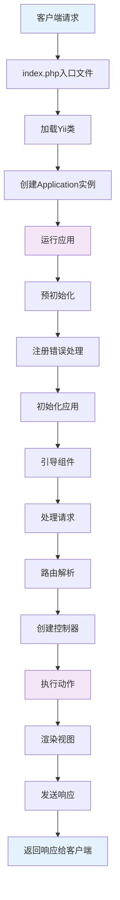

# Yii2框架每次请求的生命周期，框架本身用到哪些设计模式

## 概要回答

Yii2框架的请求生命周期从入口脚本index.php开始，经过应用实例化、引导启动、路由解析、控制器执行、视图渲染到最后响应发送。框架广泛使用了依赖注入容器、服务定位器、行为模式、事件模式、工厂模式等设计模式，构建了一个高度模块化、可扩展的MVC框架。理解Yii2的生命周期和设计模式有助于更好地使用框架和进行框架源码分析。

## 深度解析

### 1. Yii2请求生命周期

#### 1.1 整体流程图



#### 1.2 详细生命周期阶段

##### 阶段1：入口文件处理
```php
// web/index.php - Yii2入口文件
<?php

// 1. 定义常量
defined('YII_DEBUG') or define('YII_DEBUG', true);
defined('YII_ENV') or define('YII_ENV', 'dev');

// 2. 加载Composer自动加载器
require __DIR__ . '/../vendor/autoload.php';

// 3. 加载Yii类
require __DIR__ . '/../vendor/yiisoft/yii2/Yii.php';

// 4. 加载应用配置
$config = require __DIR__ . '/../config/web.php';

// 5. 创建并运行Web应用
(new yii\web\Application($config))->run();
```

##### 阶段2：应用实例创建
```php
// yii\web\Application - Web应用类
class Application extends \yii\base\Application
{
    public function __construct($config = [])
    {
        // 1. 设置实例
        Yii::$app = $this;
        
        // 2. 预初始化
        $this->preInit($config);
        
        // 3. 注册错误处理程序
        $this->registerErrorHandler($config);
        
        // 4. 调用父类构造函数
        parent::__construct($config);
    }
    
    public function run()
    {
        try {
            // 1. 初始化应用
            $this->state = self::STATE_BEFORE_REQUEST;
            $this->trigger(self::EVENT_BEFORE_REQUEST);
            
            // 2. 处理请求
            $response = $this->handleRequest($this->getRequest());
            
            // 3. 发送响应
            $this->state = self::STATE_AFTER_REQUEST;
            $this->trigger(self::EVENT_AFTER_REQUEST);
            
            $response->send();
            
            // 4. 结束应用
            $this->state = self::STATE_END;
            
            return $response->exitStatus;
        } catch (ExitException $e) {
            $this->end($e->statusCode, isset($response) ? $response : null);
            return $e->statusCode;
        }
    }
}
```

##### 阶段3：请求处理
```php
// yii\web\Application - 请求处理
public function handleRequest($request)
{
    // 1. 如果启用URL美化，解析请求
    if (empty($this->catchAll)) {
        list($route, $params) = $request->resolve();
    } else {
        $route = $this->catchAll[0];
        $params = $this->catchAll;
        unset($params[0]);
    }
    
    try {
        // 2. 运行动作
        $result = $this->runAction($route, $params);
        
        // 3. 如果结果是字符串，创建响应对象
        if ($result instanceof Response) {
            return $result;
        } else {
            $response = $this->getResponse();
            if ($result !== null) {
                $response->data = $result;
            }
            
            return $response;
        }
    } catch (InvalidRouteException $e) {
        // 4. 处理无效路由
        throw new NotFoundHttpException(Yii::t('yii', 'Page not found.'), $e->getCode(), $e);
    }
}
```

##### 阶段4：路由解析与控制器执行
```php
// yii\base\Module - 模块运行动作
public function runAction($route, $params = [])
{
    $parts = $this->createController($route);
    if (is_array($parts)) {
        /* @var $controller Controller */
        list($controller, $actionID) = $parts;
        
        // 创建动作对象
        $oldController = Yii::$app->controller;
        $controller->module = $this;
        Yii::$app->controller = $controller;
        
        try {
            // 运行动作
            $result = $controller->runAction($actionID, $params);
        } finally {
            // 恢复控制器
            Yii::$app->controller = $oldController;
        }
        
        return $result;
    } else {
        return parent::runAction($route, $params);
    }
}

// yii\web\Controller - 控制器执行动作
public function runAction($id, $params = [])
{
    // 1. 创建动作对象
    $action = $this->createAction($id);
    
    if ($action === null) {
        throw new InvalidRouteException('Unable to resolve the request: ' . $this->getUniqueId() . '/' . $id);
    }
    
    // 2. 触发动作执行前事件
    $result = $action->runWithParams($params);
    
    return $result;
}
```

##### 阶段5：动作执行与响应生成
```php
// yii\base\Action - 动作执行
public function runWithParams($params)
{
    // 1. 绑定参数
    $args = $this->controller->bindActionParams($this, $params);
    
    // 2. 触发动作执行前事件
    Yii::$app->trigger('beforeAction', new ActionEvent($this));
    
    // 3. 执行动作
    $result = call_user_func_array([$this, 'run'], $args);
    
    // 4. 触发动作执行后事件
    Yii::$app->trigger('afterAction', new ActionEvent($this, $result));
    
    return $result;
}

// yii\base\InlineAction - 内联动作执行
public function run($params)
{
    // 通过反射调用控制器方法
    $reflection = new \ReflectionMethod($this->controller, $this->actionMethod);
    $parameters = $reflection->getParameters();
    
    // 绑定参数并调用方法
    $args = $this->controller->bindInjectedParams($parameters, $params);
    return $reflection->invokeArgs($this->controller, $args);
}
```

### 2. Yii2核心设计模式

#### 2.1 服务定位器模式（Service Locator Pattern）

```php
// yii\di\ServiceLocator - 服务定位器基类
class ServiceLocator extends Component
{
    private $_components = [];
    private $_definitions = [];
    
    // 获取组件
    public function get($id, $throwException = true)
    {
        // 1. 检查是否已实例化
        if (isset($this->_components[$id])) {
            return $this->_components[$id];
        }
        
        // 2. 检查是否有定义
        if (isset($this->_definitions[$id])) {
            $definition = $this->_definitions[$id];
            
            // 3. 创建组件实例
            if (is_object($definition) && !$definition instanceof Closure) {
                return $this->_components[$id] = $definition;
            } else {
                return $this->_components[$id] = Yii::createObject($definition);
            }
        } elseif ($throwException) {
            throw new InvalidConfigException("Unknown component ID: $id");
        } else {
            return null;
        }
    }
    
    // 设置组件定义
    public function set($id, $definition)
    {
        if ($definition === null) {
            unset($this->_components[$id], $this->_definitions[$id]);
            return;
        }
        
        unset($this->_components[$id]);
        $this->_definitions[$id] = $definition;
    }
    
    // 检查组件是否存在
    public function has($id, $checkInstance = false)
    {
        return $checkInstance ? isset($this->_components[$id]) : isset($this->_definitions[$id]);
    }
}

// 应用中使用服务定位器
class Application extends Module
{
    public function coreComponents()
    {
        return [
            'log' => ['class' => 'yii\log\Dispatcher'],
            'view' => ['class' => 'yii\web\View'],
            'urlManager' => ['class' => 'yii\web\UrlManager'],
            'assetManager' => ['class' => 'yii\web\AssetManager'],
            'request' => ['class' => 'yii\web\Request'],
            'response' => ['class' => 'yii\web\Response'],
            'session' => ['class' => 'yii\web\Session'],
            'user' => ['class' => 'yii\web\User'],
            'errorHandler' => ['class' => 'yii\web\ErrorHandler'],
        ];
    }
}

// 使用示例
$request = Yii::$app->request;  // 获取请求组件
$response = Yii::$app->response; // 获取响应组件
$db = Yii::$app->db;            // 获取数据库组件
```

#### 2.2 依赖注入容器模式（Dependency Injection Container）

```php
// yii\di\Container - 依赖注入容器
class Container extends Component
{
    private $_singletons = [];
    private $_definitions = [];
    private $_params = [];
    private $_reflections = [];
    private $_dependencies = [];
    
    // 设置类定义
    public function set($class, $definition = [], array $params = [])
    {
        $this->_definitions[$class] = $this->normalizeDefinition($class, $definition);
        $this->_params[$class] = $params;
        unset($this->_singletons[$class]);
        return $this;
    }
    
    // 创建对象实例
    public function get($class, $params = [], $config = [])
    {
        // 1. 检查是否为单例
        if (isset($this->_singletons[$class])) {
            return $this->_singletons[$class];
        }
        
        // 2. 解析依赖
        if (isset($this->_definitions[$class])) {
            $definition = $this->_definitions[$class];
            if (is_callable($definition, true)) {
                $params = $this->mergeParams($class, $params);
                $object = call_user_func($definition, $this, $params, $config);
            } elseif (is_array($definition)) {
                $concrete = $definition['class'];
                unset($definition['class']);
                $config = array_merge($definition, $config);
                $params = $this->mergeParams($class, $params);
                $object = $this->build($concrete, $params, $config);
            } else {
                throw new InvalidConfigException('Unexpected object definition type: ' . gettype($definition));
            }
        } else {
            $object = $this->build($class, $params, $config);
        }
        
        // 3. 如果是单例，保存实例
        if (array_key_exists($class, $this->_singletons)) {
            $this->_singletons[$class] = $object;
        }
        
        return $object;
    }
    
    // 构建对象
    protected function build($class, $params, $config)
    {
        /* @var $reflection ReflectionClass */
        list($reflection, $dependencies) = $this->getDependencies($class);
        
        // 替换参数
        foreach ($params as $index => $param) {
            $dependencies[$index] = $param;
        }
        
        // 解析依赖
        $dependencies = $this->resolveDependencies($dependencies, $reflection);
        
        // 合并配置
        if (!$reflection->isInstantiable()) {
            throw new NotInstantiableException($reflection->name);
        }
        
        // 创建实例
        if (empty($config)) {
            return $reflection->newInstanceArgs($dependencies);
        }
        
        // 如果有配置，通过Yii::createObject创建
        $config = ['class' => $class] + $config;
        return Yii::createObject($config);
    }
}

// 使用示例
class UserController extends Controller
{
    // 构造函数注入
    public function __construct(
        $id, 
        $module, 
        UserService $userService, 
        $config = []
    ) {
        $this->userService = $userService;
        parent::__construct($id, $module, $config);
    }
    
    // 方法注入
    public function actionView(User $user, Request $request)
    {
        return $this->render('view', [
            'user' => $user,
            'method' => $request->getMethod()
        ]);
    }
}
```

#### 2.3 行为模式（Behavior Pattern）

```php
// yii\base\Behavior - 行为基类
class Behavior extends Object
{
    public $owner;
    
    // 绑定到组件
    public function attach($owner)
    {
        $this->owner = $owner;
        $this->events();
    }
    
    // 解绑
    public function detach()
    {
        if ($this->owner) {
            $this->owner = null;
        }
    }
    
    // 声明事件处理
    public function events()
    {
        return [];
    }
}

// 自定义行为示例
class TimestampBehavior extends Behavior
{
    public $createdAtAttribute = 'created_at';
    public $updatedAtAttribute = 'updated_at';
    public $value;
    
    // 声明事件处理
    public function events()
    {
        return [
            ActiveRecord::EVENT_BEFORE_INSERT => 'setValue',
            ActiveRecord::EVENT_BEFORE_UPDATE => 'setValue',
        ];
    }
    
    // 设置时间戳值
    public function setValue($event)
    {
        $attribute = $event->name === ActiveRecord::EVENT_BEFORE_INSERT 
            ? $this->createdAtAttribute 
            : $this->updatedAtAttribute;
            
        if (!empty($this->owner->$attribute)) {
            return;
        }
        
        $value = $this->getValue();
        $this->owner->$attribute = $value;
    }
    
    protected function getValue()
    {
        if ($this->value instanceof Expression) {
            return $this->value;
        } elseif ($this->value !== null) {
            return is_string($this->value) ? strtotime($this->value) : call_user_func($this->value);
        } else {
            return time();
        }
    }
}

// 在模型中使用行为
class User extends ActiveRecord
{
    public function behaviors()
    {
        return [
            [
                'class' => TimestampBehavior::className(),
                'createdAtAttribute' => 'created_at',
                'updatedAtAttribute' => 'updated_at',
            ],
            'blameable' => [
                'class' => BlameableBehavior::className(),
                'createdByAttribute' => 'created_by',
                'updatedByAttribute' => 'updated_by',
            ],
        ];
    }
}
```

#### 2.4 事件模式（Event Pattern）

```php
// yii\base\Component - 组件基类支持事件
class Component extends Object
{
    private $_events = [];
    private $_behaviors;
    
    // 绑定事件处理器
    public function on($name, $handler, $data = null, $append = true)
    {
        if ($append || empty($this->_events[$name])) {
            $this->_events[$name][] = [$handler, $data];
        } else {
            array_unshift($this->_events[$name], [$handler, $data]);
        }
    }
    
    // 解绑事件处理器
    public function off($name, $handler = null)
    {
        if (empty($this->_events[$name])) {
            return false;
        }
        
        if ($handler === null) {
            unset($this->_events[$name]);
            return true;
        }
        
        $removed = false;
        foreach ($this->_events[$name] as $i => $event) {
            if ($event[0] === $handler) {
                unset($this->_events[$name][$i]);
                $removed = true;
            }
        }
        
        if ($removed) {
            $this->_events[$name] = array_values($this->_events[$name]);
        }
        
        return $removed;
    }
    
    // 触发事件
    public function trigger($name, Event $event = null)
    {
        if (!empty($this->_events[$name])) {
            if ($event === null) {
                $event = new Event();
            }
            if ($event->sender === null) {
                $event->sender = $this;
            }
            $event->handled = false;
            $event->name = $name;
            
            foreach ($this->_events[$name] as $handler) {
                $event->data = $handler[1];
                call_user_func($handler[0], $event);
                
                // 如果事件被标记为已处理，停止传播
                if ($event->handled) {
                    return;
                }
            }
        }
        
        // 触发附加的行为事件
        if ($this->_behaviors !== null) {
            $this->triggerBehaviors($name, $event);
        }
    }
}

// 自定义事件类
class UserEvent extends Event
{
    public $user;
    public $isValid = true;
}

// 使用事件示例
class UserService
{
    // 注册前事件
    public function beforeRegister($user)
    {
        $event = new UserEvent();
        $event->user = $user;
        Yii::$app->trigger('user.beforeRegister', $event);
        
        return $event->isValid;
    }
    
    // 注册后事件
    public function afterRegister($user)
    {
        $event = new UserEvent();
        $event->user = $user;
        Yii::$app->trigger('user.afterRegister', $event);
    }
}

// 监听事件
Yii::$app->on('user.beforeRegister', function ($event) {
    // 验证用户数据
    if (empty($event->user->email)) {
        $event->isValid = false;
        throw new Exception('Email is required');
    }
});

Yii::$app->on('user.afterRegister', function ($event) {
    // 发送欢迎邮件
    Yii::$app->mailer->compose()
        ->setTo($event->user->email)
        ->setSubject('Welcome!')
        ->send();
});
```

#### 2.5 工厂模式（Factory Pattern）

```php
// Yii::createObject - 工厂方法
public static function createObject($type, array $params = [])
{
    if (is_string($type)) {
        return static::$container->get($type, $params);
    } elseif (is_array($type) && isset($type['class'])) {
        $class = $type['class'];
        unset($type['class']);
        return static::$container->get($class, $params, $type);
    } elseif (is_callable($type, true)) {
        return call_user_func($type, $params);
    } elseif (is_array($type)) {
        throw new InvalidConfigException('Object configuration must be an array containing a "class" element.');
    } else {
        throw new InvalidConfigException('Unsupported configuration type: ' . gettype($type));
    }
}

// Widget工厂模式示例
class Widget extends Component
{
    public static function widget($config = [])
    {
        ob_start();
        ob_implicit_flush(false);
        try {
            /* @var $widget Widget */
            $widget = Yii::createObject(get_called_class(), [array_merge([
                'id' => $config['id'] ?? static::getId(),
            ], $config)]);
            
            $widget->run();
            return ob_get_clean();
        } catch (\Exception $e) {
            ob_end_clean();
            throw $e;
        }
    }
}

// 自定义Widget
class AlertWidget extends Widget
{
    public $type = 'info';
    public $message;
    
    public function run()
    {
        return Html::tag('div', $this->message, [
            'class' => 'alert alert-' . $this->type,
            'role' => 'alert'
        ]);
    }
}

// 使用Widget
echo AlertWidget::widget([
    'type' => 'success',
    'message' => 'Operation completed successfully!'
]);
```

### 3. Yii2核心组件架构

#### 3.1 应用主体结构

```php
// yii\base\Application - 应用基类
abstract class Application extends Module
{
    // 应用状态常量
    const STATE_BEGIN = 0;
    const STATE_INIT = 1;
    const STATE_BEFORE_REQUEST = 2;
    const STATE_HANDLING_REQUEST = 3;
    const STATE_AFTER_REQUEST = 4;
    const STATE_END = 5;
    
    public $state;
    public $loadedModules = [];
    
    // 核心组件
    public function coreComponents()
    {
        return array_merge(parent::coreComponents(), [
            'log' => ['class' => 'yii\log\Dispatcher'],
            'view' => ['class' => 'yii\web\View'],
            'formatter' => ['class' => 'yii\i18n\Formatter'],
            'i18n' => ['class' => 'yii\i18n\I18N'],
            'mailer' => ['class' => 'yii\swiftmailer\Mailer'],
            'urlManager' => ['class' => 'yii\web\UrlManager'],
            'assetManager' => ['class' => 'yii\web\AssetManager'],
            'security' => ['class' => 'yii\base\Security'],
        ]);
    }
}

// yii\web\Application - Web应用
class Application extends \yii\base\Application
{
    public $controllerNamespace = 'app\controllers';
    public $defaultRoute = 'site';
    public $catchAll;
    public $requestedRoute;
    public $requestedAction;
    public $requestedParams;
    
    // 处理请求
    public function handleRequest($request)
    {
        // 路由解析
        if (empty($this->catchAll)) {
            list($route, $params) = $request->resolve();
        } else {
            $route = $this->catchAll[0];
            $params = $this->catchAll;
            unset($params[0]);
        }
        
        $this->requestedRoute = $route;
        
        // 运行动作
        $result = $this->runAction($route, $params);
        
        // 处理结果
        if ($result instanceof Response) {
            return $result;
        } else {
            $response = $this->getResponse();
            if ($result !== null) {
                $response->data = $result;
            }
            
            return $response;
        }
    }
}
```

#### 3.2 模块系统

```php
// yii\base\Module - 模块基类
class Module extends ServiceLocator
{
    public $module;
    public $layout;
    public $controllerNamespace;
    public $controllerMap = [];
    public $modules = [];
    private $_basePath;
    private $_version;
    
    // 初始化模块
    public function init()
    {
        if ($this->controllerNamespace === null) {
            $class = get_class($this);
            if (($pos = strrpos($class, '\\')) !== false) {
                $this->controllerNamespace = substr($class, 0, $pos) . '\controllers';
            }
        }
    }
    
    // 注册子模块
    public function setModule($id, $module)
    {
        if ($module === null) {
            unset($this->modules[$id]);
        } else {
            if (is_array($module) || is_string($module)) {
                $module = Yii::createObject($module, [$id, $this]);
            }
            $module->module = $this;
            $this->modules[$id] = $module;
        }
    }
}

// 配置模块示例
'modules' => [
    'admin' => [
        'class' => 'app\modules\admin\Module',
        'controllerNamespace' => 'app\modules\admin\controllers',
        'layout' => 'admin',
        'modules' => [
            'user' => [
                'class' => 'app\modules\admin\modules\user\Module',
            ],
        ],
    ],
],
```

## 总结

Yii2框架通过精心设计的生命周期和多种设计模式，构建了一个功能强大且灵活的MVC框架：

1. **请求生命周期**：从入口文件到响应返回，每个阶段都有明确的职责和处理逻辑
2. **核心设计模式**：
   - 服务定位器模式提供统一的组件访问接口
   - 依赖注入容器实现松耦合的组件管理
   - 行为模式实现横向功能扩展
   - 事件模式支持解耦的事件驱动架构
   - 工厂模式简化对象创建过程

3. **架构优势**：
   - 高度模块化的组件设计
   - 灵活的扩展机制
   - 完善的事件系统
   - 强大的行为系统

理解Yii2的生命周期和设计模式不仅有助于更好地使用框架，也为深入学习框架源码和进行架构设计提供了重要参考。