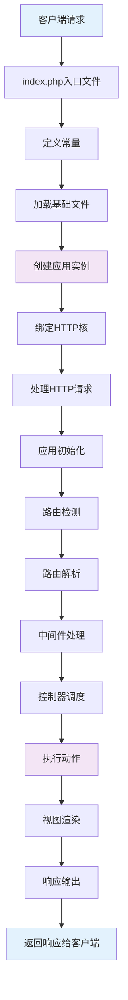

# ThinkPHP框架每次请求的生命周期，框架本身用到哪些设计模式

## 概要回答

ThinkPHP框架的请求生命周期从入口文件index.php开始，经过常量定义、自动加载、应用初始化、路由解析、控制器执行、视图渲染到最后响应发送。框架采用了单入口模式、MVC架构、依赖注入容器、门面模式、中间件模式等多种设计模式，构建了一个简单易用且功能完善的PHP开发框架。理解ThinkPHP的生命周期和设计模式有助于更好地使用框架和进行框架源码分析。

## 深度解析

### 1. ThinkPHP请求生命周期

#### 1.1 整体流程图



#### 1.2 详细生命周期阶段

##### 阶段1：入口文件处理
```php
// public/index.php - ThinkPHP入口文件
<?php

// 1. 定义应用目录
define('APP_PATH', __DIR__ . '/../application/');

// 2. 加载基础文件
require __DIR__ . '/../thinkphp/base.php';

// 3. 绑定当前访问到index模块
\think\Route::bind('index');

// 4. 关闭admin模块的访问
\think\App::denyModule('admin');

// 5. 设置根命名空间
\think\Loader::addNamespace('plugins', '../plugins/');

// 6. 执行应用
\think\App::run()->send();
```

##### 阶段2：基础文件加载
```php
// thinkphp/base.php - 基础文件
<?php

// 1. 定义常量
defined('THINK_VERSION') or define('THINK_VERSION', '5.0.24');
defined('DS') or define('DS', DIRECTORY_SEPARATOR);
defined('THINK_PATH') or define('THINK_PATH', __DIR__ . DS);
defined('LIB_PATH') or define('LIB_PATH', THINK_PATH . 'library' . DS);

// 2. 加载Loader类
require THINK_PATH . 'library/think/Loader.php';

// 3. 注册自动加载
\think\Loader::register();

// 4. 注册错误和异常处理机制
\think\Error::register();

// 5. 加载惯例配置文件
\think\Config::set(include THINK_PATH . 'convention.php');

// 6. 设置系统时区
date_default_timezone_set('PRC');
```

##### 阶段3：应用实例创建与运行
```php
// thinkphp/library/think/App.php - 应用类
namespace think;

class App
{
    protected static $namespace = 'app';
    protected static $suffix = false;
    
    public static function run(Request $request = null)
    {
        // 1. 初始化应用
        $app = new static();
        
        // 2. 创建请求对象
        is_null($request) && $request = Request::instance();
        
        try {
            // 3. 应用初始化
            $app->initialize();
            
            // 4. 路由检测
            $dispatch = $app->routeCheck($request);
            
            // 5. 记录当前调度信息
            $request->dispatch($dispatch);
            
            // 6. 执行调度
            $data = $app->exec($dispatch, $request);
            
        } catch (HttpResponseException $exception) {
            $data = $exception->getResponse();
        }
        
        // 7. 输出数据到客户端
        if ($data instanceof Response) {
            $response = $data;
        } elseif (!is_null($data)) {
            // 默认输出类型
            $type = $request->isAjax() ? 'json' : 'html';
            $response = Response::create($data, $type);
        } else {
            $response = Response::create();
        }
        
        return $response;
    }
    
    protected function initialize()
    {
        // 1. 加载环境变量配置
        if (is_file(ROOT_PATH . '.env')) {
            $this->env->load(ROOT_PATH . '.env');
        }
        
        // 2. 加载全局配置
        $this->loadLangPack();
        $this->config->load();
        
        // 3. 调试模式设置
        $this->debug->init($this->config->pull('trace'));
        
        // 4. 注册根命名空间
        $this->loader->addNamespace($this->namespace, APP_PATH);
        
        // 5. 初始化应用
        $this->init();
    }
}
```

##### 阶段4：路由检测与解析
```php
// 路由检测
protected function routeCheck(Request $request)
{
    // 1. 获取应用配置
    $config = $this->config->pull('app');
    
    // 2. 路由检测
    $path = $this->url->parseUrl($request);
    
    // 3. 路由解析
    $rule = $this->route->check($request, $path, $config['url_route_must']);
    
    // 4. 设置路由变量
    $request->setRouteVars($rule);
    
    return $rule;
}

// URL解析
public function parseUrl(Request $request)
{
    // 1. 获取URL路径
    $path = $request->path();
    
    // 2. 去除URL后缀
    $path = preg_replace('/\.(' . $this->config->get('url_html_suffix') . ')$/i', '', $path);
    
    // 3. 路径分割
    $path = trim($path, '/');
    $path = explode('/', $path);
    
    return $path;
}
```

##### 阶段5：调度执行
```php
// 执行调度
public function exec($dispatch, Request $request)
{
    switch ($dispatch['type']) {
        case 'redirect': // 重定向
            $data = $this->redirect($dispatch['url'], $dispatch['status']);
            break;
        case 'module': // 模块/控制器/操作
            $data = $this->module($dispatch['module'], $request);
            break;
        case 'controller': // 控制器
            $data = $this->controller($dispatch['controller']);
            break;
        case 'method': // 方法
            $data = $this->method($dispatch['method']);
            break;
        default:
            throw new \InvalidArgumentException('dispatch type not support');
    }
    
    return $data;
}

// 模块调度
protected function module($result, Request $request)
{
    // 1. 解析模块、控制器、操作
    list($module, $controller, $action) = $result;
    
    // 2. 设置当前模块
    $request->module($module);
    
    // 3. 设置当前控制器
    $request->controller($controller);
    
    // 4. 设置当前操作
    $request->action($action);
    
    // 5. 执行控制器操作
    return $this->execute($module, $controller, $action, $request);
}
```

##### 阶段6：控制器执行
```php
// 执行控制器操作
protected function execute($module, $controller, $action, Request $request)
{
    // 1. 创建控制器实例
    $instance = $this->controller($controller, $module);
    
    // 2. 操作方法检查
    if (!preg_match('/^[A-Za-z](\w)*$/', $action)) {
        throw new \InvalidArgumentException('method not exist:' . $action);
    }
    
    // 3. 执行前置操作
    $this->beforeAction($instance, $action);
    
    // 4. 调用操作方法
    $call = [$instance, $action . $this->config->get('action_suffix')];
    
    if (is_callable($call)) {
        // 依赖注入调用
        $data = $this->invokeMethod($call, $request);
    } else {
        // 操作不存在
        throw new \ReflectionException('method not exist:' . $action);
    }
    
    return $data;
}

// 控制器实例化
public function controller($controller, $module = '')
{
    // 1. 解析控制器类名
    $class = $this->parseController($controller, $module);
    
    // 2. 实例化控制器
    $instance = $this->make($class);
    
    return $instance;
}
```

### 2. ThinkPHP核心设计模式

#### 2.1 单例模式（Singleton Pattern）

```php
// thinkphp/library/think/Request.php - 请求单例
class Request
{
    protected static $instance;
    
    // 获取单例实例
    public static function instance($options = [])
    {
        if (is_null(self::$instance)) {
            self::$instance = new self($options);
        }
        return self::$instance;
    }
    
    // 克隆魔术方法私有化，防止克隆
    private function __clone()
    {
    }
}

// thinkphp/library/think/Config.php - 配置单例
class Config
{
    protected static $instance;
    protected $config = [];
    
    // 获取单例实例
    public static function getInstance()
    {
        if (is_null(self::$instance)) {
            self::$instance = new self();
        }
        return self::$instance;
    }
    
    // 静态调用魔术方法
    public static function __callStatic($method, $params)
    {
        return call_user_func_array([self::getInstance(), $method], $params);
    }
}
```

#### 2.2 门面模式（Facade Pattern）

```php
// thinkphp/library/think/Facade.php - 门面基类
class Facade
{
    protected static $bind = [];
    protected static $instance = [];
    
    // 调用实际类的方法
    public static function __callStatic($method, $params)
    {
        return call_user_func_array([static::createFacade(), $method], $params);
    }
    
    // 创建门面实例
    protected static function createFacade($class = '', $args = [], $newInstance = false)
    {
        $class = $class ?: static::class;
        
        $facadeClass = static::getFacadeClass();
        
        if ($facadeClass) {
            $class = $facadeClass;
        }
        
        if (static::$bind[$class] instanceof Closure) {
            $instance = call_user_func_array(static::$bind[$class], $args);
        } else {
            $instance = static::$bind[$class] ?? Container::getInstance()->make($class, $args, $newInstance);
        }
        
        if (!$newInstance) {
            static::$instance[$class] = $instance;
        }
        
        return $instance;
    }
    
    // 获取门面类
    protected static function getFacadeClass()
    {
    }
}

// 具体门面实现
class App extends Facade
{
    protected static function getFacadeClass()
    {
        return 'think\App';
    }
}

class Config extends Facade
{
    protected static function getFacadeClass()
    {
        return 'think\Config';
    }
}

class Request extends Facade
{
    protected static function getFacadeClass()
    {
        return 'think\Request';
    }
}

// 使用示例
// 配置操作
Config::set('app_trace', true);
$value = Config::get('app_trace');

// 请求操作
$path = Request::instance()->path();
$method = Request::instance()->method();

// 应用操作
App::controller('Index');
```

#### 2.3 依赖注入容器模式（Dependency Injection Container）

```php
// thinkphp/library/think/Container.php - 容器类
class Container implements ArrayAccess
{
    protected $instances = [];
    protected $bind = [];
    protected $aliases = [];
    
    // 绑定类到容器
    public function bind($abstract, $concrete = null)
    {
        if (is_array($abstract)) {
            $this->bind = array_merge($this->bind, $abstract);
        } else {
            $this->bind[$abstract] = $concrete;
        }
    }
    
    // 解析类实例
    public function make($abstract, $vars = [], $newInstance = false)
    {
        // 1. 检查别名
        $abstract = isset($this->aliases[$abstract]) ? $this->aliases[$abstract] : $abstract;
        
        // 2. 检查是否已有实例
        if (isset($this->instances[$abstract]) && !$newInstance) {
            return $this->instances[$abstract];
        }
        
        // 3. 获取具体实现
        if (isset($this->bind[$abstract])) {
            $concrete = $this->bind[$abstract];
            
            if ($concrete instanceof Closure) {
                $object = $this->invokeFunction($concrete, $vars);
            } else {
                $object = $this->make($concrete, $vars, $newInstance);
            }
        } else {
            // 4. 直接构建类
            $object = $this->invokeClass($abstract, $vars);
        }
        
        // 5. 保存实例
        if (!$newInstance) {
            $this->instances[$abstract] = $object;
        }
        
        return $object;
    }
    
    // 调用类方法（依赖注入）
    public function invokeClass($class, $vars = [])
    {
        try {
            $reflect = new ReflectionClass($class);
            
            if ($reflect->hasMethod('__make')) {
                $method = new ReflectionMethod($class, '__make');
                if ($method->isPublic() && $method->isStatic()) {
                    return $method->invoke(null, $this);
                }
            }
            
            $constructor = $reflect->getConstructor();
            
            if ($constructor) {
                $args = $this->bindParams($constructor, $vars);
                return $reflect->newInstanceArgs($args);
            } else {
                return new $class;
            }
        } catch (ReflectionException $e) {
            throw new ClassNotFoundException('class not exists: ' . $class, $class, $e);
        }
    }
    
    // 绑定参数
    protected function bindParams($reflect, $vars = [])
    {
        if (empty($vars)) {
            // 自动依赖注入
            return $this->injectParams($reflect);
        } else {
            // 手动绑定参数
            return $this->bindValue($vars);
        }
    }
}

// 使用示例
class UserController
{
    protected $userService;
    
    // 构造函数注入
    public function __construct(UserService $userService)
    {
        $this->userService = $userService;
    }
    
    // 方法注入
    public function show(Request $request, User $user)
    {
        return json([
            'user' => $user,
            'method' => $request->method()
        ]);
    }
}
```

#### 2.4 中间件模式（Middleware Pattern）

```php
// thinkphp/library/think/Middleware.php - 中间件类
class Middleware
{
    protected $queue = [];
    protected $app;
    
    // 添加中间件
    public function add($middleware)
    {
        if (is_array($middleware)) {
            $this->queue = array_merge($this->queue, $middleware);
        } else {
            $this->queue[] = $middleware;
        }
    }
    
    // 执行中间件
    public function dispatch(Request $request)
    {
        return call_user_func([$this, 'handle'], $request);
    }
    
    // 处理请求
    public function handle($request, Closure $next)
    {
        // 1. 获取第一个中间件
        $middleware = array_shift($this->queue);
        
        if (is_null($middleware)) {
            // 中间件执行完毕，调用下一个处理
            return $next($request);
        }
        
        // 2. 解析中间件
        list($call, $params) = $this->resolve($middleware);
        
        // 3. 执行中间件
        return call_user_func($call, $request, $this->resolveNext(), ...$params);
    }
    
    // 解析下一个处理
    protected function resolveNext()
    {
        return function ($request) {
            return $this->handle($request, function ($request) {
                return null;
            });
        };
    }
    
    // 解析中间件
    protected function resolve($middleware)
    {
        if (is_string($middleware)) {
            // 字符串中间件
            if (strpos($middleware, ':')) {
                list($middleware, $params) = explode(':', $middleware, 2);
                $params = explode(',', $params);
            } else {
                $params = [];
            }
            
            $call = [new $middleware(), 'handle'];
        } else {
            // 对象或闭包中间件
            $call = $middleware;
            $params = [];
        }
        
        return [$call, $params];
    }
}

// 自定义中间件示例
class AuthMiddleware
{
    public function handle($request, Closure $next, $guard = null)
    {
        // 前置操作
        if (!session('?user')) {
            return redirect('login/index');
        }
        
        // 执行下一个中间件或控制器
        $response = $next($request);
        
        // 后置操作
        // 可以在这里修改响应
        
        return $response;
    }
}

class CorsMiddleware
{
    public function handle($request, Closure $next)
    {
        // 前置操作 - 设置CORS头部
        header('Access-Control-Allow-Origin: *');
        header('Access-Control-Allow-Methods: GET, POST, PUT, DELETE, OPTIONS');
        header('Access-Control-Allow-Headers: Content-Type, Authorization');
        
        // 如果是OPTIONS请求，直接返回
        if ($request->isOptions()) {
            return response('', 204);
        }
        
        // 执行下一个中间件或控制器
        $response = $next($request);
        
        return $response;
    }
}

// 配置中间件
// application/common/middleware.php
return [
    \app\http\middleware\AuthMiddleware::class,
    \app\http\middleware\CorsMiddleware::class,
];
```

#### 2.5 工厂模式（Factory Pattern）

```php
// thinkphp/library/think/Model.php - 模型工厂
class Model
{
    // 创建模型实例
    public static function make($name = '', $layer = 'model', $appendSuffix = false)
    {
        if (empty($name)) {
            return new static();
        }
        
        $class = static::parseClass($name, $layer, $appendSuffix);
        return new $class();
    }
    
    // 解析类名
    protected static function parseClass($name, $layer, $appendSuffix)
    {
        $name = str_replace(['/', '.'], '\\', $name);
        list($module, $class) = explode('\\', $name, 2);
        
        $path = '';
        if (defined('APP_MULTI_MODULE') && APP_MULTI_MODULE) {
            $path = $module . '\\';
        }
        
        return APP_NAMESPACE . '\\' . $path . $layer . '\\' . $class . (APP_CLASS_SUFFIX ? ucfirst($layer) : '');
    }
}

// 数据库工厂
class Db
{
    protected static $instance = [];
    
    // 连接数据库
    public static function connect($config = [], $name = false)
    {
        if (false === $name) {
            $name = md5(serialize($config));
        }
        
        if (true === $name) {
            $name = 'master';
        }
        
        if (!isset(self::$instance[$name])) {
            // 创建数据库连接
            self::$instance[$name] = new Connection($config);
        }
        
        return self::$instance[$name];
    }
}

// 使用示例
// 创建模型实例
$userModel = Model::make('User');
$productModel = Model::make('product/Product');

// 数据库连接
$db = Db::connect();
$masterDb = Db::connect([], true);
```

### 3. ThinkPHP核心组件架构

#### 3.1 路由系统

```php
// thinkphp/library/think/Route.php - 路由类
class Route
{
    // 注册路由规则
    public static function rule($rule, $route = '', $type = '*', $option = [], $pattern = [])
    {
        return self::register($rule, $route, $type, $option, $pattern);
    }
    
    // GET路由
    public static function get($rule, $route = '', $option = [], $pattern = [])
    {
        return self::rule($rule, $route, 'GET', $option, $pattern);
    }
    
    // POST路由
    public static function post($rule, $route = '', $option = [], $pattern = [])
    {
        return self::rule($rule, $route, 'POST', $option, $pattern);
    }
    
    // 资源路由
    public static function resource($rule, $route = '', $option = [], $pattern = [])
    {
        // 自动生成RESTful路由
        $resources = [
            'index'   => ['GET', '', 'index'],
            'create'  => ['GET', '/create', 'create'],
            'edit'    => ['GET', '/:id/edit', 'edit'],
            'save'    => ['POST', '', 'save'],
            'read'    => ['GET', '/:id', 'read'],
            'update'  => ['PUT', '/:id', 'update'],
            'delete'  => ['DELETE', '/:id', 'delete'],
        ];
        
        foreach ($resources as $key => $val) {
            if ((!isset($option['only']) || in_array($key, $option['only']))
                && (!isset($option['except']) || !in_array($key, $option['except']))) {
                self::rule($rule . $val[1], $route . '/' . $val[2], $val[0], $option, $pattern);
            }
        }
    }
}

// 路由使用示例
// application/route.php
use think\Route;

// 基本路由
Route::get('hello/:name', 'index/hello');

// 分组路由
Route::group('api', function () {
    Route::get('users', 'api/User/index');
    Route::post('users', 'api/User/save');
    Route::get('users/:id', 'api/User/read');
    Route::put('users/:id', 'api/User/update');
    Route::delete('users/:id', 'api/User/delete');
});

// 资源路由
Route::resource('blog', 'index/Blog');

// 闭包路由
Route::get('time', function () {
    return date('Y-m-d H:i:s');
});
```

#### 3.2 配置系统

```php
// thinkphp/library/think/Config.php - 配置类
class Config
{
    protected static $config = [];
    protected static $range = '_sys_';
    
    // 设置配置
    public static function set($name, $value = null, $range = '')
    {
        $range = $range ?: self::$range;
        
        if (!isset(self::$config[$range])) {
            self::$config[$range] = [];
        }
        
        if (is_array($name)) {
            // 批量设置
            self::$config[$range] = array_merge(self::$config[$range], array_change_key_case($name));
        } elseif (is_null($value)) {
            // 清空配置
            unset(self::$config[$range][$name]);
        } else {
            // 单个设置
            self::$config[$range][strtolower($name)] = $value;
        }
        
        return true;
    }
    
    // 获取配置
    public static function get($name = null, $range = '')
    {
        $range = $range ?: self::$range;
        
        if (!isset(self::$config[$range])) {
            self::$config[$range] = [];
        }
        
        if (is_null($name)) {
            // 获取全部配置
            return self::$config[$range];
        }
        
        // 解析配置名
        $name = strtolower($name);
        $result = self::$config[$range];
        
        foreach (explode('.', $name) as $key) {
            if (!isset($result[$key])) {
                return null;
            }
            $result = $result[$key];
        }
        
        return $result;
    }
    
    // 检查配置是否存在
    public static function has($name, $range = '')
    {
        $range = $range ?: self::$range;
        return isset(self::$config[$range][strtolower($name)]);
    }
}

// 配置文件示例
// application/config.php
return [
    // 应用配置
    'app_debug'              => true,
    'app_trace'              => false,
    
    // 数据库配置
    'database'               => [
        'type'            => 'mysql',
        'hostname'        => '127.0.0.1',
        'database'        => 'test',
        'username'        => 'root',
        'password'        => '',
        'hostport'        => '3306',
        'charset'         => 'utf8',
        'prefix'          => 'tp_',
    ],
    
    // 缓存配置
    'cache'                  => [
        'type'   => 'File',
        'path'   => CACHE_PATH,
        'prefix' => '',
        'expire' => 0,
    ],
    
    // 会话配置
    'session'                => [
        'id'             => '',
        'var_session_id' => '',
        'prefix'         => 'think',
        'type'           => '',
        'auto_start'     => true,
    ],
];
```

## 总结

ThinkPHP框架通过精心设计的生命周期和多种设计模式，构建了一个简单易用且功能完善的PHP开发框架：

1. **请求生命周期**：从入口文件到响应返回，每个阶段都有明确的职责和处理逻辑
2. **核心设计模式**：
   - 单例模式确保核心组件的唯一性
   - 门面模式提供简洁的静态接口访问
   - 依赖注入容器实现松耦合的组件管理
   - 中间件模式实现横切关注点的处理
   - 工厂模式简化对象创建过程

3. **架构优势**：
   - 简单易学的API设计
   - 灵活的路由系统
   - 完善的配置管理
   - 强大的数据库ORM
   - 丰富的扩展机制

理解ThinkPHP的生命周期和设计模式不仅有助于更好地使用框架，也为深入学习框架源码和进行架构设计提供了重要参考。