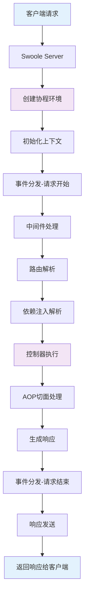

# Hyperf框架每次请求的生命周期，框架本身用到哪些设计模式

## 概要回答

Hyperf框架是基于Swoole的高性能协程框架，其请求生命周期从Swoole Server接收请求开始，经过协程环境初始化、中间件处理、路由解析、控制器执行、响应生成到最后响应发送。框架大量使用了依赖注入容器、注解驱动、AOP面向切面编程、中间件模式、事件模式等设计模式，构建了一个现代化、高性能的PHP协程框架。理解Hyperf的生命周期和设计模式有助于更好地使用框架和进行高性能应用开发。

## 深度解析

### 1. Hyperf请求生命周期

#### 1.1 整体流程图



#### 1.2 详细生命周期阶段

##### 阶段1：Swoole Server启动
```php
// bin/hyperf.php - Hyperf入口文件
#!/usr/bin/env php
<?php

declare(strict_types=1);

require_once dirname(__DIR__) . '/vendor/autoload.php';

// 创建容器
$container = require dirname(__DIR__) . '/config/container.php';

// 获取HttpServer实例
$httpServer = $container->get(Hyperf\Contract\OnRequestInterface::class);

// 启动服务
$httpServer->start();
```

```php
// config/container.php - 容器配置
use Hyperf\Di\Container;
use Hyperf\Di\Definition\DefinitionSourceFactory;
use Hyperf\Utils\ApplicationContext;

$container = new Container((new DefinitionSourceFactory(true))());

if (! $container instanceof \Psr\Container\ContainerInterface) {
    throw new RuntimeException('The dependency injection container is invalid.');
}

return ApplicationContext::setContainer($container);
```

##### 阶段2：HTTP Server处理请求
```php
// Hyperf\HttpServer\Server - HTTP服务器
class Server implements OnRequestInterface
{
    public function onRequest(SwooleRequest $request, SwooleResponse $response): void
    {
        try {
            // 1. 协程上下文初始化
            CoordinatorManager::until(Constants::WORKER_START)->yield();
            
            // 2. 创建PSR-7请求和响应对象
            $psr7Request = $this->initRequest($request);
            $psr7Response = $this->initResponse($response);
            
            // 3. 创建核心中间件
            $coreHandler = $this->createCoreMiddleware();
            
            // 4. 处理请求
            $psr7Response = $coreHandler->handle($psr7Request);
            
            // 5. 发送响应
            $this->send($psr7Response, $response, $request->fd);
        } catch (Throwable $throwable) {
            // 异常处理
            $this->exceptionHandlerDispatcher->dispatch($throwable, ...$this->exceptionHandlers);
        }
    }
    
    protected function createCoreMiddleware(): CoreMiddleware
    {
        // 创建核心中间件
        return new CoreMiddleware($this->container, $this->serverName);
    }
}
```

##### 阶段3：核心中间件处理
```php
// Hyperf\HttpServer\CoreMiddleware - 核心中间件
class CoreMiddleware implements MiddlewareInterface
{
    public function process(ServerRequestInterface $request, RequestHandlerInterface $handler): ResponseInterface
    {
        // 1. 路由调度
        $dispatched = $this->dispatcher->dispatch($request);
        
        // 2. 设置调度信息到上下文
        Context::set(ServerRequestInterface::class, $request->withAttribute(Dispatched::class, $dispatched));
        
        // 3. 根据调度类型处理
        if ($dispatched->status === Dispatcher::FOUND) {
            return $this->handleFound($dispatched, $request, $handler);
        } elseif ($dispatched->status === Dispatcher::NOT_FOUND) {
            return $this->handleNotFound($request, $handler);
        } elseif ($dispatched->status === Dispatcher::METHOD_NOT_ALLOWED) {
            return $this->handleMethodNotAllowed($dispatched, $request, $handler);
        } else {
            return $this->callMiddleware($handler, $request);
        }
    }
    
    protected function handleFound(Dispatched $dispatched, ServerRequestInterface $request, RequestHandlerInterface $handler): ResponseInterface
    {
        // 处理找到的路由
        if ($dispatched->handler->callback instanceof Closure) {
            // 闭包回调
            $response = call($dispatched->handler->callback);
        } else {
            // 控制器方法回调
            $response = $this->handleRequest($dispatched->handler, $request);
        }
        
        return $response;
    }
}
```

##### 阶段4：控制器请求处理
```php
// 控制器请求处理
protected function handleRequest(Handler $handler, ServerRequestInterface $request): ResponseInterface
{
    // 1. 解析控制器和方法
    [$controller, $action] = $this->prepareHandler($handler->callback);
    
    // 2. 获取控制器实例（通过依赖注入容器）
    $controllerInstance = $this->container->get($controller);
    
    // 3. 参数绑定
    $parameters = $this->requestDispatcher->dispatch($handler, $request);
    
    // 4. 调用控制器方法
    $response = $controllerInstance->{$action}(...$parameters);
    
    // 5. 处理响应
    return $this->responseEmitter->emit($response);
}

// 参数绑定和依赖注入
public function dispatch(Handler $handler, ServerRequestInterface $request): array
{
    // 1. 获取方法反射信息
    $method = new ReflectionMethod($handler->callback[0], $handler->callback[1]);
    
    // 2. 绑定参数
    $parameters = $this->argumentResolver->resolve($method, $request);
    
    return $parameters;
}
```

##### 阶段5：响应生成与发送
```php
// 响应发射器
class ResponseEmitter
{
    public function emit($response): ResponseInterface
    {
        if ($response instanceof ResponseInterface) {
            return $response;
        }
        
        if (is_string($response)) {
            return $this->responseFactory->createResponse()->withBody(
                new SwooleStream($response)
            );
        }
        
        if (is_array($response)) {
            return $this->responseFactory->createResponse()->withBody(
                new SwooleStream(json_encode($response, JSON_UNESCAPED_UNICODE))
            )->withHeader('Content-Type', 'application/json');
        }
        
        return $this->responseFactory->createResponse();
    }
}

// 发送响应
protected function send(ResponseInterface $response, SwooleResponse $swooleResponse, int $fd): void
{
    // 设置HTTP状态码
    $swooleResponse->status($response->getStatusCode());
    
    // 设置响应头
    foreach ($response->getHeaders() as $key => $value) {
        $swooleResponse->header($key, implode('; ', $value));
    }
    
    // 发送响应体
    $swooleResponse->end((string) $response->getBody());
}
```

### 2. Hyperf核心设计模式

#### 2.1 依赖注入容器模式（Dependency Injection Container）

```php
// Hyperf\Di\Container - 依赖注入容器
class Container implements ContainerInterface
{
    protected $definitions = [];
    protected $resolvedEntries = [];
    
    // 获取实例
    public function get($id)
    {
        // 1. 检查是否已解析
        if (isset($this->resolvedEntries[$id])) {
            return $this->resolvedEntries[$id];
        }
        
        // 2. 检查是否有定义
        if (!isset($this->definitions[$id])) {
            // 自动解析类
            return $this->resolvedEntries[$id] = $this->make($id);
        }
        
        // 3. 解析定义
        $definition = $this->definitions[$id];
        
        if ($definition instanceof Closure) {
            // 闭包定义
            $object = $definition($this);
        } elseif (is_string($definition)) {
            // 字符串定义
            $object = $this->make($definition);
        } else {
            // 其他定义
            $object = $definition;
        }
        
        // 4. 缓存解析结果
        return $this->resolvedEntries[$id] = $object;
    }
    
    // 创建实例
    public function make(string $className, array $parameters = [])
    {
        // 1. 获取反射类
        $reflection = new ReflectionClass($className);
        
        // 2. 检查是否有构造函数
        $constructor = $reflection->getConstructor();
        if (is_null($constructor)) {
            return new $className();
        }
        
        // 3. 解析构造函数参数
        $dependencies = $this->resolveDependencies($constructor->getParameters());
        
        // 4. 创建实例
        return $reflection->newInstanceArgs($dependencies);
    }
    
    // 解析依赖
    protected function resolveDependencies(array $parameters): array
    {
        $dependencies = [];
        
        foreach ($parameters as $parameter) {
            // 获取参数类型
            $type = $parameter->getType();
            
            if ($type && !$type->isBuiltin()) {
                // 类类型参数，递归解析
                $dependencies[] = $this->get($type->getName());
            } elseif ($parameter->isDefaultValueAvailable()) {
                // 有默认值
                $dependencies[] = $parameter->getDefaultValue();
            } else {
                // 无法解析的依赖
                throw new EntryNotFoundException("Cannot resolve parameter {$parameter->getName()}");
            }
        }
        
        return $dependencies;
    }
}

// 使用示例
class UserController
{
    private UserService $userService;
    private LoggerInterface $logger;
    
    // 构造函数注入
    public function __construct(
        UserService $userService,
        LoggerInterface $logger
    ) {
        $this->userService = $userService;
        $this->logger = $logger;
    }
    
    #[AutoController]
    public function index()
    {
        $users = $this->userService->getAllUsers();
        $this->logger->info('User list retrieved');
        return $users;
    }
}
```

#### 2.2 注解驱动模式（Annotation Driven Pattern）

```php
// 注解定义
#[\Attribute(\Attribute::TARGET_CLASS | \Attribute::TARGET_METHOD)]
class GetMapping
{
    public string $path;
    
    public function __construct(string $path)
    {
        $this->path = $path;
    }
}

#[\Attribute(\Attribute::TARGET_CLASS)]
class AutoController
{
    public string $prefix;
    
    public function __construct(string $prefix = '')
    {
        $this->prefix = $prefix;
    }
}

#[\Attribute(\Attribute::TARGET_PARAMETER)]
class RequestBody
{
}

// 控制器使用注解
#[AutoController(prefix: "/api/users")]
class UserController
{
    #[GetMapping(path: "/{id}")]
    public function getUser(int $id): User
    {
        return User::find($id);
    }
    
    #[PostMapping(path: "")]
    public function createUser(#[RequestBody] CreateUserRequest $request): User
    {
        return User::create($request->toArray());
    }
}

// 注解扫描和路由注册
class RouteCollector
{
    public function collectRoutes(string $controllerClass): void
    {
        $reflection = new ReflectionClass($controllerClass);
        
        // 获取类注解
        $classAttributes = $reflection->getAttributes();
        $prefix = '';
        
        foreach ($classAttributes as $attribute) {
            if ($attribute->getName() === AutoController::class) {
                $instance = $attribute->newInstance();
                $prefix = $instance->prefix;
                break;
            }
        }
        
        // 获取方法注解
        foreach ($reflection->getMethods() as $method) {
            $methodAttributes = $method->getAttributes();
            
            foreach ($methodAttributes as $attribute) {
                if ($attribute->getName() === GetMapping::class) {
                    $instance = $attribute->newInstance();
                    $path = $prefix . $instance->path;
                    
                    // 注册路由
                    $this->router->addRoute('GET', $path, [$controllerClass, $method->getName()]);
                }
            }
        }
    }
}
```

#### 2.3 AOP面向切面编程模式（Aspect Oriented Programming）

```php
// 切面定义
#[Aspect]
class LoggingAspect
{
    #[PointCut("within(App\Service\*) && execution(public *\ *(..))")]
    public function pointCut()
    {
    }
    
    #[Before]
    public function before(JoinPoint $joinPoint)
    {
        $className = $joinPoint->getClassName();
        $methodName = $joinPoint->getMethodName();
        $arguments = $joinPoint->getArguments();
        
        // 记录方法调用前日志
        echo "Before calling {$className}::{$methodName} with arguments: " . json_encode($arguments) . PHP_EOL;
    }
    
    #[AfterReturning(returning: "result")]
    public function afterReturning(JoinPoint $joinPoint, $result)
    {
        $className = $joinPoint->getClassName();
        $methodName = $joinPoint->getMethodName();
        
        // 记录方法调用后日志
        echo "After returning from {$className}::{$methodName} with result: " . json_encode($result) . PHP_EOL;
    }
    
    #[AfterThrowing(throwing: "exception")]
    public function afterThrowing(JoinPoint $joinPoint, Throwable $exception)
    {
        $className = $joinPoint->getClassName();
        $methodName = $joinPoint->getMethodName();
        
        // 记录异常日志
        echo "Exception in {$className}::{$methodName}: " . $exception->getMessage() . PHP_EOL;
    }
}

// 事务切面
#[Aspect]
class TransactionalAspect
{
    private DbConnection $db;
    
    public function __construct(DbConnection $db)
    {
        $this->db = $db;
    }
    
    #[PointCut("@annotation(App\Annotation\Transactional)")]
    public function pointCut()
    {
    }
    
    #[Around]
    public function around(ProceedingJoinPoint $proceedingJoinPoint)
    {
        $this->db->beginTransaction();
        
        try {
            $result = $proceedingJoinPoint->proceed();
            $this->db->commit();
            return $result;
        } catch (Throwable $e) {
            $this->db->rollback();
            throw $e;
        }
    }
}

// 使用事务注解
class UserService
{
    #[Transactional]
    public function transferMoney(int $fromUserId, int $toUserId, float $amount): bool
    {
        // 扣减发送方余额
        $this->deductBalance($fromUserId, $amount);
        
        // 增加接收方余额
        $this->addBalance($toUserId, $amount);
        
        return true;
    }
}
```

#### 2.4 中间件模式（Middleware Pattern）

```php
// 中间件接口
interface MiddlewareInterface
{
    public function process(ServerRequestInterface $request, RequestHandlerInterface $handler): ResponseInterface;
}

// 核心中间件实现
class CoreMiddleware implements MiddlewareInterface
{
    public function process(ServerRequestInterface $request, RequestHandlerInterface $handler): ResponseInterface
    {
        // 前置处理
        $request = $this->beforeHandle($request);
        
        // 调用下一个中间件或控制器
        $response = $handler->handle($request);
        
        // 后置处理
        $response = $this->afterHandle($response);
        
        return $response;
    }
    
    protected function beforeHandle(ServerRequestInterface $request): ServerRequestInterface
    {
        // 可以在这里做请求预处理
        return $request;
    }
    
    protected function afterHandle(ResponseInterface $response): ResponseInterface
    {
        // 可以在这里做响应后处理
        return $response;
    }
}

// 自定义中间件示例
class CorsMiddleware implements MiddlewareInterface
{
    public function process(ServerRequestInterface $request, RequestHandlerInterface $handler): ResponseInterface
    {
        // 前置处理 - 设置CORS头部
        if ($request->getMethod() === 'OPTIONS') {
            return (new Response())->withStatus(204)
                ->withHeader('Access-Control-Allow-Origin', '*')
                ->withHeader('Access-Control-Allow-Methods', 'GET, POST, PUT, DELETE, OPTIONS')
                ->withHeader('Access-Control-Allow-Headers', 'Content-Type, Authorization');
        }
        
        // 调用下一个中间件
        $response = $handler->handle($request);
        
        // 后置处理 - 添加CORS头部
        return $response->withHeader('Access-Control-Allow-Origin', '*');
    }
}

class AuthMiddleware implements MiddlewareInterface
{
    private JwtService $jwtService;
    
    public function __construct(JwtService $jwtService)
    {
        $this->jwtService = $jwtService;
    }
    
    public function process(ServerRequestInterface $request, RequestHandlerInterface $handler): ResponseInterface
    {
        // 前置处理 - 验证JWT Token
        $token = $request->getHeaderLine('Authorization');
        
        if (empty($token)) {
            return (new Response())->withStatus(401)->withBody(
                new SwooleStream('Unauthorized')
            );
        }
        
        try {
            $payload = $this->jwtService->decode($token);
            // 将用户信息存入上下文
            Context::set('user', $payload);
        } catch (Exception $e) {
            return (new Response())->withStatus(401)->withBody(
                new SwooleStream('Invalid token')
            );
        }
        
        // 调用下一个中间件
        return $handler->handle($request);
    }
}

// 中间件配置
// config/autoload/middlewares.php
return [
    'http' => [
        Hyperf\Session\Middleware\SessionMiddleware::class,
        App\Middleware\CorsMiddleware::class,
        App\Middleware\AuthMiddleware::class,
    ],
];
```

#### 2.5 事件模式（Event Pattern）

```php
// 事件分发器
class EventDispatcher implements EventDispatcherInterface
{
    private array $listeners = [];
    
    // 添加监听器
    public function addListener(string $eventName, callable $listener, int $priority = 0): void
    {
        if (!isset($this->listeners[$eventName])) {
            $this->listeners[$eventName] = new PriorityQueue();
        }
        
        $this->listeners[$eventName]->insert($listener, $priority);
    }
    
    // 分发事件
    public function dispatch(object $event): object
    {
        $eventName = get_class($event);
        
        if (isset($this->listeners[$eventName])) {
            foreach ($this->listeners[$eventName] as $listener) {
                $listener($event);
                
                // 如果事件被停止传播，则退出
                if ($event instanceof StoppableEventInterface && $event->isPropagationStopped()) {
                    break;
                }
            }
        }
        
        return $event;
    }
}

// 自定义事件
class UserRegistered
{
    public User $user;
    public array $extraData;
    
    public function __construct(User $user, array $extraData = [])
    {
        $this->user = $user;
        $this->extraData = $extraData;
    }
}

// 事件监听器
class SendWelcomeEmail
{
    private MailerInterface $mailer;
    
    public function __construct(MailerInterface $mailer)
    {
        $this->mailer = $mailer;
    }
    
    public function __invoke(UserRegistered $event): void
    {
        $this->mailer->send(
            $event->user->email,
            'Welcome!',
            "Welcome {$event->user->name} to our platform!"
        );
    }
}

class CreateUserProfile
{
    public function __invoke(UserRegistered $event): void
    {
        UserProfile::create([
            'user_id' => $event->user->id,
            'created_at' => date('Y-m-d H:i:s')
        ]);
    }
}

// 事件配置
// config/autoload/listeners.php
return [
    App\Listener\SendWelcomeEmail::class,
    App\Listener\CreateUserProfile::class,
];

// 使用事件
class UserController
{
    private EventDispatcherInterface $eventDispatcher;
    
    public function __construct(EventDispatcherInterface $eventDispatcher)
    {
        $this->eventDispatcher = $eventDispatcher;
    }
    
    public function register(CreateUserRequest $request): User
    {
        // 创建用户
        $user = User::create($request->toArray());
        
        // 触发用户注册事件
        $event = new UserRegistered($user, $request->getExtraData());
        $this->eventDispatcher->dispatch($event);
        
        return $user;
    }
}
```

### 3. Hyperf核心组件架构

#### 3.1 协程上下文管理

```php
// Hyperf\Utils\Context - 协程上下文
class Context
{
    protected static array $nonCoContext = [];
    
    // 设置上下文数据
    public static function set(string $id, $value)
    {
        if (Coroutine::inCoroutine()) {
            Coroutine::getContext()[$id] = $value;
        } else {
            static::$nonCoContext[$id] = $value;
        }
        
        return $value;
    }
    
    // 获取上下文数据
    public static function get(string $id, $default = null, &$exists = null)
    {
        if (Coroutine::inCoroutine()) {
            $exists = isset(Coroutine::getContext()[$id]);
            return $exists ? Coroutine::getContext()[$id] : $default;
        }
        
        $exists = isset(static::$nonCoContext[$id]);
        return $exists ? static::$nonCoContext[$id] : $default;
    }
    
    // 删除上下文数据
    public static function remove(string $id)
    {
        if (Coroutine::inCoroutine()) {
            unset(Coroutine::getContext()[$id]);
        } else {
            unset(static::$nonCoContext[$id]);
        }
    }
}

// 使用示例
class RequestService
{
    public function getCurrentUser(): ?User
    {
        return Context::get('current_user');
    }
    
    public function setCurrentUser(User $user): void
    {
        Context::set('current_user', $user);
    }
}
```

#### 3.2 配置系统

```php
// Hyperf\Config\Config - 配置管理
class Config implements ConfigInterface
{
    protected array $configs;
    
    public function __construct(array $configs)
    {
        $this->configs = $configs;
    }
    
    // 获取配置
    public function get(string $key, $default = null)
    {
        $exploded = explode('.', $key);
        $config = $this->configs;
        
        while (count($exploded) > 0) {
            $key = array_shift($exploded);
            
            if (!isset($config[$key])) {
                return $default;
            }
            
            $config = $config[$key];
        }
        
        return $config;
    }
    
    // 设置配置
    public function set(string $key, $value): void
    {
        $exploded = explode('.', $key);
        $config = &$this->configs;
        
        while (count($exploded) > 0) {
            $key = array_shift($exploded);
            
            if (count($exploded) === 0) {
                $config[$key] = $value;
                break;
            }
            
            if (!isset($config[$key])) {
                $config[$key] = [];
            }
            
            $config = &$config[$key];
        }
    }
}

// 配置注解
#[Inject]
class DatabaseService
{
    private ConfigInterface $config;
    
    public function __construct(ConfigInterface $config)
    {
        $this->config = $config;
    }
    
    public function getDatabaseConfig(): array
    {
        return $this->config->get('database.default');
    }
}
```

## 总结

Hyperf框架通过精心设计的生命周期和多种现代化设计模式，构建了一个高性能、高并发的协程PHP框架：

1. **请求生命周期**：基于Swoole的协程环境，从请求接收到响应发送的完整流程
2. **核心设计模式**：
   - 依赖注入容器实现松耦合的组件管理
   - 注解驱动简化配置和路由定义
   - AOP面向切面编程实现横切关注点的统一处理
   - 中间件模式实现请求处理链
   - 事件模式支持解耦的事件驱动架构

3. **架构优势**：
   - 基于Swoole的高性能协程支持
   - 完善的依赖注入和控制反转
   - 灵活的注解系统
   - 强大的AOP支持
   - 丰富的组件生态

理解Hyperf的生命周期和设计模式不仅有助于更好地使用框架，也为开发高性能的PHP应用提供了重要参考。