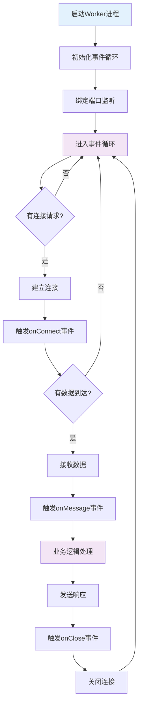

# workerman框架每次请求的生命周期，框架本身用到哪些设计模式

## 概要回答

Workerman是一个纯PHP开发的高性能进程管理框架，其生命周期从Worker进程启动开始，经过事件循环监听、连接建立、数据接收处理、业务逻辑执行到最后响应发送。框架采用了事件驱动模式、观察者模式、工厂模式、单例模式等多种设计模式，构建了一个简单高效且稳定的网络通信框架。理解Workerman的生命周期和设计模式有助于更好地使用框架和进行高性能网络应用开发。

## 深度解析

### 1. Workerman请求生命周期

#### 1.1 整体流程图



#### 1.2 详细生命周期阶段

##### 阶段1：Worker启动
```php
// start.php - Workerman启动文件
<?php
require_once __DIR__ . '/vendor/autoload.php';

use Workerman\Worker;

// 1. 创建Worker实例
$worker = new Worker("http://0.0.0.0:2345");

// 2. 设置进程数
$worker->count = 4;

// 3. 设置进程名称
$worker->name = 'MyWebServer';

// 4. 定义连接事件回调
$worker->onConnect = function($connection) {
    echo "New connection from {$connection->getRemoteIp()}\n";
};

// 5. 定义消息事件回调
$worker->onMessage = function($connection, $data) {
    // 处理HTTP请求
    $request = new \Workerman\Protocols\Http\Request($data);
    $response = handleHttpRequest($request);
    $connection->send($response);
};

// 6. 定义连接关闭事件回调
$worker->onClose = function($connection) {
    echo "Connection closed\n";
};

// 7. 运行Worker
Worker::runAll();

function handleHttpRequest($request) {
    $path = $request->path();
    
    switch ($path) {
        case '/':
            return new \Workerman\Protocols\Http\Response(200, ['Content-Type' => 'text/html'], '<h1>Hello Workerman!</h1>');
        case '/api/users':
            return new \Workerman\Protocols\Http\Response(200, ['Content-Type' => 'application/json'], json_encode(['users' => []]));
        default:
            return new \Workerman\Protocols\Http\Response(404, [], 'Not Found');
    }
}
```

##### 阶段2：Worker初始化
```php
// Workerman/Worker.php - Worker类核心实现
class Worker
{
    // Worker属性
    public $name = 'none';
    public $count = 1;
    public $user = '';
    public $reloadable = true;
    public $reusePort = false;
    public $transport = 'tcp';
    
    // 回调属性
    public $onWorkerStart = null;
    public $onWorkerStop = null;
    public $onConnect = null;
    public $onMessage = null;
    public $onClose = null;
    public $onError = null;
    public $onBufferFull = null;
    public $onBufferDrain = null;
    
    // 内部属性
    protected $_socket = null;
    protected $_mainSocket = null;
    protected static $_workers = [];
    protected static $_pidMap = [];
    protected static $_pidsToRestart = [];
    
    // 构造函数
    public function __construct($socket_name = '', $context_option = [])
    {
        // 1. 解析socket名称
        if ($socket_name) {
            list($scheme, $address) = explode(':', $socket_name, 2);
            $this->transport = $scheme;
            $this->_socketName = $socket_name;
        }
        
        // 2. 保存Worker实例
        $this->workerId = spl_object_hash($this);
        self::$_workers[$this->workerId] = $this;
        
        // 3. 设置上下文选项
        if ($context_option) {
            $this->_contextOption = $context_option;
        }
    }
    
    // 运行所有Worker
    public static function runAll()
    {
        // 1. 检查SAPI
        self::checkSapiEnv();
        
        // 2. 初始化
        self::init();
        
        // 3. 锁定Worker
        self::lock();
        
        // 4. 安装信号处理
        self::installSignal();
        
        // 5. 保存Master PID
        self::saveMasterPid();
        
        // 6. Fork Worker进程
        self::forkWorkers();
        
        // 7. 重定向标准输入输出
        self::resetStd();
        
        // 8. Master进程显示UI并监控Worker进程
        self::monitorWorkers();
    }
}
```

##### 阶段3：事件循环与连接处理
```php
// 事件循环处理
protected static function monitorWorkers()
{
    if (static::$_OS === 'linux') {
        // Linux下使用select系统调用
        static::monitorWorkersForLinux();
    } else {
        // 其他系统使用select
        static::monitorWorkersForWindows();
    }
}

// Linux下的Worker监控
protected static function monitorWorkersForLinux()
{
    while (1) {
        // 1. 检查是否有信号
        pcntl_signal_dispatch();
        
        // 2. 检查是否有退出的Worker进程
        $status = 0;
        $pid = pcntl_wait($status, WUNTRACED);
        
        // 3. 处理退出的Worker
        if ($pid > 0) {
            static::handleWorkerStop($pid, $status);
        }
        
        // 4. 检查是否需要重启Worker
        static::checkAndRestartWorkers();
    }
}

// Fork Worker进程
protected static function forkWorkers()
{
    foreach (static::$_workers as $worker) {
        // 根据count属性创建多个Worker进程
        for ($i = 0; $i < $worker->count; $i++) {
            static::forkOneWorker($worker);
        }
    }
}

// Fork单个Worker进程
protected static function forkOneWorker($worker)
{
    // 1. 创建子进程
    $pid = pcntl_fork();
    
    if ($pid > 0) {
        // 父进程
        static::$_pidMap[$worker->workerId][$pid] = $pid;
    } elseif ($pid === 0) {
        // 子进程
        srand();
        mt_srand();
        
        // 2. 清理Master进程相关数据
        static::$_workers = [];
        static::$_pidMap = [];
        
        // 3. 设置进程标题
        Timer::delAll();
        static::setProcessTitle($worker->name . ': worker process');
        
        // 4. 绑定端口
        $worker->listen();
        
        // 5. 触发WorkerStart事件
        if ($worker->onWorkerStart) {
            call_user_func($worker->onWorkerStart, $worker);
        }
        
        // 6. 进入事件循环
        $worker->eventLoop();
        
        exit(250);
    } else {
        throw new Exception("forkOneWorker fail");
    }
}
```

##### 阶段4：事件循环处理
```php
// Worker事件循环
public function eventLoop()
{
    // 1. 获取事件循环实例
    $event_loop_class = static::getEventLoopName();
    $this->_eventLoop = new $event_loop_class;
    
    // 2. 添加监听socket到事件循环
    if ($this->_socket) {
        $this->_eventLoop->add($this->_socket, EventInterface::EV_READ, array($this, 'acceptConnection'));
    }
    
    // 3. 运行事件循环
    $this->_eventLoop->loop();
}

// 接受连接
public function acceptConnection($socket)
{
    // 1. 接受客户端连接
    $new_socket = @stream_socket_accept($socket, 0, $remote_address);
    
    // 2. 设置非阻塞模式
    stream_set_blocking($new_socket, 0);
    
    // 3. 创建Connection实例
    $connection = new TcpConnection($new_socket, $remote_address);
    
    // 4. 设置回调
    $connection->onMessage = $this->onMessage;
    $connection->onClose = $this->onClose;
    $connection->onError = $this->onError;
    $connection->onBufferDrain = $this->onBufferDrain;
    $connection->onBufferFull = $this->onBufferFull;
    
    // 5. 触发连接事件
    if ($this->onConnect) {
        try {
            call_user_func($this->onConnect, $connection);
        } catch (\Exception $e) {
            static::log($e);
            exit(250);
        } catch (\Error $e) {
            static::log($e);
            exit(250);
        }
    }
}
```

##### 阶段5：数据接收与处理
```php
// TcpConnection - TCP连接处理
class TcpConnection extends Worker
{
    // 连接属性
    public $id = 0;
    public $protocol = '';
    public $worker = null;
    public $maxSendBufferSize = 1048576;
    
    // 回调属性
    public $onMessage = null;
    public $onClose = null;
    public $onError = null;
    public $onBufferFull = null;
    public $onBufferDrain = null;
    
    // 内部属性
    protected $_socket = null;
    protected $_recvBuffer = '';
    protected $_sendBuffer = '';
    protected $_isPaused = false;
    
    // 构造函数
    public function __construct($socket, $remote_address = '')
    {
        // 1. 保存socket
        $this->_socket = $socket;
        
        // 2. 设置远程地址
        $this->_remoteAddress = $remote_address;
        
        // 3. 设置连接ID
        static::$statistics['connection_count']++;
        $this->id = static::$idRecorder++;
        
        // 4. 添加到事件循环
        Worker::$globalEvent->add($this->_socket, EventInterface::EV_READ, array($this, 'baseRead'));
    }
    
    // 基础读取方法
    public function baseRead($socket, $check_eof = true)
    {
        // 1. 读取数据
        $buffer = fread($socket, self::READ_BUFFER_SIZE);
        
        // 2. 检查连接是否关闭
        if ($buffer === '' || $buffer === false) {
            if ($check_eof && (feof($socket) || !is_resource($socket) || $buffer === false)) {
                $this->destroy();
                return;
            }
        }
        
        // 3. 添加到接收缓冲区
        $this->_recvBuffer .= $buffer;
        
        // 4. 解析协议并处理数据
        $this->consumeRecvBuffer();
    }
    
    // 消费接收缓冲区
    protected function consumeRecvBuffer()
    {
        // 1. 如果设置了协议，使用协议解析
        if ($this->protocol) {
            $parser = $this->protocol;
            while ($this->_recvBuffer !== '' && !$this->_isPaused) {
                // 解析单个包
                $package = $parser::input($this->_recvBuffer, $this);
                if ($package === 0) {
                    break;
                }
                $one_request_buffer = substr($this->_recvBuffer, 0, $package);
                $this->_recvBuffer = substr($this->_recvBuffer, $package);
                
                // 处理包数据
                $this->dealWithPackage($one_request_buffer);
            }
        } else {
            // 2. 没有协议，直接处理数据
            if ($this->_recvBuffer !== '' && !$this->_isPaused) {
                $this->dealWithPackage($this->_recvBuffer);
                $this->_recvBuffer = '';
            }
        }
    }
    
    // 处理包数据
    protected function dealWithPackage($recv_buffer)
    {
        // 触发onMessage事件
        if ($this->onMessage) {
            try {
                call_user_func($this->onMessage, $this, $recv_buffer);
            } catch (\Exception $e) {
                static::log($e);
                exit(250);
            } catch (\Error $e) {
                static::log($e);
                exit(250);
            }
        }
    }
}
```

### 2. Workerman核心设计模式

#### 2.1 事件驱动模式（Event-driven Pattern）

```php
// EventInterface - 事件接口
interface EventInterface
{
    const EV_READ = 1;
    const EV_WRITE = 2;
    const EV_EXCEPT = 3;
    const EV_SIGNAL = 4;
    const EV_TIMER = 5;
    const EV_TIMER_ONCE = 6;
    
    // 添加事件监听
    public function add($fd, $flag, $func, $args = null);
    
    // 删除事件监听
    public function del($fd, $flag);
    
    // 清除所有事件
    public function clearAllTimer();
    
    // 运行事件循环
    public function loop();
    
    // 添加定时器
    public function timer($interval, $flag, $func, $args = null);
}

// Select事件循环实现
class Select implements EventInterface
{
    protected $_allEvents = [];
    protected $_signalEvents = [];
    protected $_timers = [];
    protected $_timerId = 0;
    protected $_selectTimeout = 100000000;
    protected $_scheduler = null;
    
    // 添加事件
    public function add($fd, $flag, $func, $args = null)
    {
        switch ($flag) {
            case self::EV_READ:
                $fd_key = (int)$fd;
                $this->_allEvents[$fd_key][$flag] = array($func, $fd, $args);
                break;
            case self::EV_WRITE:
                $fd_key = (int)$fd;
                $this->_allEvents[$fd_key][$flag] = array($func, $fd, $args);
                break;
            case self::EV_SIGNAL:
                $fd_key = (int)$fd;
                $this->_signalEvents[$fd_key][$flag] = array($func, $fd, $args);
                pcntl_signal($fd, array($this, 'signalHandler'));
                break;
            case self::EV_TIMER:
            case self::EV_TIMER_ONCE:
                $timer_id = ++$this->_timerId;
                $run_time = microtime(true) + $interval;
                $this->_scheduler->insert($timer_id, -$run_time);
                $this->_timers[$timer_id] = array($func, (array)$args, $flag, $interval);
                $select_timeout = ($run_time - microtime(true)) * 1000000;
                if( $this->_selectTimeout > $select_timeout ){ 
                    $this->_selectTimeout = $select_timeout;   
                }
                return $timer_id;
        }
        
        return true;
    }
    
    // 事件循环
    public function loop()
    {
        while (1) {
            // 1. 检查信号
            pcntl_signal_dispatch();
            
            // 2. 准备读写文件描述符集合
            $read_fds = [];
            $write_fds = [];
            
            foreach ($this->_allEvents as $fd => $events) {
                $fd = (int) $fd;
                if (isset($events[self::EV_READ])) {
                    $read_fds[$fd] = $fd;
                }
                if (isset($events[self::EV_WRITE])) {
                    $write_fds[$fd] = $fd;
                }
            }
            
            // 3. 执行select系统调用
            if ($read_fds || $write_fds) {
                $ret = @stream_select($read_fds, $write_fds, $except_fds, 0, $this->_selectTimeout);
                if (!$ret) {
                    continue;
                }
                
                // 4. 处理就绪的文件描述符
                foreach ($read_fds as $fd) {
                    $fd_key = (int)$fd;
                    if (isset($this->_allEvents[$fd_key][self::EV_READ])) {
                        call_user_func_array($this->_allEvents[$fd_key][self::EV_READ][0],
                            array($this->_allEvents[$fd_key][self::EV_READ][1], self::EV_READ));
                    }
                }
                
                foreach ($write_fds as $fd) {
                    $fd_key = (int)$fd;
                    if (isset($this->_allEvents[$fd_key][self::EV_WRITE])) {
                        call_user_func_array($this->_allEvents[$fd_key][self::EV_WRITE][0],
                            array($this->_allEvents[$fd_key][self::EV_WRITE][1], self::EV_WRITE));
                    }
                }
            }
            
            // 5. 处理定时器
            $this->tick();
        }
    }
    
    // 处理定时器
    protected function tick()
    {
        while (!$this->_scheduler->isEmpty()) {
            $scheduler_data = $this->_scheduler->top();
            $timer_id = $scheduler_data['data'];
            $next_run_time = -$scheduler_data['priority'];
            
            $now_time = microtime(true);
            if ($now_time < $next_run_time) {
                $this->_selectTimeout = ($next_run_time - $now_time) * 1000000;
                return;
            }
            
            $this->_scheduler->extract();
            
            if (!isset($this->_timers[$timer_id])) {
                continue;
            }
            
            // 执行定时器回调
            $task_data = $this->_timers[$timer_id];
            $func = $task_data[0];
            $args = $task_data[1];
            $flag = $task_data[2];
            $interval = $task_data[3];
            
            call_user_func_array($func, $args);
            
            // 如果是重复定时器，重新加入调度器
            if ($flag === self::EV_TIMER) {
                $next_run_time = $now_time + $interval;
                $this->_scheduler->insert($timer_id, -$next_run_time);
            } else {
                // 一次性定时器，删除
                unset($this->_timers[$timer_id]);
            }
        }
        
        $this->_selectTimeout = 100000000;
    }
}
```

#### 2.2 观察者模式（Observer Pattern）

```php
// ConnectionEvents - 连接事件管理
class ConnectionEvents
{
    // 事件类型常量
    const CONNECT = 'connect';
    const MESSAGE = 'message';
    const CLOSE = 'close';
    const ERROR = 'error';
    const BUFFER_FULL = 'buffer_full';
    const BUFFER_DRAIN = 'buffer_drain';
    
    // 观察者列表
    protected $observers = [];
    
    // 添加观察者
    public function addObserver($eventType, $observer)
    {
        if (!isset($this->observers[$eventType])) {
            $this->observers[$eventType] = [];
        }
        
        $this->observers[$eventType][] = $observer;
    }
    
    // 移除观察者
    public function removeObserver($eventType, $observer)
    {
        if (isset($this->observers[$eventType])) {
            $key = array_search($observer, $this->observers[$eventType]);
            if ($key !== false) {
                unset($this->observers[$eventType][$key]);
            }
        }
    }
    
    // 通知观察者
    public function notify($eventType, $connection, $data = null)
    {
        if (isset($this->observers[$eventType])) {
            foreach ($this->observers[$eventType] as $observer) {
                call_user_func($observer, $connection, $data);
            }
        }
    }
}

// 使用观察者模式的连接类
class ObservableConnection extends TcpConnection
{
    protected $events;
    
    public function __construct($socket, $remote_address = '')
    {
        parent::__construct($socket, $remote_address);
        $this->events = new ConnectionEvents();
    }
    
    // 添加事件监听器（观察者）
    public function on($event, $callback)
    {
        switch ($event) {
            case 'connect':
                $this->events->addObserver(ConnectionEvents::CONNECT, $callback);
                break;
            case 'message':
                $this->events->addObserver(ConnectionEvents::MESSAGE, $callback);
                break;
            case 'close':
                $this->events->addObserver(ConnectionEvents::CLOSE, $callback);
                break;
        }
    }
    
    // 触发连接事件
    protected function triggerConnect()
    {
        $this->events->notify(ConnectionEvents::CONNECT, $this);
    }
    
    // 触发消息事件
    protected function triggerMessage($data)
    {
        $this->events->notify(ConnectionEvents::MESSAGE, $this, $data);
    }
    
    // 触发关闭事件
    protected function triggerClose()
    {
        $this->events->notify(ConnectionEvents::CLOSE, $this);
    }
}
```

#### 2.3 工厂模式（Factory Pattern）

```php
// ProtocolFactory - 协议工厂
class ProtocolFactory
{
    protected static $protocols = [
        'http' => 'Workerman\\Protocols\\Http',
        'websocket' => 'Workerman\\Protocols\\Websocket',
        'text' => 'Workerman\\Protocols\\Text',
        'frame' => 'Workerman\\Protocols\\Frame',
    ];
    
    // 创建协议实例
    public static function create($protocolName)
    {
        if (isset(self::$protocols[$protocolName])) {
            $className = self::$protocols[$protocolName];
            return new $className();
        }
        
        // 尝试加载自定义协议
        if (class_exists($protocolName)) {
            return new $protocolName();
        }
        
        throw new Exception("Protocol {$protocolName} not found");
    }
    
    // 注册自定义协议
    public static function register($protocolName, $className)
    {
        self::$protocols[$protocolName] = $className;
    }
}

// ConnectionFactory - 连接工厂
class ConnectionFactory
{
    // 创建TCP连接
    public static function createTcpConnection($socket, $remote_address = '')
    {
        return new TcpConnection($socket, $remote_address);
    }
    
    // 创建UDP连接
    public static function createUdpConnection($socket)
    {
        return new UdpConnection($socket);
    }
    
    // 创建HTTP连接
    public static function createHttpConnection($socket, $remote_address = '')
    {
        $connection = new TcpConnection($socket, $remote_address);
        $connection->protocol = 'http';
        return $connection;
    }
}

// WorkerFactory - Worker工厂
class WorkerFactory
{
    // 创建HTTP Worker
    public static function createHttpWorker($host, $port, $count = 4)
    {
        $worker = new Worker("http://{$host}:{$port}");
        $worker->count = $count;
        $worker->name = 'HttpWorker';
        return $worker;
    }
    
    // 创建WebSocket Worker
    public static function createWebSocketWorker($host, $port, $count = 4)
    {
        $worker = new Worker("websocket://{$host}:{$port}");
        $worker->count = $count;
        $worker->name = 'WebSocketWorker';
        return $worker;
    }
    
    // 创建TCP Worker
    public static function createTcpWorker($host, $port, $count = 4)
    {
        $worker = new Worker("tcp://{$host}:{$port}");
        $worker->count = $count;
        $worker->name = 'TcpWorker';
        return $worker;
    }
}

// 使用示例
class ChatServer
{
    protected $httpWorker;
    protected $wsWorker;
    
    public function __construct()
    {
        // 使用工厂创建Worker
        $this->httpWorker = WorkerFactory::createHttpWorker('0.0.0.0', 8080, 2);
        $this->wsWorker = WorkerFactory::createWebSocketWorker('0.0.0.0', 8081, 2);
        
        // 配置HTTP Worker
        $this->httpWorker->onMessage = [$this, 'handleHttpRequest'];
        
        // 配置WebSocket Worker
        $this->wsWorker->onConnect = [$this, 'onWsConnect'];
        $this->wsWorker->onMessage = [$this, 'onWsMessage'];
        $this->wsWorker->onClose = [$this, 'onWsClose'];
    }
    
    public function handleHttpRequest($connection, $data)
    {
        // 处理HTTP请求
        $response = new \Workerman\Protocols\Http\Response(200, [], 'Chat Server Running');
        $connection->send($response);
    }
    
    public function onWsConnect($connection)
    {
        echo "New WebSocket connection\n";
    }
    
    public function onWsMessage($connection, $data)
    {
        // 广播消息给所有连接
        foreach ($this->wsWorker->connections as $conn) {
            $conn->send($data);
        }
    }
    
    public function onWsClose($connection)
    {
        echo "WebSocket connection closed\n";
    }
    
    public function run()
    {
        Worker::runAll();
    }
}
```

#### 2.4 单例模式（Singleton Pattern）

```php
// WorkerSingleton - Worker单例管理
class WorkerSingleton
{
    protected static $instances = [];
    
    // 获取Worker实例
    public static function getInstance($workerId)
    {
        if (!isset(self::$instances[$workerId])) {
            self::$instances[$workerId] = new Worker();
        }
        
        return self::$instances[$workerId];
    }
    
    // 获取所有Worker实例
    public static function getAllInstances()
    {
        return self::$instances;
    }
    
    // 清除实例
    public static function clearInstance($workerId)
    {
        if (isset(self::$instances[$workerId])) {
            unset(self::$instances[$workerId]);
        }
    }
}

// EventLoopSingleton - 事件循环单例
class EventLoopSingleton
{
    protected static $instance = null;
    
    // 获取事件循环实例
    public static function getInstance()
    {
        if (self::$instance === null) {
            $eventLoopClass = Worker::getEventLoopName();
            self::$instance = new $eventLoopClass();
        }
        
        return self::$instance;
    }
    
    // 重置实例
    public static function reset()
    {
        self::$instance = null;
    }
}

// TimerSingleton - 定时器单例
class TimerSingleton
{
    protected static $instance = null;
    
    // 获取定时器实例
    public static function getInstance()
    {
        if (self::$instance === null) {
            self::$instance = new Timer();
        }
        
        return self::$instance;
    }
    
    // 添加定时器
    public static function add($interval, $callback, $args = [], $persistent = true)
    {
        return self::getInstance()->add($interval, $callback, $args, $persistent);
    }
    
    // 删除定时器
    public static function del($timer_id)
    {
        return self::getInstance()->del($timer_id);
    }
    
    // 删除所有定时器
    public static function delAll()
    {
        return self::getInstance()->delAll();
    }
}

// 使用示例
class HeartbeatService
{
    protected $timerId;
    
    public function __construct()
    {
        // 使用单例定时器
        $this->timerId = TimerSingleton::add(30, [$this, 'sendHeartbeat']);
    }
    
    public function sendHeartbeat()
    {
        echo "Sending heartbeat at " . date('Y-m-d H:i:s') . "\n";
        
        // 向所有连接发送心跳
        $workers = WorkerSingleton::getAllInstances();
        foreach ($workers as $worker) {
            foreach ($worker->connections as $connection) {
                $connection->send(json_encode(['type' => 'heartbeat', 'time' => time()]));
            }
        }
    }
    
    public function stop()
    {
        TimerSingleton::del($this->timerId);
    }
}
```

### 3. Workerman核心组件架构

#### 3.1 进程管理

```php
// ProcessManager - 进程管理器
class ProcessManager
{
    protected $workers = [];
    protected $masterPid = 0;
    protected $pidFile = '';
    
    // 添加Worker
    public function addWorker($worker)
    {
        $this->workers[] = $worker;
    }
    
    // 启动所有Worker
    public function start()
    {
        // 保存Master PID
        $this->masterPid = posix_getpid();
        $this->savePid();
        
        // Fork Worker进程
        foreach ($this->workers as $worker) {
            $this->forkWorker($worker);
        }
        
        // 监控Worker进程
        $this->monitor();
    }
    
    // Fork Worker进程
    protected function forkWorker($worker)
    {
        $pid = pcntl_fork();
        
        if ($pid == 0) {
            // 子进程
            $this->runWorker($worker);
            exit(0);
        } elseif ($pid > 0) {
            // 父进程
            $worker->pid = $pid;
        } else {
            throw new Exception("Failed to fork worker process");
        }
    }
    
    // 运行Worker
    protected function runWorker($worker)
    {
        // 设置进程名称
        $this->setProcessName($worker->name);
        
        // 绑定端口
        $worker->listen();
        
        // 触发Worker启动事件
        if ($worker->onWorkerStart) {
            call_user_func($worker->onWorkerStart, $worker);
        }
        
        // 进入事件循环
        $worker->eventLoop();
    }
    
    // 监控Worker进程
    protected function monitor()
    {
        while (true) {
            pcntl_signal_dispatch();
            
            $pid = pcntl_wait($status, WUNTRACED);
            if ($pid > 0) {
                $this->handleWorkerExit($pid, $status);
            }
        }
    }
    
    // 处理Worker退出
    protected function handleWorkerExit($pid, $status)
    {
        echo "Worker process {$pid} exited with status {$status}\n";
        
        // 重启Worker
        foreach ($this->workers as $worker) {
            if ($worker->pid == $pid) {
                $this->forkWorker($worker);
                break;
            }
        }
    }
    
    // 保存PID
    protected function savePid()
    {
        if ($this->pidFile) {
            file_put_contents($this->pidFile, $this->masterPid);
        }
    }
}
```

#### 3.2 连接管理

```php
// ConnectionManager - 连接管理器
class ConnectionManager
{
    protected $connections = [];
    protected $maxConnections = 10000;
    protected $connectionCount = 0;
    
    // 添加连接
    public function addConnection($connection)
    {
        if ($this->connectionCount >= $this->maxConnections) {
            throw new Exception("Maximum connections reached");
        }
        
        $connectionId = $connection->id;
        $this->connections[$connectionId] = $connection;
        $this->connectionCount++;
        
        return $connectionId;
    }
    
    // 移除连接
    public function removeConnection($connectionId)
    {
        if (isset($this->connections[$connectionId])) {
            unset($this->connections[$connectionId]);
            $this->connectionCount--;
        }
    }
    
    // 获取连接
    public function getConnection($connectionId)
    {
        return isset($this->connections[$connectionId]) ? $this->connections[$connectionId] : null;
    }
    
    // 获取所有连接
    public function getAllConnections()
    {
        return $this->connections;
    }
    
    // 广播消息
    public function broadcast($data, $exclude = null)
    {
        foreach ($this->connections as $connection) {
            if ($exclude && $connection->id == $exclude) {
                continue;
            }
            $connection->send($data);
        }
    }
    
    // 获取连接统计信息
    public function getStatistics()
    {
        return [
            'total_connections' => $this->connectionCount,
            'max_connections' => $this->maxConnections,
            'active_connections' => count($this->connections)
        ];
    }
}

// 使用示例
class ChatRoom
{
    protected $connectionManager;
    protected $rooms = [];
    
    public function __construct()
    {
        $this->connectionManager = new ConnectionManager();
    }
    
    public function joinRoom($connection, $roomId)
    {
        // 添加连接到管理器
        $this->connectionManager->addConnection($connection);
        
        // 添加到房间
        if (!isset($this->rooms[$roomId])) {
            $this->rooms[$roomId] = [];
        }
        $this->rooms[$roomId][] = $connection->id;
        
        // 通知房间内其他人
        $this->broadcastToRoom($roomId, [
            'type' => 'user_joined',
            'user_id' => $connection->id,
            'message' => 'User joined room'
        ], $connection->id);
    }
    
    public function leaveRoom($connection, $roomId)
    {
        // 从房间移除
        if (isset($this->rooms[$roomId])) {
            $key = array_search($connection->id, $this->rooms[$roomId]);
            if ($key !== false) {
                unset($this->rooms[$roomId][$key]);
            }
        }
        
        // 从管理器移除
        $this->connectionManager->removeConnection($connection->id);
        
        // 通知房间内其他人
        $this->broadcastToRoom($roomId, [
            'type' => 'user_left',
            'user_id' => $connection->id,
            'message' => 'User left room'
        ]);
    }
    
    public function broadcastToRoom($roomId, $data, $exclude = null)
    {
        if (isset($this->rooms[$roomId])) {
            foreach ($this->rooms[$roomId] as $connectionId) {
                if ($exclude && $connectionId == $exclude) {
                    continue;
                }
                $connection = $this->connectionManager->getConnection($connectionId);
                if ($connection) {
                    $connection->send(json_encode($data));
                }
            }
        }
    }
}
```

## 总结

Workerman框架通过精心设计的生命周期和多种设计模式，构建了一个简单高效且稳定的网络通信框架：

1. **请求生命周期**：从Worker进程启动到事件循环处理，再到连接建立和数据处理的完整流程
2. **核心设计模式**：
   - 事件驱动模式实现高性能的异步IO处理
   - 观察者模式支持灵活的事件监听机制
   - 工厂模式简化对象创建过程
   - 单例模式确保核心组件的唯一性

3. **架构优势**：
   - 纯PHP实现，无需额外扩展
   - 高性能的进程管理
   - 灵活的协议支持
   - 简单易用的API设计
   - 稳定可靠的连接管理

理解Workerman的生命周期和设计模式不仅有助于更好地使用框架，也为开发高性能的网络应用提供了重要参考。Workerman特别适合构建实时通信应用，如聊天服务器、游戏服务器、推送服务等场景。