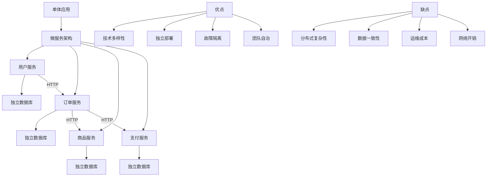

# 微服务架构的优缺点

## 概要回答

微服务架构是一种将单一应用程序开发为一组小型服务的方法，每个服务运行在自己的进程中并通过轻量级机制（通常是HTTP资源API）进行通信。每个服务都围绕着特定的业务功能构建，并且可以独立部署。

**优点：**
- 技术多样性：不同服务可以使用不同的技术栈
- 独立部署：服务可以独立开发、测试、部署和扩展
- 故障隔离：单个服务的故障不会影响整个系统
- 团队自治：不同团队可以独立负责不同服务

**缺点：**
- 分布式系统复杂性：网络延迟、容错处理等问题
- 数据一致性：跨服务的事务管理困难
- 运维成本：需要更多的监控、日志聚合等基础设施
- 网络通信开销：服务间通信带来额外延迟

## 深度解析

### 优点详解

#### 1. 技术多样性
微服务架构允许每个服务使用最适合其需求的技术栈。例如，一个计算密集型服务可以使用Go语言编写以获得更好的性能，而一个需要快速开发的服务可以使用Python或Ruby。

#### 2. 独立部署
每个微服务都可以独立部署，这意味着：
- 可以快速迭代和发布新功能
- 不会因为一个服务的部署影响其他服务
- 支持蓝绿部署、金丝雀发布等高级部署策略

#### 3. 故障隔离
当某个服务出现故障时，不会导致整个系统崩溃。例如，如果评论服务宕机，用户仍然可以浏览商品和下单购买。

#### 4. 团队自治
每个团队可以专注于特定的业务领域，使用自己熟悉的技术栈，按照自己的节奏进行开发和部署。

### 缺点详解

#### 1. 分布式系统复杂性
微服务本质上是一个分布式系统，带来了以下挑战：
- 网络延迟和不可靠性
- 服务发现和注册
- 容错和重试机制
- 分布式追踪和调试

#### 2. 数据一致性
在单体应用中，可以使用数据库事务保证数据一致性。但在微服务架构中，跨服务的数据一致性变得非常复杂，通常需要使用最终一致性或分布式事务解决方案。

#### 3. 运维成本
需要投入更多资源来维护：
- 服务监控和告警系统
- 日志收集和分析平台
- 分布式追踪系统
- 自动化部署和回滚机制

#### 4. 网络通信开销
服务间通信相比进程内调用有显著的性能开销，包括序列化/反序列化、网络传输延迟等。

## 代码示例

下面是一个简单的微服务架构示例，展示如何使用PHP实现服务间通信：

```php
<?php
// 服务客户端基类
class ServiceClient {
    private $baseUrl;
    private $httpClient;
    
    public function __construct($baseUrl) {
        $this->baseUrl = rtrim($baseUrl, '/');
        $this->httpClient = new \GuzzleHttp\Client();
    }
    
    /**
     * 发起GET请求
     */
    public function get($endpoint, $params = []) {
        try {
            $url = $this->baseUrl . '/' . ltrim($endpoint, '/');
            $response = $this->httpClient->get($url, [
                'query' => $params,
                'headers' => [
                    'Accept' => 'application/json',
                    'Content-Type' => 'application/json'
                ],
                'timeout' => 5
            ]);
            
            return json_decode($response->getBody()->getContents(), true);
        } catch (Exception $e) {
            throw new Exception("Service call failed: " . $e->getMessage());
        }
    }
    
    /**
     * 发起POST请求
     */
    public function post($endpoint, $data = []) {
        try {
            $url = $this->baseUrl . '/' . ltrim($endpoint, '/');
            $response = $this->httpClient->post($url, [
                'json' => $data,
                'headers' => [
                    'Accept' => 'application/json',
                    'Content-Type' => 'application/json'
                ],
                'timeout' => 5
            ]);
            
            return json_decode($response->getBody()->getContents(), true);
        } catch (Exception $e) {
            throw new Exception("Service call failed: " . $e->getMessage());
        }
    }
}

// 用户服务客户端
class UserServiceClient extends ServiceClient {
    public function getUser($userId) {
        return $this->get("/users/{$userId}");
    }
    
    public function createUser($userData) {
        return $this->post("/users", $userData);
    }
}

// 订单服务客户端
class OrderServiceClient extends ServiceClient {
    public function getOrdersByUser($userId) {
        return $this->get("/orders", ['user_id' => $userId]);
    }
    
    public function createOrder($orderData) {
        return $this->post("/orders", $orderData);
    }
}

// 示例：在订单服务中调用用户服务获取用户信息
class OrderController {
    private $userServiceClient;
    private $orderServiceClient;
    
    public function __construct() {
        $this->userServiceClient = new UserServiceClient('http://user-service:8080');
        $this->orderServiceClient = new OrderServiceClient('http://order-service:8080');
    }
    
    public function createOrderForUser($userId, $orderItems) {
        try {
            // 首先获取用户信息
            $user = $this->userServiceClient->getUser($userId);
            
            if (!$user) {
                throw new Exception("User not found");
            }
            
            // 创建订单
            $orderData = [
                'user_id' => $userId,
                'items' => $orderItems,
                'user_email' => $user['email'],
                'user_name' => $user['name']
            ];
            
            $order = $this->orderServiceClient->createOrder($orderData);
            
            return [
                'success' => true,
                'order' => $order
            ];
        } catch (Exception $e) {
            return [
                'success' => false,
                'error' => $e->getMessage()
            ];
        }
    }
}

// 使用示例
/*
$orderController = new OrderController();
$result = $orderController->createOrderForUser(123, [
    ['product_id' => 1, 'quantity' => 2],
    ['product_id' => 3, 'quantity' => 1]
]);

if ($result['success']) {
    echo "Order created: " . json_encode($result['order']);
} else {
    echo "Failed to create order: " . $result['error'];
}
*/
?>
```

## 图示说明



通过以上分析可以看出，微服务架构是一把双刃剑。它能够带来灵活性和技术优势，但同时也引入了分布式系统的复杂性。在决定是否采用微服务架构时，需要综合考虑团队规模、业务复杂度、技术能力等多个因素。