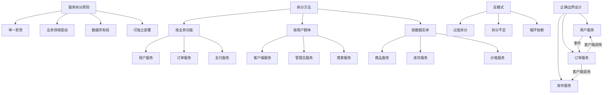

# 如何设计合理的服务拆分边界

## 概要回答

设计合理的微服务拆分边界是微服务架构成功的关键。良好的服务边界应该遵循以下原则：

1. **业务领域驱动**：根据业务领域和子域进行划分，确保每个服务职责单一
2. **高内聚低耦合**：服务内部高度相关，服务之间尽量减少依赖
3. **数据完整性**：每个服务拥有独立的数据存储，避免跨服务的强数据一致性需求
4. **可独立部署**：服务可以独立开发、测试、部署和扩展

常见的拆分方法包括：按业务功能拆分、按用户群体拆分、按数据实体拆分等。

## 深度解析

### 服务拆分原则

#### 1. 单一职责原则
每个微服务应该只负责一个明确的业务功能。例如，在电商系统中，用户管理、订单处理、支付处理、库存管理应该是独立的服务。

#### 2. 业务领域驱动设计
使用领域驱动设计（DDD）的方法来识别业务边界：
- **限界上下文**：定义清晰的业务边界
- **聚合根**：确定数据的一致性边界
- **实体和值对象**：识别核心业务概念

#### 3. 数据所有权
每个服务应该拥有自己的数据存储，并且是该数据的唯一管理者。这样可以避免跨服务的数据一致性问题。

#### 4. 服务粒度适中
服务既不能太大（失去微服务的优势），也不能太小（增加管理和运维复杂度）。一般来说，一个服务应该能够在2-3周内完全重写。

### 常见的拆分方法

#### 1. 按业务功能拆分
这是最常见的拆分方式，将相关的业务功能组合在一起。例如：
- 用户服务：负责用户注册、登录、个人信息管理
- 订单服务：负责订单创建、查询、修改
- 支付服务：负责支付处理、退款等

#### 2. 按用户群体拆分
根据不同类型的用户群体来拆分服务。例如：
- 客户端服务：面向普通用户的接口
- 管理员服务：面向运营管理人员的接口
- 商家服务：面向商户的接口

#### 3. 按数据实体拆分
以核心数据实体为中心进行拆分。例如：
- 商品服务：管理商品信息
- 库存服务：管理库存信息
- 价格服务：管理价格信息

### 服务拆分的反模式

#### 1. 过度拆分
将服务拆分得过于细小，导致：
- 网络调用过多，性能下降
- 运维复杂度增加
- 团队协作困难

#### 2. 拆分不足
服务职责过多，违背了微服务的设计初衷：
- 服务难以维护和理解
- 部署风险增加
- 技术栈统一限制

#### 3. 循环依赖
服务之间形成循环依赖关系：
- 部署顺序受限
- 故障传播链复杂
- 难以独立扩展

## 代码示例

以下是一个PHP示例，展示如何设计合理的服务边界和避免循环依赖：

```php
<?php
/**
 * 正确的服务边界设计示例
 */

// 用户服务 - 负责用户相关功能
class UserService {
    private $userRepository;
    private $eventPublisher;
    
    public function __construct($userRepository, $eventPublisher) {
        $this->userRepository = $userRepository;
        $this->eventPublisher = $eventPublisher;
    }
    
    /**
     * 创建用户
     */
    public function createUser($userData) {
        // 验证用户数据
        $this->validateUserData($userData);
        
        // 创建用户
        $user = $this->userRepository->create([
            'name' => $userData['name'],
            'email' => $userData['email'],
            'password' => password_hash($userData['password'], PASSWORD_DEFAULT),
            'created_at' => date('Y-m-d H:i:s')
        ]);
        
        // 发布用户创建事件
        $this->eventPublisher->publish('user.created', [
            'user_id' => $user['id'],
            'email' => $user['email'],
            'name' => $user['name']
        ]);
        
        return $user;
    }
    
    /**
     * 获取用户信息
     */
    public function getUser($userId) {
        return $this->userRepository->findById($userId);
    }
    
    /**
     * 验证用户数据
     */
    private function validateUserData($userData) {
        if (empty($userData['name'])) {
            throw new InvalidArgumentException("Name is required");
        }
        
        if (empty($userData['email']) || !filter_var($userData['email'], FILTER_VALIDATE_EMAIL)) {
            throw new InvalidArgumentException("Valid email is required");
        }
        
        if (empty($userData['password']) || strlen($userData['password']) < 6) {
            throw new InvalidArgumentException("Password must be at least 6 characters");
        }
    }
}

// 订单服务 - 负责订单相关功能
class OrderService {
    private $orderRepository;
    private $userServiceClient; // 通过客户端调用用户服务
    private $inventoryServiceClient; // 通过客户端调用库存服务
    private $eventPublisher;
    
    public function __construct($orderRepository, $userServiceClient, $inventoryServiceClient, $eventPublisher) {
        $this->orderRepository = $orderRepository;
        $this->userServiceClient = $userServiceClient;
        $this->inventoryServiceClient = $inventoryServiceClient;
        $this->eventPublisher = $eventPublisher;
    }
    
    /**
     * 创建订单
     */
    public function createOrder($orderData) {
        // 验证订单数据
        $this->validateOrderData($orderData);
        
        // 检查用户是否存在（通过服务间调用）
        $user = $this->userServiceClient->getUser($orderData['user_id']);
        if (!$user) {
            throw new InvalidArgumentException("User not found");
        }
        
        // 检查库存（通过服务间调用）
        $items = $orderData['items'];
        foreach ($items as $item) {
            $stock = $this->inventoryServiceClient->getStock($item['product_id']);
            if ($stock < $item['quantity']) {
                throw new RuntimeException("Insufficient stock for product {$item['product_id']}");
            }
        }
        
        // 创建订单
        $order = $this->orderRepository->create([
            'user_id' => $orderData['user_id'],
            'status' => 'pending',
            'total_amount' => $this->calculateTotalAmount($items),
            'created_at' => date('Y-m-d H:i:s')
        ]);
        
        // 创建订单项
        foreach ($items as $item) {
            $this->orderRepository->createOrderItem([
                'order_id' => $order['id'],
                'product_id' => $item['product_id'],
                'quantity' => $item['quantity'],
                'unit_price' => $item['unit_price']
            ]);
        }
        
        // 发布订单创建事件
        $this->eventPublisher->publish('order.created', [
            'order_id' => $order['id'],
            'user_id' => $order['user_id'],
            'total_amount' => $order['total_amount']
        ]);
        
        return $order;
    }
    
    /**
     * 获取用户订单列表
     */
    public function getOrdersByUser($userId) {
        // 注意：这里不直接调用用户服务验证用户是否存在
        // 而是在API层或应用层进行验证
        return $this->orderRepository->findByUserId($userId);
    }
    
    /**
     * 验证订单数据
     */
    private function validateOrderData($orderData) {
        if (empty($orderData['user_id'])) {
            throw new InvalidArgumentException("User ID is required");
        }
        
        if (empty($orderData['items']) || !is_array($orderData['items'])) {
            throw new InvalidArgumentException("Order items are required");
        }
        
        foreach ($orderData['items'] as $item) {
            if (empty($item['product_id']) || empty($item['quantity']) || empty($item['unit_price'])) {
                throw new InvalidArgumentException("Invalid item data");
            }
        }
    }
    
    /**
     * 计算订单总金额
     */
    private function calculateTotalAmount($items) {
        $total = 0;
        foreach ($items as $item) {
            $total += $item['quantity'] * $item['unit_price'];
        }
        return $total;
    }
}

// 错误示例：循环依赖
/*
class BadOrderService {
    private $userService; // 直接依赖用户服务
    
    public function __construct($userService) {
        $this->userService = $userService;
    }
    
    public function createOrder($orderData) {
        // 这里直接调用用户服务
        $user = $this->userService->getUser($orderData['user_id']);
        // ...
    }
    
    // 错误：订单服务不应该有获取用户的方法
    public function getUser($userId) {
        return $this->userService->getUser($userId);
    }
}

class BadUserService {
    private $orderService; // 直接依赖订单服务，形成循环依赖
    
    public function __construct($orderService) {
        $this->orderService = $orderService;
    }
    
    public function getUserOrders($userId) {
        // 这里直接调用订单服务
        return $this->orderService->getOrdersByUser($userId);
    }
}
*/

// 正确的做法：通过事件驱动的方式解耦
class EventDrivenOrderService {
    private $eventHandler;
    
    public function __construct($eventHandler) {
        $this->eventHandler = $eventHandler;
    }
    
    public function handleUserCreated($eventData) {
        // 当用户创建时，初始化用户的订单相关信息
        // 例如创建用户订单统计记录等
        echo "Initializing order data for user: " . $eventData['user_id'] . "\n";
    }
}

// 事件处理器
class EventHandler {
    private $listeners = [];
    
    public function subscribe($event, $listener) {
        if (!isset($this->listeners[$event])) {
            $this->listeners[$event] = [];
        }
        $this->listeners[$event][] = $listener;
    }
    
    public function publish($event, $data) {
        if (isset($this->listeners[$event])) {
            foreach ($this->listeners[$event] as $listener) {
                call_user_func($listener, $data);
            }
        }
    }
}

// 使用示例
/*
$eventHandler = new EventHandler();
$userService = new UserService($userRepository, $eventHandler);
$orderService = new OrderService($orderRepository, $userServiceClient, $inventoryServiceClient, $eventHandler);

// 订阅事件
$eventHandler->subscribe('user.created', [$orderService, 'handleUserCreated']);

// 创建用户
$userData = [
    'name' => 'John Doe',
    'email' => 'john@example.com',
    'password' => 'password123'
];
$user = $userService->createUser($userData);
*/
?>
```

## 图示说明



通过合理设计服务边界，可以确保微服务架构的可维护性、可扩展性和可靠性。关键是要从业务角度出发，结合技术实现的可行性，找到最合适的拆分点。