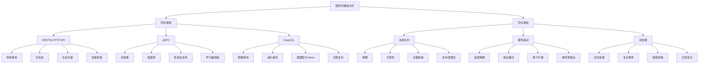

# 服务间的通信方式有哪些？各有什么特点？

## 概要回答

微服务架构中，服务间通信是核心问题之一。主要有两种通信方式：

### 同步通信
1. **RESTful HTTP API**：最常见的方式，基于HTTP协议，简单易用
2. **gRPC**：高性能RPC框架，支持多种编程语言，使用Protocol Buffers
3. **GraphQL**：灵活的数据查询语言，客户端可精确指定所需数据

### 异步通信
1. **消息队列**：如RabbitMQ、Apache Kafka，实现解耦和异步处理
2. **事件驱动**：通过发布/订阅模式实现松耦合
3. **流处理**：如Apache Kafka Streams，适用于实时数据处理

每种方式都有其适用场景，选择时需要考虑性能、可靠性、复杂度等因素。

## 深度解析

### 同步通信方式

#### 1. RESTful HTTP API
REST是最广泛使用的微服务通信方式，具有以下特点：

**优点：**
- 简单易懂，学习成本低
- 无状态，易于扩展
- 支持多种数据格式（JSON、XML等）
- 工具生态丰富

**缺点：**
- 性能相对较低（文本传输、HTTP开销）
- 缺乏强类型约束
- 版本管理复杂

#### 2. gRPC
gRPC是由Google开发的高性能RPC框架，具有以下特点：

**优点：**
- 高性能，基于HTTP/2
- 强类型接口定义（Protocol Buffers）
- 支持多种编程语言
- 内置负载均衡、健康检查等特性

**缺点：**
- 学习曲线较陡峭
- 调试相对困难
- 浏览器支持有限

#### 3. GraphQL
GraphQL是由Facebook开发的数据查询语言，具有以下特点：

**优点：**
- 客户端可精确指定所需数据
- 减少网络请求次数
- 强类型Schema
- 实时数据订阅

**缺点：**
- 服务端实现复杂
- 缓存策略复杂
- 可能导致N+1查询问题

### 异步通信方式

#### 1. 消息队列
消息队列是实现服务间异步通信的重要方式，具有以下特点：

**优点：**
- 解耦服务间依赖
- 提高系统可靠性
- 支持流量削峰
- 实现异步处理

**缺点：**
- 增加系统复杂度
- 数据一致性处理复杂
- 需要额外的基础设施

#### 2. 事件驱动
事件驱动架构通过发布/订阅模式实现服务间通信，具有以下特点：

**优点：**
- 高度解耦
- 支持扇出模式
- 易于扩展新功能
- 符合领域驱动设计思想

**缺点：**
- 事件顺序难以保证
- 调试和追踪困难
- 最终一致性需要特别处理

#### 3. 流处理
流处理适用于需要实时处理大量数据的场景，具有以下特点：

**优点：**
- 实时数据处理
- 支持复杂事件处理
- 容错能力强
- 可水平扩展

**缺点：**
- 实现复杂
- 需要专门的流处理框架
- 学习成本高

## 代码示例

以下是一些PHP实现的服务间通信示例：

```php
<?php
/**
 * 同步通信示例
 */

// 1. RESTful HTTP客户端
class RestClient {
    private $client;
    private $baseUrl;
    
    public function __construct($baseUrl) {
        $this->baseUrl = rtrim($baseUrl, '/');
        $this->client = new \GuzzleHttp\Client([
            'timeout' => 5,
            'headers' => [
                'Accept' => 'application/json',
                'Content-Type' => 'application/json'
            ]
        ]);
    }
    
    public function get($endpoint, $params = []) {
        $url = $this->baseUrl . '/' . ltrim($endpoint, '/');
        $options = empty($params) ? [] : ['query' => $params];
        
        try {
            $response = $this->client->get($url, $options);
            return json_decode($response->getBody()->getContents(), true);
        } catch (\GuzzleHttp\Exception\RequestException $e) {
            throw new Exception("HTTP GET request failed: " . $e->getMessage());
        }
    }
    
    public function post($endpoint, $data = []) {
        $url = $this->baseUrl . '/' . ltrim($endpoint, '/');
        
        try {
            $response = $this->client->post($url, ['json' => $data]);
            return json_decode($response->getBody()->getContents(), true);
        } catch (\GuzzleHttp\Exception\RequestException $e) {
            throw new Exception("HTTP POST request failed: " . $e->getMessage());
        }
    }
}

// 2. gRPC客户端示例（需要安装grpc扩展和protoc编译器）
/*
// 假设有一个用户服务的proto定义
// service UserService {
//   rpc GetUser(GetUserRequest) returns (GetUserResponse);
// }

// 使用生成的客户端代码
class GrpcUserServiceClient {
    private $client;
    
    public function __construct($host) {
        $this->client = new \UserServiceClient($host, [
            'credentials' => \Grpc\ChannelCredentials::createInsecure()
        ]);
    }
    
    public function getUser($userId) {
        $request = new \GetUserRequest();
        $request->setUserId($userId);
        
        list($response, $status) = $this->client->GetUser($request)->wait();
        
        if ($status->code !== \Grpc\STATUS_OK) {
            throw new Exception("gRPC call failed: " . $status->details);
        }
        
        return [
            'id' => $response->getUser()->getId(),
            'name' => $response->getUser()->getName(),
            'email' => $response->getUser()->getEmail()
        ];
    }
}
*/

// 3. GraphQL客户端示例
class GraphqlClient {
    private $client;
    private $baseUrl;
    
    public function __construct($baseUrl) {
        $this->baseUrl = rtrim($baseUrl, '/');
        $this->client = new \GuzzleHttp\Client([
            'timeout' => 5,
            'headers' => [
                'Accept' => 'application/json',
                'Content-Type' => 'application/json'
            ]
        ]);
    }
    
    public function query($query, $variables = []) {
        try {
            $response = $this->client->post($this->baseUrl . '/graphql', [
                'json' => [
                    'query' => $query,
                    'variables' => $variables
                ]
            ]);
            
            $result = json_decode($response->getBody()->getContents(), true);
            
            if (isset($result['errors'])) {
                throw new Exception("GraphQL query failed: " . json_encode($result['errors']));
            }
            
            return $result['data'];
        } catch (\GuzzleHttp\Exception\RequestException $e) {
            throw new Exception("GraphQL request failed: " . $e->getMessage());
        }
    }
}

/**
 * 异步通信示例
 */

// 1. RabbitMQ消息生产者
class RabbitMQProducer {
    private $connection;
    private $channel;
    
    public function __construct($host = 'localhost', $port = 5672) {
        $this->connection = new \PhpAmqpLib\Connection\AMQPStreamConnection(
            $host, $port, 'guest', 'guest'
        );
        $this->channel = $this->connection->channel();
    }
    
    public function publish($exchange, $routingKey, $message) {
        $msg = new \PhpAmqpLib\Message\AMQPMessage(
            json_encode($message),
            ['delivery_mode' => \PhpAmqpLib\Message\AMQPMessage::DELIVERY_MODE_PERSISTENT]
        );
        
        $this->channel->basic_publish($msg, $exchange, $routingKey);
        echo " [x] Sent " . json_encode($message) . "\n";
    }
    
    public function __destruct() {
        if ($this->channel) {
            $this->channel->close();
        }
        if ($this->connection) {
            $this->connection->close();
        }
    }
}

// 2. RabbitMQ消息消费者
class RabbitMQConsumer {
    private $connection;
    private $channel;
    
    public function __construct($host = 'localhost', $port = 5672) {
        $this->connection = new \PhpAmqpLib\Connection\AMQPStreamConnection(
            $host, $port, 'guest', 'guest'
        );
        $this->channel = $this->connection->channel();
    }
    
    public function consume($queue, $callback) {
        $this->channel->queue_declare($queue, false, true, false, false);
        
        $this->channel->basic_qos(null, 1, null);
        
        $this->channel->basic_consume($queue, '', false, false, false, false, $callback);
        
        while ($this->channel->is_consuming()) {
            $this->channel->wait();
        }
    }
    
    public function __destruct() {
        if ($this->channel) {
            $this->channel->close();
        }
        if ($this->connection) {
            $this->connection->close();
        }
    }
}

// 3. 事件发布者
class EventPublisher {
    private $rabbitMQProducer;
    
    public function __construct($rabbitMQProducer) {
        $this->rabbitMQProducer = $rabbitMQProducer;
    }
    
    public function publishUserCreated($userId, $userData) {
        $event = [
            'event_type' => 'user.created',
            'timestamp' => time(),
            'data' => [
                'user_id' => $userId,
                'user_data' => $userData
            ]
        ];
        
        $this->rabbitMQProducer->publish('user_events', 'user.created', $event);
    }
    
    public function publishOrderPlaced($orderId, $orderData) {
        $event = [
            'event_type' => 'order.placed',
            'timestamp' => time(),
            'data' => [
                'order_id' => $orderId,
                'order_data' => $orderData
            ]
        ];
        
        $this->rabbitMQProducer->publish('order_events', 'order.placed', $event);
    }
}

// 4. 事件订阅者
class EventSubscriber {
    private $rabbitMQConsumer;
    
    public function __construct($rabbitMQConsumer) {
        $this->rabbitMQConsumer = $rabbitMQConsumer;
    }
    
    public function subscribeToUserEvents() {
        $callback = function ($msg) {
            $event = json_decode($msg->body, true);
            
            switch ($event['event_type']) {
                case 'user.created':
                    $this->handleUserCreated($event['data']);
                    break;
                default:
                    echo "Unknown event type: " . $event['event_type'] . "\n";
            }
            
            $msg->ack();
        };
        
        $this->rabbitMQConsumer->consume('user_events_queue', $callback);
    }
    
    private function handleUserCreated($data) {
        echo "Handling user created event for user: " . $data['user_id'] . "\n";
        // 处理用户创建后的相关逻辑
        // 例如：初始化用户的积分账户、发送欢迎邮件等
    }
}

/**
 * 使用示例
 */

// 同步通信使用示例
/*
try {
    // REST客户端使用
    $userClient = new RestClient('http://user-service:8080');
    $user = $userClient->get('/users/123');
    
    $orderClient = new RestClient('http://order-service:8080');
    $orders = $orderClient->get('/orders', ['user_id' => 123]);
    
    // GraphQL客户端使用
    $graphqlClient = new GraphqlClient('http://api-gateway:8080');
    $query = '
        query GetUserWithOrders($userId: ID!) {
            user(id: $userId) {
                id
                name
                email
                orders {
                    id
                    status
                    totalAmount
                }
            }
        }
    ';
    $data = $graphqlClient->query($query, ['userId' => 123]);
    
} catch (Exception $e) {
    echo "Error: " . $e->getMessage() . "\n";
}
*/

// 异步通信使用示例
/*
try {
    // 消息队列使用
    $producer = new RabbitMQProducer('localhost', 5672);
    $publisher = new EventPublisher($producer);
    
    $publisher->publishUserCreated(123, [
        'name' => 'John Doe',
        'email' => 'john@example.com'
    ]);
    
    // 消费者使用（通常在单独的进程中运行）
    /*
    $consumer = new RabbitMQConsumer('localhost', 5672);
    $subscriber = new EventSubscriber($consumer);
    $subscriber->subscribeToUserEvents();
    *\/
    
} catch (Exception $e) {
    echo "Error: " . $e->getMessage() . "\n";
}
*/
?>
```

## 图示说明



通过合理选择服务间通信方式，可以在性能、可靠性、开发效率等方面取得平衡，构建出高质量的微服务系统。