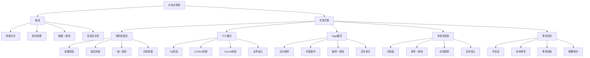

# 如何实现分布式事务？

## 概要回答

分布式事务是指在分布式系统中，涉及多个节点或服务的事务操作。由于微服务架构中每个服务都有独立的数据库，传统的ACID事务无法直接应用，因此需要特殊的解决方案。

主要实现方式包括：

1. **两阶段提交（2PC）**：经典的分布式事务协议，但存在阻塞和单点故障问题
2. **三阶段提交（3PC）**：对2PC的改进，减少了阻塞时间
3. **TCC模式（Try-Confirm-Cancel）**：通过业务层面的补偿机制实现分布式事务
4. **Saga模式**：通过一系列本地事务和补偿操作实现最终一致性
5. **本地消息表**：通过消息队列保证数据一致性
6. **事务消息**：利用消息中间件的事务特性

在实际应用中，应根据业务场景选择合适的方案，通常最终一致性比强一致性更实用。

## 深度解析

### 分布式事务的挑战

在单体应用中，数据库事务可以保证ACID特性（原子性、一致性、隔离性、持久性）。但在微服务架构中，由于数据分散在不同的服务和数据库中，传统的事务机制不再适用，面临以下挑战：

1. **网络分区**：网络故障可能导致部分服务无法访问
2. **超时处理**：服务调用可能出现超时，难以判断执行状态
3. **数据一致性**：跨服务的数据修改难以保证一致性
4. **回滚复杂性**：分布式环境下的事务回滚更加复杂

### 主要实现方案

#### 1. 两阶段提交（2PC）
两阶段提交是最经典的分布式事务协议，分为准备阶段和提交阶段。

**准备阶段**：协调者询问所有参与者是否可以提交事务
**提交阶段**：根据所有参与者的响应决定提交或回滚

**优点：**
- 强一致性保证
- 实现相对简单

**缺点：**
- 同步阻塞，性能较差
- 单点故障风险
- 数据不一致风险

#### 2. TCC模式（Try-Confirm-Cancel）
TCC是一种业务层面的补偿事务模式，要求业务逻辑实现三个操作：

**Try**：预留资源
**Confirm**：确认执行
**Cancel**：释放资源

**优点：**
- 性能较好
- 业务侵入性强，控制精细

**缺点：**
- 实现复杂
- 对业务逻辑有侵入性

#### 3. Saga模式
Saga模式将一个长事务拆分为多个本地事务，每个本地事务都有对应的补偿操作。

**正向操作**：执行业务逻辑
**补偿操作**：撤销已执行的操作

**优点：**
- 适合长时间运行的业务流程
- 异步执行，性能好

**缺点：**
- 补偿逻辑复杂
- 最终一致性而非强一致性

#### 4. 本地消息表
通过在业务数据库中增加消息表来实现事务一致性。

**优点：**
- 实现简单
- 可靠性高

**缺点：**
- 业务侵入性
- 需要额外的表维护

#### 5. 事务消息
利用消息中间件提供的事务特性来保证消息与本地事务的一致性。

**优点：**
- 解耦性好
- 可靠性高

**缺点：**
- 依赖消息中间件
- 实现复杂

## 代码示例

以下是几种分布式事务实现方式的PHP代码示例：

```php
<?php
/**
 * 分布式事务实现示例
 */

// 1. TCC模式实现
interface TccTransactionInterface {
    /**
     * Try阶段：预留资源
     */
    public function try(array $params);
    
    /**
     * Confirm阶段：确认执行
     */
    public function confirm(string $transactionId);
    
    /**
     * Cancel阶段：释放资源
     */
    public function cancel(string $transactionId);
}

// 库存服务TCC实现
class InventoryTccService implements TccTransactionInterface {
    private $inventoryRepository;
    private $transactionRepository;
    
    public function __construct($inventoryRepository, $transactionRepository) {
        $this->inventoryRepository = $inventoryRepository;
        $this->transactionRepository = $transactionRepository;
    }
    
    /**
     * Try阶段：检查并预留库存
     */
    public function try(array $params) {
        $productId = $params['product_id'];
        $quantity = $params['quantity'];
        $transactionId = $params['transaction_id'];
        
        // 检查库存是否充足
        $stock = $this->inventoryRepository->getStock($productId);
        if ($stock < $quantity) {
            throw new Exception("Insufficient stock for product {$productId}");
        }
        
        // 预留库存（冻结库存）
        $this->inventoryRepository->freezeStock($productId, $quantity);
        
        // 记录事务状态
        $this->transactionRepository->create([
            'transaction_id' => $transactionId,
            'service' => 'inventory',
            'status' => 'trying',
            'product_id' => $productId,
            'quantity' => $quantity,
            'created_at' => date('Y-m-d H:i:s')
        ]);
        
        return [
            'transaction_id' => $transactionId,
            'status' => 'try_success'
        ];
    }
    
    /**
     * Confirm阶段：确认扣减库存
     */
    public function confirm(string $transactionId) {
        $transaction = $this->transactionRepository->findByTransactionId($transactionId);
        if (!$transaction || $transaction['status'] !== 'trying') {
            throw new Exception("Invalid transaction state for confirm");
        }
        
        // 确认扣减库存
        $this->inventoryRepository->deductStock(
            $transaction['product_id'], 
            $transaction['quantity']
        );
        
        // 更新事务状态
        $this->transactionRepository->updateStatus($transactionId, 'confirmed');
        
        return [
            'transaction_id' => $transactionId,
            'status' => 'confirm_success'
        ];
    }
    
    /**
     * Cancel阶段：释放预留库存
     */
    public function cancel(string $transactionId) {
        $transaction = $this->transactionRepository->findByTransactionId($transactionId);
        if (!$transaction || $transaction['status'] !== 'trying') {
            // 如果已经是取消状态或者不存在，则直接返回
            return [
                'transaction_id' => $transactionId,
                'status' => 'already_cancelled'
            ];
        }
        
        // 释放预留库存
        $this->inventoryRepository->unfreezeStock(
            $transaction['product_id'], 
            $transaction['quantity']
        );
        
        // 更新事务状态
        $this->transactionRepository->updateStatus($transactionId, 'cancelled');
        
        return [
            'transaction_id' => $transactionId,
            'status' => 'cancel_success'
        ];
    }
}

// 订单服务TCC实现
class OrderTccService implements TccTransactionInterface {
    private $orderRepository;
    private $transactionRepository;
    
    public function __construct($orderRepository, $transactionRepository) {
        $this->orderRepository = $orderRepository;
        $this->transactionRepository = $transactionRepository;
    }
    
    /**
     * Try阶段：创建订单预记录
     */
    public function try(array $params) {
        $userId = $params['user_id'];
        $items = $params['items'];
        $transactionId = $params['transaction_id'];
        
        // 计算订单总额
        $totalAmount = $this->calculateTotalAmount($items);
        
        // 创建订单预记录
        $order = $this->orderRepository->createPreOrder([
            'user_id' => $userId,
            'total_amount' => $totalAmount,
            'status' => 'preparing',
            'created_at' => date('Y-m-d H:i:s')
        ]);
        
        // 创建订单项
        foreach ($items as $item) {
            $this->orderRepository->createOrderItem([
                'order_id' => $order['id'],
                'product_id' => $item['product_id'],
                'quantity' => $item['quantity'],
                'unit_price' => $item['unit_price']
            ]);
        }
        
        // 记录事务状态
        $this->transactionRepository->create([
            'transaction_id' => $transactionId,
            'service' => 'order',
            'status' => 'trying',
            'order_id' => $order['id'],
            'user_id' => $userId,
            'created_at' => date('Y-m-d H:i:s')
        ]);
        
        return [
            'transaction_id' => $transactionId,
            'order_id' => $order['id'],
            'status' => 'try_success'
        ];
    }
    
    /**
     * Confirm阶段：确认订单
     */
    public function confirm(string $transactionId) {
        $transaction = $this->transactionRepository->findByTransactionId($transactionId);
        if (!$transaction || $transaction['status'] !== 'trying') {
            throw new Exception("Invalid transaction state for confirm");
        }
        
        // 确认订单
        $this->orderRepository->confirmOrder($transaction['order_id']);
        
        // 更新事务状态
        $this->transactionRepository->updateStatus($transactionId, 'confirmed');
        
        return [
            'transaction_id' => $transactionId,
            'order_id' => $transaction['order_id'],
            'status' => 'confirm_success'
        ];
    }
    
    /**
     * Cancel阶段：取消订单
     */
    public function cancel(string $transactionId) {
        $transaction = $this->transactionRepository->findByTransactionId($transactionId);
        if (!$transaction || $transaction['status'] !== 'trying') {
            return [
                'transaction_id' => $transactionId,
                'status' => 'already_cancelled'
            ];
        }
        
        // 取消订单
        $this->orderRepository->cancelOrder($transaction['order_id']);
        
        // 更新事务状态
        $this->transactionRepository->updateStatus($transactionId, 'cancelled');
        
        return [
            'transaction_id' => $transactionId,
            'order_id' => $transaction['order_id'],
            'status' => 'cancel_success'
        ];
    }
    
    /**
     * 计算订单总额
     */
    private function calculateTotalAmount($items) {
        $total = 0;
        foreach ($items as $item) {
            $total += $item['quantity'] * $item['unit_price'];
        }
        return $total;
    }
}

// TCC事务协调器
class TccTransactionCoordinator {
    private $services = [];
    private $transactionLogRepository;
    
    public function __construct($transactionLogRepository) {
        $this->transactionLogRepository = $transactionLogRepository;
    }
    
    /**
     * 注册TCC服务
     */
    public function registerService(string $serviceName, TccTransactionInterface $service) {
        $this->services[$serviceName] = $service;
    }
    
    /**
     * 执行全局事务
     */
    public function executeGlobalTransaction(array $participants, array $params) {
        $transactionId = uniqid('tx_', true);
        $tryResults = [];
        
        try {
            // 1. Try阶段：所有参与者预留资源
            foreach ($participants as $serviceName => $serviceParams) {
                if (!isset($this->services[$serviceName])) {
                    throw new Exception("Service {$serviceName} not registered");
                }
                
                $serviceParams['transaction_id'] = $transactionId;
                $result = $this->services[$serviceName]->try($serviceParams);
                $tryResults[$serviceName] = $result;
            }
            
            // 2. Confirm阶段：所有参与者确认执行
            foreach ($participants as $serviceName => $serviceParams) {
                $this->services[$serviceName]->confirm($transactionId);
            }
            
            // 记录全局事务成功
            $this->transactionLogRepository->logTransaction($transactionId, 'success', $tryResults);
            
            return [
                'transaction_id' => $transactionId,
                'status' => 'success',
                'results' => $tryResults
            ];
            
        } catch (Exception $e) {
            // 3. Cancel阶段：回滚所有已成功的Try操作
            foreach (array_reverse(array_keys($tryResults)) as $serviceName) {
                try {
                    $this->services[$serviceName]->cancel($transactionId);
                } catch (Exception $cancelException) {
                    // 记录取消失败，但继续处理其他服务
                    echo "Cancel failed for service {$serviceName}: " . $cancelException->getMessage() . "\n";
                }
            }
            
            // 记录全局事务失败
            $this->transactionLogRepository->logTransaction($transactionId, 'failed', [
                'error' => $e->getMessage(),
                'try_results' => $tryResults
            ]);
            
            throw $e;
        }
    }
}

// 2. Saga模式实现
class SagaTransactionManager {
    private $steps = [];
    private $compensations = [];
    private $executedSteps = [];
    
    /**
     * 添加事务步骤
     */
    public function addStep(callable $action, callable $compensation) {
        $this->steps[] = $action;
        $this->compensations[] = $compensation;
        return $this;
    }
    
    /**
     * 执行Saga事务
     */
    public function execute() {
        $transactionId = uniqid('saga_', true);
        
        try {
            // 正向执行所有步骤
            foreach ($this->steps as $index => $step) {
                $result = call_user_func($step, $transactionId);
                $this->executedSteps[] = $index;
                
                // 记录步骤执行结果
                echo "Step {$index} executed successfully\n";
            }
            
            return [
                'transaction_id' => $transactionId,
                'status' => 'success'
            ];
            
        } catch (Exception $e) {
            // 执行补偿操作
            $this->compensate();
            
            throw new Exception("Saga transaction failed: " . $e->getMessage());
        }
    }
    
    /**
     * 执行补偿操作
     */
    private function compensate() {
        // 反向执行已执行步骤的补偿操作
        foreach (array_reverse($this->executedSteps) as $index) {
            try {
                call_user_func($this->compensations[$index]);
                echo "Compensation for step {$index} executed successfully\n";
            } catch (Exception $e) {
                echo "Compensation for step {$index} failed: " . $e->getMessage() . "\n";
            }
        }
    }
}

// 3. 本地消息表实现
class LocalMessageTableService {
    private $orderRepository;
    private $messageRepository;
    private $inventoryServiceClient;
    
    public function __construct($orderRepository, $messageRepository, $inventoryServiceClient) {
        $this->orderRepository = $orderRepository;
        $this->messageRepository = $messageRepository;
        $this->inventoryServiceClient = $inventoryServiceClient;
    }
    
    /**
     * 创建订单并发送消息
     */
    public function createOrderWithMessage($orderData) {
        try {
            // 开启数据库事务
            $this->orderRepository->beginTransaction();
            
            // 1. 创建订单
            $order = $this->orderRepository->create($orderData);
            
            // 2. 插入消息到本地消息表
            $message = [
                'message_id' => uniqid('msg_', true),
                'message_body' => json_encode([
                    'event_type' => 'order.created',
                    'order_id' => $order['id'],
                    'user_id' => $orderData['user_id'],
                    'items' => $orderData['items']
                ]),
                'status' => 'pending',
                'created_at' => date('Y-m-d H:i:s')
            ];
            
            $this->messageRepository->insert($message);
            
            // 提交数据库事务
            $this->orderRepository->commit();
            
            // 3. 异步发送消息给库存服务
            $this->sendMessageToInventoryService($message);
            
            return $order;
            
        } catch (Exception $e) {
            // 回滚数据库事务
            $this->orderRepository->rollback();
            throw $e;
        }
    }
    
    /**
     * 发送消息给库存服务
     */
    private function sendMessageToInventoryService($message) {
        try {
            // 发送消息给库存服务
            $messageBody = json_decode($message['message_body'], true);
            $this->inventoryServiceClient->reserveStock($messageBody['items']);
            
            // 更新消息状态为已发送
            $this->messageRepository->updateStatus($message['message_id'], 'sent');
            
        } catch (Exception $e) {
            // 发送失败，消息状态保持为pending，由定时任务重试
            echo "Failed to send message: " . $e->getMessage() . "\n";
        }
    }
    
    /**
     * 消息重试机制
     */
    public function retryPendingMessages() {
        $pendingMessages = $this->messageRepository->findPendingMessages();
        
        foreach ($pendingMessages as $message) {
            try {
                $this->sendMessageToInventoryService($message);
            } catch (Exception $e) {
                // 更新重试次数
                $this->messageRepository->incrementRetryCount($message['message_id']);
                echo "Retry failed for message {$message['message_id']}: " . $e->getMessage() . "\n";
            }
        }
    }
}

// 4. 事务消息实现（以RocketMQ为例）
class TransactionalMessageService {
    private $rocketMQProducer;
    private $orderRepository;
    
    public function __construct($rocketMQProducer, $orderRepository) {
        $this->rocketMQProducer = $rocketMQProducer;
        $this->orderRepository = $orderRepository;
    }
    
    /**
     * 发送事务消息
     */
    public function sendOrderTransactionMessage($orderData) {
        // 创建半消息
        $message = new \RocketMQ\Message();
        $message->setTopic('order-topic');
        $message->setTags('create-order');
        $message->setBody(json_encode($orderData));
        
        // 发送半消息
        $transactionSendResult = $this->rocketMQProducer->sendMessageInTransaction($message, function($message, $arg) {
            // 本地事务执行
            return $this->executeLocalTransaction($message, $arg);
        }, $orderData);
        
        return $transactionSendResult;
    }
    
    /**
     * 执行本地事务
     */
    private function executeLocalTransaction($message, $orderData) {
        try {
            // 执行本地事务：创建订单
            $this->orderRepository->create($orderData);
            return \RocketMQ\LocalTransactionState::COMMIT_MESSAGE;
        } catch (Exception $e) {
            echo "Local transaction failed: " . $e->getMessage() . "\n";
            return \RocketMQ\LocalTransactionState::ROLLBACK_MESSAGE;
        }
    }
    
    /**
     * 事务回查
     */
    public function checkLocalTransaction($message) {
        $orderData = json_decode($message->getBody(), true);
        $orderId = $orderData['order_id'];
        
        // 检查订单是否存在
        $order = $this->orderRepository->findById($orderId);
        
        if ($order) {
            return \RocketMQ\LocalTransactionState::COMMIT_MESSAGE;
        } else {
            return \RocketMQ\LocalTransactionState::ROLLBACK_MESSAGE;
        }
    }
}

/**
 * 使用示例
 */

// TCC模式使用示例
/*
try {
    $coordinator = new TccTransactionCoordinator($transactionLogRepository);
    $coordinator->registerService('inventory', new InventoryTccService($inventoryRepo, $transactionRepo));
    $coordinator->registerService('order', new OrderTccService($orderRepo, $transactionRepo));
    
    $participants = [
        'inventory' => [
            'product_id' => 1,
            'quantity' => 2
        ],
        'order' => [
            'user_id' => 123,
            'items' => [
                ['product_id' => 1, 'quantity' => 2, 'unit_price' => 100]
            ]
        ]
    ];
    
    $result = $coordinator->executeGlobalTransaction($participants, []);
    echo "TCC transaction completed: " . json_encode($result) . "\n";
} catch (Exception $e) {
    echo "TCC transaction failed: " . $e->getMessage() . "\n";
}
*/

// Saga模式使用示例
/*
$sagaManager = new SagaTransactionManager();

// 添加创建订单步骤
$sagaManager->addStep(
    function($transactionId) {
        // 创建订单
        echo "Creating order in step 1\n";
        return ['order_id' => 123];
    },
    function() {
        // 补偿：取消订单
        echo "Canceling order in compensation 1\n";
    }
);

// 添加扣减库存步骤
$sagaManager->addStep(
    function($transactionId) {
        // 扣减库存
        echo "Deducting inventory in step 2\n";
        return ['stock_deducted' => true];
    },
    function() {
        // 补偿：恢复库存
        echo "Restoring inventory in compensation 2\n";
    }
);

// 添加支付步骤
$sagaManager->addStep(
    function($transactionId) {
        // 执行支付
        echo "Processing payment in step 3\n";
        return ['payment_id' => 456];
    },
    function() {
        // 补偿：退款
        echo "Refunding payment in compensation 3\n";
    }
);

try {
    $result = $sagaManager->execute();
    echo "Saga transaction completed: " . json_encode($result) . "\n";
} catch (Exception $e) {
    echo "Saga transaction failed: " . $e->getMessage() . "\n";
}
*/

// 本地消息表使用示例
/*
$messageService = new LocalMessageTableService($orderRepo, $messageRepo, $inventoryClient);

$orderData = [
    'user_id' => 123,
    'items' => [
        ['product_id' => 1, 'quantity' => 2, 'unit_price' => 100]
    ],
    'total_amount' => 200
];

try {
    $order = $messageService->createOrderWithMessage($orderData);
    echo "Order created with message: " . json_encode($order) . "\n";
} catch (Exception $e) {
    echo "Failed to create order: " . $e->getMessage() . "\n";
}

// 定时重试消息
$messageService->retryPendingMessages();
*/
?>
```

## 图示说明



通过合理选择分布式事务实现方案，可以在保证数据一致性的同时，兼顾系统性能和可用性。在实际应用中，应根据业务场景的特点选择最适合的方案。