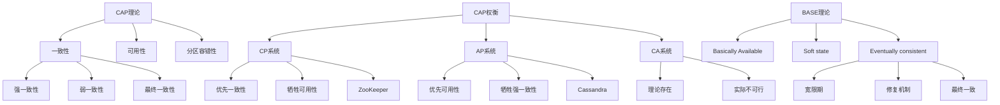

# CAP理论在分布式系统中的应用？

## 概要回答

CAP理论是分布式系统设计的基础理论，它指出在分布式系统中，一致性（Consistency）、可用性（Availability）和分区容错性（Partition Tolerance）这三个属性最多只能同时满足两个。

在实际应用中，由于网络分区不可避免，分布式系统必须在一致性和可用性之间做出权衡：

1. **CP系统**：优先保证一致性和分区容错性，牺牲可用性
2. **AP系统**：优先保证可用性和分区容错性，牺牲强一致性
3. **CA系统**：理论上存在，但在真实分布式环境中几乎不可能实现

现代分布式系统设计通常采用**BASE理论**（Basically Available, Soft state, Eventually consistent）作为指导，追求最终一致性。

## 深度解析

### CAP理论详解

#### 1. 一致性（Consistency）
一致性指的是所有节点在同一时刻看到的数据是相同的，即数据在分布式系统中的各个副本保持一致。这与ACID事务中的C有所不同，ACID中的一致性是指数据库在事务执行前后保持约束和规则。

在分布式系统中，一致性可以分为：
- **强一致性**：任何时刻读取到的数据都是最新的
- **弱一致性**：系统不保证后续的读操作能立即读到最新写入的值
- **最终一致性**：经过一段时间后，所有节点的数据将达到一致状态

#### 2. 可用性（Availability）
可用性指的是系统在任何时候都能响应用户的请求，即使某些节点发生故障。对于用户的每一次操作，系统总能在有限的时间内返回结果。

需要注意的是，可用性并不意味着系统一定能返回最新的数据，而是指系统能够响应请求。

#### 3. 分区容错性（Partition Tolerance）
分区容错性指的是当网络分区（即网络故障导致节点间无法通信）发生时，系统仍能继续运行。在网络分布式系统中，分区是不可避免的，因此分区容错性是必须满足的。

### CAP权衡分析

由于分区容错性是分布式系统的必然要求，因此实际上只有三种选择：

#### CP系统（一致性+分区容错性）
这类系统在网络分区发生时，为了保证数据一致性，可能会拒绝部分请求，从而牺牲可用性。

**典型代表**：
- 传统关系型数据库集群（如MySQL Cluster）
- Zookeeper
- etcd

**应用场景**：
- 金融交易系统
- 库存管理系统
- 配置管理中心

#### AP系统（可用性+分区容错性）
这类系统在网络分区发生时，优先保证系统的可用性，但可能会出现数据不一致的情况。

**典型代表**：
- DNS
- Web缓存
- Cassandra
- Amazon DynamoDB

**应用场景**：
- 社交网络
- 内容分发网络
- 推荐系统

#### CA系统（一致性+可用性）
理论上存在的系统，但要求网络绝对可靠，没有分区发生。在真实的分布式环境中几乎不可能实现。

### BASE理论

由于强一致性的代价过高，现代分布式系统更多采用BASE理论：

#### Basically Available（基本可用）
系统保证大部分时间是可用的，允许在极端情况下损失部分可用性。

#### Soft state（软状态）
系统状态可以随时间变化，即使没有输入也会发生变化。

#### Eventually consistent（最终一致性）
系统保证在没有新的更新操作的情况下，经过一段时间后所有节点的数据将达到一致状态。

## 代码示例

以下是CAP理论在实际系统中的应用示例：

```php
<?php
/**
 * CAP理论应用示例
 */

// 1. CP系统模拟 - 强一致性优先
class CPSystem {
    private $nodes = [];
    private $quorumSize;
    
    public function __construct($nodeCount) {
        // 初始化节点
        for ($i = 0; $i < $nodeCount; $i++) {
            $this->nodes[] = new Node("node_{$i}");
        }
        
        // 计算法定人数（多数派）
        $this->quorumSize = intval($nodeCount / 2) + 1;
    }
    
    /**
     * 写操作 - 确保强一致性
     */
    public function write($key, $value) {
        $successCount = 0;
        $errors = [];
        
        // 向所有节点写入数据
        foreach ($this->nodes as $node) {
            try {
                $node->write($key, $value);
                $successCount++;
            } catch (Exception $e) {
                $errors[] = $e->getMessage();
            }
        }
        
        // 检查是否达到法定人数
        if ($successCount >= $this->quorumSize) {
            return [
                'status' => 'success',
                'message' => "Data written to {$successCount}/" . count($this->nodes) . " nodes"
            ];
        } else {
            // 回滚已成功的写入
            foreach ($this->nodes as $node) {
                try {
                    $node->rollback($key);
                } catch (Exception $e) {
                    // 记录回滚失败
                }
            }
            
            throw new Exception("Write failed: " . implode(', ', $errors));
        }
    }
    
    /**
     * 读操作 - 从多数节点读取并验证一致性
     */
    public function read($key) {
        $responses = [];
        $errors = [];
        
        // 从所有节点读取数据
        foreach ($this->nodes as $node) {
            try {
                $value = $node->read($key);
                $responses[] = [
                    'node' => $node->getId(),
                    'value' => $value,
                    'version' => $node->getVersion($key)
                ];
            } catch (Exception $e) {
                $errors[] = $e->getMessage();
            }
        }
        
        // 检查是否达到法定人数
        if (count($responses) < $this->quorumSize) {
            throw new Exception("Not enough nodes available for read: " . implode(', ', $errors));
        }
        
        // 验证数据一致性
        return $this->validateConsistency($responses);
    }
    
    /**
     * 验证数据一致性
     */
    private function validateConsistency($responses) {
        if (empty($responses)) {
            throw new Exception("No responses received");
        }
        
        // 检查版本号是否一致
        $firstVersion = $responses[0]['version'];
        $firstValue = $responses[0]['value'];
        
        foreach ($responses as $response) {
            if ($response['version'] !== $firstVersion) {
                throw new Exception("Data inconsistency detected between nodes");
            }
            
            if ($response['value'] !== $firstValue) {
                throw new Exception("Data value inconsistency detected between nodes");
            }
        }
        
        return [
            'value' => $firstValue,
            'version' => $firstVersion,
            'node_count' => count($responses)
        ];
    }
}

// 2. AP系统模拟 - 可用性优先
class APSystem {
    private $nodes = [];
    private $minAvailableNodes;
    
    public function __construct($nodeCount) {
        // 初始化节点
        for ($i = 0; $i < $nodeCount; $i++) {
            $this->nodes[] = new Node("node_{$i}");
        }
        
        // 至少需要一个节点可用
        $this->minAvailableNodes = 1;
    }
    
    /**
     * 写操作 - 尽可能写入可用节点
     */
    public function write($key, $value) {
        $successCount = 0;
        $errors = [];
        
        // 向尽可能多的节点写入数据
        foreach ($this->nodes as $node) {
            try {
                $node->write($key, $value);
                $successCount++;
            } catch (Exception $e) {
                $errors[] = $e->getMessage();
                // 继续尝试其他节点
            }
        }
        
        // 只要有一个节点写入成功就认为成功
        if ($successCount >= $this->minAvailableNodes) {
            return [
                'status' => 'success',
                'message' => "Data written to {$successCount}/" . count($this->nodes) . " nodes",
                'inconsistency_possible' => $successCount < count($this->nodes)
            ];
        } else {
            throw new Exception("Write failed on all nodes: " . implode(', ', $errors));
        }
    }
    
    /**
     * 读操作 - 从任意可用节点读取
     */
    public function read($key) {
        // 尝试从节点读取，直到成功
        foreach ($this->nodes as $node) {
            try {
                $value = $node->read($key);
                return [
                    'value' => $value,
                    'node' => $node->getId(),
                    'may_not_be_latest' => true
                ];
            } catch (Exception $e) {
                // 继续尝试下一个节点
                continue;
            }
        }
        
        throw new Exception("No nodes available for read");
    }
    
    /**
     * 异步一致性修复
     */
    public function asyncRepair() {
        // 在后台异步修复数据不一致
        // 这里简化实现，实际系统会有更复杂的修复逻辑
        echo "Starting async consistency repair...\n";
        
        // 获取所有节点的数据版本
        $nodeData = [];
        foreach ($this->nodes as $node) {
            try {
                $nodeData[$node->getId()] = $node->getAllData();
            } catch (Exception $e) {
                // 跳过不可用节点
            }
        }
        
        // 简化的修复逻辑：以最新写入的节点为准
        $latestData = $this->findLatestData($nodeData);
        
        // 同步到所有可用节点
        foreach ($this->nodes as $node) {
            try {
                $node->syncData($latestData);
            } catch (Exception $e) {
                // 记录同步失败
                echo "Failed to sync node {$node->getId()}: " . $e->getMessage() . "\n";
            }
        }
        
        echo "Async consistency repair completed\n";
    }
    
    /**
     * 查找最新的数据
     */
    private function findLatestData($nodeData) {
        $latestData = [];
        
        // 简化实现：合并所有节点的数据，以版本号最高的为准
        foreach ($nodeData as $nodeId => $data) {
            foreach ($data as $key => $valueInfo) {
                if (!isset($latestData[$key]) || 
                    $valueInfo['version'] > $latestData[$key]['version']) {
                    $latestData[$key] = $valueInfo;
                }
            }
        }
        
        return $latestData;
    }
}

// 3. 节点模拟类
class Node {
    private $id;
    private $data = [];
    private $versions = [];
    
    public function __construct($id) {
        $this->id = $id;
    }
    
    public function getId() {
        return $this->id;
    }
    
    /**
     * 写入数据
     */
    public function write($key, $value) {
        // 模拟网络分区：有一定概率失败
        if (rand(1, 100) <= 10) { // 10%概率失败
            throw new Exception("Network partition occurred on node {$this->id}");
        }
        
        // 更新数据和版本号
        $this->data[$key] = $value;
        if (!isset($this->versions[$key])) {
            $this->versions[$key] = 0;
        }
        $this->versions[$key]++;
        
        echo "Node {$this->id}: wrote key '{$key}' with value '{$value}' (version: {$this->versions[$key]})\n";
    }
    
    /**
     * 读取数据
     */
    public function read($key) {
        // 模拟网络分区：有一定概率失败
        if (rand(1, 100) <= 10) { // 10%概率失败
            throw new Exception("Network partition occurred on node {$this->id}");
        }
        
        if (!isset($this->data[$key])) {
            throw new Exception("Key '{$key}' not found on node {$this->id}");
        }
        
        echo "Node {$this->id}: read key '{$key}' with value '{$this->data[$key]}'\n";
        return $this->data[$key];
    }
    
    /**
     * 获取版本号
     */
    public function getVersion($key) {
        return $this->versions[$key] ?? 0;
    }
    
    /**
     * 回滚操作
     */
    public function rollback($key) {
        if (isset($this->data[$key])) {
            unset($this->data[$key]);
            unset($this->versions[$key]);
            echo "Node {$this->id}: rolled back key '{$key}'\n";
        }
    }
    
    /**
     * 获取所有数据
     */
    public function getAllData() {
        $result = [];
        foreach ($this->data as $key => $value) {
            $result[$key] = [
                'value' => $value,
                'version' => $this->versions[$key] ?? 0
            ];
        }
        return $result;
    }
    
    /**
     * 同步数据
     */
    public function syncData($data) {
        foreach ($data as $key => $valueInfo) {
            $this->data[$key] = $valueInfo['value'];
            $this->versions[$key] = $valueInfo['version'];
        }
        echo "Node {$this->id}: synced data\n";
    }
}

// 4. BASE理论实现示例
class BaseService {
    private $cache = [];
    private $storage;
    private $lastSyncTime = 0;
    private $syncInterval = 5; // 5秒同步间隔
    
    public function __construct($storage) {
        $this->storage = $storage;
    }
    
    /**
     * 基本可用的写操作
     */
    public function write($key, $value) {
        try {
            // 先写入缓存（快速响应）
            $this->cache[$key] = [
                'value' => $value,
                'timestamp' => time(),
                'status' => 'dirty' // 标记为脏数据，需要同步到持久化存储
            ];
            
            // 异步写入持久化存储
            $this->asyncWriteToStorage($key, $value);
            
            return [
                'status' => 'success',
                'message' => 'Data written to cache, will sync to storage asynchronously'
            ];
        } catch (Exception $e) {
            // 即使持久化存储失败，也要保证缓存可用
            return [
                'status' => 'partial_success',
                'message' => 'Data written to cache but failed to sync to storage: ' . $e->getMessage()
            ];
        }
    }
    
    /**
     * 最终一致性的读操作
     */
    public function read($key) {
        // 首先检查缓存
        if (isset($this->cache[$key])) {
            $cacheData = $this->cache[$key];
            
            // 如果缓存数据较新，直接返回
            if ($cacheData['status'] === 'clean') {
                return [
                    'value' => $cacheData['value'],
                    'source' => 'cache',
                    'consistent' => true
                ];
            } else {
                // 返回可能不一致的数据，但保证可用性
                return [
                    'value' => $cacheData['value'],
                    'source' => 'cache',
                    'consistent' => false,
                    'eventually_consistent' => true
                ];
            }
        }
        
        // 缓存未命中，从持久化存储读取
        try {
            $value = $this->storage->read($key);
            // 更新缓存
            $this->cache[$key] = [
                'value' => $value,
                'timestamp' => time(),
                'status' => 'clean'
            ];
            
            return [
                'value' => $value,
                'source' => 'storage',
                'consistent' => true
            ];
        } catch (Exception $e) {
            throw new Exception("Failed to read from storage: " . $e->getMessage());
        }
    }
    
    /**
     * 异步写入持久化存储
     */
    private function asyncWriteToStorage($key, $value) {
        // 在实际系统中，这里会使用消息队列或后台任务
        // 这里简化为延迟执行
        $this->scheduleStorageWrite($key, $value);
    }
    
    /**
     * 调度存储写入
     */
    private function scheduleStorageWrite($key, $value) {
        // 模拟异步写入
        // 在实际应用中，这可能是通过消息队列或定时任务实现
        echo "Scheduled write to storage for key '{$key}'\n";
    }
    
    /**
     * 同步缓存和存储数据
     */
    public function syncCacheAndStorage() {
        $now = time();
        
        // 检查是否需要同步
        if ($now - $this->lastSyncTime < $this->syncInterval) {
            return;
        }
        
        $this->lastSyncTime = $now;
        
        // 同步脏数据到存储
        foreach ($this->cache as $key => $data) {
            if ($data['status'] === 'dirty') {
                try {
                    $this->storage->write($key, $data['value']);
                    // 更新缓存状态
                    $this->cache[$key]['status'] = 'clean';
                    echo "Synced key '{$key}' to storage\n";
                } catch (Exception $e) {
                    echo "Failed to sync key '{$key}': " . $e->getMessage() . "\n";
                }
            }
        }
    }
    
    /**
     * 数据存储接口
     */
    public function getStorageStats() {
        return [
            'cache_size' => count($this->cache),
            'dirty_count' => count(array_filter($this->cache, function($item) {
                return $item['status'] === 'dirty';
            })),
            'last_sync' => $this->lastSyncTime
        ];
    }
}

// 5. 持久化存储模拟
class PersistentStorage {
    private $data = [];
    
    public function write($key, $value) {
        // 模拟存储写入延迟
        usleep(rand(10000, 50000)); // 10-50ms延迟
        
        // 模拟偶尔的写入失败
        if (rand(1, 100) <= 5) { // 5%概率失败
            throw new Exception("Storage write failed");
        }
        
        $this->data[$key] = $value;
        echo "Storage: wrote key '{$key}' with value '{$value}'\n";
    }
    
    public function read($key) {
        // 模拟存储读取延迟
        usleep(rand(5000, 20000)); // 5-20ms延迟
        
        if (!isset($this->data[$key])) {
            throw new Exception("Key '{$key}' not found in storage");
        }
        
        echo "Storage: read key '{$key}' with value '{$this->data[$key]}'\n";
        return $this->data[$key];
    }
}

/**
 * 使用示例
 */

// CP系统示例
/*
echo "=== CP System Example ===\n";
try {
    $cpSystem = new CPSystem(3); // 3个节点
    
    // 写入数据
    $result = $cpSystem->write('user_123', ['name' => 'John', 'age' => 30]);
    echo "Write result: " . json_encode($result) . "\n";
    
    // 读取数据
    $data = $cpSystem->read('user_123');
    echo "Read result: " . json_encode($data) . "\n";
    
} catch (Exception $e) {
    echo "CP System Error: " . $e->getMessage() . "\n";
}

echo "\n";
*/

// AP系统示例
/*
echo "=== AP System Example ===\n";
try {
    $apSystem = new APSystem(3); // 3个节点
    
    // 写入数据
    $result = $apSystem->write('user_123', ['name' => 'Jane', 'age' => 25]);
    echo "Write result: " . json_encode($result) . "\n";
    
    // 读取数据
    $data = $apSystem->read('user_123');
    echo "Read result: " . json_encode($data) . "\n";
    
    // 异步修复一致性
    $apSystem->asyncRepair();
    
} catch (Exception $e) {
    echo "AP System Error: " . $e->getMessage() . "\n";
}

echo "\n";
*/

// BASE系统示例
/*
echo "=== BASE System Example ===\n";
$storage = new PersistentStorage();
$baseService = new BaseService($storage);

// 写入数据
$result = $baseService->write('user_456', ['name' => 'Bob', 'age' => 35]);
echo "Write result: " . json_encode($result) . "\n";

// 读取数据
$data = $baseService->read('user_456');
echo "Read result: " . json_encode($data) . "\n";

// 查看存储统计
$stats = $baseService->getStorageStats();
echo "Storage stats: " . json_encode($stats) . "\n";

// 同步数据
$baseService->syncCacheAndStorage();

// 再次查看存储统计
$stats = $baseService->getStorageStats();
echo "Storage stats after sync: " . json_encode($stats) . "\n";
*/
?>
```

## 图示说明



通过理解和应用CAP理论，可以更好地设计符合业务需求的分布式系统，在一致性、可用性和性能之间找到最佳平衡点。