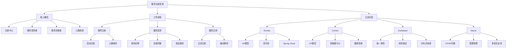

# 服务注册发现的原理和实现？

## 概要回答

服务注册与发现是微服务架构中的核心组件，用于解决服务之间的动态寻址问题。其基本原理包括：

1. **服务注册**：服务启动时向注册中心注册自己的网络地址和元数据
2. **服务发现**：客户端或其他服务通过注册中心查找目标服务的地址
3. **健康检查**：注册中心定期检查服务实例的健康状态
4. **服务注销**：服务停止时主动或被动地从注册中心移除

主流的注册中心实现包括：
- **Eureka**：Netflix开源，AP模型，强调可用性
- **Consul**：HashiCorp开源，CP模型，强调一致性
- **Zookeeper**：Apache开源，CP模型，强一致性
- **Nacos**：阿里巴巴开源，支持CP和AP两种模式

## 深度解析

### 服务注册发现的核心概念

#### 1. 注册中心（Registry）
注册中心是服务注册与发现的核心组件，维护着所有服务实例的地址信息和状态。它提供了服务注册、发现、健康检查等功能。

#### 2. 服务提供者（Service Provider）
服务提供者是实际提供业务功能的服务实例。在启动时，它们会向注册中心注册自己的信息，并定期发送心跳保持活跃状态。

#### 3. 服务消费者（Service Consumer）
服务消费者是需要调用其他服务的服务实例。它们通过注册中心发现目标服务的地址，并发起远程调用。

#### 4. 心跳检测（Heartbeat）
服务实例定期向注册中心发送心跳信号，证明自己处于健康状态。如果注册中心在一定时间内未收到心跳，则认为该实例已下线。

### 工作流程

#### 服务注册流程
1. 服务实例启动
2. 服务实例向注册中心发送注册请求，包含IP地址、端口、服务名等信息
3. 注册中心接收注册信息并存储
4. 服务实例定期发送心跳维持在线状态

#### 服务发现流程
1. 服务消费者需要调用某个服务
2. 服务消费者向注册中心查询目标服务的实例列表
3. 注册中心返回可用的服务实例列表
4. 服务消费者根据负载均衡策略选择一个实例进行调用

#### 服务注销流程
1. 服务实例正常关闭
2. 服务实例向注册中心发送注销请求
3. 注册中心移除该实例的信息
4. 或者注册中心检测到实例心跳超时，自动移除

### 主流注册中心对比

#### Eureka
**特点**：
- AP模型，优先保证可用性
- 去中心化架构，Peer to Peer复制
- 自带Rest API
- Spring Cloud集成良好

**适用场景**：
- 对一致性要求不高的场景
- 需要高可用的服务发现

#### Consul
**特点**：
- CP模型，优先保证一致性
- 支持多数据中心
- 内置健康检查
- 支持ACL权限控制

**适用场景**：
- 对一致性要求较高的场景
- 需要多数据中心支持

#### Zookeeper
**特点**：
- CP模型，强一致性
- 成熟稳定
- 层次化命名空间
- 复杂的API

**适用场景**：
- 对一致性要求极高的场景
- 需要分布式协调功能

#### Nacos
**特点**：
- 同时支持CP和AP模式
- 支持服务发现和服务配置
- 多语言支持
- 阿里巴巴生态集成

**适用场景**：
- 需要灵活切换一致性和可用性
- 需要服务配置管理

## 代码示例

以下是服务注册发现的PHP实现示例：

```php
<?php
/**
 * 服务注册发现实现示例
 */

// 1. 服务实例类
class ServiceInstance {
    private $serviceId;
    private $serviceName;
    private $host;
    private $port;
    private $metadata;
    private $lastHeartbeat;
    private $status;
    
    public function __construct($serviceId, $serviceName, $host, $port, $metadata = []) {
        $this->serviceId = $serviceId;
        $this->serviceName = $serviceName;
        $this->host = $host;
        $this->port = $port;
        $this->metadata = $metadata;
        $this->lastHeartbeat = time();
        $this->status = 'UP';
    }
    
    public function getServiceId() {
        return $this->serviceId;
    }
    
    public function getServiceName() {
        return $this->serviceName;
    }
    
    public function getHost() {
        return $this->host;
    }
    
    public function getPort() {
        return $this->port;
    }
    
    public function getMetadata() {
        return $this->metadata;
    }
    
    public function getLastHeartbeat() {
        return $this->lastHeartbeat;
    }
    
    public function getStatus() {
        return $this->status;
    }
    
    public function updateHeartbeat() {
        $this->lastHeartbeat = time();
    }
    
    public function setStatus($status) {
        $this->status = $status;
    }
    
    public function getAddress() {
        return $this->host . ':' . $this->port;
    }
    
    public function toArray() {
        return [
            'service_id' => $this->serviceId,
            'service_name' => $this->serviceName,
            'host' => $this->host,
            'port' => $this->port,
            'metadata' => $this->metadata,
            'last_heartbeat' => $this->lastHeartbeat,
            'status' => $this->status
        ];
    }
}

// 2. 注册中心接口
interface RegistryInterface {
    /**
     * 注册服务
     */
    public function register(ServiceInstance $instance);
    
    /**
     * 注销服务
     */
    public function deregister($serviceId);
    
    /**
     * 发送心跳
     */
    public function heartbeat($serviceId);
    
    /**
     * 发现服务
     */
    public function discover($serviceName);
    
    /**
     * 获取所有服务
     */
    public function getAllServices();
    
    /**
     * 健康检查
     */
    public function healthCheck();
}

// 3. 简单内存注册中心实现
class SimpleRegistry implements RegistryInterface {
    private $services = [];
    private $heartbeatTimeout = 30; // 30秒超时
    
    /**
     * 注册服务
     */
    public function register(ServiceInstance $instance) {
        $serviceId = $instance->getServiceId();
        $this->services[$serviceId] = $instance;
        
        echo "Service registered: {$instance->getServiceName()} ({$instance->getAddress()})\n";
        return true;
    }
    
    /**
     * 注销服务
     */
    public function deregister($serviceId) {
        if (isset($this->services[$serviceId])) {
            $instance = $this->services[$serviceId];
            unset($this->services[$serviceId]);
            echo "Service deregistered: {$instance->getServiceName()} ({$instance->getAddress()})\n";
            return true;
        }
        return false;
    }
    
    /**
     * 发送心跳
     */
    public function heartbeat($serviceId) {
        if (isset($this->services[$serviceId])) {
            $this->services[$serviceId]->updateHeartbeat();
            $this->services[$serviceId]->setStatus('UP');
            return true;
        }
        return false;
    }
    
    /**
     * 发现服务
     */
    public function discover($serviceName) {
        $instances = [];
        
        foreach ($this->services as $service) {
            // 检查服务是否超时
            $this->checkServiceTimeout($service);
            
            if ($service->getServiceName() === $serviceName && $service->getStatus() === 'UP') {
                $instances[] = $service;
            }
        }
        
        return $instances;
    }
    
    /**
     * 检查服务是否超时
     */
    private function checkServiceTimeout(ServiceInstance $service) {
        $now = time();
        if ($now - $service->getLastHeartbeat() > $this->heartbeatTimeout) {
            $service->setStatus('DOWN');
            echo "Service timeout: {$service->getServiceName()} ({$service->getAddress()})\n";
        }
    }
    
    /**
     * 获取所有服务
     */
    public function getAllServices() {
        $activeServices = [];
        
        foreach ($this->services as $service) {
            // 检查服务是否超时
            $this->checkServiceTimeout($service);
            
            if ($service->getStatus() === 'UP') {
                $activeServices[] = $service;
            }
        }
        
        return $activeServices;
    }
    
    /**
     * 健康检查
     */
    public function healthCheck() {
        $total = count($this->services);
        $up = 0;
        $down = 0;
        
        foreach ($this->services as $service) {
            $this->checkServiceTimeout($service);
            
            if ($service->getStatus() === 'UP') {
                $up++;
            } else {
                $down++;
            }
        }
        
        return [
            'total' => $total,
            'up' => $up,
            'down' => $down,
            'status' => ($down === 0) ? 'HEALTHY' : 'UNHEALTHY'
        ];
    }
}

// 4. 服务提供者
class ServiceProvider {
    private $registry;
    private $serviceInstance;
    private $heartbeatInterval = 10; // 10秒发送一次心跳
    private $running = false;
    
    public function __construct(RegistryInterface $registry, ServiceInstance $serviceInstance) {
        $this->registry = $registry;
        $this->serviceInstance = $serviceInstance;
    }
    
    /**
     * 启动服务
     */
    public function start() {
        // 注册服务
        $this->registry->register($this->serviceInstance);
        
        // 启动心跳线程
        $this->running = true;
        $this->startHeartbeat();
        
        echo "Service provider started: {$this->serviceInstance->getServiceName()}\n";
    }
    
    /**
     * 停止服务
     */
    public function stop() {
        $this->running = false;
        
        // 注销服务
        $this->registry->deregister($this->serviceInstance->getServiceId());
        
        echo "Service provider stopped: {$this->serviceInstance->getServiceName()}\n";
    }
    
    /**
     * 启动心跳
     */
    private function startHeartbeat() {
        // 在实际应用中，这应该在一个单独的线程或定时任务中运行
        // 这里简化为循环
        /*
        while ($this->running) {
            sleep($this->heartbeatInterval);
            if ($this->running) {
                $this->registry->heartbeat($this->serviceInstance->getServiceId());
            }
        }
        */
    }
    
    /**
     * 模拟处理请求
     */
    public function handleRequest($request) {
        // 模拟业务处理
        usleep(rand(10000, 50000)); // 10-50ms处理时间
        
        return [
            'status' => 'success',
            'data' => 'Response from ' . $this->serviceInstance->getServiceName(),
            'timestamp' => time()
        ];
    }
}

// 5. 服务消费者
class ServiceConsumer {
    private $registry;
    private $loadBalancer;
    
    public function __construct(RegistryInterface $registry) {
        $this->registry = $registry;
        $this->loadBalancer = new RoundRobinLoadBalancer();
    }
    
    /**
     * 调用服务
     */
    public function callService($serviceName, $request) {
        // 发现服务实例
        $instances = $this->registry->discover($serviceName);
        
        if (empty($instances)) {
            throw new Exception("No available instances for service: {$serviceName}");
        }
        
        // 负载均衡选择实例
        $instance = $this->loadBalancer->choose($instances);
        
        // 调用服务
        return $this->invokeService($instance, $request);
    }
    
    /**
     * 调用具体服务实例
     */
    private function invokeService(ServiceInstance $instance, $request) {
        $url = "http://{$instance->getAddress()}/api/service";
        
        // 这里简化处理，实际应该使用HTTP客户端
        echo "Calling service at: {$url}\n";
        
        // 模拟网络延迟
        usleep(rand(5000, 20000)); // 5-20ms网络延迟
        
        // 模拟服务响应
        return [
            'status' => 'success',
            'data' => 'Response from ' . $instance->getServiceName() . ' at ' . $instance->getAddress(),
            'timestamp' => time()
        ];
    }
    
    /**
     * 获取服务列表
     */
    public function getServiceList() {
        return $this->registry->getAllServices();
    }
}

// 6. 负载均衡器
interface LoadBalancerInterface {
    public function choose($instances);
}

// 轮询负载均衡器
class RoundRobinLoadBalancer implements LoadBalancerInterface {
    private $currentIndex = 0;
    
    public function choose($instances) {
        if (empty($instances)) {
            throw new Exception("No instances available");
        }
        
        $instance = $instances[$this->currentIndex % count($instances)];
        $this->currentIndex++;
        
        return $instance;
    }
}

// 随机负载均衡器
class RandomLoadBalancer implements LoadBalancerInterface {
    public function choose($instances) {
        if (empty($instances)) {
            throw new Exception("No instances available");
        }
        
        $index = rand(0, count($instances) - 1);
        return $instances[$index];
    }
}

// 7. 基于Redis的注册中心实现
class RedisRegistry implements RegistryInterface {
    private $redis;
    private $heartbeatTimeout = 30;
    private $prefix = 'service_registry:';
    
    public function __construct($redisConfig) {
        $this->redis = new Redis();
        $this->redis->connect($redisConfig['host'], $redisConfig['port']);
        if (isset($redisConfig['password'])) {
            $this->redis->auth($redisConfig['password']);
        }
    }
    
    /**
     * 注册服务
     */
    public function register(ServiceInstance $instance) {
        $serviceId = $instance->getServiceId();
        $serviceName = $instance->getServiceName();
        
        // 存储服务实例信息
        $this->redis->setex(
            $this->prefix . 'instance:' . $serviceId,
            $this->heartbeatTimeout * 2, // 设置过期时间
            json_encode($instance->toArray())
        );
        
        // 添加到服务名称集合
        $this->redis->sadd(
            $this->prefix . 'service:' . $serviceName,
            $serviceId
        );
        
        // 添加到所有服务集合
        $this->redis->sadd(
            $this->prefix . 'all_services',
            $serviceName
        );
        
        echo "Service registered in Redis: {$serviceName} ({$instance->getAddress()})\n";
        return true;
    }
    
    /**
     * 注销服务
     */
    public function deregister($serviceId) {
        // 获取服务信息
        $instanceData = $this->redis->get($this->prefix . 'instance:' . $serviceId);
        if (!$instanceData) {
            return false;
        }
        
        $instanceInfo = json_decode($instanceData, true);
        $serviceName = $instanceInfo['service_name'];
        
        // 删除实例信息
        $this->redis->del($this->prefix . 'instance:' . $serviceId);
        
        // 从服务名称集合中移除
        $this->redis->srem($this->prefix . 'service:' . $serviceName, $serviceId);
        
        echo "Service deregistered from Redis: {$serviceName} ({$instanceInfo['host']}:{$instanceInfo['port']})\n";
        return true;
    }
    
    /**
     * 发送心跳
     */
    public function heartbeat($serviceId) {
        // 更新过期时间
        $instanceKey = $this->prefix . 'instance:' . $serviceId;
        $ttl = $this->redis->ttl($instanceKey);
        
        if ($ttl > 0) {
            $this->redis->expire($instanceKey, $this->heartbeatTimeout * 2);
            return true;
        }
        
        return false;
    }
    
    /**
     * 发现服务
     */
    public function discover($serviceName) {
        // 获取服务实例ID列表
        $serviceIds = $this->redis->smembers($this->prefix . 'service:' . $serviceName);
        
        $instances = [];
        foreach ($serviceIds as $serviceId) {
            $instanceData = $this->redis->get($this->prefix . 'instance:' . $serviceId);
            if ($instanceData) {
                $instanceInfo = json_decode($instanceData, true);
                $instance = new ServiceInstance(
                    $instanceInfo['service_id'],
                    $instanceInfo['service_name'],
                    $instanceInfo['host'],
                    $instanceInfo['port'],
                    $instanceInfo['metadata']
                );
                $instance->setStatus($instanceInfo['status']);
                $instances[] = $instance;
            }
        }
        
        return $instances;
    }
    
    /**
     * 获取所有服务
     */
    public function getAllServices() {
        $serviceNames = $this->redis->smembers($this->prefix . 'all_services');
        
        $allInstances = [];
        foreach ($serviceNames as $serviceName) {
            $instances = $this->discover($serviceName);
            $allInstances = array_merge($allInstances, $instances);
        }
        
        return $allInstances;
    }
    
    /**
     * 健康检查
     */
    public function healthCheck() {
        $total = $this->redis->scard($this->prefix . 'all_services');
        return [
            'total' => $total,
            'status' => 'HEALTHY',
            'backend' => 'Redis'
        ];
    }
}

// 8. 服务注册发现客户端
class DiscoveryClient {
    private $registry;
    private $serviceName;
    private $host;
    private $port;
    private $serviceInstance;
    private $heartbeatInterval = 10;
    
    public function __construct(RegistryInterface $registry, $serviceName, $host, $port) {
        $this->registry = $registry;
        $this->serviceName = $serviceName;
        $this->host = $host;
        $this->port = $port;
        
        $serviceId = $serviceName . '_' . $host . '_' . $port . '_' . uniqid();
        $this->serviceInstance = new ServiceInstance(
            $serviceId,
            $serviceName,
            $host,
            $port,
            ['version' => '1.0', 'environment' => 'production']
        );
    }
    
    /**
     * 启动客户端
     */
    public function start() {
        // 注册服务
        $this->registry->register($this->serviceInstance);
        
        // 启动心跳
        $this->startHeartbeat();
        
        echo "Discovery client started for service: {$this->serviceName}\n";
    }
    
    /**
     * 启动心跳
     */
    private function startHeartbeat() {
        // 在实际应用中，这应该使用定时任务或后台进程
        // 这里只是示意代码
        /*
        $timer = new Timer();
        $timer->add($this->heartbeatInterval * 1000, function() {
            $this->registry->heartbeat($this->serviceInstance->getServiceId());
        }, null, true);
        */
    }
    
    /**
     * 停止客户端
     */
    public function stop() {
        $this->registry->deregister($this->serviceInstance->getServiceId());
        echo "Discovery client stopped for service: {$this->serviceName}\n";
    }
    
    /**
     * 发现服务
     */
    public function discoverService($serviceName) {
        return $this->registry->discover($serviceName);
    }
}

/**
 * 使用示例
 */

// 内存注册中心示例
/*
echo "=== Memory Registry Example ===\n";

// 创建注册中心
$registry = new SimpleRegistry();

// 创建服务提供者
$service1 = new ServiceInstance('user-service-1', 'user-service', '192.168.1.10', 8080);
$service2 = new ServiceInstance('user-service-2', 'user-service', '192.168.1.11', 8080);
$service3 = new ServiceInstance('order-service-1', 'order-service', '192.168.1.20', 8080);

$provider1 = new ServiceProvider($registry, $service1);
$provider2 = new ServiceProvider($registry, $service2);
$provider3 = new ServiceProvider($registry, $service3);

$provider1->start();
$provider2->start();
$provider3->start();

// 创建服务消费者
$consumer = new ServiceConsumer($registry);

// 发现服务
$userServices = $consumer->discoverService('user-service');
echo "Found " . count($userServices) . " user-service instances\n";

$orderServices = $consumer->discoverService('order-service');
echo "Found " . count($orderServices) . " order-service instances\n";

// 调用服务
try {
    $response = $consumer->callService('user-service', ['action' => 'get_user', 'user_id' => 123]);
    echo "Service response: " . json_encode($response) . "\n";
} catch (Exception $e) {
    echo "Service call failed: " . $e->getMessage() . "\n";
}

// 健康检查
$health = $registry->healthCheck();
echo "Registry health: " . json_encode($health) . "\n";

// 停止服务提供者
$provider1->stop();
*/

// Redis注册中心示例
/*
echo "\n=== Redis Registry Example ===\n";

try {
    // 创建Redis注册中心
    $redisRegistry = new RedisRegistry([
        'host' => 'localhost',
        'port' => 6379
    ]);
    
    // 创建发现客户端
    $client1 = new DiscoveryClient($redisRegistry, 'payment-service', '192.168.1.30', 8080);
    $client2 = new DiscoveryClient($redisRegistry, 'notification-service', '192.168.1.31', 8080);
    
    $client1->start();
    $client2->start();
    
    // 发现服务
    $paymentServices = $redisRegistry->discover('payment-service');
    echo "Found " . count($paymentServices) . " payment-service instances\n";
    
    // 健康检查
    $health = $redisRegistry->healthCheck();
    echo "Redis registry health: " . json_encode($health) . "\n";
    
} catch (Exception $e) {
    echo "Redis registry example failed: " . $e->getMessage() . "\n";
}
*/
?>
```

## 图示说明



通过合理选择和实现服务注册发现机制，可以构建出高可用、可扩展的微服务架构，有效解决服务之间的动态寻址问题。