# 负载均衡策略有哪些？

## 概要回答

负载均衡是分布式系统中重要的组件，用于将请求分发到多个服务实例上，以提高系统的可用性和性能。主要的负载均衡策略包括：

### 静态负载均衡策略
1. **轮询（Round Robin）**：按顺序依次分发请求
2. **加权轮询（Weighted Round Robin）**：根据服务器权重分配请求
3. **随机（Random）**：随机选择服务器处理请求
4. **加权随机（Weighted Random）**：根据权重随机选择服务器

### 动态负载均衡策略
1. **最少连接（Least Connections）**：将请求分发给当前连接数最少的服务器
2. **最快响应（Lowest Latency）**：将请求分发给响应时间最短的服务器
3. **观察模式（Reactive）**：根据服务器的实际性能动态调整负载分配

### 特殊负载均衡策略
1. **IP Hash**：根据客户端IP地址进行哈希计算，确保同一IP始终访问同一服务器
2. **一致性哈希（Consistent Hashing）**：减少服务器增减时的缓存失效
3. **地理位置（Geo-location）**：根据用户地理位置选择最近的服务器

## 深度解析

### 负载均衡的基本概念

负载均衡是一种计算机技术，用于在多个计算资源（如服务器、网络链接、CPU、磁盘驱动器等）之间分配工作负载。其主要目的是优化资源使用、最大化吞吐量、最小化响应时间，并避免任何单一资源的过载。

### 静态负载均衡策略

#### 1. 轮询（Round Robin）
轮询是最简单的负载均衡算法，它按顺序将请求分发给每个服务器。例如有3台服务器A、B、C，请求会按A→B→C→A→B→C的顺序分发。

**优点**：
- 实现简单
- 请求均匀分布
- 无需维护服务器状态

**缺点**：
- 不考虑服务器性能差异
- 无法应对服务器故障

#### 2. 加权轮询（Weighted Round Robin）
加权轮询在轮询的基础上引入权重概念，性能更好的服务器会被分配更多的请求。

**优点**：
- 考虑服务器性能差异
- 更合理的负载分配

**缺点**：
- 权重设置需要人工干预
- 仍然无法动态适应服务器状态变化

#### 3. 随机（Random）
随机策略随机选择服务器处理请求，实现简单且在大量请求下能达到较好的均衡效果。

**优点**：
- 实现简单
- 在大量请求下分布均匀

**缺点**：
- 可能出现短期不均衡
- 不考虑服务器状态

#### 4. 加权随机（Weighted Random）
加权随机根据服务器权重进行概率性选择，权重越高的服务器被选中的概率越大。

**优点**：
- 考虑服务器性能
- 实现相对简单

**缺点**：
- 无法保证绝对均衡
- 权重设置需要人工干预

### 动态负载均衡策略

#### 1. 最少连接（Least Connections）
最少连接策略将请求分发给当前活跃连接数最少的服务器，适用于处理长时间连接的服务。

**优点**：
- 动态适应服务器负载
- 更智能的负载分配

**缺点**：
- 需要维护连接状态
- 实现复杂度较高

#### 2. 最快响应（Lowest Latency）
最快响应策略将请求分发给历史平均响应时间最短的服务器，适用于对响应时间敏感的应用。

**优点**：
- 优化用户体验
- 动态适应服务器性能

**缺点**：
- 需要收集和分析响应时间数据
- 可能受网络波动影响

#### 3. 观察模式（Reactive）
观察模式根据服务器的实时性能指标动态调整负载分配策略。

**优点**：
- 高度自适应
- 实时优化性能

**缺点**：
- 实现复杂
- 需要大量监控数据

### 特殊负载均衡策略

#### 1. IP Hash
IP Hash根据客户端IP地址计算哈希值，确保同一客户端始终访问同一服务器，适用于需要会话保持的场景。

**优点**：
- 实现会话保持
- 无需额外的会话存储

**缺点**：
- 负载分布可能不均
- 服务器增减时需要重新哈希

#### 2. 一致性哈希（Consistent Hashing）
一致性哈希在服务器增减时最小化缓存失效，适用于分布式缓存系统。

**优点**：
- 减少缓存失效
- 适合动态扩缩容

**缺点**：
- 实现复杂
- 需要虚拟节点保证均衡

#### 3. 地理位置（Geo-location）
地理位置策略根据用户地理位置选择最近的服务器，适用于全球分布式系统。

**优点**：
- 降低网络延迟
- 提升用户体验

**缺点**：
- 需要地理位置数据库
- 实现复杂

## 代码示例

以下是各种负载均衡策略的PHP实现示例：

```php
<?php
/**
 * 负载均衡策略实现示例
 */

// 1. 服务器节点类
class ServerNode {
    private $id;
    private $host;
    private $port;
    private $weight;
    private $currentConnections;
    private $avgResponseTime;
    private $status;
    private $location;
    
    public function __construct($id, $host, $port, $weight = 1, $location = 'default') {
        $this->id = $id;
        $this->host = $host;
        $this->port = $port;
        $this->weight = $weight;
        $this->currentConnections = 0;
        $this->avgResponseTime = 0;
        $this->status = 'UP';
        $this->location = $location;
    }
    
    public function getId() {
        return $this->id;
    }
    
    public function getHost() {
        return $this->host;
    }
    
    public function getPort() {
        return $this->port;
    }
    
    public function getWeight() {
        return $this->weight;
    }
    
    public function getCurrentConnections() {
        return $this->currentConnections;
    }
    
    public function getAvgResponseTime() {
        return $this->avgResponseTime;
    }
    
    public function getStatus() {
        return $this->status;
    }
    
    public function getLocation() {
        return $this->location;
    }
    
    public function incrementConnections() {
        $this->currentConnections++;
    }
    
    public function decrementConnections() {
        if ($this->currentConnections > 0) {
            $this->currentConnections--;
        }
    }
    
    public function updateResponseTime($responseTime) {
        // 简单的移动平均算法
        if ($this->avgResponseTime == 0) {
            $this->avgResponseTime = $responseTime;
        } else {
            $this->avgResponseTime = ($this->avgResponseTime * 0.7) + ($responseTime * 0.3);
        }
    }
    
    public function setStatus($status) {
        $this->status = $status;
    }
    
    public function getAddress() {
        return $this->host . ':' . $this->port;
    }
    
    public function toArray() {
        return [
            'id' => $this->id,
            'host' => $this->host,
            'port' => $this->port,
            'weight' => $this->weight,
            'connections' => $this->currentConnections,
            'avg_response_time' => $this->avgResponseTime,
            'status' => $this->status,
            'location' => $this->location
        ];
    }
}

// 2. 负载均衡器接口
interface LoadBalancerInterface {
    public function selectServer($servers, $clientIp = null);
    public function getName();
}

// 3. 轮询负载均衡器
class RoundRobinLoadBalancer implements LoadBalancerInterface {
    private $currentIndex = 0;
    
    public function selectServer($servers, $clientIp = null) {
        // 过滤掉不可用的服务器
        $availableServers = array_filter($servers, function($server) {
            return $server->getStatus() === 'UP';
        });
        
        if (empty($availableServers)) {
            throw new Exception("No available servers");
        }
        
        $serversArray = array_values($availableServers);
        $server = $serversArray[$this->currentIndex % count($serversArray)];
        $this->currentIndex++;
        
        return $server;
    }
    
    public function getName() {
        return "Round Robin";
    }
}

// 4. 加权轮询负载均衡器
class WeightedRoundRobinLoadBalancer implements LoadBalancerInterface {
    private $currentPosition = 0;
    private $currentWeight = 0;
    
    public function selectServer($servers, $clientIp = null) {
        // 过滤掉不可用的服务器
        $availableServers = array_filter($servers, function($server) {
            return $server->getStatus() === 'UP';
        });
        
        if (empty($availableServers)) {
            throw new Exception("No available servers");
        }
        
        $serversArray = array_values($availableServers);
        
        // 找到最大权重
        $maxWeight = max(array_map(function($server) {
            return $server->getWeight();
        }, $serversArray));
        
        // 找到所有权重的最大公约数
        $gcd = $this->calculateGcd($serversArray);
        
        while (true) {
            $this->currentPosition = ($this->currentPosition + 1) % count($serversArray);
            
            if ($this->currentPosition == 0) {
                $this->currentWeight = $this->currentWeight - $gcd;
                if ($this->currentWeight <= 0) {
                    $this->currentWeight = $maxWeight;
                    if ($this->currentWeight == 0) {
                        return $serversArray[0];
                    }
                }
            }
            
            if ($serversArray[$this->currentPosition]->getWeight() >= $this->currentWeight) {
                return $serversArray[$this->currentPosition];
            }
        }
    }
    
    private function calculateGcd($servers) {
        $weights = array_map(function($server) {
            return $server->getWeight();
        }, $servers);
        
        $result = $weights[0];
        for ($i = 1; $i < count($weights); $i++) {
            $result = $this->gcd($result, $weights[$i]);
        }
        
        return $result;
    }
    
    private function gcd($a, $b) {
        while ($b != 0) {
            $temp = $b;
            $b = $a % $b;
            $a = $temp;
        }
        return $a;
    }
    
    public function getName() {
        return "Weighted Round Robin";
    }
}

// 5. 随机负载均衡器
class RandomLoadBalancer implements LoadBalancerInterface {
    public function selectServer($servers, $clientIp = null) {
        // 过滤掉不可用的服务器
        $availableServers = array_filter($servers, function($server) {
            return $server->getStatus() === 'UP';
        });
        
        if (empty($availableServers)) {
            throw new Exception("No available servers");
        }
        
        $serversArray = array_values($availableServers);
        $index = rand(0, count($serversArray) - 1);
        
        return $serversArray[$index];
    }
    
    public function getName() {
        return "Random";
    }
}

// 6. 加权随机负载均衡器
class WeightedRandomLoadBalancer implements LoadBalancerInterface {
    public function selectServer($servers, $clientIp = null) {
        // 过滤掉不可用的服务器
        $availableServers = array_filter($servers, function($server) {
            return $server->getStatus() === 'UP';
        });
        
        if (empty($availableServers)) {
            throw new Exception("No available servers");
        }
        
        $serversArray = array_values($availableServers);
        
        // 计算总权重
        $totalWeight = array_sum(array_map(function($server) {
            return $server->getWeight();
        }, $serversArray));
        
        // 生成随机数
        $random = rand(1, $totalWeight);
        
        // 根据权重选择服务器
        $currentWeight = 0;
        foreach ($serversArray as $server) {
            $currentWeight += $server->getWeight();
            if ($random <= $currentWeight) {
                return $server;
            }
        }
        
        // 如果没有找到（理论上不会发生），返回第一个服务器
        return $serversArray[0];
    }
    
    public function getName() {
        return "Weighted Random";
    }
}

// 7. 最少连接负载均衡器
class LeastConnectionsLoadBalancer implements LoadBalancerInterface {
    public function selectServer($servers, $clientIp = null) {
        // 过滤掉不可用的服务器
        $availableServers = array_filter($servers, function($server) {
            return $server->getStatus() === 'UP';
        });
        
        if (empty($availableServers)) {
            throw new Exception("No available servers");
        }
        
        $serversArray = array_values($availableServers);
        
        // 找到连接数最少的服务器
        $minConnections = min(array_map(function($server) {
            return $server->getCurrentConnections();
        }, $serversArray));
        
        // 找到所有连接数最少的服务器
        $candidates = array_filter($serversArray, function($server) use ($minConnections) {
            return $server->getCurrentConnections() == $minConnections;
        });
        
        // 如果有多个候选，随机选择一个
        $candidatesArray = array_values($candidates);
        $index = rand(0, count($candidatesArray) - 1);
        
        return $candidatesArray[$index];
    }
    
    public function getName() {
        return "Least Connections";
    }
}

// 8. 最快响应负载均衡器
class LowestLatencyLoadBalancer implements LoadBalancerInterface {
    public function selectServer($servers, $clientIp = null) {
        // 过滤掉不可用的服务器
        $availableServers = array_filter($servers, function($server) {
            return $server->getStatus() === 'UP';
        });
        
        if (empty($availableServers)) {
            throw new Exception("No available servers");
        }
        
        $serversArray = array_values($availableServers);
        
        // 找到响应时间最短的服务器
        $minLatency = min(array_map(function($server) {
            return $server->getAvgResponseTime();
        }, $serversArray));
        
        // 找到所有响应时间最短的服务器
        $candidates = array_filter($serversArray, function($server) use ($minLatency) {
            return $server->getAvgResponseTime() == $minLatency;
        });
        
        // 如果有多个候选，随机选择一个
        $candidatesArray = array_values($candidates);
        $index = rand(0, count($candidatesArray) - 1);
        
        return $candidatesArray[$index];
    }
    
    public function getName() {
        return "Lowest Latency";
    }
}

// 9. IP Hash负载均衡器
class IpHashLoadBalancer implements LoadBalancerInterface {
    public function selectServer($servers, $clientIp = null) {
        if (!$clientIp) {
            throw new Exception("Client IP is required for IP Hash load balancing");
        }
        
        // 过滤掉不可用的服务器
        $availableServers = array_filter($servers, function($server) {
            return $server->getStatus() === 'UP';
        });
        
        if (empty($availableServers)) {
            throw new Exception("No available servers");
        }
        
        $serversArray = array_values($availableServers);
        
        // 使用IP地址进行哈希计算
        $hash = crc32($clientIp);
        $index = abs($hash) % count($serversArray);
        
        return $serversArray[$index];
    }
    
    public function getName() {
        return "IP Hash";
    }
}

// 10. 地理位置负载均衡器
class GeoLocationLoadBalancer implements LoadBalancerInterface {
    private $clientLocations = []; // 模拟客户端位置数据
    
    public function selectServer($servers, $clientIp = null) {
        if (!$clientIp) {
            throw new Exception("Client IP is required for Geo Location load balancing");
        }
        
        // 过滤掉不可用的服务器
        $availableServers = array_filter($servers, function($server) {
            return $server->getStatus() === 'UP';
        });
        
        if (empty($availableServers)) {
            throw new Exception("No available servers");
        }
        
        $serversArray = array_values($availableServers);
        
        // 获取客户端地理位置（这里简化处理）
        $clientLocation = $this->getClientLocation($clientIp);
        
        // 找到相同地理位置的服务器
        $sameLocationServers = array_filter($serversArray, function($server) use ($clientLocation) {
            return $server->getLocation() == $clientLocation;
        });
        
        if (!empty($sameLocationServers)) {
            // 如果有同地理位置的服务器，从中随机选择
            $sameLocationArray = array_values($sameLocationServers);
            $index = rand(0, count($sameLocationArray) - 1);
            return $sameLocationArray[$index];
        } else {
            // 如果没有同地理位置的服务器，使用随机选择
            $index = rand(0, count($serversArray) - 1);
            return $serversArray[$index];
        }
    }
    
    private function getClientLocation($clientIp) {
        // 简化处理，实际应用中需要IP地理位置数据库
        $locations = ['us-east', 'us-west', 'eu-central', 'asia-east'];
        $hash = crc32($clientIp);
        return $locations[abs($hash) % count($locations)];
    }
    
    public function getName() {
        return "Geo Location";
    }
}

// 11. 负载均衡器工厂
class LoadBalancerFactory {
    public static function create($type) {
        switch (strtolower($type)) {
            case 'round_robin':
                return new RoundRobinLoadBalancer();
            case 'weighted_round_robin':
                return new WeightedRoundRobinLoadBalancer();
            case 'random':
                return new RandomLoadBalancer();
            case 'weighted_random':
                return new WeightedRandomLoadBalancer();
            case 'least_connections':
                return new LeastConnectionsLoadBalancer();
            case 'lowest_latency':
                return new LowestLatencyLoadBalancer();
            case 'ip_hash':
                return new IpHashLoadBalancer();
            case 'geo_location':
                return new GeoLocationLoadBalancer();
            default:
                throw new Exception("Unknown load balancer type: {$type}");
        }
    }
}

// 12. 负载均衡管理器
class LoadBalancerManager {
    private $servers = [];
    private $loadBalancer;
    private $requestCount = 0;
    private $serverStats = [];
    
    public function __construct(LoadBalancerInterface $loadBalancer) {
        $this->loadBalancer = $loadBalancer;
    }
    
    public function addServer(ServerNode $server) {
        $this->servers[$server->getId()] = $server;
        $this->serverStats[$server->getId()] = [
            'requests_handled' => 0,
            'total_response_time' => 0
        ];
    }
    
    public function removeServer($serverId) {
        unset($this->servers[$serverId]);
        unset($this->serverStats[$serverId]);
    }
    
    public function getServers() {
        return $this->servers;
    }
    
    public function routeRequest($clientIp = null) {
        $this->requestCount++;
        
        try {
            $selectedServer = $this->loadBalancer->selectServer($this->servers, $clientIp);
            
            // 更新服务器统计信息
            $serverId = $selectedServer->getId();
            $this->serverStats[$serverId]['requests_handled']++;
            
            // 模拟服务器处理请求
            $selectedServer->incrementConnections();
            
            // 模拟响应时间
            $responseTime = rand(10, 100); // 10-100ms
            usleep($responseTime * 1000); // 模拟处理时间
            
            $selectedServer->updateResponseTime($responseTime);
            $selectedServer->decrementConnections();
            
            $this->serverStats[$serverId]['total_response_time'] += $responseTime;
            
            return [
                'server' => $selectedServer,
                'response_time' => $responseTime,
                'load_balancer' => $this->loadBalancer->getName()
            ];
            
        } catch (Exception $e) {
            throw new Exception("Failed to route request: " . $e->getMessage());
        }
    }
    
    public function getStats() {
        $stats = [
            'total_requests' => $this->requestCount,
            'load_balancer' => $this->loadBalancer->getName(),
            'servers' => []
        ];
        
        foreach ($this->serverStats as $serverId => $serverStat) {
            $server = $this->servers[$serverId];
            $avgResponseTime = $serverStat['requests_handled'] > 0 ? 
                $serverStat['total_response_time'] / $serverStat['requests_handled'] : 0;
                
            $stats['servers'][] = [
                'server_id' => $serverId,
                'host' => $server->getHost(),
                'requests_handled' => $serverStat['requests_handled'],
                'avg_response_time' => round($avgResponseTime, 2),
                'current_connections' => $server->getCurrentConnections(),
                'status' => $server->getStatus()
            ];
        }
        
        return $stats;
    }
    
    public function setLoadBalancer(LoadBalancerInterface $loadBalancer) {
        $this->loadBalancer = $loadBalancer;
    }
}

/**
 * 使用示例
 */

// 创建服务器节点
$servers = [
    new ServerNode('server-1', '192.168.1.10', 8080, 3, 'us-east'),
    new ServerNode('server-2', '192.168.1.11', 8080, 2, 'us-west'),
    new ServerNode('server-3', '192.168.1.12', 8080, 1, 'eu-central'),
    new ServerNode('server-4', '192.168.1.13', 8080, 2, 'asia-east')
];

// 测试不同负载均衡策略
$strategies = [
    'round_robin',
    'weighted_round_robin',
    'random',
    'weighted_random',
    'least_connections',
    'lowest_latency',
    'ip_hash',
    'geo_location'
];

foreach ($strategies as $strategy) {
    echo "=== Testing {$strategy} Load Balancer ===\n";
    
    try {
        $loadBalancer = LoadBalancerFactory::create($strategy);
        $manager = new LoadBalancerManager($loadBalancer);
        
        // 添加服务器
        foreach ($servers as $server) {
            $manager->addServer($server);
        }
        
        // 模拟请求
        for ($i = 0; $i < 20; $i++) {
            $clientIp = "192.168.0." . rand(1, 254);
            $result = $manager->routeRequest($clientIp);
            echo "Request {$i}: Routed to {$result['server']->getAddress()} " .
                 "(Response time: {$result['response_time']}ms)\n";
        }
        
        // 输出统计信息
        $stats = $manager->getStats();
        echo "Statistics:\n";
        echo "Total requests: {$stats['total_requests']}\n";
        echo "Load balancer: {$stats['load_balancer']}\n";
        echo "Server distribution:\n";
        
        foreach ($stats['servers'] as $serverStats) {
            echo "  {$serverStats['host']}: {$serverStats['requests_handled']} requests, " .
                 "avg response time: {$serverStats['avg_response_time']}ms\n";
        }
        
    } catch (Exception $e) {
        echo "Error testing {$strategy}: " . $e->getMessage() . "\n";
    }
    
    echo "\n";
}

// 动态切换负载均衡策略示例
/*
echo "=== Dynamic Strategy Switching ===\n";

$manager = new LoadBalancerManager(new RoundRobinLoadBalancer());

// 添加服务器
foreach ($servers as $server) {
    $manager->addServer($server);
}

// 初始请求
echo "Using Round Robin:\n";
for ($i = 0; $i < 5; $i++) {
    $result = $manager->routeRequest();
    echo "Request {$i}: Routed to {$result['server']->getAddress()}\n";
}

// 切换到最少连接策略
$manager->setLoadBalancer(new LeastConnectionsLoadBalancer());

echo "\nSwitched to Least Connections:\n";
for ($i = 0; $i < 5; $i++) {
    $result = $manager->routeRequest();
    echo "Request {$i}: Routed to {$result['server']->getAddress()}\n";
}

// 输出最终统计
$stats = $manager->getStats();
echo "\nFinal Statistics:\n";
print_r($stats);
*/
?>
```

## 图示说明

```mermaid
graph TD
    A[负载均衡策略] --> B[静态策略];
    A --> C[动态策略];
    A --> D[特殊策略];
    
    B --> B1[轮询];
    B --> B2[加权轮询];
    B --> B3[随机];
    B --> B4[加权随机];
    
    C --> C1[最少连接];
    C --> C2[最快响应];
    C --> C3[观察模式];
    
    D --> D1[IP Hash];
    D --> D2[一致性哈希];
    D --> D3[地理位置];
    
    B1 --> B11[顺序分发];
    B1 --> B12[实现简单];
    B1 --> B13[均匀分布];
    
    B2 --> B21[权重分配];
    B2 --> B22[性能考虑];
    B2 --> B23[人工设置];
    
    B3 --> B31[随机选择];
    B3 --> B32[大量请求均衡];
    B3 --> B33[短期不均];
    
    B4 --> B41[概率选择];
    B4 --> B42[权重概率];
    B4 --> B43[实现复杂];
    
    C1 --> C11[连接数最少];
    C1 --> C12[动态适应];
    C1 --> C13[长连接优化];
    
    C2 --> C21[响应时间最短];
    C2 --> C22[用户体验优化];
    C2 --> C23[实时调整];
    
    C3 --> C31[性能指标];
    C3 --> C32[自适应调整];
    C3 --> C33[监控数据];
    
    D1 --> D11[会话保持];
    D1 --> D12[哈希计算];
    D1 --> D13[负载不均];
    
    D2 --> D21[缓存优化];
    D2 --> D22[动态扩缩容];
    D2 --> D23[虚拟节点];
    
    D3 --> D31[就近访问];
    D3 --> D32[延迟优化];
    D3 --> D33[地理位置库];
```



通过合理选择和组合不同的负载均衡策略，可以根据具体业务场景和性能要求构建出高效、稳定的分布式系统。