# 熔断器模式的原理和作用？

## 概要回答

熔断器模式（Circuit Breaker Pattern）是一种重要的容错设计模式，用于处理分布式系统中的服务故障。其核心原理是：

1. **监控服务调用**：持续监测服务调用的成功率和响应时间
2. **故障检测**：当失败率达到阈值时，熔断器切换到打开状态
3. **快速失败**：在打开状态下，直接拒绝请求而不实际调用服务
4. **自动恢复**：经过一段时间后，尝试半开状态，逐步恢复服务调用

熔断器模式的主要作用包括：
- **防止故障级联**：避免一个服务的故障导致整个系统崩溃
- **提高系统稳定性**：通过快速失败减少资源浪费
- **提供优雅降级**：在服务不可用时提供备用方案
- **支持自动恢复**：服务恢复后自动恢复正常调用

## 深度解析

### 熔断器模式的核心概念

#### 1. 熔断器状态
熔断器有三种状态：

**关闭状态（Closed）**：
- 正常允许请求通过
- 监控请求的成功和失败情况
- 当失败率达到阈值时切换到打开状态

**打开状态（Open）**：
- 拒绝所有请求，直接返回错误
- 避免对故障服务的进一步调用
- 经过设定的时间后切换到半开状态

**半开状态（Half-Open）**：
- 允许有限的请求通过
- 如果请求成功，则切换到关闭状态
- 如果请求失败，则切换回打开状态

#### 2. 关键参数

**失败率阈值**：
触发熔断的失败百分比，默认通常是50%

**超时时间**：
熔断器保持打开状态的时间，默认通常是60秒

**请求量阈值**：
触发熔断所需的最小请求数，默认通常是20个

**半开请求数**：
半开状态下允许通过的请求数，默认通常是10个

### 工作原理

#### 1. 正常流程
1. 熔断器处于关闭状态
2. 客户端发起服务调用请求
3. 熔断器记录请求结果（成功/失败）
4. 如果成功，正常返回结果
5. 如果失败，记录失败并返回错误

#### 2. 熔断触发
1. 失败率超过设定阈值
2. 熔断器切换到打开状态
3. 设置定时器，等待超时时间
4. 在此期间所有请求都被拒绝

#### 3. 自动恢复
1. 超时时间到达后，切换到半开状态
2. 允许少量请求通过
3. 如果请求成功，切换到关闭状态
4. 如果请求失败，切换回打开状态

### 熔断器模式的优势

#### 1. 防止故障级联
在微服务架构中，一个服务的故障可能会导致调用链上的其他服务也出现故障。熔断器可以切断故障传播路径。

#### 2. 快速失败
相比于等待超时，熔断器可以直接拒绝请求，节省系统资源。

#### 3. 资源保护
避免大量请求堆积在故障服务上，保护系统其他部分不受影响。

#### 4. 自动恢复
无需人工干预，系统可以自动检测服务恢复并恢复正常调用。

### 熔断器模式的挑战

#### 1. 参数调优
需要根据具体业务场景调整各项参数，否则可能过早或过晚触发熔断。

#### 2. 状态管理
在分布式环境中，多个实例间的熔断器状态需要协调。

#### 3. 监控复杂性
需要完善的监控体系来跟踪熔断器的状态变化。

#### 4. 误判风险
网络抖动等临时性问题可能导致不必要的熔断。

## 代码示例

以下是熔断器模式的PHP实现示例：

```php
<?php
/**
 * 熔断器模式实现示例
 */

// 1. 熔断器状态枚举
class CircuitBreakerState {
    const CLOSED = 'CLOSED';
    const OPEN = 'OPEN';
    const HALF_OPEN = 'HALF_OPEN';
}

// 2. 熔断器异常类
class CircuitBreakerException extends Exception {
    public function __construct($message = "", $code = 0, Exception $previous = null) {
        parent::__construct($message, $code, $previous);
    }
}

// 3. 熔断器配置类
class CircuitBreakerConfig {
    private $failureThreshold;      // 失败率阈值 (0-1)
    private $timeout;               // 熔断超时时间(秒)
    private $requestVolumeThreshold; // 请求量阈值
    private $halfOpenAttempts;      // 半开状态尝试次数
    private $sleepWindow;           // 熔断器打开后的休眠窗口(毫秒)
    
    public function __construct(
        $failureThreshold = 0.5,
        $timeout = 60,
        $requestVolumeThreshold = 20,
        $halfOpenAttempts = 10,
        $sleepWindow = 5000
    ) {
        $this->failureThreshold = $failureThreshold;
        $this->timeout = $timeout;
        $this->requestVolumeThreshold = $requestVolumeThreshold;
        $this->halfOpenAttempts = $halfOpenAttempts;
        $this->sleepWindow = $sleepWindow;
    }
    
    public function getFailureThreshold() {
        return $this->failureThreshold;
    }
    
    public function getTimeout() {
        return $this->timeout;
    }
    
    public function getRequestVolumeThreshold() {
        return $this->requestVolumeThreshold;
    }
    
    public function getHalfOpenAttempts() {
        return $this->halfOpenAttempts;
    }
    
    public function getSleepWindow() {
        return $this->sleepWindow;
    }
}

// 4. 熔断器度量统计类
class CircuitBreakerMetrics {
    private $successCount = 0;
    private $failureCount = 0;
    private $totalCount = 0;
    private $lastFailureTime = 0;
    private $rollingWindow = 10; // 统计窗口时间(秒)
    private $windowStartTime = 0;
    
    public function __construct($rollingWindow = 10) {
        $this->rollingWindow = $rollingWindow;
        $this->windowStartTime = time();
    }
    
    public function recordSuccess() {
        $this->resetIfWindowExpired();
        $this->successCount++;
        $this->totalCount++;
    }
    
    public function recordFailure() {
        $this->resetIfWindowExpired();
        $this->failureCount++;
        $this->totalCount++;
        $this->lastFailureTime = time();
    }
    
    public function getSuccessCount() {
        $this->resetIfWindowExpired();
        return $this->successCount;
    }
    
    public function getFailureCount() {
        $this->resetIfWindowExpired();
        return $this->failureCount;
    }
    
    public function getTotalCount() {
        $this->resetIfWindowExpired();
        return $this->totalCount;
    }
    
    public function getFailureRate() {
        $this->resetIfWindowExpired();
        if ($this->totalCount == 0) {
            return 0;
        }
        return $this->failureCount / $this->totalCount;
    }
    
    public function getLastFailureTime() {
        return $this->lastFailureTime;
    }
    
    private function resetIfWindowExpired() {
        $now = time();
        if ($now - $this->windowStartTime >= $this->rollingWindow) {
            $this->successCount = 0;
            $this->failureCount = 0;
            $this->totalCount = 0;
            $this->windowStartTime = $now;
        }
    }
    
    public function reset() {
        $this->successCount = 0;
        $this->failureCount = 0;
        $this->totalCount = 0;
        $this->lastFailureTime = 0;
        $this->windowStartTime = time();
    }
}

// 5. 基础熔断器类
class CircuitBreaker {
    private $config;
    private $metrics;
    private $state;
    private $openTime;
    private $halfOpenSuccessCount;
    private $halfOpenAttemptCount;
    private $lock;
    
    public function __construct(CircuitBreakerConfig $config = null) {
        $this->config = $config ?: new CircuitBreakerConfig();
        $this->metrics = new CircuitBreakerMetrics();
        $this->state = CircuitBreakerState::CLOSED;
        $this->openTime = 0;
        $this->halfOpenSuccessCount = 0;
        $this->halfOpenAttemptCount = 0;
        $this->lock = new Mutex();
    }
    
    /**
     * 执行受保护的操作
     */
    public function execute(callable $operation, callable $fallback = null) {
        $this->lock->acquire();
        
        try {
            // 检查熔断器状态
            if ($this->isOpen()) {
                if ($fallback) {
                    return call_user_func($fallback);
                }
                throw new CircuitBreakerException("Circuit breaker is OPEN");
            }
            
            // 执行操作
            $result = call_user_func($operation);
            
            // 记录成功
            $this->onSuccess();
            
            return $result;
            
        } catch (Exception $e) {
            // 记录失败
            $this->onError($e);
            
            // 执行降级逻辑
            if ($fallback) {
                return call_user_func($fallback);
            }
            
            throw $e;
        } finally {
            $this->lock->release();
        }
    }
    
    /**
     * 检查熔断器是否打开
     */
    public function isOpen() {
        switch ($this->state) {
            case CircuitBreakerState::OPEN:
                // 检查是否应该切换到半开状态
                if (time() - $this->openTime >= $this->config->getTimeout()) {
                    $this->attemptToHalfOpen();
                }
                return true;
                
            case CircuitBreakerState::HALF_OPEN:
                return false;
                
            case CircuitBreakerState::CLOSED:
            default:
                // 检查是否应该熔断
                return $this->shouldTrip();
        }
    }
    
    /**
     * 检查是否应该触发熔断
     */
    private function shouldTrip() {
        $totalCount = $this->metrics->getTotalCount();
        
        // 如果请求数量未达到阈值，不触发熔断
        if ($totalCount < $this->config->getRequestVolumeThreshold()) {
            return false;
        }
        
        // 检查失败率是否超过阈值
        $failureRate = $this->metrics->getFailureRate();
        return $failureRate >= $this->config->getFailureThreshold();
    }
    
    /**
     * 尝试切换到半开状态
     */
    private function attemptToHalfOpen() {
        $this->state = CircuitBreakerState::HALF_OPEN;
        $this->halfOpenSuccessCount = 0;
        $this->halfOpenAttemptCount = 0;
        echo "Circuit breaker switched to HALF_OPEN state\n";
    }
    
    /**
     * 操作成功时的处理
     */
    private function onSuccess() {
        switch ($this->state) {
            case CircuitBreakerState::HALF_OPEN:
                $this->halfOpenSuccessCount++;
                $this->halfOpenAttemptCount++;
                
                // 如果半开状态下的所有尝试都成功，切换到关闭状态
                if ($this->halfOpenAttemptCount >= $this->config->getHalfOpenAttempts()) {
                    if ($this->halfOpenSuccessCount == $this->halfOpenAttemptCount) {
                        $this->switchToClosed();
                    } else {
                        $this->switchToOpen();
                    }
                }
                break;
                
            case CircuitBreakerState::CLOSED:
            default:
                $this->metrics->recordSuccess();
                break;
        }
    }
    
    /**
     * 操作失败时的处理
     */
    private function onError(Exception $exception) {
        switch ($this->state) {
            case CircuitBreakerState::HALF_OPEN:
                $this->halfOpenAttemptCount++;
                
                // 半开状态下任何失败都会导致重新打开熔断器
                $this->switchToOpen();
                break;
                
            case CircuitBreakerState::CLOSED:
            default:
                $this->metrics->recordFailure();
                
                // 检查是否应该触发熔断
                if ($this->shouldTrip()) {
                    $this->switchToOpen();
                }
                break;
        }
    }
    
    /**
     * 切换到打开状态
     */
    private function switchToOpen() {
        $this->state = CircuitBreakerState::OPEN;
        $this->openTime = time();
        echo "Circuit breaker switched to OPEN state\n";
    }
    
    /**
     * 切换到关闭状态
     */
    private function switchToClosed() {
        $this->state = CircuitBreakerState::CLOSED;
        $this->metrics->reset();
        echo "Circuit breaker switched to CLOSED state\n";
    }
    
    /**
     * 获取熔断器状态
     */
    public function getState() {
        return $this->state;
    }
    
    /**
     * 获取度量信息
     */
    public function getMetrics() {
        return [
            'state' => $this->state,
            'success_count' => $this->metrics->getSuccessCount(),
            'failure_count' => $this->metrics->getFailureCount(),
            'total_count' => $this->metrics->getTotalCount(),
            'failure_rate' => $this->metrics->getFailureRate(),
            'last_failure_time' => $this->metrics->getLastFailureTime()
        ];
    }
}

// 6. 互斥锁模拟类（简化实现）
class Mutex {
    private $locked = false;
    
    public function acquire() {
        // 简化实现，实际应用中应使用真正的互斥锁
        while ($this->locked) {
            usleep(1000); // 1ms
        }
        $this->locked = true;
    }
    
    public function release() {
        $this->locked = false;
    }
}

// 7. 服务调用模拟类
class ServiceClient {
    private $serviceName;
    private $failureRate; // 模拟服务失败率 (0-1)
    private $latency;     // 模拟服务延迟 (毫秒)
    
    public function __construct($serviceName, $failureRate = 0.2, $latency = 50) {
        $this->serviceName = $serviceName;
        $this->failureRate = $failureRate;
        $this->latency = $latency;
    }
    
    public function call($endpoint, $params = []) {
        // 模拟网络延迟
        usleep($this->latency * 1000);
        
        // 模拟服务失败
        if (rand(0, 1000) / 1000 < $this->failureRate) {
            throw new Exception("Service {$this->serviceName} is temporarily unavailable");
        }
        
        return [
            'status' => 'success',
            'data' => "Response from {$this->serviceName}",
            'timestamp' => time()
        ];
    }
    
    public function getServiceName() {
        return $this->serviceName;
    }
}

// 8. 带熔断器的服务客户端
class CircuitBreakerServiceClient {
    private $serviceClient;
    private $circuitBreaker;
    
    public function __construct(ServiceClient $serviceClient, CircuitBreaker $circuitBreaker) {
        $this->serviceClient = $serviceClient;
        $this->circuitBreaker = $circuitBreaker;
    }
    
    public function call($endpoint, $params = []) {
        return $this->circuitBreaker->execute(
            function() use ($endpoint, $params) {
                return $this->serviceClient->call($endpoint, $params);
            },
            function() {
                // 降级逻辑
                return [
                    'status' => 'fallback',
                    'data' => "Fallback response for {$this->serviceClient->getServiceName()}",
                    'timestamp' => time()
                ];
            }
        );
    }
    
    public function getCircuitBreaker() {
        return $this->circuitBreaker;
    }
}

// 9. 熔断器管理器
class CircuitBreakerManager {
    private $circuitBreakers = [];
    
    public function register($serviceName, CircuitBreaker $circuitBreaker) {
        $this->circuitBreakers[$serviceName] = $circuitBreaker;
    }
    
    public function get($serviceName) {
        return isset($this->circuitBreakers[$serviceName]) ? 
            $this->circuitBreakers[$serviceName] : null;
    }
    
    public function getAllMetrics() {
        $metrics = [];
        foreach ($this->circuitBreakers as $serviceName => $circuitBreaker) {
            $metrics[$serviceName] = $circuitBreaker->getMetrics();
        }
        return $metrics;
    }
}

// 10. 高级熔断器配置（支持更多参数）
class AdvancedCircuitBreakerConfig extends CircuitBreakerConfig {
    private $latencyThreshold;      // 延迟阈值(毫秒)
    private $ignoreExceptions;      // 忽略的异常类型
    private $forceOpen;             // 强制打开
    private $forceClosed;           // 强制关闭
    
    public function __construct(
        $failureThreshold = 0.5,
        $timeout = 60,
        $requestVolumeThreshold = 20,
        $halfOpenAttempts = 10,
        $sleepWindow = 5000,
        $latencyThreshold = 1000,
        $ignoreExceptions = [],
        $forceOpen = false,
        $forceClosed = false
    ) {
        parent::__construct($failureThreshold, $timeout, $requestVolumeThreshold, $halfOpenAttempts, $sleepWindow);
        $this->latencyThreshold = $latencyThreshold;
        $this->ignoreExceptions = $ignoreExceptions;
        $this->forceOpen = $forceOpen;
        $this->forceClosed = $forceClosed;
    }
    
    public function getLatencyThreshold() {
        return $this->latencyThreshold;
    }
    
    public function getIgnoreExceptions() {
        return $this->ignoreExceptions;
    }
    
    public function isForceOpen() {
        return $this->forceOpen;
    }
    
    public function isForceClosed() {
        return $this->forceClosed;
    }
}

/**
 * 使用示例
 */

// 基础熔断器示例
/*
echo "=== Basic Circuit Breaker Example ===\n";

// 创建配置
$config = new CircuitBreakerConfig(
    0.5,  // 50%失败率触发熔断
    10,   // 10秒后尝试恢复
    5,    // 至少5个请求才考虑熔断
    3,    // 半开状态下尝试3次
    3000  // 3秒熔断时间
);

// 创建熔断器
$circuitBreaker = new CircuitBreaker($config);

// 模拟不稳定的服务
$unstableService = new ServiceClient('UnstableService', 0.7, 100); // 70%失败率

echo "Testing unstable service with circuit breaker...\n";

// 进行多次调用
for ($i = 1; $i <= 20; $i++) {
    try {
        $result = $circuitBreaker->execute(function() use ($unstableService) {
            return $unstableService->call('/api/test');
        });
        
        echo "Call {$i}: Success - {$result['data']}\n";
    } catch (Exception $e) {
        echo "Call {$i}: Failed - {$e->getMessage()}\n";
    }
    
    // 输出当前状态
    $metrics = $circuitBreaker->getMetrics();
    echo "  State: {$metrics['state']}, Failure Rate: " . round($metrics['failure_rate'], 2) . "\n";
    
    // 等待一段时间
    sleep(1);
}

echo "\n";
*/

// 带降级的熔断器示例
/*
echo "=== Circuit Breaker with Fallback Example ===\n";

// 创建服务客户端和熔断器
$serviceClient = new ServiceClient('PaymentService', 0.8, 200); // 80%失败率
$circuitBreaker = new CircuitBreaker(new CircuitBreakerConfig(0.5, 5, 3, 2, 2000));

$clientWithCircuitBreaker = new CircuitBreakerServiceClient($serviceClient, $circuitBreaker);

echo "Testing service with fallback mechanism...\n";

// 进行多次调用
for ($i = 1; $i <= 15; $i++) {
    try {
        $result = $clientWithCircuitBreaker->call('/api/payment');
        echo "Call {$i}: {$result['status']} - {$result['data']}\n";
    } catch (Exception $e) {
        echo "Call {$i}: Exception - {$e->getMessage()}\n";
    }
    
    // 等待
    usleep(500000); // 0.5秒
}

echo "\n";
*/

// 多服务熔断器管理示例
/*
echo "=== Multi-Service Circuit Breaker Management ===\n";

$manager = new CircuitBreakerManager();

// 创建多个服务
$services = [
    'UserService' => new ServiceClient('UserService', 0.3, 50),
    'OrderService' => new ServiceClient('OrderService', 0.6, 100),
    'PaymentService' => new ServiceClient('PaymentService', 0.4, 150)
];

// 为每个服务创建熔断器
foreach ($services as $serviceName => $service) {
    $circuitBreaker = new CircuitBreaker(new CircuitBreakerConfig());
    $client = new CircuitBreakerServiceClient($service, $circuitBreaker);
    $manager->register($serviceName, $circuitBreaker);
    
    echo "Registered circuit breaker for {$serviceName}\n";
}

// 模拟调用各个服务
$serviceNames = array_keys($services);
for ($i = 1; $i <= 30; $i++) {
    $serviceName = $serviceNames[array_rand($serviceNames)];
    
    try {
        $service = $services[$serviceName];
        $result = $service->call('/api/test');
        echo "Call {$i} to {$serviceName}: Success\n";
    } catch (Exception $e) {
        echo "Call {$i} to {$serviceName}: Failed - {$e->getMessage()}\n";
    }
    
    // 每10次调用输出一次统计信息
    if ($i % 10 == 0) {
        echo "\n--- Metrics Report ---\n";
        $metrics = $manager->getAllMetrics();
        foreach ($metrics as $name => $metric) {
            echo "{$name}: State={$metric['state']}, " .
                 "Rate=" . round($metric['failure_rate'], 2) . ", " .
                 "Total={$metric['total_count']}\n";
        }
        echo "--- End Report ---\n\n";
    }
    
    usleep(200000); // 0.2秒
}
*/

// 熔断器状态变化演示
echo "=== Circuit Breaker State Transition Demo ===\n";

// 创建一个高失败率的服务
$veryUnstableService = new ServiceClient('VeryUnstableService', 0.9, 50); // 90%失败率
$circuitBreaker = new CircuitBreaker(new CircuitBreakerConfig(0.5, 3, 2, 2, 2000));

echo "Initial state: " . $circuitBreaker->getState() . "\n";

// 进行几次调用触发熔断
for ($i = 1; $i <= 5; $i++) {
    try {
        $result = $circuitBreaker->execute(function() use ($veryUnstableService) {
            return $veryUnstableService->call('/api/unstable');
        });
        echo "Call {$i}: Success\n";
    } catch (Exception $e) {
        echo "Call {$i}: Failed - {$e->getMessage()}\n";
    }
    
    $metrics = $circuitBreaker->getMetrics();
    echo "  State: {$metrics['state']}, Failure Rate: " . round($metrics['failure_rate'], 2) . "\n";
}

echo "\nWaiting for circuit breaker timeout...\n";
sleep(4); // 等待超过超时时间

// 尝试半开状态下的调用
echo "Attempting calls in HALF_OPEN state:\n";
for ($i = 1; $i <= 3; $i++) {
    try {
        // 创建一个稳定的服务用于测试恢复
        $stableService = new ServiceClient('StableService', 0.0, 50); // 0%失败率
        $result = $circuitBreaker->execute(function() use ($stableService) {
            return $stableService->call('/api/stable');
        });
        echo "Recovery call {$i}: Success\n";
    } catch (Exception $e) {
        echo "Recovery call {$i}: Failed - {$e->getMessage()}\n";
    }
    
    $metrics = $circuitBreaker->getMetrics();
    echo "  State: {$metrics['state']}\n";
}

echo "\nFinal state: " . $circuitBreaker->getState() . "\n";
?>
```

## 图示说明

```mermaid
graph TD
    A[熔断器模式] --> B[核心概念];
    A --> C[工作原理];
    A --> D[优势与挑战];
    
    B --> B1[熔断器状态];
    B --> B2[关键参数];
    
    B1 --> B11[关闭状态];
    B1 --> B12[打开状态];
    B1 --> B13[半开状态];
    
    B2 --> B21[失败率阈值];
    B2 --> B22[超时时间];
    B2 --> B23[请求量阈值];
    B2 --> B24[半开请求数];
    
    C --> C1[正常流程];
    C --> C2[熔断触发];
    C --> C3[自动恢复];
    
    C1 --> C11[允许请求];
    C1 --> C12[监控结果];
    C1 --> C13[记录状态];
    
    C2 --> C21[失败率超标];
    C2 --> C22[切换打开];
    C2 --> C23[拒绝请求];
    C2 --> C24[设置定时];
    
    C3 --> C31[超时到达];
    C3 --> C32[切换半开];
    C3 --> C33[尝试请求];
    C3 --> C34[成功恢复];
    
    D --> D1[优势];
    D --> D2[挑战];
    
    D1 --> D11[防止级联故障];
    D1 --> D12[快速失败];
    D1 --> D13[资源保护];
    D1 --> D14[自动恢复];
    
    D2 --> D21[参数调优];
    D2 --> D22[状态管理];
    D2 --> D23[监控复杂];
    D2 --> D24[误判风险];
```



通过合理使用熔断器模式，可以显著提高分布式系统的稳定性和容错能力，在面对服务故障时提供优雅的降级处理机制。